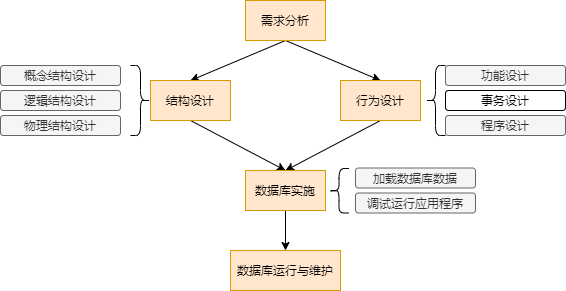

简述数据、数据库、数据库管理系统、数据库系统的概念

> - 数据：是描述事物的符号记录，指的是用物理符号记录的可以鉴别的信息；数据是信息存在的一种形式，只有通过解释或处理的数据才能称为有用的信息
> - 指的是可以长期存储在计算机中，有组织，可共享的数据集合
>   - 数据库中的数据按某种数据模型描述，组织和存储，具有较低的冗余度，较高的数据独立性，系统易于扩展，可以被多个用户所共享
> - 数据库管理系统：指的是专门用于建立和管理数据库的一套软件，介于应用程序和操作系统之间
> - 数据库系统：指定是在计算机引入数据库技术后的系统；通常包括用户、应用程序、数据库管理系统、数据库管理员、数据库

简述在数据管理技术中，与人工管理、文件系统相比，数据库系统的优点

> 1. 数据集成
> 2. 数据共享性更高
> 3. 数据冗余度更小
> 4. 数据独立性更高
> 5. 实施统一的管理和控制
> 6. 减少应用程序开发和维护的工作量

简述数据库管理系统的功能

> 1. 数据定义功能
> 2. 数据操作功能
> 3. 数据库的运行和管理功能
> 4. 数据库的创建和维护功能
> 5. 数据在组织、存储管理功能
> 6. 其他功能

简述数据库系统的三级模式和两层映像的含义

> 1. 数据库系统三级模式包括外模式、模式、内模式
>
>    1. 外模式：描述的是数据库用户能够看见和使用的局部数据的逻辑结构和特征，是与某一应用有关的逻辑表示
>    2. 模式：是数据库中整体数据的逻辑结构和特征的描述，是所有用户的公共数据视图
>    3. 内模式：描述的数据库中数据的物理结构和存储方式的描述，是数据在数据库内部的表示形式
>
> 2. 外模式/模式映像
>
>    1. 定义了各个外模式与概念模式之间的映像关系，这些映像关系通常在各自的外模式中加以描述，每个系统有多个外模式，对每一个外模式都有一个对应的外模式/模式映像
>
>    2. 保证了数据与程序的逻辑独立性
>
>       当数据库的模式发生改变时，DBA通常会对各个外模式/模式进行调整，以使那些对用户可见的外模式保持不变
>
>       从而应用程序的编程人员就不必修改那些依据外模式编写的应用程序；从而实现了外模式不受概念模式的影响，并保证了数据与程序的逻辑独立性
>
>    3. 保证了数据与程序的物理独立性
>
>       当数据库系统的物理存储改变时，DBA会对模式/内模式映像进行调整，以使数据库的模式保持不变，从而不必修改应用程序；如此实现了概念模式不受内模式的影响，并保证了数据与程序的物理独立性

简述关系模型与层次模型、网状模型的区别

> 层次模型是最早使用的模型，它的结构是一颗有向树，特点是：有且仅有一个结点没有父节点，其他结点有且仅有一个父节点；难以表示较复杂的实体间联系；
>
> 网状模型是层次模型的扩展，它允许有多于一个结点没有父节点；每个结点可以有多于一个的父节点；结构复杂，实现的算法难以规范化
>
> 关系模型
>
> 关系模型是用二维表结构来表示实体及实体间的联系，并以二维表格式的形式组织数据库中的数据；具有以下优点：建立在严格的数据概念的基础上；数据结构简单，清晰，用户易懂易用；存取路径对用户透明，具有更高的数据独立性和数据安全性

数据约束的内容

> 1. 数据的安全保密性
> 2. 数据的完整性
> 3. 响应时间
> 4. 故障恢复

数据库设计目标

> 满足应用功能的需求
>
> 良好的数据库性能

数据库设计的内容

> 数据库结构设计：针对给定的应用环境进行数据库的模式或子模式设计，包括数据库的概念结构设计，逻辑结构设计，物理结构设计
>
> 数据库行为设计：是确定数据库用户的行为和动作。用户的行为和动作是对数据库的操作，通常通过应用程序来实现。行为设计是动态的，用户的行为会使数据库的内容发生变化。

数据库设计的方法

> 直观设计方法
>
> 规范设计方法
>
> ​	奥尔良设计方法，分为四个阶段：需求分析，概念结构设计，逻辑结构设计，物理结构设计
>
> ​	基于E-R模型的设计方法，在需求分析的基础上用E-R图构造一个反映现实世界实体之间联系的企业模式，然后将此模式转换为某一DBMS下的概念模式
>
> ​	基于3NF的设计方法：是一类结构设计方法
>
> 计算机辅助设计方法

数据库设计的基本步骤

> 1. 需求分析 `起点`
>
>    1. 确定数据范围 `第一项工作`
>
>    2. 分析数据应用过程
>
>    3. 收集与分析数据
>
>       1. 静态结构 数据分类表、数据元素表
>       2. 动态结构 任务分类表、数据操作特征表
>       3. 数据约束 安全保密性、数据完整性、响应时间、数据恢复
>
>    4. 编写需求分析报告
>
>       内容：数据库的应用功能目标、表明不同用户视图范围、应用处理过程需求说明、数据字典、数据量、数据约束
>
> 2. 概念结构设计
>
>    1. 在需求分析报告的基础上，按照特定方法设计满足应用需求的`用户信息结构`；称为概念模型
>    2. 实体分析法、属性综合法
>
> 3. 逻辑结构设计：目的是将概念模型转换为等价的，特定DBMS支持的数据模型的结构
>
>    1. 输入信息：概念模型；有关响应时间、安全保密性、数据完整性、恢复方面的要求说明；保持数据一致性的规则说明；数据量及使用频率；特定DBMS特性；
>    2. 输出信息：一个特定DBMS支持的概念模式；一个或多个外部视图；物理设计说明，程序设计说明
>    3. 逻辑结构设计的基本步骤：1.模型转换；2.子模式设计；3.应用程序设计说明；4.设计评价;
>
> 4. 物理结构设计：确定数据库在存储设备的上的`存储结构`和`存取方法`;  还可能包括建立索引和聚集，以及物理块大小，缓冲区个数和大小，数据压缩的选择等。
>
> 5. 数据库实施 ：加载数据、应用程序设计、数据库试运行
>
> 6. 数据库运行维护：保证数据库的正常运行，困难是数据库重组与重构
>
> 

关系数据库设计方法-概念结构设计

> 1. E-R图表示方法
> 2. 局部信息结构设计
>    1. 确定数据范围
>    2. 选择实体
>    3. 确定实体的关键字属性
>    4. 确定实体之间的联系
>    5. 确定实体的属性
> 3. 全局信息结构设计
>    1. 将各局部信息机构合并成一个全局信息结构，是所有局部信息结构的全面准确的映像
>    2. 要努力避免或消除不同局部信息结构中因用户观点不同导致的数据不一致；尽可能增强数据的共享性，控制冗余；
>    3. 可能产生冲突：属性冲突，命名冲突，结构冲突
> 4. ER优化步骤
>    1. 合并相关的实体类型
>    2. 消除不必要的冗余的属性
>    3. 消除不必要的冗余的联系

关系数据库设计方法-逻辑结构设计

> 1. ER图向关系模式的转换
> 2. 数据模型的优化
> 3. 设计用户子模式

关系数据库设计方法-物理结构设计

> 建立索引和聚集实现相关数的逻辑连接的物理聚集，改善数据库的存取效率
>
> 建立索引分为静态建立索引和动态建立索引
>
> 建立聚集使将相关数几种存放的物理存储技术；有效方式是块结构；

SQL提供了SELECT语句进行数据查询、该功能强大使用灵活，其数学理论基础是关系数据模型中对表对象的一组关系运算；即`选择，投影，连接`

视图的概念

> 视图是数据库中的一个对象， 它是DBMS提供给用户从不同角度观察数据库中数据的一种重要机制；
>
> 视图是一个或多个表或其他视图中通过查询语句导出的表；它也包含一系列带有名称的数据列和若干条数据行，并有自己的视图名；

