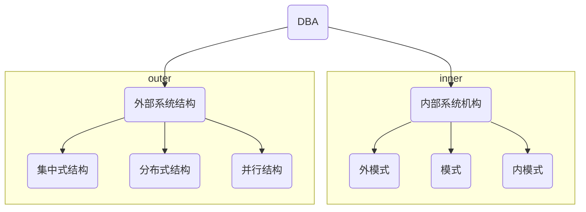
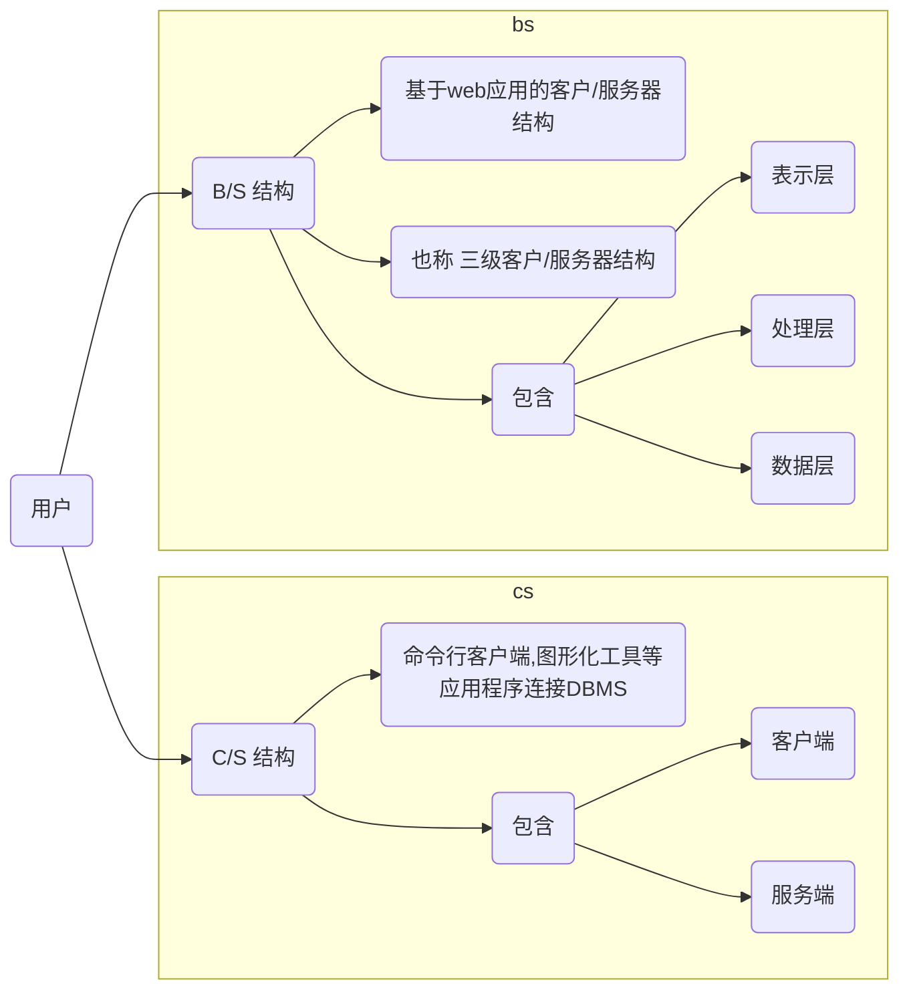
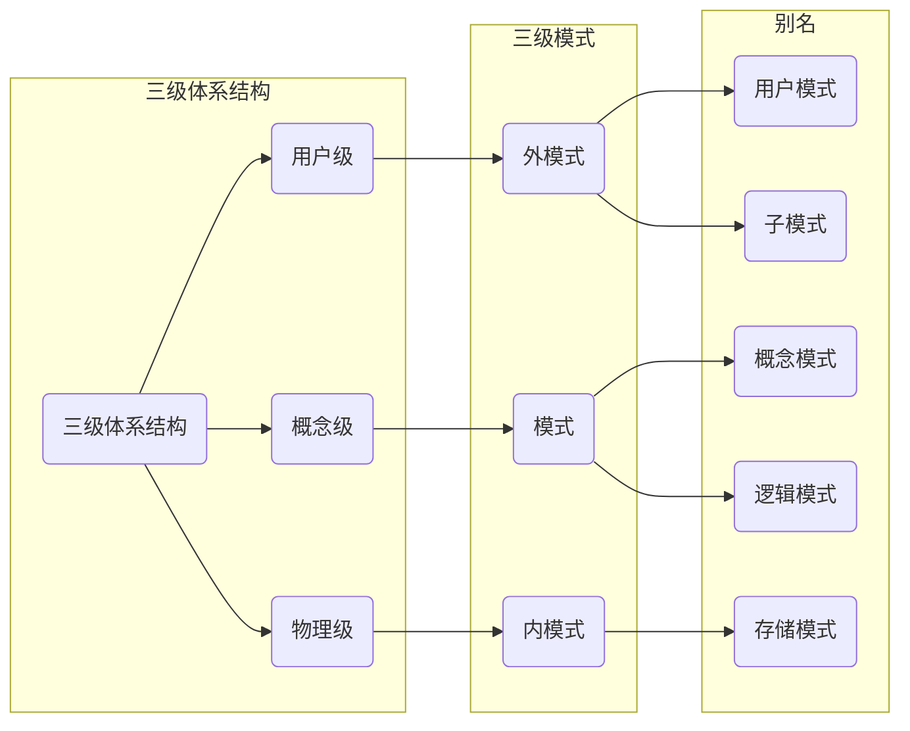
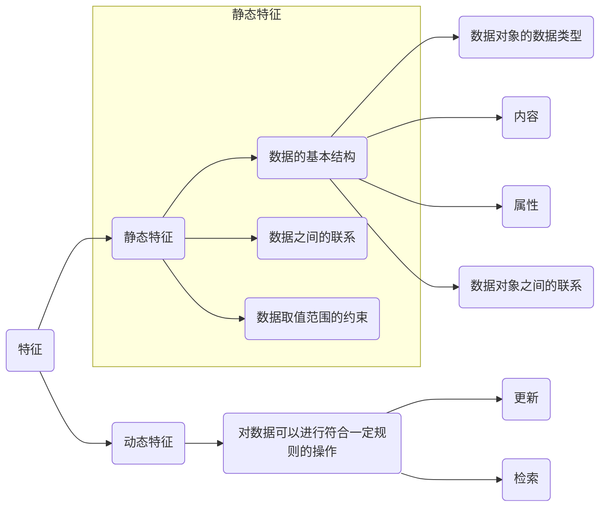
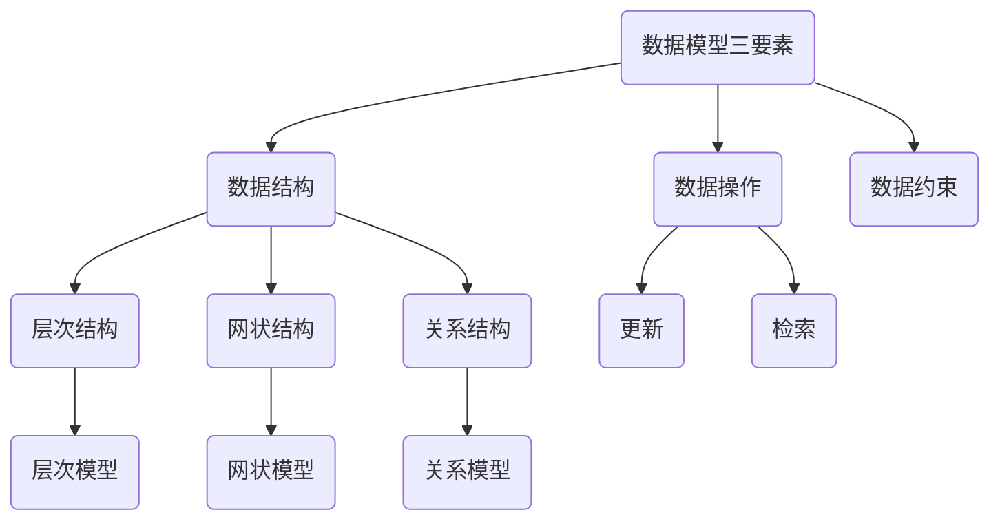
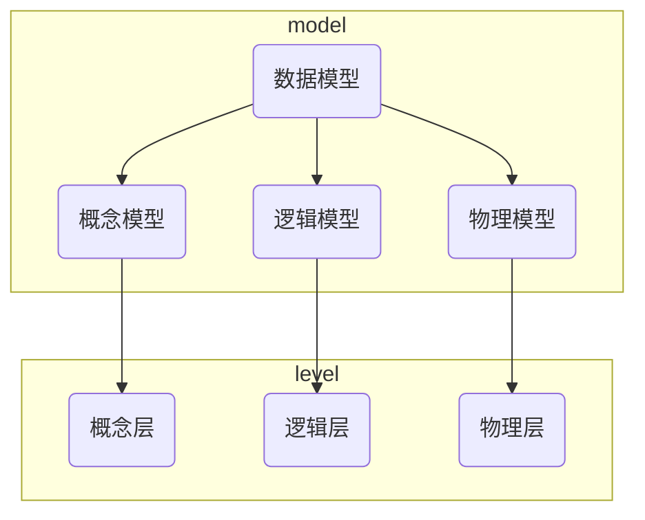

# 1. 数据库基本概念

- 数据

    - 是描述事物的**符号记录**，指的是用**物理符号**记录下来的，可以**鉴别**的信息
    - 数据是**信息**存在的一种形式，只有通过解释或处理的数据才能称为有用的信息。

- 数据库

    - 指的是能够长期存储在计算机中、有组织的可共享的数据集合
    - 数据库中的数据按一定的数据模型组织，描述和存储，具有较小的冗余度， 较高的数据独立性，系统易于扩展，可以被多个用户共享
    - 三个特征： 永久存储，有组织，可共享

- 数据库管理系统

    - 是专用于建立和管理数据库的一套软件，介于应用程序和操作系统之间

- 数据库系统

    - 指的是在计算机引入数据库技术后的系统

    - 通常包含：

        - 用户， 应用程序，数据库管理系统，数据库管理员，数据库

        

## 1.1 数据库管理系统的功能

1. 数据定义功能
    1. 用户通过DBMS提供的DDL语言定义数据库中的数据对象
2. 数据操作功能
    1. 用户通过DBMS提供的DML语言操纵数据库中的数据，实现对数据库的基本操作
3. 数据库的运行管理功能
    1. 提供统一的控制和管理机制，保证数据的安全性、可靠性， 实现数据在并发情况下互不干扰， 并在发生故障时能够对数据库进行正确的恢复
4. 数据库的建立和维护功能
    1. 提供对数据库创建
    2. 数据库空间维护
    3. 数据库备份、恢复
    4. 数据库的重组织
    5. 性能监控、分析
5. 数据组织、存储管理功能
    1. 对数据进行分类存储和管理，提高数据存取效率。
6. 其他功能
    1. 与其他软件的通信功能
    2. 不同数据库管理系统之间的数据传输和互相访问功能
    3. 等

# 2. 数据库技术的发展

- 数据收集， 以便于处理的方式收集数据，并将记录在纸质文件上的数据转换成计算机可以处理的形式
- 数据组织， 将收集的数据进行适当的构造
    - 逻辑组织， 是用户或应用程序所使用的数据结构形式
    - 物理组织，是数据在物理存储设备上的结构形式
    - 两者之间相互独立

## 2.1人工阶段

- 数据不保存
- 应用程序管理数据
    - 引用程序的数据由程序自行负责
- 数据面向应用
    - 一组数据只能对应一个程序

## 2.2 文件系统阶段

- 文件系统是将数据的逻辑结构与物理结构分离
- 应用程序只涉及数据的逻辑结构，系统决定数据的物理结构
- 当物理结构发生变化时，不会导致应用程序的修改（数据的物理独立性）

特点：

- 可长期保存
- 专门管理
- 提供了**物理数据独立性**
- 数据共享成为可能
    - 只能实现**文件级的共享**
- 仍然存在大量的数据冗余

## 2.3 数据库系统阶段

- 数据集成
    - **是数据库管理系统的主要目的**。 在数据库中通过关联数据间定义的逻辑联系，数据被组织成统一的逻辑结构，与数据的物理组织与定位分离
- 数据共享性高
    - 一个数据可以为多个不同的用户共同使用
    - 多个用户可以同时存取同一数据
- 数据冗余小
- 数据一致性
    - 通过消除或控制数据冗余，可以在一定范围内避免数据的不一致性
    - 引起不一致的更新是数据冗余
- 数据独立性高
    - 不同的应用程序（用户）对同样的数据可以使用不同的视图， 数据的逻辑独立
    - 改变数据的存储结构或存取方法而不影响现有的应用， 数据的物理独立
- 实施统一管理与控制
    - 数据的安全性
    - 数据的完整性
    - 并发控制
    - 故障恢复
- 减少应用程序开发与维护的工作量

# 3. 数据库系统的结构

从DBA的视角来看，数据库系统可以分为

从数据库应用的用户来看，数据库系统可分为：

## 3.1 数据库系统的三级模式结构

即用户级、概念级、物理级

三级模式结构，两层映像功能

数据库系统的三级模式结构是指数据库系统由模式（Schema）、外模式（External Schema）、内模式（Internal Schema） 三级构成。

### 1 模式

- **概念模式、逻辑模式**
- 是数据库中全体数据的逻辑结构和特征的描述，是所有用户的公共数据视图
- 一个数据库只有一个模式，且相对稳定

### 2 外模式

- **用户模式、子模式**
- 数据库用户能看见和使用的局部数据的逻辑结构和特征的描述，是与某一应用有关的数据的逻辑表示
- 多个外模式

### 3 内模式

- **存储模式**
- 是对数据库中数据物理结构和存储方式的描述， 是数据在数据库内部的表示形式
- 一个模式

### 4 三级模式结构的两层映像与数据独立性

所谓映像，就是一种对应规则，它指出映像双方是如何进行转换的。

#### 1. 外模式/模式映像

- 对每一个外模式都有一个外模式/模式映像，定义外模式与模式之间的对应关系
- 映像定义通常在各自的外模式中加以描述
- **保证数据与程序的逻辑独立性**
    - 当模式发生改变，DBA对映像规则做出改变，使外模式保持不变
    - 依据外模式编写的应用程序不必修改，从而保证**数据与程序的逻辑独立性**

#### 2. 模式/内模式映像

- 定义了数据库全局逻辑结构与物理存储结构之间的对应关系
- 这种映像定义通常在模式中加以描述
- **保证了数据与程序的物理独立性**

## 3.2 数据库系统的运行与应用结构

### 1. 客户/服务器结构 C/S

客户端，前台、表示层：**主要完成与数据库使用者的交互任务**

服务器、后台、数据层：**主要负责数据管理**

单机方式

网络方式

### 2. 浏览器/服务器结构 B/S

是一种基于web应用的**客户/服务器**结构， 也称为 **三层** 客户/服务器结构

三层： 表示层、处理层（中间层）、数据层

表示层：数据库使用者的操作和展示界面

处理层：处理数据库使用者的具体应用逻辑

数据层：

# 4. 数据模型

**数据模型**是对现实世界数据特征的抽象，描述的是数据的**共性内容**。

## 4.1  数据特征与数据模型组成要素

一般而言，数据的特征具有静态和动态两种：

- 静态特征， **`包括数据的结构`**，**`数据之间的联系`**以及**`对数据取值范围的约束`**
- 动态特征， 指对数据可以进行符合一定规则的操作

**数据模型**是用来描述数据的结构、定义在结构上的操纵以及数据间的约束的一组概念和定义。

通常任何一种数据模型都是严格定义的概念集合， 这些概念必须能精确地描述系统的静态特征、动态特征和数据约束条件。

因此，数据模型通常由数据结构、数据操作和数据约束三个要素组成。

### 1. 数据结构

- 描述的是系统的静态特性
- 即：数据对象的数据类型， 内容，属性以及数据对象之间的关系
- 通常按照数据结构的类型来命名数据模型
    - 层次结构-层次模型
    - 网状结构-网状模型
    - 关系结构-关系模型

### 2. 数据操作

- 描述的是系统的动态特性， 主要包含更新和检索

### 3. 数据约束

- 描述数据结构中数据间的**语法和语义关联**
- 包含相互制约于依存关系以及数据动态变化规则，以保证数据的正确性、有效性、相容性
    - 完整性约束
    - 安全性约束
    - 并发控制约束 

## 4.2 数据模型的分类

 **数据模型应该满足三个方面的要求**
- 比较真实地模拟现实世界
- 容易为人们所理解
- 便于在计算机实现

**逐步抽象方法**

1. 首先将现实世界中的客观对象抽象为信息世界中的某一种信息结构， 这种信息结构并不依赖于具体的计算机系统，也不与拒听的数据库管理系统相关，是一种概念级模型
2. 再将概念级的模型转换为机器世界中某一具体的数据库管理系统支持的数据模型 

**数据模型**是模型化数据和信息的工具，也是数据库系统的**核心和基础**。

### 1. 概念层数据模型

是数据抽象级别的最高层， 目的是按照用户的观点来对世界建模。

也称为**数据的概念模型**或信息模型， 独立于任何DBMS， 主要用于数据库的**设计阶段**

是数据库设计人员进行数据库设计的有力工具，也是数据库设计人员与用户交流的语言。

#### **信息世界的基本概念**

- 实体， 客观存在并可相互区别的事物成为实体。 可以是实际事物也可以是抽象的概念或联系
- 属性，实体所具有的某种特性
- 码/键， 可唯一标识实体的属性集
- 域， 属性的取值范围。 例如性别的域为（男，女）
- 实体型
    - 用实体名与与属性名集合来抽象和刻画同类实体
- 实体集
    - 同型实体的集合称为实体集， 例如每个学生是一个实体， 所有学生是一个实体集
- 联系
    - 实体内部或实体间的联系

型： 对某一类数据的结构和属性的说明

值：是型的一个具体赋值

#### **数据模型的表示方法**

### 2. 逻辑层数据模型

逻辑层是数据抽象级别的中间层，描述数据整体的逻辑结构。

逻辑层数据模型也称为**数据的逻辑模型**， 它是用户通过DBMS看到的现实世界，是基于计算机系统的观点来对数据进行建模和表示。

任何DBMS都是基于某种逻辑数据模型。

#### 层次模型 

- 是数据库系统最早使用的一种数据模型
- 它的结构是一颗有向树（组织结构是典型的层次结构）， 树的每个节点对应一个记录集
- 特点
    - 有且仅有一个节点没有父节点，称作根节点
    - 其他节点有且仅有一个父节点
- 层次模型**难以**表达实体之间比较复杂的关系

#### 网状模型

- 以网状结构表示实体之间的联系，是层次模型的扩展
- 允许节点有多余一个的父节点
- 可以有一个以上的节点没有父节点
- 结构复杂，实现的算法难以规范化

#### 关系模型

用**二维表结构**来表示实体及实体间联系的模型， 并以二维表格的形式组织树库中的数据

优点：

1.  建立在严格的数学概念的基础上
2. 关系模型的概念单一,  数据结构简单、清晰， 用户易懂、易用
3. 存取路径对用户透明，具有更高的数据独立性、更好的安全保密性

#### 面向对象模型

- 即使概念模型，也是逻辑模型
- 表达能力丰富， 对象可重复使用，维护方便

### 3. 物理层数据模型

- 也称为**数据的物理模型**
- 描述数据在物理存储介质上的组织结构，是逻辑模型的物理实现
- 物理模型是数据库**`最底层`**的抽象，它确定数据的物理存储结构、数据存取路径以及调整、优化数据库的性能。
- 设计目标是**提高数据库性能**和**有效利用存储空间**

# 真题

 

