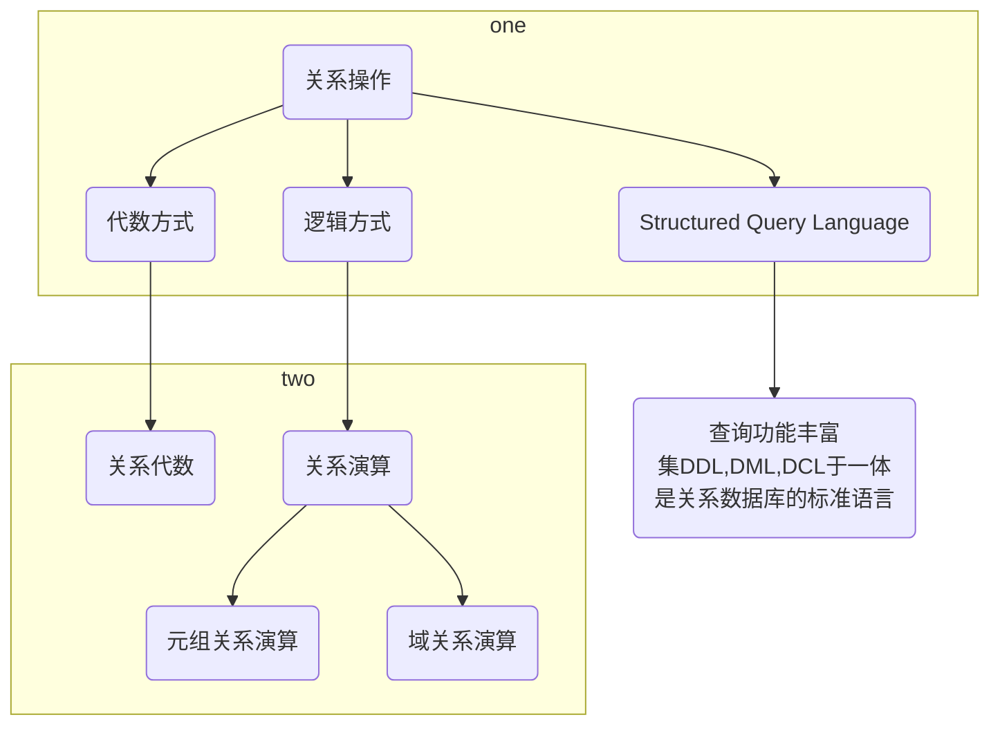

#  1. 关系数据库概述


# 2. 关系数据模型

 关系模型包含三个组成要素

- 关系数据结构
- 关系操作集合
- 关系完整性约束


## 2.1 关系数据结构


### 关系数据库的基本术语 

- 表 Table
    - 也称关系， 是一个二维的数据结构
- 关系 Relation
    - 有三种类型
        - 基本关系， 基本 表，基表， 是实际存在的表
        - 查询表，查询结果对应的表， 不真实存在
        - 视图表，是基本表或其他视图表导出的表， 是虚表不对应实际存储的数据
- 列 Column
    - 也称字段或属性 
- 属性 Attribute
    - 表中的一列即为一个属性。 表中属性的个数称为关系的元或度。
    - 
- 行 Row
    - 也称元组或记录
- 元组 Tuple
    - 表中的一行即一个元组
- 分量 Component
    - 元组中的一个属性值
    - 
- 码/键
    - 属性的值能用来**唯一标识**该关系的元组，则称这些**属性或属性组**为该关系的码或键
- 超码/超键
    - 在码中去除某个属性，它仍然是这个关系的码 
- 候选码/候选键
    - 在码中不能从中移除任何一个属性，否则它就不再是这个关系的码或键
    - 候选码或候选键是这个关系的最小超码或超键
- 主码/主键
    - 在一个关系的若干候选码中指定一个用来唯一标识关系的元组， 这个指定的候选码就是主键
- 全码/全键
    - 一个关系模式的所有属性集合是这个关系的主码
- 主属性、非主属性
    - 关系中包含在任何一个候选码中的属性为主属性
    - 不包含在任何一个候选码中的属性为非主属性
- 外码/外键
    -  当某个属性不是这个关系的主码或候选码，而是另一个关系的主键时，该属性为外键
- 参照关系
    - 以外码作为主码的关系称： 被参照关系，主关系
    - 外码所在的关系称：参照关系，从关系
- 域
    - 标识属性的取值范围
- 数据类型
    - 限制该列中存储的数据
- 关系模式
    - 关系模式时型， 关系时值
- 关系数据库
    - 以关系模型作为数据的逻辑模型，并采用关系作为数据组织方式的一类数据库
    - 其数据库操作建立在关系代数的基础上


关系数据库对关系的限定：

- 每一个属性都是不可分解的
- 每一个关系仅有一种关系模型
- 每一个关系模式中的属性必须命名，属性名不同
- 在同一个关系中不允许出现候选码完全相同的元组
- 在关系中元组顺序无关紧要
- 在关系中属性的顺序无关紧要


## 2.2 关系操作集合  

关系模型给出了关系操作的能力说明，但不对 RDBMS 语言给出具体的语法要求， 也就是说不同观点关系数据库管理系统可以定义和开发不同的语言来实现这些操作。


### 1. 基本的关系操作

分为`查询`操作和(`插入、删除、修改`)操作两大部分


查询可以分为

- 选择、投影、连接，除、并、差、交、笛卡儿积

- **5中基本操作**
    - 选择、投影、并、差、笛卡儿积

 

关系操作的特点是集合操作方式，操作的对象和结果都是集合。 一次一集合方式。


### 2. 关系数据语言的分类

关系语言的特定（优点）是**高度非过程化**。

关系操作的能力可以用两种方式来表示：代数方式和逻辑方式。


代数方式：主要有关系代数，通过对关系的操作来表达查询要求

逻辑方式：主要有关系演算， 分为**元组关系演算**和**域关系演算**。

关系代数、元组关系演算、域关系演算三种语言在表达能力上完全等价。




关系数据语言可分为三类：关系代数语言，关系演算语言，兼具两者双重特定的语言（如SQL）。它们的共同特点：

- 具有完备的表达能力
- 是非过程化的集合操作语言
- 功能强，能够独立使用也可嵌入高级语言中使用


### 3. 关系代数

任何操作都是在一定的操作符作用域一定的操作对象上得到操作结果。

所以任何一种操作都包含三大要素：

- 操作对象
- 操作符
- 操作结果


关系代数操作经过有限次符合的式子称为关系代数操作表达式，简称关系代数表达式


####  传统的集合运算

传统集合运算是二目运算，它将关系看成是元组的集合，其运算是从关系的"水平"方向（行）来进行。

具有并、差、交、笛卡儿积 四种运算


**并 ** $\cup$

假设有两个关系R1和R2， 它们的并运算产生一个新的关系R3。

R3是由属于关系R1或R2的所有不同元组所组成 记为：$R3=R1\cup R2$

注意：R1和R2的属性个数相同，相应属性分别有相同的值域


**差** $-$

假设有两个关系R1和R2， 它们的差运算产生一个新的关系R3。

R3是由属于关系R1，但不属于R2的元组所组成 记为：$R3=R1- R2$

注意：R1和R2的属性个数相同，相应属性分别有相同的值域


**交** $\cap$

假设有两个关系R1和R2， 它们的交运算产生一个新的关系R3。

R3是由即属于关系R1，也属于R2的元组所组成 记为：$R3=R1\cap R2$

注意：R1和R2的属性个数相同，相应属性分别有相同的值域

$R1 \cap R2 = R1 - (R1 - R2)$


**笛卡尔积** $\times$

假设有两个关系R1和R2，且R1为m元关系， R2为n元关系。 它们的笛卡儿积产生一个新的关系R3。

R3是由R1和R2的所有元组连接而成的具有（m+n）个分量的元组所组成 。

列加行乘， 列数是两个关系元组数相加， 行数是两个关系的元组数相乘

记为：$R3=R1 \times R2$


#### 专门的关系运算

**选择**

选择运算表示为：$\sigma_F（R）$， 其中F为条件表达式， R为指定的被运算关系名

```sql
SELECT 关系名 WHERE 性别="男"
```

$\sigma_{性别=男}（关系名）$


**投影**

投影运算表示为$\pi_A(R)$，其中R为关系名， A为属性序列

 $\pi_{学号，姓名}(学生表)$


**连接**


**除**


## 2.3 关系完整性约束

数据库的数据完整性是指数据库中数据的<font color=red>**正确性、相容性、一致性**</font>

包含两个方面：

1. 与现实世界中应用需求的数据的正确性、相容性、一致性
2. 数据库内数据之间的正确性、相容性、一致性


关系模型中有三类完整性约束：

- 实体完整性约束
- 参照关系完整性约束
- 用户定义完整性约束

前两种是关系模型必须满足的完整性约束条件，关系数据库管理系统应自动支持，称<font color=red>关系的两个不变性</font>


### 1. 实体完整性约束

实体完整性约束使指关系的主属性（主码、主键）的组成不能为空，也就是关系的主属性不能是空值 NULL。++

关系对应显示世界中的实体集，显示世界中的实体使可区分的，即每个实体具有唯一标识。


### 2. 参照完整性约束

定义外码和主码之间的引用规则，是对关系间引用数据的一种限制。

要么外码等于主码中某个元组的主码值， 要么为空。

定义：

若属性F（或属性组）是基本关系R的外码， 它与基本关系S的主码K相对应，则对与R中每个元组在F上的值只有两种可能，要么取空值，要么等于S中某个元组的主码值。

其中，关系R和S可以是不同的关系也可以是同一个关系。


### 3. 用户定义完整性约束

针对某一应用环境的完整性约束条件，它反映了某一具体应用所涉及的数据应满足的要求。 也称**域完整性约束**

关系模型提供定义和检验这类完整性规则的机制，其目的是用统一的方式来处理它们， 不再由应用程序完成这些工作。

###  4. 关系模型完整性约束的检验

**插入操作**

1. 主码不为空且不存在重复
2. 外码在被参照关系中存在或外码为空
3. 检查用户定义的域完整性约束，精度，长度，取值范围，是否为空等


**执行删除操作**

一般只需要对被参照关系检查参照完整性约束。


**执行更新操作**

上述两种综合


# 3. 关系数据库的规范化理论

关系规范化理论主要用于数据库设计中的**概念设计阶段**。


## 3.1 关系模式中可能存在的冗余和异常问题

R： 供应商（供应商名称，供应商地址，货物名称，货物售价）

- 数据冗余
    - 数据冗余是指同一数据被反复存储的情况。

- 更新异常
    - 数据冗余将导致存储空间的浪费和潜在数据不一致性即修改麻烦等问题。
    - 对冗余数据的部分修改，导致数据的不一致

- 插入异常
    - 指的是应该插入到数据库中的数据不能执行插入操作的情形。
    - 某个供应商没有提供货物， 就无法录入。 主键（供应商，货物名）

- 删除异常
    - 不应删除的数据被删除的情况。
    - 删除供应商的全部供货信息，会一起删除供应商信息。


数据冗余将**导致**更新异常、插入异常、删除异常。


函数依赖、多值依赖。

## 3.2 函数依赖与关键字


函数依赖指关系中属性间的对应关系。

>设R为任一给定关系，如果对于R中属性X的每一个值，R中的属性Y只有唯一值与之对应，
>
>则称：$X函数决定Y$， 或称 $Y函数依赖于X$，记作$X \rightarrow Y$ , 其中X为决定因素
>
>
>
>例如： $SNO \rightarrow SName$ 知道学号就可以知道学生名字
>
>对于关系中的属性X和Y， 若X不能函数决定Y， 记作 $ X\large{\nrightarrow} Y$
>
>
>
>例如 $Sex \nrightarrow SName$, 根据性别不能唯一决定名称
>
> 

码： 属性的值能用来唯一标识该关系的元组，则称这些属性或属性组为该关系的码或键


函数依赖有： **完全函数依赖、部分函数依赖、 传递函数依赖**。

### 1. 完全函数依赖

>设$R$为任一给定关系，X、Y为其属性集， 若 $X \rightarrow Y$, 且对X中任何真子集$X^{'}$都有$X^{'} \nrightarrow Y$， 则称$Y完全函数依赖于X$
>
>真子集： 一个集合中的**任意一部分**都是该集合的真子集

候选码：在码中不能从中移除任何一个属性，否则它就不再是这个关系的码或键

 


### 2. 部分函数依赖

>设$R$为任一给定关系，X、Y为其属性集， 若 $X \rightarrow Y$, 且对X中存在一个真子集$X^{'}$， 满足$X^{'} \rightarrow Y$， 则称$Y部分函数依赖于X$

 

超码

### 3. 传递函数依赖

>设$R$为任一给定关系，X、Y、Z为其不同属性子集， 若 $X \rightarrow Y \quad Y \nrightarrow X \quad Y \rightarrow Z \quad 则 \quad X \rightarrow Z $, 则称$Z传递函数依赖于X$

  


### 4. 关键字

> 设$R$为任一给定关系，U 为其所含的全部属性集合， X是U的子集， 若有完全函数依赖 $ X\rightarrow U$, 则X为R的一个候选关键字

 


## 3.3 范式与关系规范化过程

关系数据库中的关系需要满足一定的要求，不同程度的要求称为不同的范式（Normal Form, NF)。 

满足最低要求的称为第一范式（1NF）； 在第一范式的基础上满足一些新要求称为第二范式（2NF），以此类推。

一个低一级范式的关系通过模式分解（Schema Decomposition）可以转换为若干个高一级范式的关系模式的集合， 这个过程称作规范化（Normalization）


### 第一范式，1NF

> 设R为任一给定关系， 如果R中每个列与行的交点处的取值都是不可再分的基本元素，则R为第一范式

存在冗余高、插入和删除异常

解决1NF关系存在的问题的方法：将满足部分函数依赖关系和满足完全函数依赖的属性分解并组成两个关系，从而**消除非主属性对候选关键字的部分函数依赖**


### 第二范式，2NF

> 设R为任一给定关系， 如果R为1NF， 且其所有非主属性都**完全函数依赖**于**候选关键字**， 则R为第二范式

### 第三范式，3NF 	

> 设R为任一给定关系， 如果R为2NF,且每一个非主属性都不**传递函数依赖**于候选关键字， 则R为第三范式


### BCNF


02：18：18


# 真题

> 设有关系模式R（读者号，姓名，单位号，单位名，图书号，书名，借阅日期，还书日期）存储读者借阅图书等信息。
>
> 如果规定：
>
> 每个读者只属于一个单位
>
> 每个读者可以借阅多本图书，每本图书也可以被多名读者借阅，每个读者也可以对某本图书多次借阅，但每个读者每本图书每天最多借一次
>
> 
>
> 1. 根据上述条件，写出模式R的关键字
> 2. R最高属于第几范式，为什么
> 3. 举例说明R在何种情况下会发生删除异常
> 4. 将R规范到3NF
>
> 答：
>
> 1. （读者号，图书号，借阅日期）
> 2.  R 属于第一范式， 因为存在非主属性对码的部分函数依赖
> 3.  删除读者借阅图书信息是可能把读者的基本信息也删除了
> 4. 示例
>     1. 读者（读者号， 姓名）， 读者号是主码
>     2. 单位（单位号，单位名），单位号是主码
>     3. 图书（图书号，图书名），图书号是主码
>     4. 借阅（读者号，图书号，借阅日期，还书日期），（读者号，图书号，借阅日期）是主码
