# 1. 数据库设计概述

## 1.1 数据库的生命周期

从数据库演变过程的角度看， 数据库的生命周期分为两个阶段：

- 数据库分析与设计阶段
    - 需求分析
    - 概念设计
    - 逻辑设计
    - 物理设计
- 数据的实现与操作阶段
    - 实现
    - 操作与监督
    - 修改与调整

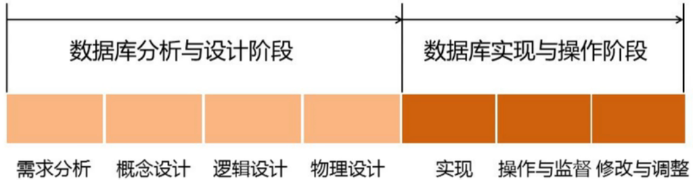

## 1.2 数据库设计目标

数据库的设计目标：

- 满足应用功能需求
    - 存取删改
- 良好的数据库性能
    - 数据的高效率存取和空间的节省
    - 有良好的数据共享性、完整性、一致性、安全保密性

## 1.3 数据库设计的内容

数据库数据的内容包含两个方面：

- 数据库结构设计（静态）	
    - 数据库概念结构设计
    - 逻辑结构设计
    - 物理结构设计
- 数据库行为设计（动态）

## 1.4 数据库设计方法

### 1. 直观设计方法

最原始的方法， 依赖于设计者的经验和技巧。

### 2. 规范设计方法

- 新奥尔良设计方法
    - 将数据库设计分为四个阶段
        - 需求分析
        - 概念结构设计
        - 逻辑结构设计
        - 物理结构设计
        - 注重数据库的**结构设计**，不太考虑数据库的行为设计
- 基于E-R模型的数据库设计方法
    - 在需求分析的基础上用E-R图构造一个反映显示世界实体之间联系的企业模式
    - 然后将此模式转换为某一DBMS下的概念模式
- 基于第三范式的设计方法
    - 是一类结构化设计方法

### 3. 计算机辅助设计方法

辅助软件工程工具

## 1.5 数据库设计过程

数据库实施包括：

- 加载数据库数据
- 调试运行应用程序

# 2. 数据库设计的基本步骤

基本的设计步骤有： 需求分析、概念结构设计、逻辑机构设计、物理结构设计、数据库实施、数据库的运行与维护

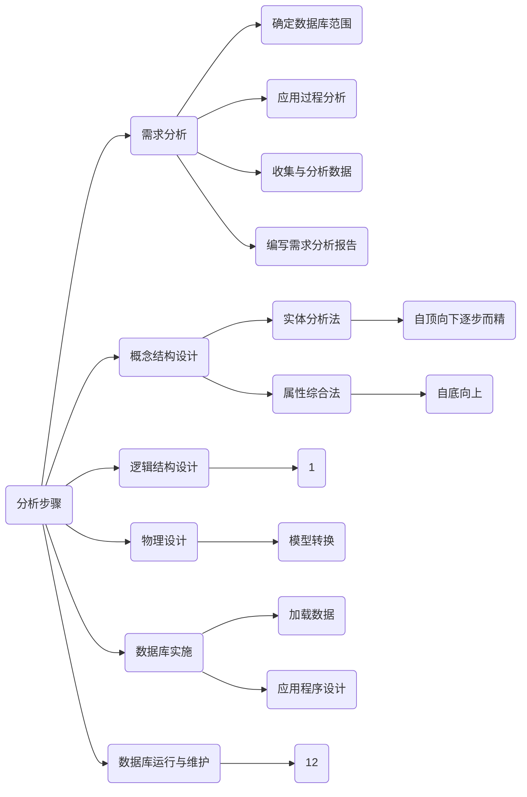

## 1. 需求分析

- 数据库设计的**起点**
- 目标
    - 了解与分析用户的信息及应用处理的要求
    - 将结果按一定格式整理而形成**需求分析报告**
- 该报告是后续**概念设计、逻辑设计、物理设计、数据库建立与维护**的依据

需求分析一般可分为四个步骤：**确定数据范围、分析应用数据过程、收集与分析数据、编写需求分析报告**

### 1. 确定数据库范围

确定数据库应支持哪些应用功能。 范围要尽可能地考虑较为广泛的应用部门或应用领域。

- 数据库设计的第一项**工作**
    - 有效利用计算机设备及数据库系统的潜在能力（满足多种领域，部门的应用功能要求）
    - 提高数据库的应变能力（考虑到将来的需求），避免应用过程中对数据库做太多或太大的修改
    - 从而延长数据库的生命周期

### 2. 应用过程分析

了解并分析`数据`与`数据处理`之间的关系。应用过程分析的结果是`数据库结构设计`和数据库`应用程序编写`的重要依据。

- 用到哪些数据
- 数据的使用顺序
- 对数据作何处理
- 数据的处理策略与处理结果

### 3. 收集与分析数据

了解并分析数据的组成格式及操作特征，每个数据元素的语义及关系等，并将它们收集起来整理归档。

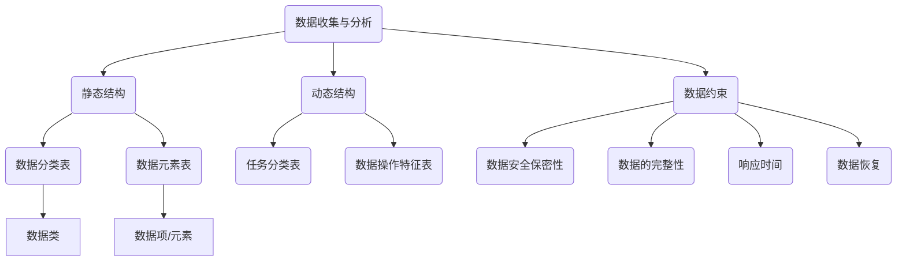

数据的收集与分析可以从三个方面展开

- **静态结构**
    - 指不施加应用操作于其上时数据的原始状况。可以通过**数据分类表**和**数据元素**表进行说明
    - 数据分类表
        - 用于数据的总体描述。
        - 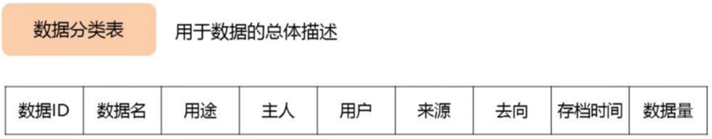
    - 数据元素表
        - 指通常意义下的数据项或属性
        - 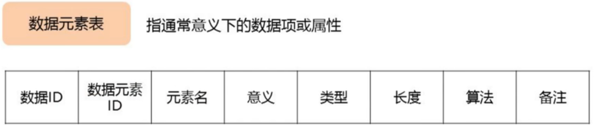
- **动态结构**
    - 指将**应用操作**施加于数据之上后数据的状况，可以通过**任务分类表**与**数据操作特征表**进行说明
    - 任务分类表
        - 指为完成某一特定处理功能的相对独立的操作序列
        - 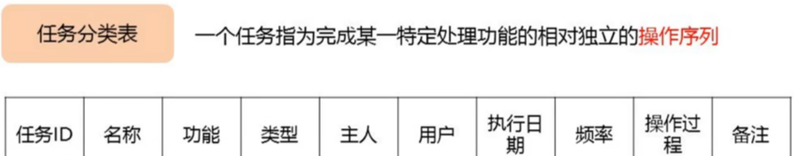
    - 数据操作特征表
        - 用以描述任务与数据之间的关系，它包括不同任务对数据执行不同操作的频率；
        -   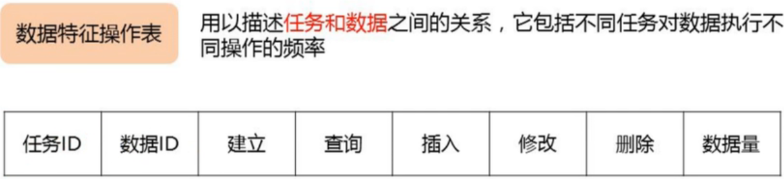
- **数据约束** 
    - 指使用数据时的特殊要求，約束主要有以下几个方面：
    - **数据的安全保密性**， 权限
    - **数据的完整性**
    - **响应时间**
    - **数据恢复**

### 4. 编写需求分析报告

包括的内容

1. 数据库的应用功能目标
2. 标明不同用户视图范围
3. 应用处理过程需求说明
    1. 数据流程图
    2. 任务分类表：不同任务的功能及使用状况
    3. 数据操作特征表：任务与数据的联系，不同数据的不同操作特征，执行频率
    4. 操作过程说明书：标明任务的主要逻辑执行步骤
4. 数据字典
    1. 是数据库系统中存储三级结构定义的数据库，通常指的是数据库系统中各类数据详细描述的集合
    2. 功能是存储和检索各种数据描述，即元数据
    3. 包括数据分类表，数据元素表和各类原始资料
5. 数据量
6. 数据约束

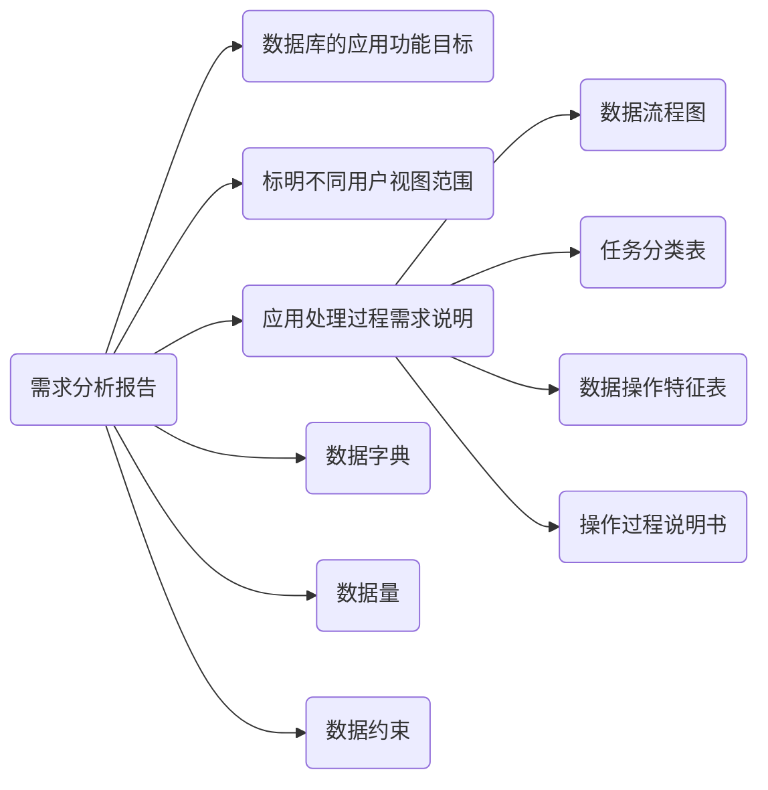

## 2. 概念结构设计

**任务**是在需求分析中产生的需求分析报告的基础上，按照特定的方法设计满足应用需求的**用户信息结构**，该信息结构通常称为**概念模型** 

- 概念模型独立于任何软件与硬件， 目标是**最大限度满足应用需求**
- 概念结构设计常用方法有
    - **实体分析法**
        - 自顶向下法
        - 自顶向下，逐步而精
    - **属性综合法**
        - 自底向上法
        - 从属性分析开始，高层实体及联系通过底层属性组成
        - 其过程：属性分类、实体构成、联系的确定等

## 3. 逻辑结构设计

逻辑结构设计的目标是将概念模型转换为等价的，并为特定DBMS所支持数据模型的结构。

逻辑结构设计的输入信息

1. 独立与DBMS的概念模型
2. 有关响应时间、安全保密性、数据完整性及恢复方面的要求说明，包括保持数据一致性的规则说明
3. 数据量及使用频率
4. 特定DBMS特性，包括DBMS支持的数据模型及数据定义语言说明

完成逻辑机构设计后的输出信息

1. 一个特定DBMS支持的概念**模式**：模式
2. 一个或多个外部视图：子模式、用户模式
3. 物理设计说明
4. 程序设计说明

### 逻辑结构设计的步骤

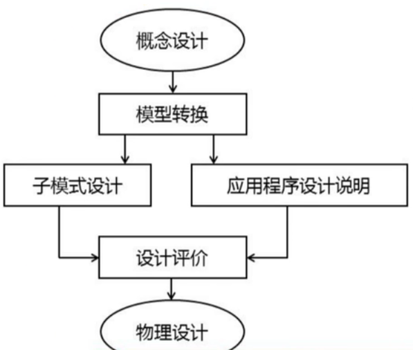

1. 模型转换
    - 将概念模型等价转换为特定DBMS支持的关系模型、网状模型或层次模型
2. 子模式设计
    - 目标是抽取或导出模式的子集，以构造不同用户使用的局部数逻辑结构
3. 应用程序设计说明
    - 编制应用程序设计说明的目的是：为可实际运行的应用程序设计提供依据与指导，并作为设计评价的基础
4. 设计评价
    - 任务是分析并检验模式及子模式的正确性与合理性

## 4. 物理设计

对于一个给定的数据库逻辑结构，研究并构造物理结构的过程。

任务是：要确定数据库在存储设备上的存储结构及存取方法，因DBMS的不同还可能包括建立索引和聚集，以及物理块大小、缓冲区个数和大小、数据压缩的选择等

## 5. 数据库实施

数据库实施阶段需要完成的工作：加载数据、应用程序设计、数据库试运行

### 加载数据

指将符合要求的初始数据装载到数据库中，具体包括：

收集、分类、整理、校验和输入等

### 应用程序设计

不属于数据库设计范畴，随着数据库结构设计的进展逐步进行

### 数据库试运行

为了避免对实际应用带来损害。 在已建立的数据库上，按生产现场实际环境要求运行应用程序，检验其功能和性能。

- 有利于工作工作人员掌握并熟悉系统
- 有利于正式运行时避免人为的操作不当等损害

## 6. 数据库运行与维

保证数据库的正常运行

最困难的是数据库重组与重构。

# 3. 关系数据库设计方法

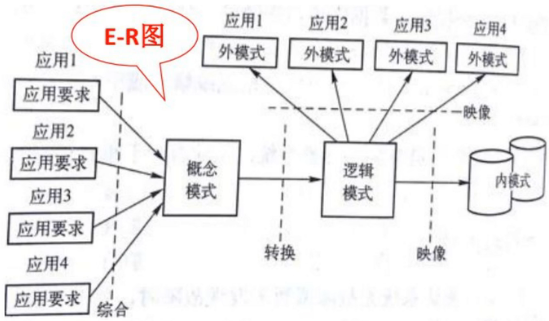

## 3.1 概念结构设计方法

### 1. E-R图表示方法

矩形：实体

椭圆：属性

菱形：联系

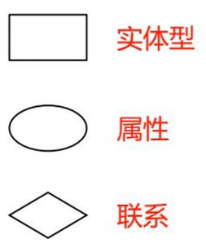

无论是否提示实体的属性可以省略， 联系的属性都不能省略。

两个实体之间的关系

一对一：$1:1$

一对多： $1:n$

多对多：$m:n$

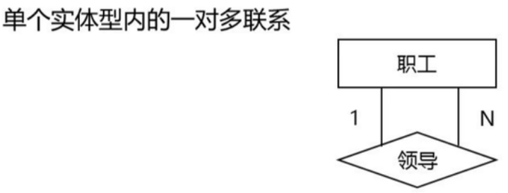

### 2. 局部信息结构设计

1. 确定局部范围

    - 主要依据**需求分析报告**中标明的**用户视图范围**来确定

2. 选择实体

    - **数据分类表**是i选择实体的直接依据
    - 最大的困难是如何区别实体与属性

3. 确定实体的关键字属性

    - 实体的存在依赖于其关键字的存在

4. 确定实体之间的联系

    - 数据间的联系必须在概念设计时确定

5. 确定实体的属性

    - 属性分为**标识属性**和**说明属性**
    - 标识属性用作实体的关键字
    - 说明属性用作描述实体的一般特征

    

    

### 3. 全局信息结构设计

将各局部信息结构合并成一个全局信息结构。 全局信息结构是所有局部信息结构的**全面准确的映像**。

全局信息结构中要努力避免或消除不同局部信息结构中因用户的不同观点导致的数据不一致，并尽可能增强数据的共享性，控制数据冗余。

合并时可能产生冲突，各局部E-R图之间 的冲突主要表现在三个方面：**属性冲突、命名冲突、结构冲突**

**属性冲突**

- 属性域冲突
- 属性取值单位冲突

**命名冲突**

- 同名异义
- 异义同名

**结构冲突**

- 同一对象在一个局部ER图中作为实体，在另一个ER图作为属性
- 同一实体在不同ER图中属性个数和类型不同
- 实体之间的联系在不同的ER图中时不同的类型

**E-R优化步骤**

- 相关实体类型的合并
- 消除不必要的冗余属性
- 消除不必要的冗余联系

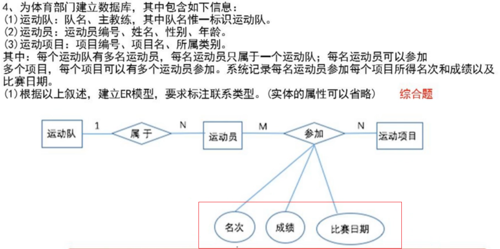

## 3.2 逻辑结构设计方法

逻辑结构设计的任务就是把概念结构设计阶段已设计好的ER图转换为关系数据库管理系统（RDBMS）所支持的**关系**模型，通常包含三项工作：

- 将ER图转换为关系模型
- 对关系数据模型进行优化
- 设计面向用户的外模式

### 1. E-R图向关系模式的转换

ER图与关系模式转换的原则：

- 一个实体型转换为一个关系模式。 一个实体就是一个表
- 一个一对一的**联系**， 可以转换为一个独立的关系模式（中间表）， 也可以和与任意一端的关系模式合并（外码）
- 一个一对多的联系可以转换为一个独立的关系模式，也可以与N端（多的那个表）合并
- 一个多对多联系转换为一个关系模式，与该联系相连的各实体的码与联系本身的属性作为关系的属性（中间表）
- 三个或以上实体间的一个多元联系可以转换为一个关系模式
- 具有相同码的关系模式可以合并

转换方法：

1. 主键用下划线标识
2. 中间表用**联系名**
3. 一对一和一对多都采用外码的方式
4. 没有说明时，需要写明主键，外键是谁

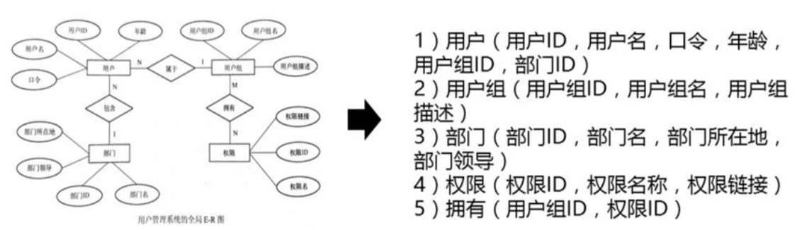

### 示例

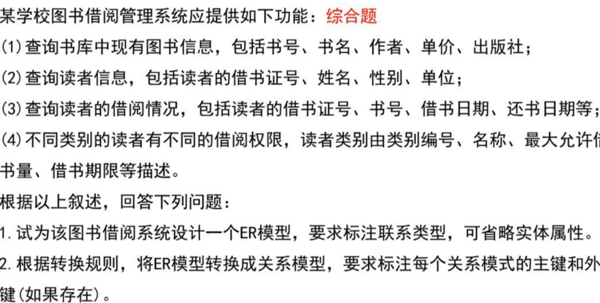

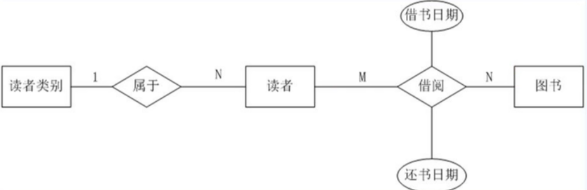

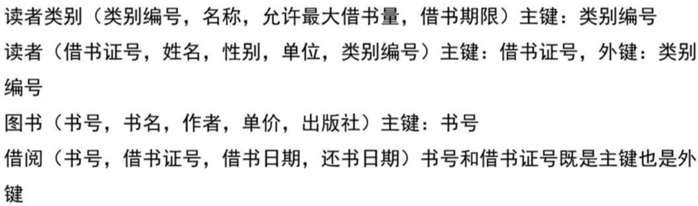

### 2. 数据模型的优化

数据库的逻辑结构设计不是唯一的。

关系数据模型的优化通常以**关系规范化理论**为指导：

1. 确定各属性间的函数依赖关系
2. 对于各关系模式之间的数据依赖进行极小化处理，消除冗余的联系
3. 判断每个关系模式的范式，根据实际需要确定最合适的范式
4. 按照需求分析阶段得到的处理要求，分析这些模式对于这样的应用环境是否合适，确定是否要对某些模式进行合并或拆解
5. 对关系模式i进行必要的分解，提高**数据操作的效率**和**存储空间**的利用率

### 3. 设计用户子模式

1. 可以通过视图机制在设计用户视图时，重新定义某些属性的别名，使其更符合用户的习惯，以方便使用
2. 可以对不同级别的用户定义不同的视图，以保证系统的安全性
3. 简化用户对系统的使用

## 3.3 物理设计方法

物理设计的任务主要是通过对关系**建立索引**和**聚集**来实现应用相关数据的逻辑连接和物理聚集，以**改善对数据库的存取效率**

### 建立索引

建立索引的方式通常有静态和动态两种：

- 静态建立索引
    - 静态建立索引指应用人员预先建立索引，一旦建立，后续的应用程序均可直接使用该索引存取数据
    - 适合用户较多且使用周期较长的数据
- 动态建立索引
    - 指应用人员在程序内外临时建立索引
    - 适合单独用户用户或临时性使用的情况

### 建立聚集

聚集是将相关数据集中存放的**物理存储技术**，借以提高IO的数据命中率而改善存取速度， 功能由DBMS提供。

数据聚集结构的一种有效方式是**块结构**方式

