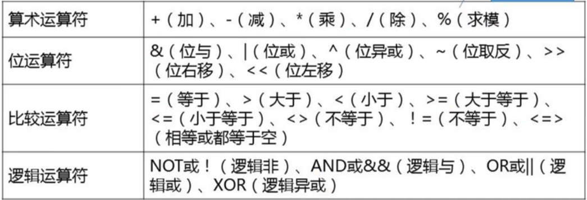
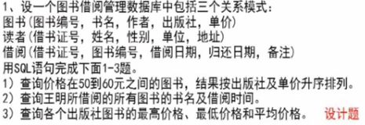

# SQL 概述

结构化查询语言是一种专门用来与数据库通信的语言，他可以帮助用户操作关系数据库。

SQL是关系数据库的标准语言。


## SQL的特点

1. SQL 不是某个特定数据库供应商专有的语言
2. SQL 简单易学
3. SQL 语言强大，灵活， 可以进行非常复杂和高级的数据库操作

## SQL的组成

SQL 集数据查询、数据操纵、数据定义、数据控制四大功能于一体。

数据定义语言 DDL

数据操作语言 DML

数据查询语言 DQL

数据控制语言 DCL

### 数据定义语言

主要用于对数据库及数据库中各种对象进行创建、删除、修改等操作。

数据库对象主要有：表，默认约束、`规则`、视图、触发器、存储过程

- CREATE
- ALTER
- DROP

### 数据操作语言

主要用于`操纵`数据库中各种对象，特别是检索和修改数据。

- SELECT
- INSERT
- DELETE
- UPDATE

### 数据控制语言

主要用于安全管理，例如确定哪些用户可以查看或修改数据库中的数据

- grant 授予权限
- revoke 收回权限

### 嵌入式和动态SQL

嵌入式和动态SQL规则规定了 SQL语句在高级程序设计语言中的使用的规范方法,以便适应较为复杂的应用


### SQL调用和会话规则

SQL调用包括:`SQL例程`、`调用规则`，以便提高SQL的灵活性、有效性、共享性、以及使用SQL具有更多的高级语言的特征  

会话规则可以可以使应用程序连接到多个SQL服务器中的某一个并与之交互


# MySQL预备知识

LAMP

WAMP

### 常量

分为字符串常量、数值常量、十六进制常量、日期时间常量、位字段值、布尔值（true=1, false=0）、NULL值

### 变量

临时存储数据。有名字和类型。

MySQL中变量分为：用户变量 + 系统变量

用户变量前面添加一个`@`符号， 系统变量前添加`@@`符号

```mysql
@variable
@@system_variable
```

### 运算符



### 表达式

是常量、变量、列名、复杂计算、运算符、函数的组合，一个表达式通常可以得到一个值。

根据表达式的值的数据类型，表达式可以分为：

- 字符型表达式
- 数值型表达式
- 日期表达式

### 内置函数

ABS， AVG、MAX、MIN、COUNT， SUM


# 数据定义

## 数据库模式定义

#### 创建数据库

```sql
create {database|schema} [is not exists] db_name
[default] character set [=] charset_name
|[default] collate[=] collation_name;

-- 选择数据库
use db_name;
```

#### 修改数据库

```sql
alter {database|schema} [db_name];
```

#### 删除数据库

```sql
drop db_name if exists;
```

#### 查看数据库

```sql
show databases;
```


## 表定义

### 创建表 create table

auto_increment, primary key 必须在创建语句中指定主键

```sql
create [temporary] TABLE tbl_name(
	column_name_1 数据类型[完整性约束] [默认值]
);

create table customers (
	id int not null auto_increment,
    cust_name char(50) not null,
    cust_sex char(1) not null default 0,
    cust_address char(50) null,
    cust_contact char(50) null,
    primary key(id) #主键的定义必须在这里写，虽然有其他写法
);
```

#### 临时表与持久表

temporary 临时表

- 当前用户可见
- 生命周期为当前会话（数据库连接）
- 关闭数据库连接后MySQL会自动删除
- 临时表名可以重复（在不同的连接中）
- 临时表可以与持久表重名

### 更新表

#### 新增列 add column

==`写上数据库的名字`==

```sql
alter table db_name.table_name add column city not null default '武汉' 
after cust_sex; 
```

- after column_name;

#### 修改列名或数据类型 change column

```sql
alter table db_name.table_name change column old_col_name new_name char(1) null default 'M';
```

#### 修改或删除表中的默认值 set default

```sql
alter table db_name.table_name
alter column city set default 'beijing';
```

#### 只修改数据类型 modify

```sql
alter table db_name.table_name
modify cust_name char(20) first;
```

#### 删除列 drop column

```sql
alter table db_name.table_name 
drop column cust_contact;
```

#### 修改表名 rename to

```sql
alter table db_name.table_name rename to db_name.new_table_name;
rename table db_name.table_name to new_table_name;
```

#### 删除表

```sql
drop [temporary] table [if exists] table_name[,table_name2,table_name3] [restrict|cascade]
```

#### 查看表结构

```sql
show columns from table_name;

+--------------+----------+------+-----+---------+----------------+
| Field        | Type     | Null | Key | Default | Extra          |
+--------------+----------+------+-----+---------+----------------+
| cust_name    | char(20) | YES  |     | NULL    |                |
| id           | int(11)  | NO   | PRI | NULL    | auto_increment |
| cust_sex     | char(1)  | YES  |     | M       |                |
| cust_address | char(50) | YES  |     | NULL    |                |
| city         | char(20) | NO   |     | beijing |                |
+--------------+----------+------+-----+---------+----------------+
```


## 索引定义 

索引就是DBMS根据表中一列或多列按照一定顺序建立的列值与行之间的对应关系表。

因此，`索引实质上是一张描述索引的列值与原表中记录行之间的有序表`。


索引是提高数据文件访问效率的有效方法。

过多使用索引会增加系统的开销，这是因为索引存在一些弊端：

- 索引是以`文件`的方式存储的，DBMS会将一个表的所有索引保存在同一个索引文件中。如果有大量的索引，索引文件可能比数据文件更快达到最大的文件尺寸。
- 索引在提高查询数据的效率的同时，会`降低更新`表的速度。


### 索引的分类

- 普通索引 
    - 最基本的索引，没有任何限制。创建普通索引通常使用`INDEX或KEY`
- 唯一性索引
    - UNIQUE -> 候选码
    - 索引列中的值必须是唯一的。
- 主键
    - 一种唯一性索引。

### 索引的创建

#### CREATE INDEX

```sql
CREATE [UNIQUE] INDEX index_name ON tbl_name(idx_col_name,...)
# idx_col_name 格式： col_name[(length)] [ASC|DESC]
```


```sql
# 根据姓名列的前三个字符创建一个升序索引
create index index_customers
on db_name.tab_name(name(3) ASC);
```

#### CREATE TABLE

```sql
crate table tbl_name (
	col_name,
	...,
	primary key(col_name,...),
	index idx_name(col_name) # 创建索引
);
```

#### ALTER TABLE

```sql
alter table db_name.tbl_name add index idx_name(col_name);
alter table db_name.tbl_name add constraint primary key(col_name);
alter table db_name.tbl_name add [constraint] unique [index|key] idx_name(col_name);
alter table db_name.tbl_name add [constraint] foreign key idx_name(col_name);
```


### 查看索引

```sql
show {index|indexes|keys} 
	{from|in} tbl_name
```


### 删除索引

```sql
drop index index_name on tbl_name; # on table
alter table db_name.tbl_name drop index idx_name;
	
alter table db_name.tbl_name
	drop primary key,
	drop foreign key idx_name;
```


# 数据更新

## 插入数据

```sql
insert into tbl_name (col_name,...) vlaues(val,...);
insert ... set; # 插入部分列的值
insert ... select; # 插入子查询数据
```


```sql
insert into db_name.tbl_name set col_name=val, col=val, ...;
```

> 自增id列， 可以指定0作为值，新增时会自增
>
> DEFAULT 可以用于指定使用默认值。


## 删除数据

```sql
delete from tbl_name
 [where expr]
 [order by ...]
 [limit row_count]
```

## 修改数据

```sql
update db_name.tbl_name set col=val, ... 
	[where expr]
	[order by col_name]
	[limit count];
```


# 数据查询

## 替换查询结果中的数据 case when 

```sql
select 
	case
	when condition_1 then val_1
	when condition_2 then val_2
	else def_val
	end as col_name
from db_name.tbl_name
where ...
```


## 聚合

count max min sum avg std， group_concat

## From 字句、连接查询

### 交叉连接、笛卡儿积

```sql
select * from tbl_1 cross join tbl_2;
select * from tbl_1, tbl2_;
```

### 内连接

通过在查询中设置连接条件的方式，来移除查询结果集中某些数据行之后的交叉连接。

内连接就是利用条件判断表达式中的比较运算符来组合两涨表的记录， 其目的是消除交叉连接中的某些数据行。

```sql
select * from tbl_1 inner join tbl_2 on some_condition;

select * from student inner join score on student.s_no = score.s_no;
```

#### 等值连接 =

#### 非等值连接 > < !=

#### 自连接 

### 外连接

以一张表作为**基表**， 另一张表作为**参考表**。

```sql
select * from tbl_1 inner join tbl_2 on some_condition;

select * from student left outer join score on student.s_no = score.s_no;
```


#### 左外连接

LEFT OUTER JOIN 

LEFT JOIN

#### 右外连接

RIGHT OUTER JOIN

RIGHT JOIN


```sql
SELECT SOME_CONDITION FROM TBL_1 INNER JOIN TBL_2 ON SOME_CONDITIONS ;
```

## Where

<=> 当两个值相等或都是空值是返回true

### 判断范围

between ... and ... 关键字是**between**

in / not in, 使用关键字in可以指定一个值的**枚举表**，该表中列出所有可能的值。

### 判定空值

is null

is not null

### 子查询

在select查询语句中嵌套select查询语句。

在mysql中包含四类子查询

- `表`子查询, 子查询返回的结果集是一个表
- `行`子查询，子查询返回的结果集是带有一个值或多个值的一行数据
- `列`子查询，子查询返回的结果集是一列数据，可以是一行或多行，但每行只有一个值
- `标量`子查询，查询结果集仅仅是一个值

```sql
select sno, name from tb_student where sno in (
	select sno from th_score where score > 80
);
```


结合比较运算符使用子查询，有三种： `ALL, SOME, ANY`

`exist  (subquery)`

子查询的结果集不为空，则返回true， 否则返回false


==一般都用 in 子查询来进行==


## GroupBy

```SQL
	GROUP BY {col_name|expr|position} [ASC|DESC], ... [WITH ROLLUP]
	# expr
	# position 指定用于分组的选择列在select语句结果集中的位置，通常是一个正整数。
	# asc/desc 按升序、降序分组
	# with rollup 用于指定在结果集中不仅包含有 group by子句分组后的数据行，还包含各分组行的汇总行以及所有分组的整体汇总行。
```


> 计算customers表中分别包含相同地址的男性和女性客户人数
>
> ```sql
> select addr, sex, count(*) as 'renshu' 
> 	from customers
> 	group by addr, sex;
> ```


## Having

用于过滤分组， 即在结果集中规定包含哪些分组和排除哪些分组

where 与 having 的区别

- where 子句主要用于过滤数据行， having子句用于过滤分组。
    - 即Having子句可基于分组的聚合值而不是特定行的值来过滤数据
- Having子句中可以包含聚合函数， Where 不可以包含
- where子句在分组前过滤数据， having子句在分组后过滤数据
    - where排除的数据不包含在分组中

## Order by

注意事项

1. order by 子句可以包含子查询
2. 当对空值进行排序时， order by 将空值作为`最小值`
3. 若有多个字段， 从左到有依次进行排序


**Group by & Order By**

| Order By         | Group By                                 |
| ---------------- | ---------------------------------------- |
| 排序产生的输出   | 分组行， 但输出可能不是分组的排序        |
| 任意列都可以使用 | 只可能使用选择列或表达式列               |
| 不一定需要       | 若与聚合函数一起使用列或表达式，必须使用 |


## Limit

限制select返回的行数

```sql
limit {[offset,]row_count|row_count OFFSET offset};
```

- offset : 偏移量， 跳过多少行
- row_count: 指定返回的数据行数
- row_count OFFSET offset 从offset+1行开始获取row_count 行。

```SQL
select * from customers limit 0, 10;
select * from customers limit 10 OFFSET 0;
```





题目给的中文就写中文

```sql
select * from 图书 where 价格 between 50 and 60 order by 出版社,单价;

select 书名,借阅时间 from 读者 join 借阅 on 读者.借书证号=借阅.借书证号
join 图书 on 图书.图书编号 = 借阅.图书编号
where 读者.姓名 = '王明';

#标准
select 书名,借阅时间 from 图书,读者，借阅 where 姓名 = '王明' and 图书.图书编号 = 借阅.图书编号 and 读者.借书证号 = 借阅.借书证号;


select 出版社, max(单价), min(单价), avg(单价) from 图书 group by 出版社;
```


# 视图

视图是数据库中的一个对象， 它是数据库管理系统提供给用户从`不同角度`观察数据库中数据的一种重要机制。

视图是一个或多个表或其他视图中通过查询语句导出的表。


`基表`： 真实的表

`查询表`： select 的结果集

`视图`： 虚拟表

- 视图不是数据库中真实的表， 而是一张虚拟表， 其自身并不存储数据
    - 其结构和数据是建立在对数据库中真实表的查询基础上的
- 视图的内容是由存储在数据库进行查询操作的SQL语句来定义的
- 视图不是以数据集的形式存储在数据库中，他所对应的数据实际上存储在视图所引用的真实表中
- 视图是用来查看存储在别处的数据的一种虚拟表， 本身并不存储数据


**视图的优点**

- 集中分散的数据
    - 数据分散在多个表中， 通过定义视图可以将它们集中在一起
- 简化查询语句
    - 为用户屏蔽数据库的复杂性， 不必了解复杂的表结构和表连接。
- 重用SQL语句
    - 视图提供的是一种对查询操作的封装。
- 保护数据安全
    - 通过只授予用户使用视图的权限，来保护基础数据的安全。
- 共享所需数据
- 更改数据格式
    - 通过视图重新格式化检索出的数据。


## 创建视图

```SQL
create view view_name [(column_list)]
	AS select_statement
	[WITH [CASCADED|LOCAL] CHECK OPTION];
	# WITH CHECK OPTION 用于指定在可更新视图上所进行的修改都需要符合 select_statement 中所指定的限制条件
	# 当视图是根据另一个视图定义时， cascaded、local用于指定检擦范围， cascaded是默认值，即对级联检查所有视图。
```

cascaded local


replace: 如果存在则替换

```sql
create or replace view db_name.customers_view
	as select * from customers where sex = '男' 
	with check option;
```


```sql
mysql> create or replace view customer_sex_m 
    -> as select * from cust where sex = 'M' # 性别是男
    -> with check option;
Query OK, 0 rows affected (0.05 sec)

mysql> select * from customer_sex_m;
+----+-----------+------+--------------+------+
| id | cust_name | sex  | cust_address | city |
+----+-----------+------+--------------+------+
|  2 | B         | M    | bj-hd        | bj   |
|  3 | C         | M    | bj-hd        | bj   |
|  4 | D         | M    | cd-wh        | cd   |
|  5 | E         | M    | cd-wh        | cd   |
+----+-----------+------+--------------+------+
4 rows in set (0.00 sec)

mysql> update customer_sex_m set sex ='F' where id = 2; # 性别只能是 M
ERROR 1369 (HY000): CHECK OPTION failed 'my_test_db.customer_sex_m' # check option
```


## 删除视图

```sql
drop view [if exists]
	view_name[, view_name] ...
	[restrict|cascade]
```

## 修改视图定义

```SQL
alter view view_name[(column_list)]
	as select_statement
	[WITH [CASCADED|LOCAL] CHECK OPTION];
```

## 查看视图定义

```sql
show create view view_name;
```


## 更新视图数据

对视图数据的更新操作实质上是更新视图所引用的基本表中的数据。

对于可更新的视图，该视图中的行和基本表中的行具有一对一的关系。

- insert

    - 视图的insert 受创建视图时的select语句中的where子句限制， 必须满足where子句

- update

    - 若一个视图依赖多个基本表，则一次视图数据修改操作只能改变一个基本表中的数据

- delete

    - 对于依赖多个基本表的视图，不能使用delete

    - ```sql
        delete from cust_order where o_id = 2;
        ERROR 1395 (HY000): Can not delete from join view 'my_test_db.cust_order' 
        ```

