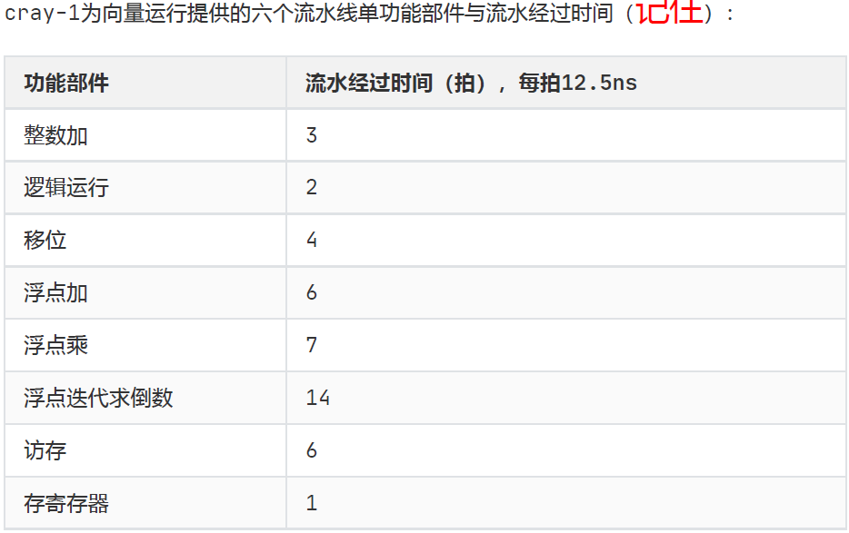
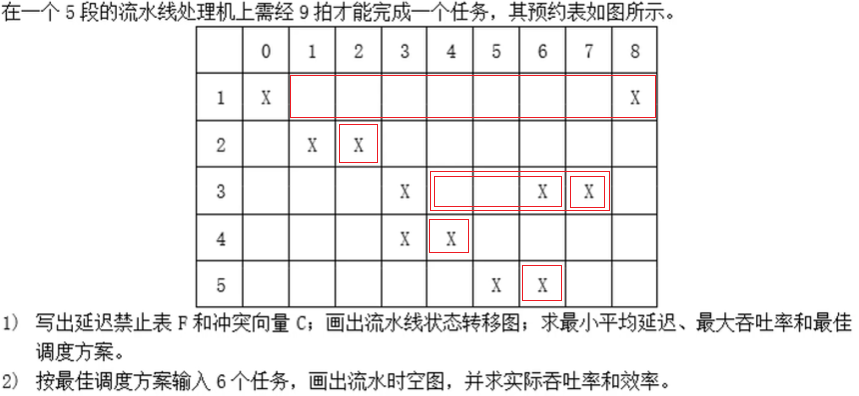
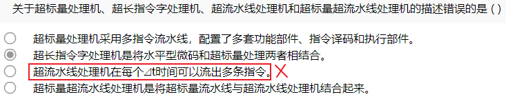

## 操作码优化

操作码采用定长码时，需要$\lceil log_2n \rceil$位表示$ｎ$条指令.

操作码的信息源熵 $H=-\sum_{i=1}^{n}P_i \log_2P_i, \;\;\; P:频度$

`信息冗余` = $\frac{实际平均码长-H}{实际平均码长}$

`平均码长`=$\sum_{i=1}^{n}P_il_i$

## 转移概率

【例3-1】设，访存申请队的转移概率$\lambda=25\%$，比较在模32和模16的多体单字交叉存储器中，每个周期能访问到的平均字数

根据每个存储周期能访问到的平均字数

$$B = \frac{1-(1-\lambda)^m}{\lambda}$$

将$\lambda=25\%, m=32$带入，可求得：

$B = \frac{1-0.75^{32}}{0.25}=4$

将$\lambda=25\%, m=16$带入，可求得：

$B = \frac{1-0.75^{16}}{0.25}=3.96$

==结论：单纯的提高模数m对提高主存的实际频宽影响已经不大了， 所以模m的值不宜过大==

## 通道极限流量

字节多路通道
$$
f_{max}\cdot_{byte}=\frac{1}{T_S+T_D}
$$

数组多路通道 K 定长块长度
$$
\begin{align}f_{max}\cdot_{block}&=\frac{K}{T_S+(K*T_D)} \\
&=\frac{1}{\frac{T_S}{K}+T_D}
\end{align}
$$
选择多路通道 N 要传送是全部字节数
$$
\begin{align}
f_{max}\cdot_{select}&=\frac{N}{T_S+(N*T_D)} \\
&=\frac{1}{\frac{T_S}{N}+T_D}
\end{align}
$$

## 互连网络

> 编号为0、1、2、……、15的16个处理器，用单级互连网络互连，用Cube1互连函数时，与第6号处理器相连的处理器编号是(　4　)       
>
> 6=110
>
> cube1即在第1位上取反， 即 100=4

> 编号为0、1、2、…、15的8个处理器，用单级互连网络互连，用PM2+2互连函数时，与第6号处理器相连的处理器的编号是( )       
>
> 该题考查考生对于PM2I单级网络互连函数的掌握，用PM2+2互连函数时，PM2+2（6）= （6+22） mod 8，所以与第6号处理器相连的处理器编号是2

在设计互连网络时，应使用`规整单一的基本构件`组合而成，提高模块性，而非使用结构不同的构件

