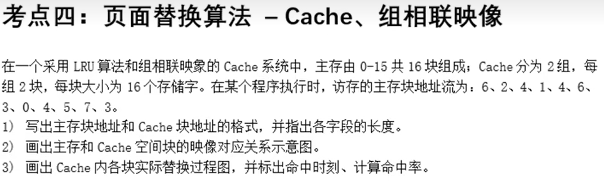
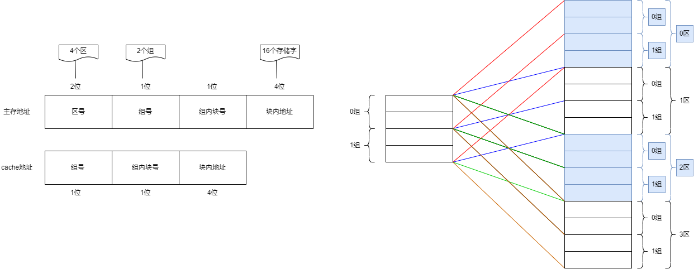
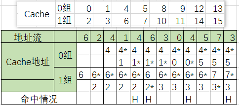

## 操作码优化

操作码采用定长码时，需要$\lceil log_2n \rceil$位表示$ｎ$条指令.

操作码的信息源熵 $H=-\sum_{i=1}^{n}P_i \log_2P_i, \;\;\; P:频度$

`信息冗余` = $\frac{实际平均码长-H}{实际平均码长}$

`平均码长`=$\sum_{i=1}^{n}P_il_i$

## 转移概率

【例3-1】设，访存申请队的转移概率$\lambda=25\%$，比较在模32和模16的多体单字交叉存储器中，每个周期能访问到的平均字数

根据每个存储周期能访问到的平均字数

$$B = \frac{1-(1-\lambda)^m}{\lambda}$$

将$\lambda=25\%, m=32$带入，可求得：

$B = \frac{1-0.75^{32}}{0.25}=4$

将$\lambda=25\%, m=16$带入，可求得：

$B = \frac{1-0.75^{16}}{0.25}=3.96$

==结论：单纯的提高模数m对提高主存的实际频宽影响已经不大了， 所以模m的值不宜过大==

## 中断系统

中断的分类

> 分类原因
>
> 一个中大型的通用计算机，中断源数量巨大，为每一个中断源设置单独的中断处理程序入口，硬件实现困难，代价大，而且不少中断源的性质相近，单独实现中断处理程序也没有必要；因此将中断源性质相近的分为一类，为每一类提供一个中断处理程序入口，再由软件分支转入相应的中断处理部分，可以大大简化中断处理程序地址形成硬件；
>
> 
>
> 分类：
>
> 机器校验中断 访管中断 程序性中断 外部中断 输入输出中断 重新启动中断
>
> 分级
>
> 中断因为随机的发出，所以常常会同时发生多个中断请求；
>
> 机器校验为第一级， 程序性中断与访管中断为第二级，外部中断为第三级， 输入输出为第四级，重新启动为第五级

异常与中断

> 异常：由现行指令引起的暂停事件；如运算结果溢出，页面失效等
>
> 中断：与当前运行程序无关的请求暂停的事件，如机器故障中断

中断系统的功能

> 1. 中断请求的保存和清除
> 2. 优先级确定
> 3. 中断断点及现场的保存
> 4. 中断请求的分析与处理
> 5. 中断返回

## 通道极限流量

字节多路通道
$$
f_{max}\cdot_{byte}=\frac{1}{T_S+T_D}
$$

数组多路通道 K 定长块长度
$$
\begin{align}f_{max}\cdot_{block}&=\frac{K}{T_S+(K*T_D)} \\
&=\frac{1}{\frac{T_S}{K}+T_D}
\end{align}
$$
选择多路通道 N 要传送是全部字节数
$$
\begin{align}
f_{max}\cdot_{select}&=\frac{N}{T_S+(N*T_D)} \\
&=\frac{1}{\frac{T_S}{N}+T_D}
\end{align}
$$

流水线吞吐率

吞吐率是流水线单位时间内能流出的任务数或结果数
$$
T_p=\frac{n}{m\Delta{t}+(n-1)\Delta{t}}
$$

流水方式工作的加速比为：
$$
\begin{align}
S_p & =\frac{nm\Delta{t_0}}{m\Delta{t_0}+(n-1)\Delta{t_0}}  \\
& =\frac{m}{1+\frac{m-1}{n}}
\end{align}
$$

#### 效率

> 
>
> 

## 标量处理机

重叠解释

> 指令的重叠解释使机器语言程序的执行速度会比采用顺序解释的有较大的提高；
>
> 解释一条机器指令的微操作可归并为：取指令，分析，执行三部分

重叠解释的必须在计算机上满足

> 1. 解决访问主存的冲突
> 2. 解决“执行”与“分析”操作的并行：硬件上有独立的执行和分析部件
> 3. 解决”执行“与”分析“操作在控制上的同步：执行与分析需要的时间不同，要在硬件中解决控制上的同步，保证任何时候都是执行k与分析k+1重叠
> 4. 解决指令将各种相关的处理
>    1. 第k条指令是根据执行结果进行转移的条件转移指令，成功转移后要撤销对k+1的分析并从头分析第m条指令
>    2. 相邻指令间的关系，如第k+1条指令依赖于第k条指令的执行结果

各种相关及解决办法

> 1. 转移指令：重叠方式的计算机在程序中应尽量避免使用条件转移指令； 采用延迟转移指令
> 2. 指令相关：不允许修改指令；设置一条”执行“指令来解决
> 3. 主存数相关：相邻两条指令对同一主存单元要求先写而后读的操作；只有推迟”分析k+1“的读；常用方法是存控给写和读操作设置不同的优先级自动实现推后读
> 4. 通用寄存器相关：
>    1. 操作数相关、基址值相关两种
>       1. 推后”分析k+1“指令，牺牲速度；设置相关专用通路

流水方式

> 重叠与流水在概念上没有什么差别，流水是重叠的引申；一次重叠是把一条指令拆分为分析与执行两个子过程；流水则是拆分为更多的子过程；

流水的分类

> - 不同处理级别：部件级，处理机级，系统级
> - 单、多功能：
>   - 只能实现单一功能的流水，如只能实现浮点加减的流水向
>   - 指的是同一流水的各个段之间可以有多种不同的连接方式，以实现多种不同的功能或运算
> - 动、静流水线：按多功能流水线的各段能允许同时用于多种不同功能连接的流水分为动、静流水线
>   - 在某一段时间内各段只能按一种功能连接流水，只有等流水线全部流空后，才能切换为按另一种功能连接流水
>   - 各功能段在同一时间内可以按不同的运算或功能连接
> - 线性、非线性流水线
>   - 从流水线各功能段是否具有反馈回路角度，分为线性和非线性流水线

主要性能

> 吞吐率$T_p$  : 流水线单位时间内能流出的任务数或结果数; n/mt+(n-1)t (指令条数/总时间)
>
> 加速比$S_p$  : 非流水方式完成n各任务的时间$nm\Delta{t}$比流水方式完成n各任务的时间 $m\Delta{t_0}+(n-1)\Delta{t_0}$ ； $\frac{m}{1+\frac{m-1}{n}}$

相关处理和控制机构

> - 局部性相关
>   - 由于机器同时解释多条指令时出现了对同一主存单元或通用寄存器要求”先写后读“
>   - 解决办法有两种： 推迟后续指令对相关单元的读；设置直接相关通路将运行结果直接送入所需部件
> - 全局性相关
>   - 已经进入流水线的转移指令和其后续指令间的相关
>   - 使用猜测法；加快和提前形成条件码；采取延迟转移；加快短循环程序的处理

非线性流水线的调度

> 1. 根据调度表找出延迟禁止表 F （预约表中相差的拍数）
> 2. 根据延迟禁止表计算冲突向量 C （）
> 3. 将每一位0所在的的位右移对应的位数，与C进行或运算（有1得1，无1得0），将得到的新的状态重复此步骤，直到没有新的状态

## 互连网络

> 编号为0、1、2、……、15的16个处理器，用单级互连网络互连，用Cube1互连函数时，与第6号处理器相连的处理器编号是(　4　)       
>
> 6=110
>
> cube1即在第1位上取反， 即 100=4

混洗交换网络

混洗：左移1位，将高位放到最低位

蝶形：最高位与最低位交换

> 编号为0、1、2、…、15的8个处理器，用单级互连网络互连，用PM2+2互连函数时，与第6号处理器相连的处理器的编号是( )       
>
> 该题考查考生对于PM2I单级网络互连函数的掌握，用PM2+2互连函数时，PM2+2（6）= （6+22） mod 8，所以与第6号处理器相连的处理器编号是2

在设计互连网络时，应使用`规整单一的基本构件`组合而成，提高模块性，而非使用结构不同的构件

