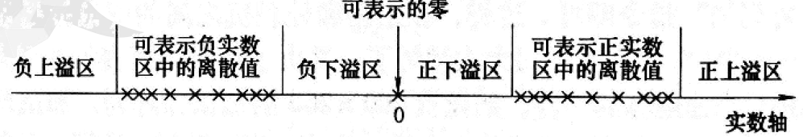

# 数据表示

## 数据表示和数据结构

**数据表示**指的是能由计算机硬件直接识别和引用的数据类型，表现在它由对这种类型的数据进行操作的`指令`和`运算部件`；

**数据结构**是要通过软件映像，变换成计算机中所具有的数据表示来实现的。不同的数据表示可以为不同的数据结构的实现提供不同的支持；表现为实现的效率和方便性不同

早期的计算机只有定点数据表示， 浮点数需要两个定点数来分别表示其阶码和位数。

## 高级数据表示

### 自定义数据表示

- 标志符数据表示
- 数据描述符

传统机器语言程序通过操作码指明操作数的类型。

#### 标志符数据表示

将数据类型与数据本身绑定在一起的数据表示。

##### 优点

1. 简化了`指令系统和程序的设计`
2. 简化了`编译程序`
3. 便于实现`一致性校验`
4. 能由硬件自动变换数据类型
5. 支持数据库系统的实现与数据类型无关的要求。
6. 为软件调试和应用软件开发提供了支持

##### 两个问题

1. 每个数据字因增设标识符，会增加程序所占用的主存空间。
   1. 只要设计合理，这种增加量很少， 甚至可能减少；因为指令种类减少，缩短了操作码位数
2. 采用标识符会降低指令的执行速度
   1. 因为要增加按标志符确定数据属性及判断操作数之间是否相容等操作， 单条指令的速度下降。

#### 数据描述符

为进一步减少标识符所占用的存储空间，对向量、数组、记录等数据，由于元素属性相同发展出数据描述符。

#### `区别`

- 标识符是和每个数据`相连`的， 合并存储在一个存储单元中， 用于描述`单个数据`的类型特征
- 数据描述符则是与数据`分开`存放，用于描述所访问的数据是`整块`的还是`单个`， 访问的数据块或数据元素所需要的`地址和其他信息`等

### 数组、向量数据表示

为向量、数组数据结构的实现和快速运算提供更好地硬件支持的方式是`增设数组、向量数据表示`，组成向量机；

### 堆栈数据表示

**堆栈计算机的表现**

1. 由高速寄存器组成的硬件堆栈，附加控制电路， 与主存中的堆栈在逻辑上构成一个整体， 使得堆栈的速度是寄存器的，容量是主存的。
2. 有`丰富`的堆栈`操作指令`且功能很强，可直接对堆栈中的数据进行各种运算和处理
3. 有力地支持了高级语言程序的`编译`
4. 有力地支持了`子程序`的嵌套和`递归调用`

## 引入数据表示的原则

1. 看系统效率是否有显著提高，包括`实现时间`和`存储空间`是否显著减少
   1. 实现时间主要是看在主存和处理器之间传送的信息量是否减少
   2. 传送的信息量越少，实现时间越少
2. 看引入数据表示后，其通用性和利用率是否提高
   1. 如果只对某种数据结构的实现效率高，其他数据结构的实现效率低；
   2. 或引入的数据表示在应用中很少用到，则为其耗费的硬件过多却并未在性能上取得好处，必然导致性能价格比降低，特别是一些复杂的数据表示

## 浮点数尾数基值大小和下溢处理方法的选择

### 浮点数尾数基值的选择

阶码部分包含了`阶符`和`阶值`两部分

阶码部分可用原码、补码或增码（也称移码）表示。

不管怎么表示，`p + 1`位阶码部分中影响阶值大小的实际只有`p`位

数学中实数在数轴上是连续分布的。但由于计算机字长有限，浮点数只能表示出数轴上分散于正、负两个区间上的部分离散值

- 浮点数阶值的位数`p`主要影响两个可表示区的大小，即`可表示数的范围大小`， 而尾数的位数`m`主要影响在可表示区中能表示`值的精度`

- 由于计算机中尾数位数限制，实数难以精确表示，因此，不得不用较接近的可表示数来近似表示，产生的`误差大小`就是数的`表示精度`。

例：$2^3$ 、$10^3$、$8^3$ 

基数：2、10、8

阶值：3

$r_m$ : 浮点数尾数的基数； 

$log_2r_m$ : 这个基数要占多少位

$m$ : 尾数的计算机位数 

$m'$ : $r_m$进制的尾数的位数

|                        | 阶值：二进制p位                           | 若p=2， m=4                                                  |                                                              |
| ---------------------- | ----------------------------------------- | ------------------------------------------------------------ | ------------------------------------------------------------ |
| 非负阶、正尾数、规格化 | 尾数：$r_m$进制$m'$位                     | 当$r_m=2(m'=4)$时                                            | 当$r_m=16(m'=1)$时                                           |
| 可表示最小尾数值       | $1\times r_m^{-1}\text{即} (r_m^{-1})$    | $\frac{1}{2}$                                                | $\frac{1}{16}$                                               |
| 可表示最大尾数值       | $1-r_m^{-m'}$                             | $\frac{15}{16}$                                              | $\frac{15}{16}$                                              |
| 最大阶值               | $2^p-1$                                   | 3                                                            | 3                                                            |
| 可表示最小值           | $r_m^0\times{r_m^{-1}} 即(r_m^{-1})$      | $\frac{1}{2}$                                                | $\frac{1}{16}$                                               |
| 可表示最大值           | $r_m^{(2^p-1)} \times (1-r_m^{-m'})$      | $2^{(2^2-1)} \times (1-2^{-4})$ $=8 \times \frac{15}{16} = $7.5 | $16^{(2^2-1)} \times (1-16^{-1})$ $=16^3 \times \frac{15}{16} = 3840$ |
| 可表示的尾数个数       | $r_m^{m'} \times (r_m -1)/r_m$            | $2^4 \times (2-1)/2$ $=16 \times \frac{1}{2} = 8$       | $16^1 \times (16-1)/16$ $=16 \times \frac{15}{16} = 15$ |
| 可表示阶的个数         | $2^p$                                     | $4$                                                          | $4$                                                          |
| 可表示数的个数         | $2^p \times r_m^{m'} \times (r_m -1)/r_m$ | $32$                                                         | $60$                                                         |

1. 可表示数范围，随$r_m$增大而增大
2. 可表示数个数，随$r_m$增大而增大
3. 在数轴上的分布，随$r_m$增大而越发稀疏
4. 可表示的精度，随$r_m$增大而单调下降
5. 运算中的精度损失，随$r_m$增大而减小
6. 运算速度，随$r_m$增大而提高

### 下溢处理办法

1. 截断法： 将超出计算机字长的部分截去，实现简单；平均误差为负且较大，无法调节
2. 舍入法： 在计算机运算的规定字长之外增设一位附加位，存放溢出部分的最高位，每当进行尾数下溢处理时，将附加位加1
   1. 实现简单，硬件少， 最大误差小，平均误差接近0
   2. 处理速度慢
3. 恒置1法：将规定字长的最低位恒置为1.
   1. 实现简单，无需增加硬件和处理时间，平均误差趋于0
   2. 最大误差大，比截断法大
4. `查表舍入法`：用ROM或PLA存放下溢处理表
   1. ROM表共需要$2^k$个单元，地址用k位二进制码表示，每个存储单元字长 $k-1$ 位
   2. 当存储器k位地址码之高k-1位全为1时，对应单元内容填k-1位全为1
   3. 其余情况按k为二进制地址码最低位为0全舍弃，为1进1来填k-1位内容
   4. ROM 查表舍入法速度较快，平均误差可以调节到0， 是较好的方法
   5. 缺点是硬件量大

