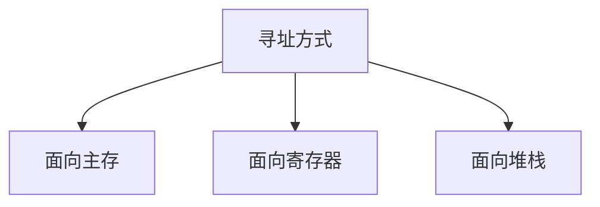

# 寻址方式

多数计算机都将主存、寄存器、堆栈分类编址， 分别有面向主存、面向寄存器、面向堆栈的寻址方式。

- `面向主存`的寻址主要访问主存，少量访问寄存器

- `面向寄存器`的寻址主要访问寄存器，少量访问主存和堆栈

- `面向堆栈`的寻址主要访问堆栈，少量访问主存和寄存器

由指令中给出的逻辑地址如何形成操作数真地址有很多方式， 如立即、直接、间接、相对、变址等寻址方式。

## 寻址方式在指令中的指明方式

1. 占用操作码中的某些位来指明
2. 不占用操作码，在地址码部分专门设置寻址方式位字段指明

