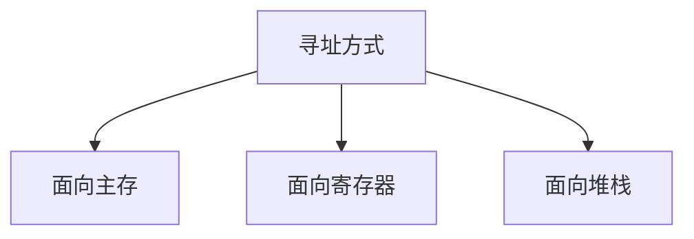
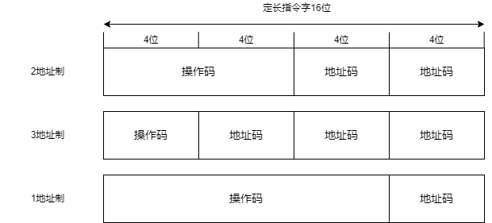

# 数据表示

## 数据表示和数据结构

**数据表示**指的是能由计算机硬件直接识别和引用的数据类型，表现在它由对这种类型的数据进行操作的`指令`和`运算部件`；

**数据结构**是要通过软件映像，变换成计算机中所具有的数据表示来实现的。不同的数据表示可以为不同的数据结构的实现提供不同的支持；表现为实现的效率和方便性不同

早期的计算机只有定点数据表示， 浮点数需要两个定点数来分别表示其阶码和位数。

## 高级数据表示

### 自定义数据表示

- 标志符数据表示
- 数据描述符

传统机器语言程序通过操作码指明操作数的类型。

#### 标志符数据表示

将数据类型与数据本身绑定在一起的数据表示。

##### 优点

1. 简化了`指令系统和程序的设计`
2. 简化了`编译程序`
3. 便于实现`一致性校验`
4. 能由硬件自动变换数据类型
5. 支持数据库系统的实现与数据类型无关的要求
6. 为软件调试和应用软件开发提供了支持

##### 两个问题

1. 每个数据字因增设标识符，会增加程序所占用的主存空间
   1. 只要设计合理，这种增加量很少， 甚至可能减少；因为指令种类减少，缩短了操作码位数
2. 采用标识符会降低指令的执行速度
   1. 因为要增加按标志符确定数据属性及判断操作数之间是否相容等操作， 单条指令的速度下降。

#### 数据描述符

为进一步减少标识符所占用的存储空间，对向量、数组、记录等数据，由于元素属性相同发展出数据描述符

#### `区别`

- 标识符是和每个数据`相连`的， 合并存储在一个存储单元中， 用于描述`单个数据`的类型特征
- 数据描述符则是与数据`分开`存放，用于描述所访问的数据是`整块`的还是`单个`， 访问的数据块或数据元素所需要的`地址和其他信息`等

### 数组、向量数据表示

为向量、数组数据结构的实现和快速运算提供更好地硬件支持的方式是`增设数组、向量数据表示`，组成向量机；

### 堆栈数据表示

**堆栈计算机的表现**

1. 由高速寄存器组成的硬件堆栈，附加控制电路， 与主存中的堆栈在逻辑上构成一个整体， 使得堆栈的速度是寄存器的，容量是主存的。
2. 有`丰富`的堆栈`操作指令`且功能很强，可直接对堆栈中的数据进行各种运算和处理
3. 有力地支持了高级语言程序的`编译`
4. 有力地支持了`子程序`的嵌套和`递归调用`

## 引入数据表示的原则

1. 看系统效率是否有显著提高，包括`实现时间`和`存储空间`是否显著减少
   1. 实现时间主要是看在主存和处理器之间传送的信息量是否减少
   2. 传送的信息量越少，实现时间越少
2. 看引入数据表示后，其`通用性`和`利用率`是否提高
   1. 如果只对某种数据结构的实现效率高，其他数据结构的实现效率低；
   2. 或引入的数据表示在应用中很少用到，则为其耗费的硬件过多却并未在性能上取得好处，必然导致性能价格比降低，特别是一些复杂的数据表示

## 浮点数尾数基值大小和下溢处理方法的选择

### 浮点数尾数基值的选择

阶码部分包含了`阶符`和`阶值`两部分

阶码部分可用原码、补码或增码（也称移码）表示。

不管怎么表示，`p + 1`位阶码部分中影响阶值大小的实际只有`p`位

数学中实数在数轴上是连续分布的。但由于计算机字长有限，浮点数只能表示出数轴上分散于正、负两个区间上的部分离散值

- 浮点数阶值的位数`p`主要影响两个可表示区的大小，即`可表示数的范围大小`， 而尾数的位数`m`主要影响在可表示区中能表示`值的精度`

- 由于计算机中尾数位数限制，实数难以精确表示，因此，不得不用较接近的可表示数来近似表示，产生的`误差大小`就是数的`表示精度`。

例：$2^3$ 、$10^3$、$8^3$ 

基数：2、10、8

阶值：3

$r_m$ : 浮点数尾数的基数； 

$log_2r_m$ : 这个基数要占多少位

$m$ : 尾数的计算机位数 

$m'$ : $r_m$进制的尾数的位数 $m'=m/\lceil \log_2r_m\rceil$

| 非负阶             | 阶值：二进制p位                           | 若p=2， m=4                                                  |                                                              |
| ------------------ | ----------------------------------------- | ------------------------------------------------------------ | ------------------------------------------------------------ |
| 正尾数 规格化 | 尾数：$r_m$进制$m'$位                     | 当$r_m=2(m'=4)$时                                            | 当$r_m=16(m'=1)$时                                           |
| 可表示最小尾数值   | $1\times r_m^{-1}\text{即} (r_m^{-1})$    | $\frac{1}{2}$                                                | $\frac{1}{16}$                                               |
| 可表示最大尾数值   | $1-r_m^{-m'}$                             | $\frac{15}{16}$                                              | $\frac{15}{16}$                                              |
| 最大阶值           | $2^p-1$                                   | 3                                                            | 3                                                            |
| 可表示最小值       | $r_m^0\times{r_m^{-1}} 即(r_m^{-1})$      | $\frac{1}{2}$                                                | $\frac{1}{16}$                                               |
| 可表示最大值       | $r_m^{(2^p-1)} \times (1-r_m^{-m'})$      | $2^{(2^2-1)} \times (1-2^{-4})$ $=8 \times \frac{15}{16} = $7.5 | $16^{(2^2-1)} \times (1-16^{-1})$ $=16^3 \times \frac{15}{16} = 3840$ |
| 可表示的尾数个数   | $r_m^{m'} \times (r_m -1)/r_m$            | $2^4 \times (2-1)/2$ $=16 \times \frac{1}{2} = 8$       | $16^1 \times (16-1)/16$ $=16 \times \frac{15}{16} = 15$ |
| 可表示阶的个数     | $2^p$                                     | $4$                                                          | $4$                                                          |
| 可表示数的个数     | $2^p \times r_m^{m'} \times (r_m -1)/r_m$ | $32$                                                         | $60$                                                         |

1. 可表示数范围，随$r_m$增大而增大
2. 可表示数个数，随$r_m$增大而增大
3. 在数轴上的分布，随$r_m$增大而越发稀疏
4. 可表示的精度，随$r_m$增大而单调下降
5. 运算中的精度损失，随$r_m$增大而减小
6. 运算速度，随$r_m$增大而提高

### 下溢处理办法

1. 截断法： 将超出计算机字长的部分截去，实现简单；平均误差为负且较大，无法调节
2. 舍入法： 在计算机运算的规定字长之外增设一位附加位，存放溢出部分的最高位，每当进行尾数下溢处理时，将附加位加1
   1. 实现简单，硬件少， 最大误差小，平均误差接近0
   2. 处理速度慢
3. 恒置1法：将规定字长的最低位恒置为1.
   1. 实现简单，无需增加硬件和处理时间，平均误差趋于0
   2. 最大误差大，比截断法大
4. `查表舍入法`：用ROM或PLA存放下溢处理表
   1. ROM表共需要$2^k$个单元，地址用k位二进制码表示，每个存储单元字长 $k-1$ 位
   2. 当存储器k位地址码之高k-1位全为1时，对应单元内容填k-1位全为1
   3. 其余情况按k为二进制地址码最低位为0全舍弃，为1进1来填k-1位内容
   4. ROM 查表舍入法速度较快，平均误差可以调节到0， 是较好的方法
   5. 缺点是硬件量大

# 寻址方式

**寻址方式**指的是指令按什么方式寻找（或访问）到所需的操作数或信息的。

寻址方式在多样性、灵活性、寻址范围、地址映像算法和地址变换速度等方面都有了很大的进展。

多数计算机都将主存、寄存器、堆栈分类编址， 分别有面向主存、面向寄存器、面向堆栈的寻址方式。

- `面向主存`的寻址主要访问主存，少量访问寄存器

- `面向寄存器`的寻址主要访问寄存器，少量访问主存和堆栈

- `面向堆栈`的寻址主要访问堆栈，少量访问主存和寄存器

由指令中给出的逻辑地址如何形成操作数真地址有很多方式， 如立即、直接、间接、相对、变址等寻址方式。

## 寻址方式在指令中的指明方式

1. 占用操作码中的某些位来指明
2. 不占用操作码，在地址码部分专门设置寻址方式位字段指明

## 程序在主存中的定位技术

**逻辑地址与物理地址**

逻辑地址是程序员编程用的地址， 主存物理地址是程序在主存中的实际地址。

### 静态再定位

在目的程序装入主存时，有装入程序用软件方法把目的程序的逻辑地址变换为物理地址。

程序执行时，物理地址不再改变，称为静态再定位。

不利于故障定位和程序调试， 给重叠流水技术的采用造成困难。

### 动态再定位

基址寻址法

增加相应的`基址寄存器`和`地址加法器`硬件，在程序不做变换直接装入主存的同时，将装入主存的`起始地址`a`存入对应该道程序使用的基址寄存器`中。

程序执行时只要通过地址加法器将`逻辑地址`加上基址寄存器的`程序基址`形成物理（有效）地址后再访存即可。

把在执行每条指令时才形成访存物理地址的方法称为动态在定位。

基址寻址与变址寻址原理上相似，但不是同一概念

- 变址寻址是对诸如向量、数组等数据块运算的支持，以便于实现程序的循环
- 基址寻址是对逻辑地址空间到物理地址空间变换的支持，以利于实现程序的动态再定位

### 虚实地址映射表

地址加界法要求程序员所有变址空间不能超出实际主存的容量；采用虚拟存储器增加了映像表硬件后，是程序空间可以超出实际主存空间，进一步发展了动态在定位。

## 物理主存中信息的存储分布

信息有字节（8位），半字，单字，双字等不同宽度。 

为了使任何时候所需的信息都只用一个存储周期访问到，要求信息在主存中存放的地址必须是该信息宽度（字节数）的整数倍。否则存在信息跨主存边界存放。

信息在存储器中按整数边界存储对于保证访问速度是很有必要的， 但是会造成存储空间浪费。

# 指令系统的设计和优化

## 指令系统设计的基本原则

指令系统是程序设计者看计算机的主要属性， 是软、硬件的主要界面，它在很大程度上决定了计算机具有的基本功能

指令系统的设计包括指令的功能和指令格式设计。

功能：操作类型、寻址方式和具体操作内容

指令类型一般分为`非特权型`和`特权型`；

- 非特权型指令：
  - 主要给应用程序员使用，也可以供系统程序员使用。
  - 包括算数逻辑运算、数据传送、浮点运算、字符串、十进制运算、控制转移及系统控制等子类

- 特权型指令：
  - 只供系统程序员使用，用户无权使用。
  - 用户只有先经访管指令调用操作系统，再由操作系统来使用这些特权指令。
  - 包含启动I/O（多用户环境下）、停机等待、存储管理保护、控制系统状态、诊断等子类

指令系统设计的基本步骤（反复多次进行）

1. 根据应用初拟指令的分类和具体的指令
2. 试编出用该指令系统设计的各种高级语言的编译程序
3. 对各种算法编写大量的测试程序并进行模拟测试，看指令系统的操作码和寻址方式效能是否都比较高
4. 将程序中高频出现的指令串复合改成一条强功能新指令（硬件实现）；将频度很低的指令的操作改成用基本的指令组成的指令串来完成（软件实现）

编译程度设计者对指令系统的要求：

1. 规整性
2. 对称性
3. 独立性和全能性
4. 正交性
5. 可组合性
6. 可扩充性

系统接结构设计者对执行系统的期望：

1. 指令码密度适中
2. 兼容性
3. 适应性

## 指令操作码的优化

指令是由`操作码`和`地址码`两部组成的。

**指令格式优化**

指如何用最短的位数来表示指令的操作信息和地址信息，使程序中指令的平均字长最短。

操作码的优化上要用到哈夫曼压缩概念。

**哈夫曼研所概念基本思想**

当各种事件发生的概率不均等时，采用优化技术，对发生概率最高的事件用最短的位数（时间）来表示（处理）；

对出现概率较低的事件允许用较长的位数（时间）来表示（处理），就会使表示（处理）的平均位数（时间）缩短。

研究操作码的优化是为了`缩短指令字长`，减少程序总位数及增加指令字能表示的操作信息和地址信息。要对操作码进行优化，就要知道每种指令在程序中出现的概率（使用频度），一般可以通过对大量已有的典型程序进行统计求得。

例：

操作码采用定长码时，需要$\lceil log_2n \rceil$位表示$ｎ$条指令.

操作码的信息源熵 $H=-\sum_{i=1}^{n}P_i \log_2P_i, \;\;\; P:频度$

信息冗余 = $\frac{实际平均码长-H}{实际平均码长}$

平均码长=$\sum_{i=1}^{n}P_il_i$

15/15/15 编码法

8/64/512 编码法

指令的操作码优化编码方法有：哈夫曼编码，扩展操作码编码

## 指令字格式优化

只有操作码的优化，没有在地址码和寻址方式上采取措施，程序总位数还是难以减少.

为了不降低访存取指令的速度，就要维持`指令字按整数边界存储`。

操作码优化表示后的长度$l_i$会因$p_i$的不同而有多种，但操作码优化带来的$l_i$缩短，只使指令字出现空白浪费。

**多地址制**

实际应用中各种指令的操作数个数会有不同，因此可根据需要让指令系统采用多种地址制。同一种地址制还可以采用多种地址形式和长度，也可以用空白处来存放直接操作数或常数等。

让最常用的操作码最短，其地址码个数越多，就越能使指令字的功能增强，越可以从宏观上减少所需的指令条数。

**措施**

1. 采用扩展操作码，并根据指令的频度$p_i$的分布状况选择合适的编码方式，以`缩短操作码的平均长度`
2. 采用诸如基址，变址，相对，寄存器，寄存器间接，段式存放，隐式指明等多种寻址方式，以`缩短地址码的长度`，并在有限的地址长度内提供更多的地址信息
3. 采用0、1、2、3等多种地址制，以增强指令的功能，从宏观上缩短程序长度，并加快执行的执行速度
4. 在同种地址制内再采用多种地址形式，如寄存器-寄存器，寄存器-主存，主存-主存等； 让每种地址字段可以有多种长度，且让长操作码和短地址码进行组配。
5. 在维持指令字在存储器中按整数边界存储的前提下，使用多种不同指令字长度。

## 指令系统的发展和改进

**两种途径和方向**

为使计算机系统有更强的功能，更高的性能，更好的性能价格比，满足应用的需求，在指令系统的设计、发展和改进上有两种不同的途径：

1. 复杂指令系统计算机CISC
   1. 如何进一步增强原有指令的功能以及设置更为复杂的新指令以取代原先由软件子程序完成的功能；实现软件功能的硬化；
   2. 按此方向发展， 机器指令系统日渐庞大和复杂
   3. 可以从面向目标程序、面向高级语言、面向操作系统三个方面的优化实现来考虑
2. 精减指令系统计算机RISC
   1. 如何通过减少指令种数和简化指令功能来降低硬件设计的复杂度，提高指令的执行速度

### 按CISC 方向发展和改进指令系统

#### 面向目标程序的优化实现改进

**途径1** 通过对大量已有机器的机器语言程序及执行情况，统计各种指令和指令串的使用频度加以分析和改进

`静态`使用频度：着眼于减少目标程序所占用的<u>存储空间</u>

`动态`使用频度：着眼于减少目标程序的<u>执行时间</u>

**途径2** 增设`强功能复合指令`来取代原先由常用宏指令或子程序实现的功能，由微程序解释实现，不仅大大提高运算速度，减少了程序调用的开销，还减少了子程序占用的主存空间。

#### 面向高级语言的优化实现改进

**途径1** `通过对源程序中各种高级与语言语句的使用频度进行统计来分析改进`

**途径2** 如何面向编译、优化代码生成来改进；`应当增强系统结构的规整性，尽量减少例外或特殊的情况和用法`，让所有运算都对称、均匀地在存储器（寄存器）单元间进行。对所有存储（寄存器）单元都同等对待，无论是操作数或运算结果都可以无约束地存放在任意单元中。这样为优化管理通用寄存器的使用可以大大减少辅助开销。

**途径3** 改进指令系统，使它与各种高级语言的语义差距都有同等的缩小

**途径4** 由”`指令系统为主，高级语言为从`“ 方式演变为以”`高级语言为主，指令系统为从`“的方式

**途径5** 发展高级语言计算机；基本特点是没有编译；

1. 让高级语言直接称为机器的汇编语言。间接执行的高级语言机器
2. 让高级语言本身成为机器语言，由硬件或固件逐条进行解释执行。直接执行的高级语言机器

#### 面向操作系统的优化实现改进

主要目标是如何通过缩短操作系统与计算机系统结构之间的语义差距，进一步减少操作系统的时间和节省操作系统所占用的存储空间。

**途径1** 对操作系统中常使用的指令和指令串进行`统计分析`来改进；效果有限

**途径2** 考虑如何`增设专用`于操作系统的`新指令`

**途径3** 把操作系统频繁使用的，对速度影响较大的机构型软件子程序`硬化或固化`，改为直接用硬件或微程序解释实现

**途径4** 发展让操作系统由专门的处理机来执行的`功能分布处理`系统结构

### 按RISC方向发展和改进指令系统

**CISC的问题**

1. 指令系统庞大， 一般在200条以上
2. 许多指令的操作繁杂，执行速度很低；
3. 由于指令系统庞大，使高级语言编译程序选择`目标指令的范围太大`，难以优化生成高效机器语言程序，编译程序也太长太复杂
4. 由于指令系统庞大，各种指令的使用频度都不会太高，且差别很大，其中相当一部分利用率很低

#### 设计RISC的基本原则

1. 确定指令系统时，只选择使用频度很高的那些指令；在增加少量能有效支持操作系统、高级语言实现及其他功能的指令；一般<100条
2. 减少指令系统所使用的寻址方式种类
3. 让所有指令都在一个机器周期内完成
4. 扩大通用寄存器数，一般不少于32，尽量减少访存；
5. 为提高指令执行速度，大多数指令采用`硬联控制`实现，少数指令才用微程序实现
6. 通过精简指令和优化设计编译程序，简单有效地支持高级语言实现

#### 基本技术

1. 按设计RISC的一般原则来设计
2. 逻辑实现采用硬联和微程序相结合
3. 在CPU中设置大量工作寄存器并采用重叠寄存器窗口
4. 指令用流水和延迟转移
5. 采用高速换从存储器Cache， 采用指令Cache和数据Cache分别存放指令和数据
6. 优化设计编译系统

