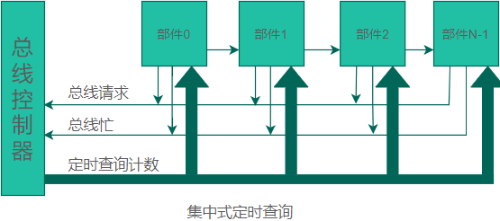
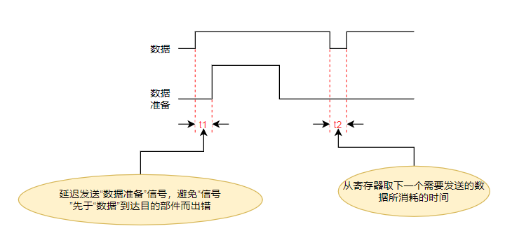
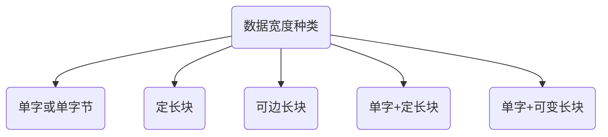
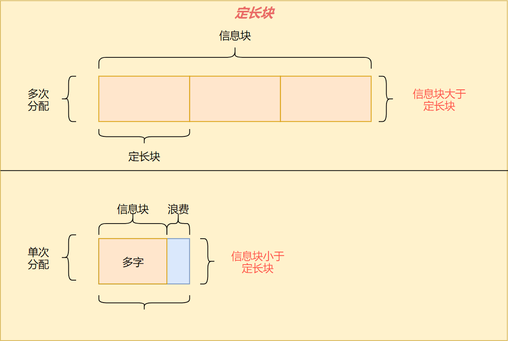
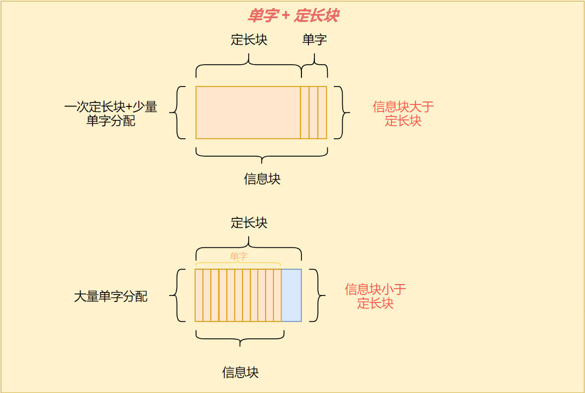

# 总线系统

**总线（Bus）**

- 是一组信号线的集合，它定义了各个引线的信号、电气和机械特性，使计算机系统内部的各部件之间以及外部的各系统之间建立信号联系，进行数据传递和通信。
- 是用于互联计算机、CPU、存储器、IO接口及外部设备、远程通信设备间信息传送通路的集合。
- 同一个时刻，只能有一个信号源（模块或设备）发送信息；多模块传输信息采用分时操作。

**总线系统**

总线与其相配合的附属控制电路统称为总线系统。

按信息传送功能、性能的不同，有

- **数据线** 根数决定同时传送的数据位数，即***数据通路宽度***
- **地址线** 根数决定直接寻址的范围
- **命令、时序和中断信号等控制/状态线** 决定总线的功能和使用能力
- 电源线
- 地线
- **备用线** 用于系统功能扩充
- 等

## 1.总线的分类

### 1.根据总线在系统中的位置分类

- **芯片级** CPU芯片内部的总线， `片内总线`
- **板级** 连接插件版内的各个组件，也称`局部总线`或`内部总线`
- **系统级** 系统间或主机与I/O接口或设备之间的总线，`外部总线`

### 2.根据信息传送方向分类

- **单向传输**
- **双向传输**
    - **半双向**：可沿相反方向传送，但同时只能有一个方向传送
    - **全双向**：允许同时向两个方向传送，速度快，造价高，结构复杂。

### 3.按总线的用法分类

- **专用**

    - 只连接一对物理部件的总线称为专用总线，
    - 优点：
        - 多个部件可以同时接收发送信息，不争用总线**系统流量高**；
        - 通信时不用指明源和目的，**控制简单**；
        - 任何总线失效只会使连于该总线的两个部件不能直接通信，但仍可以间接通信，所以**系统可靠**。

    - 缺点：
        - **总线数多**，成本高；
        - 时间利用率低；
        - 不利于系统模块化；
        - 难以小型化、集成电路化；

    - 在一般的I/O系统中，专用总线只适用于实现某个设备(部件)仅与另一个设备(部件)的连接

    

    N个部件需要 $N*(N-1)/2$组总线， N较大时，总线数于部件数N成平方倍关系增加。

    

- **非专用**

    - 非专用总线可以被多种功能或多个部件*分时共享*，同一时间只有一对部件可使用总线进行通信。
    - 优点：
        - 总线数少，造价低；
        - 总线接口标准化、模块性强；
        - 可扩充能力强（加功能或部件不会使电缆、接口和驱动电路数激增）；
        - 易用多重总线提高总线带宽和可靠性；
    - 缺点：
        - 系统流量小，进程争用总线；
        - 使用不当总线可能成为系统速度性能的瓶颈；
        - 共享总线失效会导致系统瘫痪；
    - I/O系统适宜使用非专用总线。

### 1.根据总线所传输的对象分类

- **数据总线**： 双向， 有8根（字节），16根（字），32根（双字）；
- **地址总线**：单向，由CPU发出，指定信息源或目的的地址。有20根（8086），24根（80286），32根（80386及之后的CPU），寻址范围是$2^{n}\text{ , n=地址总线根数}$
- **控制总线**：但双向都有，控制读写，数据传输，联络，总线判决和中断控制等功能
- **电源总线**：供电

## 2.总线的控制方式

非专用总线上所挂载的多个设备或部件同时请求使用总线时，**总线控制机构**按某种优先次序裁决，保证只有一个高优先级的申请者首先取得对总线的使用权。

**优先次序的决定**

优先次序的确定可以有：`串行链接`、`定时查询`、`独立请求`三种不同的方式

采用何种方式取决于控制线数目、总线分配速度、灵活性、可靠性等因素综合权衡。

### 总线控制方式

总线控制方式分为`集中式总线控制`和`分布式控制两种`；

**集中式总线控制**

总线控制机构基本集中在一起。或者放在连接总线的一个部件中，或者放在单独的硬件中。

**分布式总线控制**

总线控制逻辑分散于连接在总线上的各个部件中。

### 集中式总线控制的三种类型

- 集中式串行链接方式
- 集中式定时查询方式
- 集中式独立请求方式

#### 集中式串行链接方式

- 所有部件都经`总线请求`线向控制器发出使用总线请求
- 只有当"总线忙"信号没有建立（总线空闲）时，总线控制器才会响应该请求并发出响应信号，该信号串行通过每一个部件
- 部件接收到"总线可用"信号但没有发出过"总线请求"时，将信号传递到下一个部件
- 部件接收到"总线可用"信号且发出过"总线请求"时信号停止传递，该部件建立"总线忙"并去除"总线请求"（获得总线使用权）

该方式获得总线使用权的优先次序时有“总控可用”线所连接部件的物理位置决定的，距离总线控制器越近，优先级越高。

##### **优点**

- 选择算法简单
- 用于解决总线控制分配的控制线的线数少，只需要三（请求，可用，忙）根且不取决于部件数量
- 部件增加容易，扩充性好
- 因逻辑简单可重复设置提高可靠性

##### **缺点**

- 对"总线可用"线及有关电路的**失效敏感**。一个部件不能正常传输可用信号，其后的部件将无法得到总线使用权
- 优先级固定无法更改，**灵活性差**
- 若高优先级部件频繁使用总线，距离总线控制器远的部件难以获得使用权
- 总线可用信号顺序脉动地通过各个部件，限制了总线的分配速度
- 因总线长度限制，增减或移动部件受到限制

#### 集中式定时查询方式

- 总线上的每个部件通过"总线请求"线发出请求
- 若总线空闲，"总线忙"信号未建立，总线控制器接收到请求后，让计数器开始计数。定时查询各部件确定发出请求的部件
- 当查询先上的计数值与部件号一致，该部件建立“总线忙”并停止计数(停止查询)，同时去除该部件的"总线请求"，该部件获得使用权

优先次序

- 若每次总线分配前将计数器清0，查询从0开始，部件优先级同串行链接
- 若每次总线分配前计数器不清0，则从中止点继续查询，是一种循环优先级，为每个部件提供相同的使用机会
- 若总线分配前将计数器置为某个值，则可以指定某个部件为最高优先级

==总线分配前，将部件号重新设置就可以让指定部件为任意优先级==

**优点**

- 计数器初值和部件号都可以由程序动态修改，所以优先次序可以控制，灵活性强
- 不会因某部件失效而影响其他部件对总线的使用，可靠性高

**缺点**

- 控制线线数较多， 需要$2+\lceil{log_2N}\rceil$
- 可共享总线的部件数受限于"定时查询线"的线数，扩展性稍差
- 控制复杂
- 总线分配速度取决于计数信号的频率和部件数，不能很高

#### 集中式独立请求方式

共享总线的每个部件各自有一对"总线请求"和"总线准许"线。

当部件需要使用总线时，通过自己的"总线请求线"发出信号到总线控制器。

总线控制器根据某种算法在同时接收到总线使用请求的多个部件中选择一个部件使用总线，并通过"总线准许线"送回该部件

**优点**

- 总线分配速度快
- 可以通过程序灵活控制部件的优先权
- 能方便地隔离失效部件的请求

**缺点**

- 控制线数量过大，为控制N个部件必须有$2N+1$根控制线
- 总线控制器复杂

## 3.总线的通信技术

==记住同步通信和异步通信两个名词即可==

当获得总线使用权后，还必须给出通信的是"源"还是"目的"部件，以及传送信息的类型和方向等信息后才能开始真正的数据传送。

**同步**的意义

为了保证通信正常进行，必须采用一定的方式让接收端知道发送端什么时候开始发送，什么时候发送完毕。这个过程称为总线通信的同步。

按同步方式不同，信息在总线上的传输方法基本可分为：同步、异步两种。

### 同步通信

部件之间采用定宽、定距的系统时标同步。

**优点**

信息传送效率高，受总线长度影响小

**缺点**

- 时钟在总线上的时滞可能会造成同步误差

- 时钟线上的干扰信号容易引起误同步
- 为了可靠性加宽时间片可能使数据传送速率低于异步通信

**解决办法**

目的部件（接收端）对数据是否正确接收给予响应。

正常时目的部件不响应， 出错时目的部件在同步时间片过去后，发回源部件一个出错信号。不会降低正常时总线的传送速率。

*要求*源部件必须设置较大容量的缓冲器来保留已发送但未证实和回答过的所有数据用于重发。

### 异步通信

由于IO总线一般是为具有不同速度的众多的IO设备所共享，所以适合采用异步通信。

异步通信分为：

- 单向控制

- 请求/回答双向控制两种。

**单向控制**

通信过程只由源或目的部件之一控制的称为单向源控式**或**单向目控式。

**双向控制**

通信过程由源和目的部件共同控制的方式称为请求/回答双向控制。

#### 单向控制

单向控制的缺点是：（没有提供传送完毕标志）不能保证下一个数据传送之前让所有数据线和控制线的电平信号恢复成初始状态，从而可能造成错误

##### 异步单向源控式

1. 源部件将数据放在"数据"总线上
2. 延迟 $t1$ 后在**控制总线**上发"数据准备"信号

延迟$t1$是为了避免"准备"信号先于"数据"到达目的部件而出错。

$t2$是源部件输出寄存器再装入新的待发数据或是总线重新分配所需的时间

"数据准备"信号是给目的部件作为接收数据的**选通信号**

**优点**

简单，高速

**缺点**

- 没有目的部件的响应，不知道数据是否接收
- 对不同速度的部件间通信困难，部件内需要设置缓冲器以缓冲来不及处理的数据
- 有效率低，高速部件难以发挥效能
- 要求“数据准备”干扰小，否则容易认成有效信号

##### 异步单向目控式

1. 由目的部件建立"数据请求"来使源部件将数据放到数据总线上
2. 目的部件检验数据的有效性。如果有错，目的部件发送"数据错误"代替下一个"数据请求"

目的部件发出"数据请求"后，经过2次传送延迟（2td）后，数据到达目的部件。

优点：

增加了数据校验， 有了目的部件的应答信号。

缺点：

==总线传送速率随源、目的部件之间的距离增加而下降。开始时需要辅助操作时间已经目的部件在接收数据后，需要再加上数据校验时间才能发出下一个请求信号==

#### 双向控制

##### 非互锁方式异步双向控制通信

**优点**

提供了出错控制

比那与不同速率部件通信

**缺点**

传送速率更低

容易丢失数据

##### 互锁方式异步双向控制通信

**优点**

保证数据高速、正确传送， 适合不同速率部件间通信

**缺点**

增加了信号沿总线来回传送的次数， 控制硬件复杂

## 4.数据宽度与总线线数

### 数据宽度

**数据宽度**：是I/O设备取得I/O总线后所传送数据的总量,可能要经过多个时钟周期分次传送。

**数据通路宽度**：是数据总线的物理宽度，即一个时钟周期所传送的信息量（32bit， 64bit）。

==记住==

**单字**（单字节）宽度适合于输入机、打印机等**低速**设备。
**定长块**宽度适合于磁盘等**高速**设备，可以充分利用总线带宽。
**可变长块**宽度适合于**高优先级的中高速**磁带、磁盘等设备，
单字+定长块适合低速高优先级设备
采用单字加可变长块的传送，是一种灵活有效却复杂、开销大的方法。

#### 单字宽度

适用于低速设备，每传送完一个字后等待时间长，期间释放总线为其他设备服务以提高利用率和系统效率

不适用于快速设备。

**优点**

不指明信息长度，减少辅助开销

**缺点**

要求总线控制逻辑高速分配总线，妨碍总线采用更为合理的分配算法。

#### 定长块

适用于快速设备，不用指明信息长度，简化控制，按整个块进行校验。

**缺点**

- 块**大于**信息时浪费总线和缓冲器空间
- 块**小于**信息时仍要多次分配总线

#### 可变长块

适用于高优先级的中高速设备。

**优点**

可以按设备特点动态改变传送块的大小，有效地利用总线宽度。

**缺点**

- 增大缓冲器空间

- 增加指明信息块大小的辅助开销和控制

#### 单字+定长块

适用于高优先级的低速设备。定长块不用过大.

**优点**

信息块超过定长块的部分采用单字，减少总线带宽，部件缓冲器的浪费

**缺点**

信息块小于定长块单字数又较多时，总线利用率低。

#### 单字+可变长块

灵活有效，但是复杂、开销大

适用于挂有各种设备的总线

### 总线线数

总线要有发送/接收电路、传输导线或电缆、转接插头和电源等。

在满足性能前提下要尽可能减少线数。总线线数可通过采用线的功能组合、编码和并/串-串/并转换来减少

总线标准一般包括机械、功能、电气、过程（同步）等4个方面的标准。

#### 制约因素

- 总线线数越多，成本越高，干扰越大、可靠性越低、占用空间越大。
    - 但是速度与流量越高
- 总线长度越长，成本越高，干扰越大、可靠性越低、波形畸变越严重

#### 原则

- 总线越长，线数就尽可能减少
- 在满足性能要求及通信和速率的情况下，应尽量减少总线的线数

#### 线数减少的手段

- 总线组合
- 并/串--串/并转换 （并联、串联）
- 编码

#### 流量问题

- IO总线所需的流量取决于该总线所接外设数量、种类、传输信息的方式和速率要求
- 总线的价格正比于流量，当流量超过某范围时价格呈指数上升
- 当系统流量要求过大时，可以采用多组总线进行合理的流量分配，并限制每组总线长度与所接设备数量
- 为保证总线上各设备满负荷运行工作时也不丢失信息，必须使总线的允许流量不低于所接多台外设的平均流量之和，并设有一定容量的缓冲器

