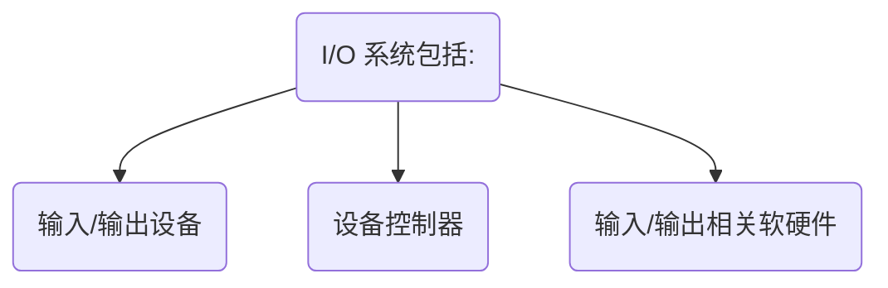
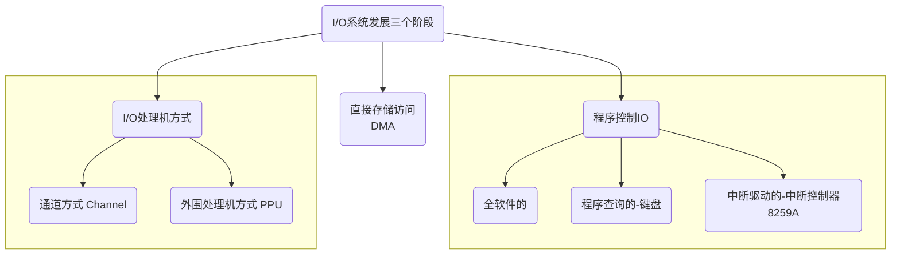
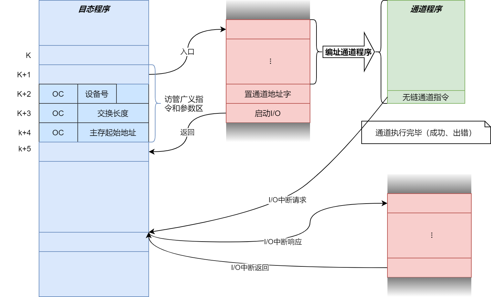

# IO系统

## IO系统概述

什么是IO系统：

IO系统的设计目标：考虑解决好CPU、主存和I/O设备在速度的上的巨大差距。

大多数计算机中都具有较多的IO设备以及多用户，他们共享CPU、主存和外围设备资源。在这类系统上用户程序的输入输出不是由用户自己安排， 而是由**用户向系统发出申请，经操作系统调度分配设备并进行具体的IO处理。**

高级程序语言中的读写语句到读写操作全部完成，需要通过编译程序、操作系统和I/O总线、设备控制器、设备硬件共同完成。

大多数计算机输入输出系统的设计应该面向操作系统，考虑怎样在操作系统与输入输出系统之间进行合理的软硬件功能分配。

输入输出系统结构设计不好会直接影响计算机系统的性能

输入输出设备分为外存和传输设备两大类。

- 外存有磁盘，磁带，光盘等。 
- 传输设备有键盘、鼠标、光笔、显示器、打印机、声音输入输出设备、图像扫描器、网络驱动等。

### 输入输出系统发展的三个阶段

三个阶段对应三种方式

程序控制I/O、直接存储器访问、I/O处理机方式

### DMA

### 通道

- 有自己的指令系统和程序通道程序
- 可以与CPU并行工作
- 可以替CPU对多个设备信息传输进行分时管理
- 指令功能简单,使用面窄 一般只具有面向外设控制和数据传送的指令

### 冗余磁盘阵列技术

将并行处理原理引入到磁盘系统中。将多台低成本小型磁盘组成同步化的磁盘阵列，数据被分布存放到各个磁盘上，使用缓冲器同步访问。

以冗余提高可靠性。

磁盘阵列的数据并行访问对主处理机是完全透明的。i

冗余磁盘阵列技术分为

- 带镜像磁盘的
    - 每一数据库不断被复制到镜像盘上，库的有效容量**降低一般**，**适用于高可靠性场景**
- 带海明码纠错的
    - 冗余量少，具有一位纠错功能，适用于**大量顺序数据访问**
- 带奇偶校验的
    - 只能检错，不能纠错，冗余度很小。 **适合大量顺序数据的访问**
- 独立传送的
    - 采用数据块交叉布放，**适用于小块数据的高速访问**

## 通道处理机的工作原理

通道处理机是IBM首先提出的一种IO处理机方式。

出于众多设备和用户共享CPU和外围设备资源，不允许用户直接安排输入输出，同时也可以**避免用户窃取系统中不该让其读取的内容**，以及**防止用户可以自行输入输出而破坏其他用户程序或系统程序**。

CPU用于控制外围设备操作用的输入输出指令被定义为管态指令，用户在目态程序中不能使用。

用户只能在目态程序中安排广义输入输出指令，进入相应的管理程序执行这些输入输出管态指令。

广义指令由访管指令和若干参数组成， 它的操作码对应此广义指令的管理程序入口。

访管指令是目态指令，当目态程序执行到要求输入输出的访管指令后，产生自愿访管中断。

- 当目态程序执行到访管指令时，产生自愿访管中断
- 输入输出中断处理程序根据访管指令中提供的参数编址通道程序。
    - 通道程序存放在主存对应该通道的通道缓冲区中
    - 将通道程序入口置入主存中的通道地址字单元
- 管理程序执行启动I/O指令， 进入通道开始设备选择期

"***启动I/O***"指令是管态指令，其执行流程是：

- 选择特定的通道、子通道， 如果它被联通且空闲时，从主存中取出通道地址字，按通道地址字给出的通道程序首地址，从主存通道缓冲区取出第一条通道指令
- 经校验，其格式无误后，选择相应的设备控制器和设备
- 如果设备是连接的，就向设备发送启动命令
- 如果设备启动成功，用全“0”字节回答通道，结束通道开始选择设备期

通道被启动后，CPU退出管态继续运行目态程序。通道进入通道数据传送期执行通道程序组织I/O操作，开始通道与设备间的数据传送。此时通道与目态程序并行执行。

通道程序执行完无链通道指令后传送完成，或出现故障、错误等异常时向CPU发起I/O中断请求,CPU响应中断请求后第二次进入管态处理中断请求。

每一次I/O操作只需要两次进管态,减少对目态程序的影响，提高了CPU运算和外设操作的重叠度

系统中多个通道可以有自己的通道程序同时运行，使多种、多台设备可以并行工作。

### 通道的分类

通道在通道数据传送期里，如果所连接的多台设备同时要交换数据或通道的数据宽度与要传送的信息宽度不等时，还要多次选择当前要传送的是哪一台设备（每传送一个数据宽度就要重新选择设备）

根据通道数据传送期中传送数据方式不同，可以分为：字节多路通道、数组多路通道、选择通道

#### 字节多路通道

适用于连接大量的字符(字节）类低速设备。 数据宽度：字节

传送一个字符的时间很短，但是字符间等待时间长。

可以有多个子通道，子通道可以独立执行通道指令，并行地操作，以字节宽度分时进出通道。子通道上的多个设备也可以分时使用子通道。

以字节交叉方式轮流为多台低速设备服务

#### 数组多路通道

适用于连接多台磁盘等高速设备。数据宽度：定长块

传送速率高，但是传送前寻址的辅助操作时间很长。

采用成组交叉方式工作，充分利用并尽可能重叠高速设备的辅助操作时间。

传送完K个字节数据后就重新选择下一个设备。

可以有多个子通道，同时执行多个通道程序。

利用率高，控制复杂。

以成组交叉方式传送

#### 选择通道

适合于连接优先级高的磁盘等高速设备。数据宽度：可变长块

物理上可以连接多个设备，但是多个设备不能同时工作，同一时间段只能选择一个设备工作。

采用可变长块，一次对N个字节全部传送完毕。在数据传送期内只选择一次设备。

## 通道处理机的流量设计

### 极限流量

通道流量是通道在数据传送期内，单位时间内传送的字节数。能达到的最大流量称为通道极限流量。

通道的极限流量与其工作方式、数据传送期内**选择一次设备的时间**$T_S$(select)和**传送一个字节的时间**$T_D$(deliver)有关。

字节多路通道每选择一台设备只传送一个字节，其极限流量为：
$$
f_{max}\cdot_{byte}=\frac{1}{T_S+T_D}
$$
数组多路通道，每选择一个设备可以传送完K个字（定长块K);如果要传送N个字节，需要拆分为$\lceil{N}/K\rceil$次传送，每次传送都需要选择一次设备，其极限流量为：
$$
\begin{align}f_{max}\cdot_{block}&=\frac{K}{T_S+(K*T_D)} \\
&=\frac{1}{\frac{T_S}{K}+T_D}
\end{align}
$$

选择通道每选择一次设备就把N个字节全部传送完成，其极限流量为：
$$
\begin{align}
f_{max}\cdot_{select}&=\frac{N}{T_S+(N*T_D)} \\
&=\frac{1}{\frac{T_S}{N}+T_D}
\end{align}
$$

### 实际最大流量

由通道工作原理可知，当挂上设备后，设备要求通道的实际最大流量为

字节交叉方式工作的实际最大流量应该是该该通道所接设备的字节传送速率之和， 即：
$$
f_{byte}\cdot_{j}=\sum_{i=1}^{P_j}f_{i}\cdot_{j}
$$

数组多路通道和选择通路工作的应是所接各设备的字节传送效率中的最大者， 即：
$$
f_{block}\cdot_j=\max_{i=1}^{P_j}f_{i}\cdot_{j}
$$

$$
f_{select}\cdot_j=\max_{i=1}^{P_j}f_{i}\cdot_{j}
$$

式中，$j$为通道的编号；$f_i\cdot_{j}$为第j号通道上所挂的第$i$台设备的字节传送效率；$P_j$为第$j$号通道中所接设备的台数。

为了保证第j号通道上所挂设备在满负荷的最坏情况下不丢失信息，必须满足设备要求通道的实际最大流量不超过通道的极限流量,即：
$$
f_{byte}\cdot_{j}\le{f}_{max}\cdot_{byte}\cdot_{j} \\
f_{block}\cdot_{j}\le{f}_{max}\cdot_{block}\cdot_{j} \\
f_{select}\cdot_{j}\le{f}_{max}\cdot_{select}\cdot_{j}
$$
实际最大流量小于极限流量

> 【例3-4】如果通道在数据传输期中，选择设备需要9.8$\mu{s}$，传送一个字节数据需要0.2$\mu{s}$。
>
> 1.某低速设备每隔500$\mu{s}$发出一个字节数据请求，至多可以连接几台这种低速设备?
>
> 2.对于如下A-F六台设备，一次通信传送的字节数不少于1024字节，则那些设备可以挂，那些不可以？其中A-F设备每发送一个字节数据传送请求时间间隔分别如下表：
>
> | 设备                    | A    | B    | C    | D    | E    | F    |
> | ----------------------- | ---- | ---- | ---- | ---- | ---- | ---- |
> | 发请求间隔时间/$\mu{s}$ | 0.2  | 0.25 | 0.5  | 0.19 | 0.4  | 0.21 |
>
> > 答：
> >
> > 1. 根据题意，低速设备500$\mu{s}$发送一个字节数据，可知挂低速设备的通道采用的是字节多路通道方式工作，所以其通道极限流量为：
> >
> > $$
> > f_{max}\cdot_{byte} = \frac{1}{T_S+T_D}
> > $$
> >
> > 且在满负荷情况下，通道极限流量应大于等于设备对通道要求的流量。即：
> > $$
> > f_{max}\cdot_{byte}\ge{f}_{byte} \\
> > \frac{1}{T_S+T_D}\ge{m}\cdot{f_i}\\
> > m\le{\frac{1}{(T_S+T_D)\cdot{f_i}}} \\
> > m\le{\frac{1}{(T_S+T_D)\cdot{f_i}}} \\
> > =\frac{1}{9.8+0.2}/f_i =\frac{1}{9.8+0.2}/\frac{1}{500} =\frac{1}{10}\cdot{500}=50{(台)}
> > $$
> > 所以，至多可以挂50台设备
>
> 
>
> > 2. 根据A-F都是高速设备，且每次传送数据不少于1024字节，可知该通道采用的是选择通道。如果通道上挂由m台设备，则通道极限流量为：
> >
> > $$
> > f_{max}\cdot_{select}=\frac{1}{\frac{T_S}{n} + T_D} \\
> > =\frac{1B}{\frac{9.8\mu{s}}{nB}+0.2\mu{s}/B} \\
> > $$
> >
> > 所以，限制通道上所挂设备速率
> > $$
> > f_i\le\frac{1}{\frac{9.8}{n}+0.2}B\cdot{\mu{s}^{-1}}, n\ge{1024} \\
> > f_i\le\frac{1}{\frac{9.8}{1024}+0.2}B\cdot{\mu{s}^{-1}} \\
> > f_i\le{4.78}
> > $$
> > A-F设备的速率如下：
> >
> > | 设备     | A       | B        | C       | D           | E         | F           |
> > | -------- | ------- | -------- | ------- | ----------- | --------- | ----------- |
> > | 设备速率 | 1/0.2=5 | 1/0.25=4 | 1/0.5=2 | 1/0.19=5.26 | 1/0.4=2.5 | 1/0.21=4.76 |
> >
> > 所以，A，D因为超过了限制不能挂， B，C，E，F可以挂
>
> 

