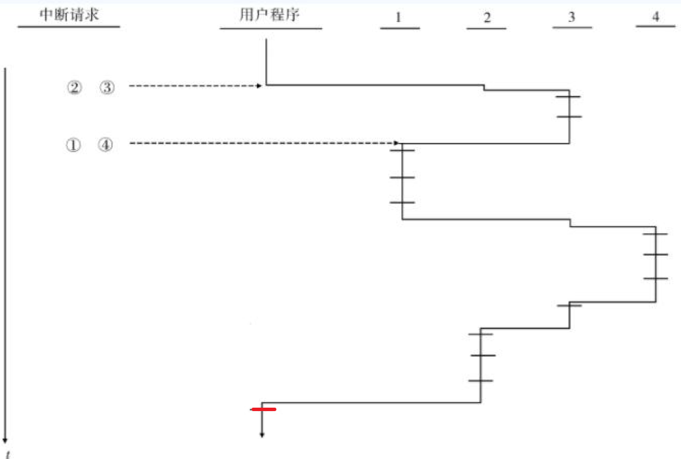

# 1、存储系统

## 存储系统的基本要求

- 基本要求是大容量、高速度、低价格

### 存储器容量 

$$\text{存储器容量} S_M=W * l * m$$

- W 为存储体的字长， 单位是位、字节
- l 为存储体的字数
- m 为并行工作的存储体数

### 存储速度

存储速度可以用访问时间$T{_A}$、存储周期 $T{_M}$ 和 频宽（带宽）$B{_m}$描述

#### 访问时间$T{_A}$

> 是存储器从接收访存读请求申请 到信息被读取到数据总线上的时间

 是处理机启动访存后必须等待的时间
 是确定处理机与存储器时间关系的重要参数

#### 存储周期$T{_M}$

> 是连续启动一个存储体所需要的时间间隔一般比Ta大

#### 存储器频宽$B{_m}$

- 是存储器可提供的数据传送速率
- 用每秒传送的信息位数或字节数衡量
- 有最大频宽和实际频宽之分,最大频宽是是存储器连续访问时的频宽
- 存储器频度 Bm=W/Tm(存储体字长/存储周期)
- m个存储体并行的最大频度 $Bm = W * m/Tm$

> $B_m=字长\times 体数 / 存储周期$

### 存储器容量、速度、价格关系

- 容量越大，因其延迟增大会使速度越低
- 容量越大，总价格越高
- 存储器速度越快，价格越高

### 使用并行系统的原因

使用单一工艺无法同时满足`容量`，`速度`与`价格`的要求。因此系统中必须同时采用多种不同工艺存储器组成的存储器系统（memory system）例如：主存+辅存

为了弥补CPU与存储器在速度上的差距，引入了`并行与重叠技术`构成并行主存系统，在保持每位价格基本不变的情况下，使主存的频宽得到较大的提高。但是这种方法提高频宽有限

## 并行主存系统

#### 单体单字存储器

一个字长位W位的单体主存，一次可以访问一个存储器字
存储器的字长W与CPU要访问的字的字长W相同，则CPU从主存获得数据的速度就是$B_m=W/T_M$

#### 单体多字存储器

一个字长为$W$的单体主存，其字长是CPU字的倍数（相当于一次读取多个字）。

一次可以读取多个CPU字。

> 将单体单字扩展为单体多字

#### 多体单字交叉存储器

一个大容量的半导体主存往往是由多个容量较小、字长较短的存储器芯片（内存颗粒)组搭而成的，每个存储芯片都由其自己的地址译码、读/写驱动等外围电路。因此可以采用多体单字存储。

CPU字在主存中按模m交叉编址，根据应用特点分为 `低位交叉`和`高位交叉`

以低位交叉为例，其$m$在单体多字方式中为一个主存字所包含的CPU字数，在多体单字方式中则为分体体数。

以多体单字交叉为例，单体容量为 $l$ 的多个 $m$ 个分体，其 $M_j$ 体的编制模式为 $m * i + j$ 。其中 $i = , 1, 2,..., l -1$, $j = 0,1,2,...,m-1$。如上图，如果多体存储器的体数为4， 存储体$M_0$中的编址序列为 $4*i+0$,存储体$M_1$中的编址序列为 $4*i+1$,存储体$M_2$中的编址序列为 $4*i+2$,存储体$M_3$中的编址序列为 $4*i+3$。

各分体地址对应二进制码最末尾两位的状态

$M_0$ 的地址最后两位是 00, $4*i+0$, 2的倍数

$M_1$ 的地址最后两位是 01, $4*i+1$, 1=01

$M_2$ 的地址最后两位是 10, $4*i+2$, 2=10

$M_3$ 的地址最后两位是 11, $4*i+3$, 3=11

#### 各分体的工作方式

各分体的工作方式可以采用`同时启动`或`分时启动`方式工作。相对而言，分时启动方式所用的硬件较节省。

#### 并行主存系统

能`并行`读出多个CPU字的单体多字和多体单字、多体多字交的交叉访问主存系统称作并行主存系统。

提高模 m 的值（体数）是能提高主存系统的最大频宽的，但是实际频宽并不是随 m 值增大而线性提高。也就是说实际效率并不是希望的那么高。原因是：

1. 系统效率问题

    - 对模$m$交叉，若都是顺序取指，效率是可以提高到$m$倍的。
    - 但实际程序中指令不总是顺序执行，一旦出现`转移`效率就会下降。
    - 转移的频度越高，并行主存系统效率的下降越大
    - 数据的顺序性比指令的要差，实际的频宽可能还要低些

2. 工程实现上

    - 在工程实现上由于模 $m$ 的越高，存储器数据`总线越长`，总线上并联的负载越重。
    - 有时还不得不增加门的级数，这些都会使传输`延迟增加`

#### 定量分析主存频宽与分体数m、转移概率$\lambda$的关系

对有m个独立分体的主存系统，CPU发出的访存申请队为：$A_1,A_2,...,A_q$。

- 在每一个主存周期到来之前扫描申请队，并从对头截取序列$A_1,A_2,...,A_k$作为申请序列。
- 申请序列是在要求访存的k个地址中没有两个或以上的地址在同一个分体中的最长序列。
- 即：$A_1\text{到}A_k$的地址不一定是顺序编址，只要它们之间不发生分体冲突。显然$k$是随机变量， $1\leq{k}\leq{m}$。
- k 最大可以到m，但实际通常小于m。且k表示了可以并行访问k个分体。因此该系统的效率取决于k的平均值

即每一个地址都在不同的分体中，就可以并行访问这些分体中的数据。

设$P(k)$表示申请序列长度为k的概率，其中$k=1,2,...,m$。k的平均值用B表示， 则：
$$
B = \sum_{k=1}^{m}k*P(k)
$$
B实际上就是每个主存周期所能访问到的`平均字数`，正比与主存`实际频宽`，只差一个常数比值 $T_M/W$

$P(k)$ 与程序密切相关。如果访存申请队都是指令的话，那么影响最大的就是`转移概率`

- 转移概率
    - 是给定指令的下条指令地址为非顺序地址的概率。

指令在程序中一般是顺序执行的，但是如遇转移成功，则申请序列中在转移指令之后的，与它在同一存储周期内读取出的其他顺序单元内容就没用了。

如果第一条指令就是转移指令且转移成功， 与第一条指令并行读取出的其他 $m-1$ 条指令就是没用的，相当于 $k=1$所以 $P(1)=\lambda=(1-\lambda)^0*\lambda$

第二条指令是转移指令且转移成功的概率就是第一条没有转移的概率， 即$1-\lambda$。

第一条指令是转移指令且转移成功，即 $k=1$, $P(1)=\lambda=(1-\lambda)^0*\lambda$

第二条指令是转移指令且转移成功，即 $k=2$, $P(2)=(1-P(1))*\lambda = （1-\lambda）^1*\lambda$

第三条指令是转移指令且转移成功，即 $k=3$, $P(3)=(1-P(1)-P(2))*\lambda=(1-\lambda)^2 * \lambda$

第k条指令是转移指令且转移成功，即 $k=m$, $P(k)=(1-\lambda)^{k-1}*\lambda\text{ ，其中}1\leq{k}\leq{m}$ 

所以：$P(m)=(1-\lambda)^{m-1}*\lambda$
$$
B=\sum_{i=0}^{m}(1-\lambda)^i
$$
这是一个等比级数，因此：
$$
B=\frac{1-(1-\lambda)^m}{\lambda}
$$
由此得出：

若每条指令都是转移指令且成功，即$\lambda=1$时，$B=1$ 即k的平均长度为1。意味着使用并行多体交叉存储的实际频宽低到与使用单体单字的一样。

若所有指令都不转移,即$\lambda=0$, $B=m$ 即k的平均长度为m。意味着使用并行多体交叉存储的效率最高。

 

【例3-1】设，访存申请队的转移概率$\lambda=25\%$，比较在模32和模16的多体单字交叉存储器中，每个周期能访问到的平均字数

根据每个存储周期能访问到的平均字数
$$B = \frac{1-(1-\lambda)^m}{\lambda}$$

将$\lambda=25\%, m=32$带入，可求得：

$B = \frac{1-0.75^{32}}{0.25}=4$

将$\lambda=25\%, m=16$带入，可求得：

$B = \frac{1-0.75^{16}}{0.25}=3.96$

==结论：单纯的提高模数m对提高主存的实际频宽影响已经不大了， 所以模m的值不宜过大==

# 2、中断系统

**中断**

> CPU中止当前正在执行的程序转而与处理随机提出的请求，待处理完毕后再回到原先被打断的程度继续执行的过程称为终端

**中断系统**

> 响应和处理各种中断的软、硬间总体称作中断系统。

**中断的分类**

在计算机中，中断可以分为内部中断、外部中断、软件中断三类。

- `内部中断` 由CPU内部的异常引起
- `外部中断` 由中断信号引起
- `软件中断` 由`自陷指令`引起，用于供操作系统服务
  - 外部中断又分为`可屏蔽中断`和`不可屏蔽中断`

## 1.中断的分类与分级

**中断源** 

> 引起中断的各种事件称作中断源

**中断请求** 

> 中断源向中断系统发出请求中断的申请，称为中断请求

**中断响应**

> 中断响应就是允许CPU暂停正在执行的程序，转去对该请求进行预处理，包括`保存断点及现场`，调出有关处理该中断的中断处理程序，准备运行中断处理程序。

同时发生多个中断事件时，中断系统需要按照事先确定好的中断响应优先次序对优先级高的中断请求予以响应。

### 1.1中断的分类

为处理一个中断请求，需要调出相应的中断处理程序。如果中断源少，通过中断系统硬件就可以对每个中断源直接形成相应的中断处理程序入口。

但是对中大型多用途计算机，中断源数量巨大，为每一个中断源单独形成入口，硬件实现困难、代价大，而且不少中断源性质相近，单独实现处理程序也没必要

将中断源性质相近的归为一类，为每一类中断给定一个中断处理程序入口。再由软件分支转入相应的中断处理部分。这样可以大大简化中断处理程序`入口地址形成硬件`。

**中断向量表**

**中断的分类（IBM370的分类：从高到低）**

- **机器校验中断** 告诉程序发生了设备故障。包含电源故障、运算电路误动作、`主存出错`、通道动作故障、处理器的各种硬件故障等

- **访管中断**
    - 在用户程序需要操作系统介入时（调用访管指令），通过执行“访管”指令时发生，访管原因由“访管”指令中的8位码指明
- **程序性中断**
    - 包括`指令`和`数据的格式错`
    - 程序执行过程中出现异常（非法指令、目态下执行管态指令、主存访问方式保护、寻址超过主存容量、各种溢出、`除数为0`、有效位为0）
    - 程序的事件记录、监督程序对事件的检测引起的中断
- **外部中断**
    - 来自计算机外部，包括
        - 各种**定时器中断**： 用以计时、计费、控制等
        - **外部信号中断**：主要用于与其他计算机和系统的联系
        - **中断键中断**：用于操作员对计算机的干预。
    - 可分为两类：一类是若`未被响应则继续保留`。另一类是如`不响应则不再保留`.
- **输入、输出中断**
    - 是CPU与I/O设备及通道联系的工具,在输入输出操作完成、IO通道或设备故障时发生
- **重新启动中断**
    - 是为操作员或另一台CPU要启动一个程序所用。CPU不能禁止这种中断。

#### 1.1.1 异常与中断

将中断正在执行程序的事件进一步细分为`中断和异常`两类。

异常: 由现行指令引起的暂停事件，如运算结果溢出、页面失效，一般不能屏蔽

中断: 则专指与当前运行程序无关的请求暂停的事件，如机器故障中断。

异常可以分为: `自陷、故障、失败`三种

### 1.2中断的分级

中断因为随机地发出，所以常常会同时发生多个中断请求。

同一类的各<u>中断请求</u>的响应和处理的优先次序，一般不由中断系统的硬件管理而是由中断系统中的软件或通道来管理。

不同类的中断根据`中断的性质`、`紧迫性`、`重要性`、`软件处理便利性`划分为不同的级别。中断系统按照中断源的优先级高低来响应。

- 优先级最高的划分为第一级，其次第二级，再次是第三级...
- 不同计算机优先级高低划分有所不同，一般将
    - 机器校验划分为<u>第一级</u>(掉电、地址错、数据错、通路错，必须立即处理)
    - 程序性和管理程序调用为<u>第二级</u>
    - 外部划分为<u>第三级</u>
    - 输入输出划分为<u>第四级</u>
    - 重新启动划分为<u>最低级</u>

机器校验划分为第一级是因为掉电、地址错、数据错、通路错等必须及时处理，否则系统无法正常工作。但对只影响局部的某些故障的优先级可以低一些（例如讲将通道或外部设备故障归为输入输出所在级别）。

- 有些计算机系统中还划分有0级
    - 当计算机因故障重叠发生或无法排除，完全无法工作时，有中断系统硬设备发出计算机告急
    - 它或向操作员报警请求直接干预；或向其他计算机求援，进行计算机之间的任务切换
    - 这种告急不是真正的中断级，不参加中断级排队，中断后也**无法自行恢复**。

中断嵌套

## 2.中断的响应次序与处理次序

**响应次序**

中断的响应次序是在同时发生多个不同中断类的中断请求时，中断响应硬件中的`排队器`所决定的响应次序。 

**处理次序**

中断处理程序可以被高优先级的中断请求中断，高优先级中断请求响应完毕后继续回到上一个被中断的中断处理程序继续响应上一个中断请求。

中断响应的次序是用`排队器硬件`来实现的，次序是`由高到低固定`的。

计算机通过设置`中断级屏蔽位寄存器`来灵活改变事件的中断处理次序，决定某级中断请求能否进入中断响应排队器。只要进入排队器的总是优先响应优先级高的。

操作系统通过对每类中断处理程序的现行PSW中的中断级屏蔽位设置，可以实现希望的处理次序。

`PSW`: 反应当前执行程序的状态，包含

- CPU的工作状态码（目态、管态）
- 条件码（反映指令执行后的结果特征）
- 中断屏蔽码（是否允许屏蔽）

【例3-3】假设某系统有4级中断，相应的每一级中断处理程序的现行PSW中都有4位中断屏蔽位。若位1，表示对该级中断开发，0表示对该级中断屏蔽。那么要让各级中断处理次序和响应次序都一样（1>2>3>4或1>4>3>2),那么按照如下方式设置屏蔽位即可： 此处0为屏蔽， 1为开放

对当前级之后的进行屏蔽， 对之前的开放

`屏蔽位越多的，优先级越高`

在设置中断屏蔽位时，应遵守在执行某级中断处理程序时，现行PSW中应**屏蔽同级和低级**的中断请求。并通过**返回地址堆栈**确保中断嵌套时可以保证程序的正确执行次序。

==用户程序（目态程序）不能屏蔽任何中断，即用户程序的PSW的中断屏蔽位应对各级屏蔽都开放==

中断次序执行图：

当前中断程序处理结束后，要回到被中断的中断处理程序或用户程序重新继续处理（恢复用户程序执行或恢复被中断的中断处理程序）

回到用户程序后要切换PSW

>【1510真题】设中断级屏蔽位“1”对应于开放，“0”对应于屏蔽，各级中断处理程序的中
>断级屏蔽位设置如题表所示。（10分）
>中断处理顺序为1→4→3→2
>如果所有的中断处理各需3个单位时间，中断响应和中断返回时间相对中断处理时间少得多。
>当计算机正在运行用户程序时，同时发生第2、3级中断请求，过两个单位时间后，又同时发生
>1、4级中断请求，试画出程序运行过程示意图。
>
>

## 3.中断系统的软、硬件功能分配

### 中断系统的功能 \*\*

- 中断请求的保存和清除
- 优先级确定
- 中断断点及现场的保存
- 对中断请求的分析和处理
- 中断返回

这些功能都是由中断系统的**中断响应硬件**和**中断处理软件**完成的。中断系统的软、硬件功能分配实质上是中断处理程序软件和中断响应硬件的功能分配。

### 功能的实现

1. 早期，大部分功能是由软件实现的，中断响应和处理时间较长
2. 后来中断响应及其次序由程序查询软件改为用中断响应排队器硬件实现。
3. 中断的分析也由程序查询改为中断编码，直接或经中断向量表间接形成各种中断处理程序的入口地址。
4. 进而发展成每级中断经中断响应硬件形成该级中断PSW地址的入口，再把中断源的状况以中断码的形式经旧PSW告知中断处理程序。

### 中断现场

中断现场包括***软件状态***和***硬件状态***。

- **软件状态**
    - 如作业名称和级别，上下界值，各种软件状态和标志等
    - 软件状态本来就在主存中，同时其数量随操作系统的发展在扩大，宜于经中断处理程序保存。

- **硬件状态**
    - 如现行指令地址，条件码等状态信息，各种控制寄存器及通用寄存器内容
    - 硬件状态的保存具有两种方式
        - 1.经中断响应硬件保存
        - 2.经中断处理程序保存
        - 实际情况是部分经中断响应硬件保存，部分经中断处理程序保存
        - 两种保存的方式要视计算机的规模和使用场景而定
    - 硬件状态随计算机日益复杂而越加多，若全由中断处理程序保存，会延缓转入真正处理该中断请求的时间。且部分硬件状态无法使用机器指令访问（若为各种硬件状态都设置专门指令保存，指令系统会过于复杂）所以通常采用把分散于CPU各个部分的硬件状态组成PSW（部分计算机是CPU状态字或换道区），然后由中断响应硬件通过将PSW存到主存指定地址的方式保存，再把新的PSW从指定地址读取到有关寄存器中建立新的运行环境。

### 中断响应时间

中断响应时间主要取决于PSW交换的时间。

为减少中断处理程序保存通用寄存器内容所耗费的时间，设置通用寄存器组与主存或堆栈之间的成组传送指令是必要的，至少可以减少大量的取指令时间。

# 3、总线系统

**总线（Bus）**

- 是一组信号线的集合，它定义了各个引线的信号、电气和机械特性，使计算机系统内部的各部件之间以及外部的各系统之间建立信号联系，进行数据传递和通信。
- 是用于互联计算机、CPU、存储器、IO接口及外部设备、远程通信设备间信息传送通路的集合。
- 同一个时刻，只能有一个信号源（模块或设备）发送信息；多模块传输信息采用分时操作。

**总线系统**

总线与其相配合的附属控制电路统称为总线系统。

按信息传送功能、性能的不同，有

- **数据线** 根数决定同时传送的数据位数，即***数据通路宽度***
- **地址线** 根数决定直接寻址的范围
- **命令、时序和中断信号等控制/状态线** 决定总线的功能和使用能力
- 电源线
- 地线
- **备用线** 用于系统功能扩充
- 等

## 1.总线的分类

### 1.根据总线在系统中的位置分类

- **芯片级** CPU芯片内部的总线， `片内总线`
- **板级** 连接插件版内的各个组件，也称`局部总线`或`内部总线`
- **系统级** 系统间或主机与I/O接口或设备之间的总线，`外部总线`

### 2.根据信息传送方向分类

- **单向传输**
- **双向传输**
    - **半双向**：可沿相反方向传送，但同时只能有一个方向传送
    - **全双向**：允许同时向两个方向传送，速度快，造价高，结构复杂。

### 3.按总线的用法分类

- **专用**

    - 只连接一对物理部件的总线称为专用总线，
    - 优点：
        - 多个部件可以同时接收发送信息，不争用总线**系统流量高**；
        - 通信时不用指明源和目的，**控制简单**；
        - 任何总线失效只会使连于该总线的两个部件不能直接通信，但仍可以间接通信，所以**系统可靠**。

    - 缺点：
        - **总线数多**，成本高；
        - 时间利用率低；
        - 不利于系统模块化；
        - 难以小型化、集成电路化；

    - 在一般的I/O系统中，专用总线只适用于实现某个设备(部件)仅与另一个设备(部件)的连接

    

    N个部件需要 $N*(N-1)/2$组总线， N较大时，总线数于部件数N成平方倍关系增加。

    

- **非专用**

    - 非专用总线可以被多种功能或多个部件*分时共享*，同一时间只有一对部件可使用总线进行通信。
    - 优点：
        - 总线数少，造价低；
        - 总线接口标准化、模块性强；
        - 可扩充能力强（加功能或部件不会使电缆、接口和驱动电路数激增）；
        - 易用多重总线提高总线带宽和可靠性；
    - 缺点：
        - 系统流量小，进程争用总线；
        - 使用不当总线可能成为系统速度性能的瓶颈；
        - 共享总线失效会导致系统瘫痪；
    - I/O系统适宜使用非专用总线。

### 1.根据总线所传输的对象分类

- **数据总线**： 双向， 有8根（字节），16根（字），32根（双字）；
- **地址总线**：单向，由CPU发出，指定信息源或目的的地址。有20根（8086），24根（80286），32根（80386及之后的CPU），寻址范围是$2^{n}\text{ , n=地址总线根数}$
- **控制总线**：但双向都有，控制读写，数据传输，联络，总线判决和中断控制等功能
- **电源总线**：供电

## 2.总线的控制方式

非专用总线上所挂载的多个设备或部件同时请求使用总线时，`总线控制机构`按某种优先次序裁决，保证只有一个高优先级的申请者首先取得对总线的使用权。

**优先次序的决定**

优先次序的确定可以有：`串行链接`、`定时查询`、`独立请求`三种不同的方式

采用何种方式取决于控制线数目、总线分配速度、灵活性、可靠性等因素综合权衡。

### 总线控制方式

总线控制方式分为`集中式总线控制`和`分布式控制两种`；

**集中式总线控制**

总线控制机构基本集中在一起。或者放在连接总线的一个部件中，或者放在单独的硬件中。

**分布式总线控制**

总线控制逻辑分散于连接在总线上的各个部件中。

### 集中式总线控制的三种类型

- 集中式串行链接方式
- 集中式定时查询方式
- 集中式独立请求方式

#### 集中式串行链接方式

- 所有部件都经`总线请求`线向控制器发出使用总线请求
- 只有当"总线忙"信号没有建立（总线空闲）时，总线控制器才会响应该请求并发出响应信号，该信号串行通过每一个部件
- 部件接收到"总线可用"信号但没有发出过"总线请求"时，将信号传递到下一个部件
- 部件接收到"总线可用"信号且发出过"总线请求"时信号停止传递，该部件建立"总线忙"并去除"总线请求"（获得总线使用权）

该方式获得总线使用权的优先次序时由“总控可用”线所连接部件的物理位置决定的，距离总线控制器越近，优先级越高。

##### **优点**

- 选择算法简单
- 用于解决总线控制分配的控制线的线数少，只需要三（请求，可用，忙）根且不取决于部件数量
- 部件增加容易，扩充性好
- 因逻辑简单可重复设置提高可靠性

##### **缺点**

- 对"总线可用"线及有关电路的**失效敏感**。一个部件不能正常传输可用信号，其后的部件将无法得到总线使用权
- 优先级固定无法更改，**灵活性差**
- 若高优先级部件频繁使用总线，距离总线控制器远的部件难以获得使用权
- 总线可用信号顺序脉动地通过各个部件，限制了总线的分配速度
- 因总线长度限制，增减或移动部件受到限制

#### 集中式定时查询方式

- 总线上的每个部件通过"总线请求"线发出请求
- 若总线空闲，"总线忙"信号未建立，总线控制器接收到请求后，让`计数器`开始计数。定时查询各部件确定发出请求的部件
- 当查询线上的计数值与部件号一致，该部件建立“总线忙”并停止计数(停止查询)，同时去除该部件的"总线请求"，该部件获得使用权

优先次序

- 若每次总线分配前将计数器清0，查询从0开始，部件优先级同串行链接
- 若每次总线分配前计数器不清0，则从中止点继续查询，是一种循环优先级，为每个部件提供相同的使用机会
- 若总线分配前将计数器置为某个值，则可以指定某个部件为最高优先级

==总线分配前，将部件号重新设置就可以让指定部件为任意优先级==

**优点**

- 计数器初值和部件号都可以由程序动态修改，所以优先次序可以控制，灵活性强
- 不会因某部件失效而影响其他部件对总线的使用，可靠性高

**缺点**

- 控制线线数较多， 需要$2+\lceil{log_2N}\rceil$
- 可共享总线的部件数受限于"定时查询线"的线数，扩展性稍差
- 控制复杂
- 总线分配速度取决于计数信号的频率和部件数，不能很高

#### 集中式独立请求方式

共享总线的每个部件各自有一对"总线请求"和"总线准许"线。

当部件需要使用总线时，通过自己的"总线请求线"发出信号到总线控制器。

总线控制器根据某种算法在同时接收到总线使用请求的多个部件中选择一个部件使用总线，并通过"总线准许线"送回该部件

**优点**

- 总线分配速度快
- 可以通过程序灵活控制部件的优先权
- 能方便地隔离失效部件的请求

**缺点**

- 控制线数量过大，为控制N个部件必须有$2N+1$根控制线
- 总线控制器复杂

## 3.总线的通信技术

==记住同步通信和异步通信两个名词即可==

当获得总线使用权后，还必须给出通信的是"源"还是"目的"部件，以及传送信息的类型和方向等信息后才能开始真正的数据传送。

**同步**的意义

为了保证通信正常进行，必须采用一定的方式让接收端知道发送端什么时候开始发送，什么时候发送完毕。这个过程称为总线通信的同步。

按同步方式不同，信息在总线上的传输方法基本可分为：同步、异步两种。

### 同步通信

部件之间采用`定宽、定距`的系统`时标`同步。

**优点**

信息传送效率高，受总线长度影响小

**缺点**

- 时钟在总线上的时滞可能会造成同步误差

- 时钟线上的干扰信号容易引起误同步
- 为了可靠性加宽时间片可能使数据传送速率低于异步通信

**解决办法**

目的部件（接收端）对数据是否正确接收给予响应。

正常时目的部件不响应， 出错时目的部件在同步时间片过去后，发回源部件一个出错信号。不会降低正常时总线的传送速率。

*要求*源部件必须设置较大容量的缓冲器来保留已发送但未证实和回答过的所有数据用于重发。

### 异步通信

由于IO总线一般是为具有不同速度的众多的IO设备所共享，所以适合采用异步通信。

异步通信分为：

- 单向控制

- 请求/回答双向控制两种。

**单向控制**

通信过程只由源或目的部件之一控制的称为`单向源控式`**或**`单向目控式。`

**双向控制**

通信过程由源和目的部件共同控制的方式称为请求/回答双向控制。

#### 单向控制

单向控制的缺点是：（没有提供传送完毕标志）不能保证下一个数据传送之前让所有数据线和控制线的电平信号恢复成初始状态，从而可能造成错误

##### 异步单向源控式

1. 源部件将数据放在"数据"总线上
2. 延迟 $t1$ 后在**控制总线**上发"数据准备"信号

延迟$t1$是为了避免"准备"信号先于"数据"到达目的部件而出错。

$t2$是源部件输出寄存器再装入新的待发数据或是总线重新分配所需的时间

"数据准备"信号是给目的部件作为接收数据的**选通信号**

**优点**

简单，高速

**缺点**

- 没有目的部件的响应，不知道数据是否接收
- 对不同速度的部件间通信困难，部件内需要设置缓冲器以缓冲来不及处理的数据
- 有效率低，高速部件难以发挥效能
- 要求“数据准备”干扰小，否则容易认成有效信号

##### 异步单向目控式

1. 由目的部件建立"数据请求"来使源部件将数据放到数据总线上
2. 目的部件检验数据的有效性。如果有错，目的部件发送"数据错误"代替下一个"数据请求"

目的部件发出"数据请求"后，经过2次传送延迟（2td）后，数据到达目的部件。

优点：

增加了数据校验， 有了目的部件的应答信号。

缺点：

==总线传送速率随源、目的部件之间的距离增加而下降。开始时需要辅助操作时间已经目的部件在接收数据后，需要再加上数据校验时间才能发出下一个请求信号==

#### 双向控制

##### 非互锁方式异步双向控制通信

**优点**

提供了出错控制

比那与不同速率部件通信

**缺点**

传送速率更低

容易丢失数据

##### 互锁方式异步双向控制通信

**优点**

保证数据高速、正确传送， 适合不同速率部件间通信

**缺点**

增加了信号沿总线来回传送的次数， 控制硬件复杂

## 4.数据宽度与总线线数

### 数据宽度

**数据宽度**：是I/O设备取得I/O总线后所传送数据的总量,可能要经过多个时钟周期分次传送。

**数据通路宽度**：是数据总线的物理宽度，即一个时钟周期所传送的信息量（32bit， 64bit）。

==记住==

`单字`（单字节）宽度适合于输入机、打印机等`低速`设备。
`定长块`宽度适合于磁盘等`高速设备`，可以充分利用总线带宽。
`可变长块`宽度适合于`高优先级的中高速`磁带、磁盘等设备，
`单字+定长块`适合低速高优先级设备
采用单字加可变长块的传送，是一种灵活有效却复杂、开销大的方法。

#### 单字宽度

适用于低速设备，每传送完一个字后等待时间长，期间释放总线为其他设备服务以提高利用率和系统效率

不适用于快速设备。

**优点**

不指明信息长度，减少辅助开销

**缺点**

要求总线控制逻辑高速分配总线，妨碍总线采用更为合理的分配算法。

#### 定长块

适用于快速设备，不用指明信息长度，简化控制，按整个块进行校验。

**缺点**

- 块**大于**信息时浪费总线和缓冲器空间
- 块**小于**信息时仍要多次分配总线

#### 可变长块

适用于高优先级的中高速设备。

**优点**

可以按设备特点动态改变传送块的大小，有效地利用总线宽度。

**缺点**

- 增大缓冲器空间

- 增加指明信息块大小的辅助开销和控制

#### 单字+定长块

适用于高优先级的低速设备。定长块不用过大.

**优点**

信息块超过定长块的部分采用单字，减少总线带宽，部件缓冲器的浪费

**缺点**

信息块小于定长块单字数又较多时，总线利用率低。

#### 单字+可变长块

灵活有效，但是复杂、开销大

适用于挂有各种设备的总线

### 总线线数

总线要有发送/接收电路、传输导线或电缆、转接插头和电源等。

在满足性能前提下要尽可能减少线数。总线线数可通过采用线的功能组合、编码和并/串——串/并转换来减少

总线标准一般包括机械、功能、电气、过程（同步）等4个方面的标准。

#### 制约因素

- 总线`线数`越多，成本越高，干扰越大、可靠性越低、占用空间越大。
    - 但是速度与流量越高
- 总线`长度`越长，成本越高，干扰越大、可靠性越低、波形畸变越严重

#### 原则

- 总线越长，线数就尽可能减少
- 在满足性能要求及通信和速率的情况下，应尽量减少总线的线数

#### 线数减少的手段

- 总线组合
- 并/串--串/并转换 （并联、串联）
- 编码

#### 流量问题

- IO总线所需的流量取决于该总线所接外设数量、种类、传输信息的方式和速率要求
- 总线的价格正比于流量，当流量超过某范围时价格呈指数上升
- 当系统流量要求过大时，可以采用多组总线进行合理的流量分配，并限制每组总线长度与所接设备数量
- 为保证总线上各设备满负荷运行工作时也不丢失信息，必须使总线的允许流量不低于所接多台外设的平均流量之和，并设有一定容量的缓冲器

# 4、IO系统

## IO系统概述

什么是IO系统：

IO系统的设计目标：考虑解决好CPU、主存和I/O设备在速度的上的巨大差距。

大多数计算机中都具有较多的IO设备以及多用户，他们共享CPU、主存和外围设备资源。在这类系统上用户程序的输入输出不是由用户自己安排， 而是由**用户向系统发出申请，经操作系统调度分配设备并进行具体的IO处理。**

高级程序语言中的读写语句到读写操作全部完成，需要通过编译程序、操作系统和I/O总线、设备控制器、设备硬件共同完成。

大多数计算机输入输出系统的设计应该面向操作系统，考虑怎样在操作系统与输入输出系统之间进行合理的软硬件功能分配。

输入输出系统结构设计不好会直接影响计算机系统的性能

输入输出设备分为外存和传输设备两大类。

- 外存有磁盘，磁带，光盘等。 
- 传输设备有键盘、鼠标、光笔、显示器、打印机、声音输入输出设备、图像扫描器、网络驱动等。

### 输入输出系统发展的三个阶段

三个阶段对应三种方式

程序控制I/O、直接存储器访问、I/O处理机方式

### DMA

### 通道

- 有自己的指令系统和程序(通道程序)
- 可以与CPU并行工作
- 可以替CPU对多个设备信息传输进行分时管理
- 指令功能简单,使用面窄 一般只具有面向外设`控制`和`数据传送`的指令

### 冗余磁盘阵列技术

将并行处理原理引入到磁盘系统中。将多台低成本小型磁盘组成同步化的磁盘阵列，数据被分布存放到各个磁盘上，使用缓冲器同步访问。

以冗余提高可靠性。

磁盘阵列的数据并行访问对主处理机是完全透明的。

冗余磁盘阵列技术分为

- 带镜像磁盘的
    - 每一数据库不断被复制到镜像盘上，库的有效容量**降低一般**，**适用于高可靠性场景**
- 带海明码纠错的
    - 冗余量少，具有一位纠错功能，适用于**大量顺序数据访问**
- 带奇偶校验的
    - 只能检错，不能纠错，冗余度很小。 **适合大量顺序数据的访问**
- 独立传送的
    - 采用数据块交叉布放，**适用于小块数据的高速访问**

## 通道处理机的工作原理

通道处理机是IBM首先提出的一种IO处理机方式。

出于众多设备和用户共享CPU和外围设备资源，不允许用户直接安排输入输出，同时也可以**避免用户窃取系统中不该让其读取的内容**，以及**防止用户可以自行输入输出而破坏其他用户程序或系统程序**。

CPU用于控制外围设备操作用的输入输出指令被定义为管态指令，用户在目态程序中不能使用。

用户只能在目态程序中安排广义输入输出指令，进入相应的管理程序执行这些输入输出管态指令。

广义指令由访管指令和若干参数组成， 它的操作码对应此广义指令的管理程序入口。

访管指令是目态指令，当目态程序执行到要求输入输出的访管指令后，产生自愿访管中断。

- 当目态程序执行到访管指令时，产生自愿访管中断
- 输入输出中断处理程序根据访管指令中提供的参数`编制`通道程序。
    - 通道程序存放在主存对应该通道的通道缓冲区中
    - 将通道程序入口置入主存中的通道地址字单元
- 管理程序执行启动I/O指令， 进入通道开始设备选择期

"***启动I/O***"指令是管态指令，其执行流程是：

- 选择特定的通道、子通道， 如果它被联通且空闲时，从主存中取出通道地址字，按通道地址字给出的通道程序首地址，从主存通道缓冲区取出第一条通道指令
- 经校验，其格式无误后，选择相应的`设备控制器`和设备
- 如果设备是连接的，就向设备发送启动命令
- 如果设备启动成功，用全“0”字节回答通道，结束通道开始选择设备期

通道被启动后，CPU退出管态继续运行目态程序。通道进入通道数据传送期执行通道程序组织I/O操作，开始通道与设备间的数据传送。此时通道与目态程序并行执行。

通道程序执行完无链通道指令后传送完成，或出现故障、错误等异常时向CPU发起I/O中断请求,CPU响应中断请求后第二次进入管态处理中断请求。

每一次I/O操作只需要两次进管态,减少对目态程序的影响，提高了CPU运算和外设操作的重叠度

系统中多个通道可以有自己的通道程序同时运行，使多种、多台设备可以并行工作。

### 通道的分类

通道在通道数据传送期里，如果所连接的多台设备同时要交换数据或通道的数据宽度与要传送的信息宽度不等时，还要多次选择当前要传送的是哪一台设备（每传送一个数据宽度就要重新选择设备）

根据通道数据传送期中传送数据方式不同，可以分为：字节多路通道、数组多路通道、选择通道

#### 字节多路通道

适用于连接大量的字符(字节）类低速设备。 数据宽度：字节

传送一个字符的时间很短，但是字符间等待时间长。

可以有多个子通道，子通道可以独立执行通道指令，并行地操作，以字节宽度分时进出通道。子通道上的多个设备也可以分时使用子通道。

以字节交叉方式轮流为多台低速设备服务

#### 数组多路通道

适用于连接多台磁盘等高速设备。数据宽度：定长块

传送速率高，但是传送前寻址的辅助操作时间很长。

采用成组交叉方式工作，充分利用并尽可能重叠高速设备的辅助操作时间。

传送完K个字节数据后就重新选择下一个设备。

可以有多个子通道，同时执行多个通道程序。

利用率高，控制复杂。

以成组交叉方式传送

#### 选择通道

适合于连接优先级高的磁盘等高速设备。数据宽度：可变长块

物理上可以连接多个设备，但是多个设备不能同时工作，同一时间段只能选择一个设备工作。

采用可变长块，一次对N个字节全部传送完毕。在数据传送期内只选择一次设备。

## 通道处理机的流量设计

### 极限流量

通道流量是通道在数据传送期内，单位时间内传送的字节数。能达到的最大流量称为通道极限流量。

通道的极限流量与其工作方式、数据传送期内**选择一次设备的时间**$T_S$(select)和**传送一个字节的时间**$T_D$(deliver)有关。

字节多路通道每选择一台设备只传送一个字节，其极限流量为：
$$
f_{max}\cdot_{byte}=\frac{1}{T_S+T_D}
$$
数组多路通道，每选择一个设备可以传送完K个字（定长块K);如果要传送N个字节，需要拆分为$\lceil{N}/K\rceil$次传送，每次传送都需要选择一次设备，其极限流量为：
$$
\begin{align}f_{max}\cdot_{block}&=\frac{K}{T_S+(K*T_D)} \\
&=\frac{1}{\frac{T_S}{K}+T_D}
\end{align}
$$

选择通道每选择一次设备就把N个字节全部传送完成，其极限流量为：
$$
\begin{align}
f_{max}\cdot_{select}&=\frac{N}{T_S+(N*T_D)} \\
&=\frac{1}{\frac{T_S}{N}+T_D}
\end{align}
$$

### 实际最大流量

由通道工作原理可知，当挂上设备后，设备要求通道的实际最大流量为

字节交叉方式工作的实际最大流量应该是该该通道所接设备的字节传送速率之和， 即：
$$
f_{byte}\cdot_{j}=\sum_{i=1}^{P_j}f_{i}\cdot_{j}
$$

数组多路通道和选择通路工作的应是所接各设备的字节传送效率中的最大者， 即：
$$
f_{block}\cdot_j=\max_{i=1}^{P_j}f_{i}\cdot_{j}
$$

$$
f_{select}\cdot_j=\max_{i=1}^{P_j}f_{i}\cdot_{j}
$$

式中，$j$为通道的编号；$f_i\cdot_{j}$为第j号通道上所挂的第$i$台设备的字节传送效率；$P_j$为第$j$号通道中所接设备的台数。

为了保证第j号通道上所挂设备在满负荷的最坏情况下不丢失信息，必须满足设备要求通道的实际最大流量不超过通道的极限流量,即：
$$
f_{byte}\cdot_{j}\le{f}_{max}\cdot_{byte}\cdot_{j} \\
f_{block}\cdot_{j}\le{f}_{max}\cdot_{block}\cdot_{j} \\
f_{select}\cdot_{j}\le{f}_{max}\cdot_{select}\cdot_{j}
$$
实际最大流量小于极限流量

> 【例3-4】如果通道在数据传输期中，选择设备需要9.8$\mu{s}$，传送一个字节数据需要0.2$\mu{s}$。
>
> 1.某低速设备每隔500$\mu{s}$发出一个字节数据请求，至多可以连接几台这种低速设备?
>
> 2.对于如下A-F六台设备，一次通信传送的字节数不少于1024字节，则那些设备可以挂，那些不可以？其中A-F设备每发送一个字节数据传送请求时间间隔分别如下表：
>
> | 设备                    | A    | B    | C    | D    | E    | F    |
> | ----------------------- | ---- | ---- | ---- | ---- | ---- | ---- |
> | 发请求间隔时间/$\mu{s}$ | 0.2  | 0.25 | 0.5  | 0.19 | 0.4  | 0.21 |
>
> > 答：
> >
> > 1. 根据题意，低速设备500$\mu{s}$发送一个字节数据，可知挂低速设备的通道采用的是字节多路通道方式工作，所以其通道极限流量为：
> >
> > $$
> > f_{max}\cdot_{byte} = \frac{1}{T_S+T_D}
> > $$
> >
> > 且在满负荷情况下，通道极限流量应大于等于设备对通道要求的流量。即：
> > $$
> > f_{max}\cdot_{byte}\ge{f}_{byte} \\
> > \frac{1}{T_S+T_D}\ge{m}\cdot{f_i}\\
> > m\le{\frac{1}{(T_S+T_D)\cdot{f_i}}} \\
> > m\le{\frac{1}{(T_S+T_D)\cdot{f_i}}} \\
> > =\frac{1}{9.8+0.2}/f_i =\frac{1}{9.8+0.2}/\frac{1}{500} =\frac{1}{10}\cdot{500}=50{(台)}
> > $$
> > 所以，至多可以挂50台设备
>
> 
>
> > 2. 根据A-F都是高速设备，且每次传送数据不少于1024字节，可知该通道采用的是选择通道。如果通道上挂由m台设备，则通道极限流量为：
> >
> > $$
> > f_{max}\cdot_{select}=\frac{1}{\frac{T_S}{n} + T_D} \\
> > =\frac{1B}{\frac{9.8\mu{s}}{nB}+0.2\mu{s}/B} \\
> > $$
> >
> > 所以，限制通道上所挂设备速率
> > $$
> > f_i\le\frac{1}{\frac{9.8}{n}+0.2}B\cdot{\mu{s}^{-1}}, n\ge{1024} \\
> > f_i\le\frac{1}{\frac{9.8}{1024}+0.2}B\cdot{\mu{s}^{-1}} \\
> > f_i\le{4.78}
> > $$
> > A-F设备的速率如下：
> >
> > | 设备     | A       | B        | C       | D           | E         | F           |
> > | -------- | ------- | -------- | ------- | ----------- | --------- | ----------- |
> > | 设备速率 | 1/0.2=5 | 1/0.25=4 | 1/0.5=2 | 1/0.19=5.26 | 1/0.4=2.5 | 1/0.21=4.76 |
> >
> > 所以，A，D因为超过了限制不能挂， B，C，E，F可以挂
>
> 
