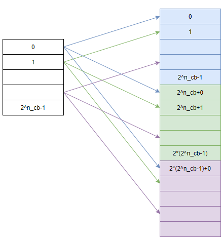
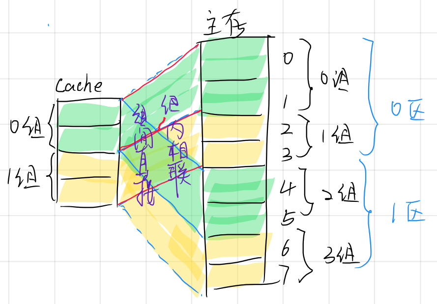
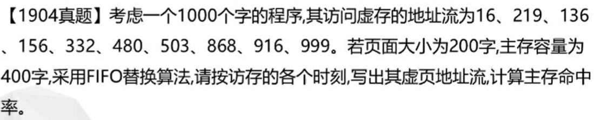
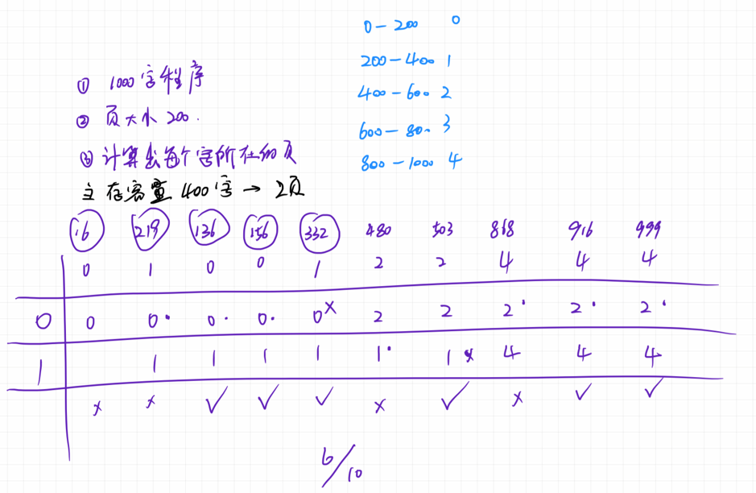
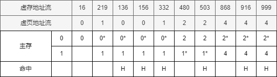
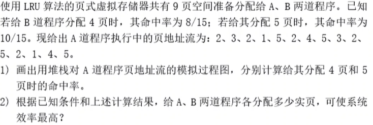
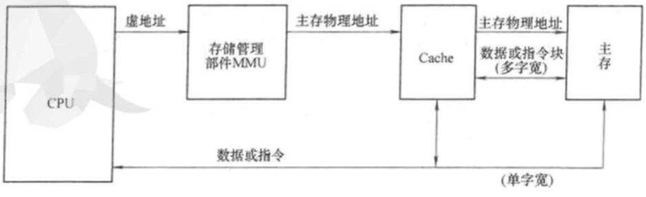
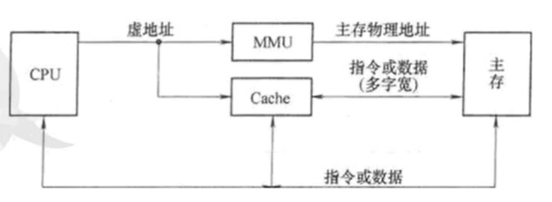
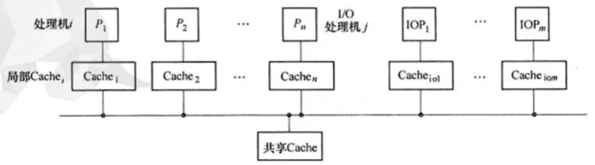

# 1.基本

## 1.存储体系及其分支

将不同工艺的多种存储器组织在一起并在逻辑上构成一个完整的整体形成存储体系。

存储体系（存储结构）是让构成存储系统的几种不同存储器($M_1...M_n$)之间,配上辅助软、硬件或辅助硬件，使之从应用程序员角度来看，它们在逻辑上是一个整体。

让存储器的等效访问速度接近于$M_1$,容量是$M_n$的，每位价格接近$M_n$。

基本的二级存储体系是虚拟存储器和Cache存储器,这是存储器的两个不同的分支。

### 容量

虚拟存储器是因为主存容量满足不了要求而提出的。在主存和辅存之间增设辅助的软、硬件设备，让它们构成一个整体。所以也是主存-辅存存储层次。

**速度与价格**

主存的访问速度约是磁盘的10万倍，主存的价格约为磁盘的1000倍。

**虚实空间**

程序空间的地址是虚地址(程序空间),实际主存空间的地址是实地址(实存空间)。当虚存空间远远大于实存空间时，只需将程序空间分割为较小的页或段，由系统程序根据需要调入物理主存，并用辅助映像表建立其虚、实地址空间的对应关系。

只要是存储层次，必须对应用程序员透明。

### 速度

Cache存储器是因为主存速度满足不了要求而提出的。在CPU与主存之间增设高速、小容量、每位价格较高的Cache，用辅助硬件将Cache和主存构成整体。

CPU与主存的速度只差一个数量级，信息在Cahe与主存之间传送只能全部使用硬件实现。

因此，Cahce存储器同时对**系统程序员**和**应用程序员**透明。

### 多级存储层次

由二级存储层次可以组合成多级存储层次。 从CPU角度来看，有接近最高层$M_1$的速度，最底层$M_n$的容量和每位价格。

## 2.存储体系的构成依据

为了使存储体系有效地工作，需要预知将要访问的信息的地址预先将其调入。

这种预知的可能性是根据计算机程序的局部性原理,包括时间局部性和空间局部性。

虚拟存储器只适用于多道程序环境（多用户），Cache存储器同时适用于多用户和单用户环境。

## 3.存储体系的性能参数

每位价格 $c$
$$
c =\frac{c_1*S_{M_1}+c_2*S_{M_2}}{S_{M_1}+S_{M_2}}
$$
即：各存储器容量价格平均值。 每位价格乘容量之和除以容量之和。

命中率 $H$

定义为CPU产生的逻辑地址能在$M_1$中访问到的概率。

命中率$H$与程序的地址流、所采用的地址预判算法及$M_1$的容量都有很大关系。命中率越大越好。

等效访问时间 $T_A$

# 2.虚拟存储器

要点

- 三种虚拟管理方式的原理、地址映像规则、映像表机构、地址变换过程、各自的优点和问题
- 段页式虚拟存储器
- 页式虚拟存储器
- FIFO、LRU、OPT 算法页面替换的过程
- 堆栈型替换算法定义、种类
- PFF替换算法、分析虚拟存储器，综合评估和改进页式虚拟存存储器性能的办法

## 1.虚拟存储器的管理方式

根据存储映像算法不同，可以有多种不同的存储管理方式的虚拟存储器，其中主要有段式、页式、段页式

### 段式管理

程序具有**模块性**，一个复杂的大型程序总可以分解为多个在逻辑上相对独立的模块。这些模块可以是主程序、子程序、过程也可以是数据块。

将主存按段分配的存储管理方式称为段式管理。

#### 段式管理的原理

- 每个模块大小无法确定且每一个模块都是一个独立的段，都以该段的起点为0开始**相对编址**
- 当某段从辅存调入主存时，为该段赋予一个基址， 基址+相对位移就是实际主存地址
- 段表,用于记录改道程序各段装入主存的状况信息，其中每一项（行）描述该程序的一段的基本情况
- 段表本身也是一个段，一般常驻主存种；也可以存在辅存种，需要时再调入主存。

#### 段式管理的优点

- 分段可以将大型程序分模块编制并行编程，缩短编程时间。
- 段式管理中每段都是独立的,有利于程序员灵活实现段的链接；段的扩大、缩小和修改不影响其他的段。
- 每段只包含一种类型的对象，如过程或是数组、堆栈、标量等集合，易于对其特定类型实现保护。
- 把共享的程序或数据单独构成一个段，从而易于实现多个用户、进程对公用段的管理。
- 以段链接形成的程序空间可以与主存容量无关。

#### 缺点

- 大小不确定，难以为调入段高效分配主存
- 除了系统要为每道程序分别设置段映像表外，操作系统还要为整个主存系统建立一个实主存管理表，包括占用区域表和可用区域表
- 段之间有**空间浪费**

### 页式管理

页式存储是把主存空间和程序空间**都**机械地等分成固定大小的页,按页顺序进行编号；每页大小随机器而异，一般在512B到**几KB**之间。

程序空间中的虚拟地址由`页表`记录的页面映射关系+页内位移转换为物理地址。物理地址由`页号+页内位移`组成。

页表只需要给出虚拟页号和物理页号的对应关系即可。

与段式一样，计算机是采用多道程序方式工作的，所以每道程序都有一个页表。

就整个多用户虚拟存储器的**虚地址**有用户（进程、程序）标志号$u$、虚页号$N_v^{'}$和页内位移组成。

页式管理也需要在系统中专门设置主存页面管理表指明主存中每个页面的使用情况和其他信息。

#### 优点

- 对程序员完全透明，需要的映像表硬件少，地址变换快
- 调入操作简单

#### 缺点

- 页内仍有浪费
- 程序员无法将大型程序拆分

### 段页式管理

段页式=段式+页式

段页式存储是把主存机械地等分为固定大小的页。程序按模块被分为段，每个段内又分为与实主存页面大小相同的页。每道程序通过段表加对应的一组页表进行定位。

与纯段式的区别是：段的起点不再是任意的，必须是主存中页面的起点。

对于多道程序来说，每道程序都需要有一个用户标志号 $u ，\text{转换成基号b}$ 以指明该道程序的段表起点存放在哪个基址寄存器中。这样多用户虚地址由用户标志号 $u$, 段号 $s$, 页号 $p$， 页内位移 $d$ 四个字段组成。

## 2.页式虚拟存储器的构成

### 1.地址的映像和变换

$$
N_i\text{ 指令地址码} = N_v^{'} \text{ 虚页号} + N_r \text{ 页内位移} \\

主存地址 = n_r \text{ 实页号} + n_v \text{ 页内位移} \\

N_r = n_r

虚存空间总页数（编码范围）为： 2^{u+N_v^{'}}
$$

页式虚拟存储器是采用页式存储和管理的主存-辅存存储层次。

地址的映像是将每个虚存单元按某种规则（算法）装入(定位于)实主存，建立起多用户虚地址$N_s$与主存地址$n_p$之间的对应关系。

由于是把大容量虚存空间压缩到小的主存空间，主存中的每一个页面位置应可对应多个虚页，可以对应多少个虚页与采用的映像方式有关。

页式虚拟存储器一般都采用全相联映像,即：让每道程序的任何虚拟页都可以装入到任何实页位置。

#### 相联目录表法

把页表压缩成只存放已装入主存的那些虚页（用基号$b$和$N^{'}_v$标识）与实页位置$n_v$的对应关系，该表最多有$2^{n_v}$行。主存总共有$2^{n_v}$个实页位置。 该表采用按内容访问的相联存储器构成。 

按内容访问的相联存储器不同于按地址访问的随机存储器。

随机存储器：在一个存储周期中只能按给出的一个地址访问其存单元。

相联存储器：在一个存储周期中能将给定的 $N_v$同时与目录表中的全部$2^{n_v}$个单元对应的虚页号字段内容进行比较，进行相连查找。若找到则将该单元中的实页号读取拼接上页内位移就是实地址。

### 2.页面替换算法

通常虚存空间比主存空间大得多，必然导致主存页面已满又发生页面失效的情况，这是需要将主存中的页面调出，将辅存中的页面调入主存。

页面替换算法就是用于选择主存中的哪一个页面被替换。

替换算法的确定主要看主存是否有高命中率, 也要看算法是否易于实现、辅助软、硬件是否低成本.

#### 随机算法

通过软件或硬件随机数生产器产生主存中需要被替换的页号。

- 算法简单、实现容易
- 无法反映程序的局部性，命中率低（弃用）

#### 先进先出算法 First-in First-out, FIFO

选择最早进入主存的页作为被替换的页。

在主存页面表中为每一个页分配一个计数器字段，每调入一个页时，将该页的计数器字段清零，其余在主存中的页计数器加一。当需要替换时选择计数器最大（最早进入主存）的页作为被替换的页。

- 算法实现方便
- 反映了主存使用的历史信息， 但不一定能反映程序的局部性: 最早进入主存的页可能是现在经常使用的页

#### 最近最少使用算法 Least Recently Used, LRU

选择近期最少使用的页作为被替换的页。

- 可以比较正确的反映程序的局部性
- 

#### 优化算法 Optimal, OPT

替换未来最长时间不再使用的页， 理想算法，无法实现。

主要价值是作为衡量其他算法优劣的标准，越靠近OPT命中率的算法越好。

命中率与所选用的替换算法有关，命中率与页地址流也有关。一般情况LRU优于FIFO。 

命中率与分配给程序的主存页数有关。

#### 堆栈型替换算法

设：

A是任意一个地址流，长度为L, t 是已处理过$t-1$个页面的时间点

n为该程序主存页数

$B_t(n)$表示在t时间点，在n页主存中的页面集合

$L_t$表示到t时间点，已经遇到过的地址流中相异的页数。

如果替换算法满足：
$$
n<L_t 时，B_t(n)\subset{B_t(n+1)} \\
n\ge{L_t}时，B_t(n)={B_t(n+1)} \\
$$

- LRU 算法在主存中保留的n个最近使用的页， 它们又总是包含在n+1个最近使用的页中，所以LRU时堆栈型算法
- OPT 是堆栈型算法
- FIFO 不是堆栈型算法

详见$P_{141}$。 

堆栈型算法具有包含性质,因此命中率随主存页数的增加只可能增加，至少不会降低。而FIFO则不一定。

## 3.页式虚拟存储器实现中的问题

- 页面失效

要访问的虚页不在实际主存中时，就会发生页面失效。

###   提高虚拟存储器等效访问速度的措施

1. 存储层次的等效访问使时间是$T_A=HT_1+(1-H)T_2$
    1. H 是主存命中率
    2. $T_1$ 是主存访问时间
    3. $T_2$是辅存访问时间
2. 要提高存储层次等效访问速度，可采取的措施有
    1. 当等效访问时间远大于主存访问周期时，可采取调高主存命中率的方法
    2. 当主存命中率H已经很高时，可提高主存的访问速度以降低$T_1$
    3. 加快内部地址映像和变换，如采用快-慢表层次， 增大快表命中率等

### 影响主存命中率和CPU效率的某些因素

`程序地址流`、`替换算法`以及分配给程序的`实页数`（主存容量）不同都会影响命中率

- 页面大小$S_p$、分配给程序的主存容量$S_1$与命中率$H$的关系
    - $S_1$一定时， $S_p$由小增大时，命中率先增高，达到某个最大值后又开始减小
- 分配给程序的主存容量$S_1$的增大只是在开始时对命中率$H$提高有明显作用

# 3.高速缓冲存储器

## 1.工作原理和基本结构

高速缓冲存储器（Cache）是为了弥补主存速度的不足，在处理机和主存之间设置一个高速，小容量的Cache， 构成 **Cache-主存**存储层次，使之从CPU的角度来看，速度接近于Cache， 容量却是主存的。

将Cache和主存机械地等分成相同大小的`块`（行），每块由若干字组成。每次访问主存时，都由**主存-Cache地址映像变换机构**判定所访问字的块是否在Cache中（命中）。

Cache与CPU之间进行单字信息传送。

## 2.地址的映像与转换

### 全相联映像和变换

主存中任意一块都可以装入Cache中的任意一块位置。

为加快地址变换，不宜采用类似虚拟存储器的页表法来存放主存-Cache的地址映像关系。

代价大，速度慢

采用：`目录表硬件方式`实现

给出主存地址$n_m$的访存时， 将其主存块号$n_{mb}$与目录表中所有各项的$n_{mb}$字段同时比较。

如果有相同，就将对应行的Cache块号$n_{cb}$取出，拼接上块内地址$n_{mr}$形成Cache地址$n_c$后访Cache。

如果没有相同，表示主存块未装入Cache，发生Cache失效，由硬件调块。

优点是：块冲突概率低，只有Cache全装满时才产生冲突。所以Cache空间利用率高。

缺点是：全相联代价大， 查表速度难以提高

### 直接映像 

将主存区域按Cahce大小等分成区，主存每一个区内的块只能按位置一一对应到Cache的相应块位置上。Cache中的块可以装入不同区中的块。

优点：节省硬件

缺点：块冲突概率很高（致命缺点），空间利用率低。

### 组相连映像机器变换

> 将主存空间按Cache大小等分成区，将Cache空间和主存空间都分割成组， 每组包含S块。 
>
> 组相联映像指各组之间是直接映像，组内各块之间采用全相联映像。

## 3.Cache存储器的LRU替换算法的硬件实现

## 4.Cache存储器的透明性及性能分析

### 1. cache存储器的透明性分析及解决办法

由于cache存储器的地址变换和块替换算法是全硬件的， 所以Cache存储器对应用程序员和系统程序员都是透明的。

问题：

Cache中的内容和主存中的内容在一段时期内不一致，如果在此期间对这部分内容进行读写就可能导致错误。

必须采取措施解决好由于读写过程中产生的Cache和主存对应内容不一致的问题。

方法：

写回法和写直达法

#### 写回法

- 抵触修改法
- 在CPU执行写操作时，信息只写入cache ，仅当需要替换时才将写过的cache块先写回主存，然后调入新块。
    - 需要在映像表中添加一个“修改位”

#### 写直达法

- 存直达法
- 利用Cache存储器在处理机和主存之间的直接通路，每当处理机写入Cache的同时，通过此通路直接写入主存。

写回法将开销花在每次替换的时候

写直达法将开销花在每次写Cache时都要增加一个比写Cache时间长的多的写主存时间。

### 2. Cache的取算法

Cache所用的取算法基本上是`按需取进法`，即在Cache块失效时才将要访问的字所在的块取进。

适当选择好Cache的`容量`、`块的大小`、组相联的`组数`和`组内块数`，是可以保证有较高的命中率的。

###  3.性能分析

评价Cache存储器的性能主要是看命中率的高低，而命中率与块的大小、块的总数（Cache的总容量）、采用组相联时组的大小（组内块数）、替换算法和地址流的蔟聚性等有关。

Cache本身的速度与容量都会影响Cache存储器的等效访问速度。

> 1. 堆栈（LRU）
>
> | 页地址流 | 2    | 3    | 2    | 1    | 5    | 2    | 4    | 5    | 3    | 2    | 5    | 2    | 1    | 4    | 5    |
> | -------- | ---- | ---- | ---- | ---- | ---- | ---- | ---- | ---- | ---- | ---- | ---- | ---- | ---- | ---- | ---- |
> | 堆栈内容 | 2    | 3    | 2    | 1    | 5    | 2    | 4    | 5    | 3    | 2    | 5    | 2    | 1    | 4    | 5    |
> |          |      | 2    | 3    | 2    | 1    | 5    | 2    | 4    | 5    | 3    | 2    | 5    | 2    | 1    | 4    |
> |          |      |      |      | 3    | 2    | 1    | 5    | 2    | 4    | 5    | 3    | 3    | 5    | 2    | 1    |
> |          |      |      |      |      | 3    | 3    | 1    | 1    | 2    | 4    | 4    | 4    | 3    | 5    | 2    |
> |          |      |      |      |      |      |      | 3    | 3    | 1    | 1    | 1    | 1    | 4    | 3    | 3    |
> | n=4      |      |      | H    |      |      | H    |      | H    |      | H    | H    | H    |      |      | H    |
> | n=5      |      |      | H    |      |      | H    |      | H    | H    | H    | H    | H    | H    | H    | H    |
>
> 当n=4时，A到程序命中率为 7/15, 当n=5时，A道程序命中率为10/15
>
> 2. 当A道程序分配4页时命中率为7/15, 则B道程序分配5页命中率为10/15, 两道程序的平均命中率为 $\frac{\frac{7}{15} + \frac{10}{15}}{2} = \frac{17}{30}$
>
>    当A道程序分配5页时命中率为10/15，则B道程序分配4页命令率为8/15， 两道程序的平均命令率为 $\frac{\frac{10}{15} + \frac{8}{15}}{2} = \frac{18}{30}$
>
>    因此，当A道程序分配5页，B道程度分配4页时系统效率最高

# 4.三级存储体系

## 1.物理地址Cache

物理地址Cache是由Cache-主存 和 主存-辅存两个独立的存储层次组成。

## 2.虚地址Cache

虚地址Cache是将Cache-主存-辅存直接构成三级存储层次的形式，其组成形式如图：

## 3.全Cache

全Cache是最近出现的组织形式， 不成熟，未商品化。 

它没有主存，只用Cache与辅存中的一部分构成 Cache-辅存 存储体系。

Cache存储系统的等效访问时间要接近于Cache的，容量是虚地址空间的容量。

多处理机实现的一种方案：

