向量：有方向，有大小

标量：没方向，有大小

# 1.重叠方式 \*\*

## 重叠原理与一次重叠

指令的重叠解释使机器语言程序的执行速度会比采用顺序解释的有较大的提高。

解释一条机器指令的微操作可归并为取指令、分析、执行三部分

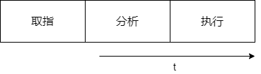

### 顺序解释

指的是各条指令之间顺序串行（执行完一条指令后才取下条指令）地执行，每条指令内部的各个微操作也顺序串行地执行。

优点：控制简单，转入下条指令的时间易于控制。

缺点：上一步操作未完成，下一步操作无法开始，速度提不上去，计算机各`部件利用率低`

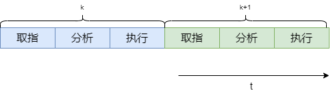

### 重叠解释

让不同的指令在时间上重叠地解释。在解释第k条指令的操作完成之前，就可以开始解释第k+1条指令。

不能提高单条指令的解释速度， 但是可以加快相邻两条指令乃至整段程序的解释。

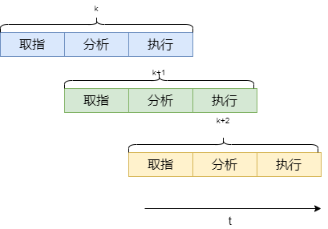

指令重叠解释必须在计算机组成上满足：

1. 解决访问主存的冲突
2. 解决"分析"与"执行"操作的并行
    1. 硬件上有独立的分析部件和执行部件

3. 解决"分析"与"执行"操作控制上的同步
    1. 分析和执行的时间实际上不同，在硬件上解决控制的同步，保证任何时候都是执行k与分析k+1重叠

4. 解决指令间各种相关的处理

    1. 第k条指令是根据执行结果进行转移的条件转移指令，成功转移后要撤销分析k+1并从头分析第m条指令
    2. 相邻两条指令之间的关系，例如k+1依赖第k条指令的计算结果。即：用k的执行来形成k+1 

### 一次重叠

1. 实际上**分析**和**执行**所需的时间通常不同，还需要在硬件中解决控制上的同步，保证任何时候都只是"执行K"与"分析K+1”重叠。
2. 这种指令分析部件和指令执行部件任何时候都只有相邻两条指令在重叠解释的方式为“**一次重叠**“ 

## ”相关“处理

### 1. 转移指令的处理

当程序中遇到条件转移指令， 一旦条件转移成功，重叠解释实际变成了顺序解释

1. 重叠方式的计算机在程序中应尽量避免使用条件转移指令
2. 采用延迟转移技术

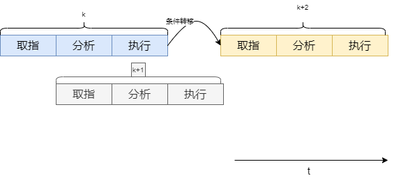

### 2. 指令相关的处理

对于有指缓的计算机，由于指令是提前从主存取进指缓的，为了判定是否发生了指令相关，需要对多条指令地址与多条指令的运算结果地址比较，看是否有相同的，这是很复杂的。 

指令相关是因为机器指令允许修改而引出的。

1. 不准修改指令
2. 设置一条**执行**指令来解决

### 3. 主存空间数相关的处理

主存空间数相关是相邻两条指令之间出现对主存同一单元要求先写而后读的关联。

第k条指令执行时要写主存m

分析第k+1条指令时要读主存m， 就会造成k+1读取的不是k执行完写入主存的数据而出错。

#### 解决办法

只有推后"分析k+1"的读。

##### 推后的方法：

常见方法是存控给`读、写安排不同的访存优先级`。

只要在存储器控制器中将写数级别安排成高于读数级别，则当第k条指令和第k+1条指令出现主存数相关时，存控就会先处理“执行k”的写数，而将“分析k+1"的读申请推迟到下一个主存周期才能处理，自动实现推后”分析k+1"。

### 通用寄存器组相关的处理

一般的计算机中，通用寄存器除了存放源操作数、运算结果外，也可能存放形成访存操作数物理地址的变址或基址值。

因此，通用寄存器组的相关操作又有操作数的相关和变址值或基址值的相关两种。

 

#### 解决办法

1. 推后"分析k+1"指令
    1. 以降低速度为代价，使设备基本上不增加
2. 设置"相关专用通路"

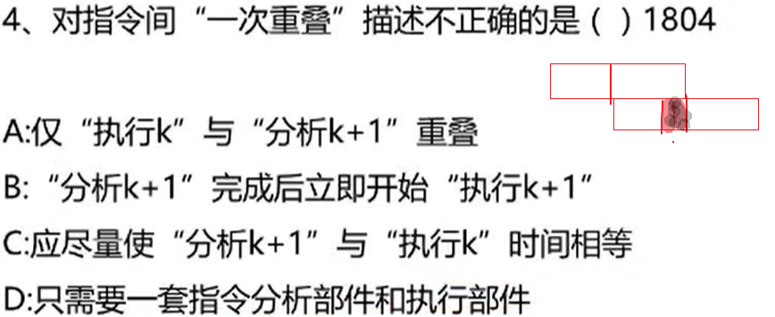

B错误， 分析K+1的时间可能少于执行K， 要等k执行完后才可以执行K+1

# 2.流水方式 *

## 1.基本概念

### 1.工作原理

 "分析k+1"与"执行k"的一次重叠是把指令的解释过程分解成”分析“与”执行“两个子过程，在独立的分析部件和执行部件上时间重叠地进行。

流水与重叠在概念上没有什么差别， 流水可以看成是重叠的引申。二者的差别只在于**一次重叠**是把一条指令的解释拆分成*两个*子过程，而**流水**则是分成更多的子过程。

如果把一条指令的解释分解成时间相等的$m$个子过程，则每隔$\Delta{t}=T/m$就可以处理一条指令。

$T$：完成一条指令的时间

因此流水的最大吞吐率取决于子过程的经过时间$\Delta{t}$, 其值越小，流水线的吞吐率越高。

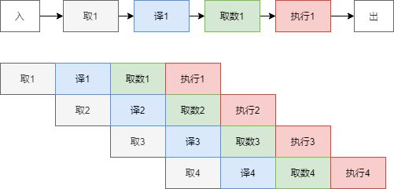

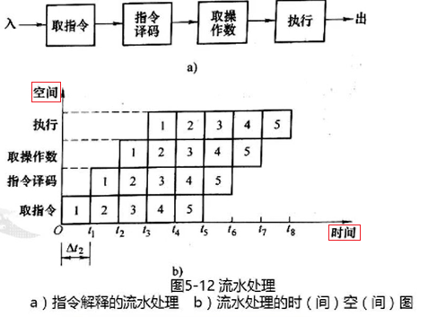

### 2.流水的分类

#### 不同处理级别流水线

按处理的级别分类，从小到大：`部件级、处理机级、系统级`

#### 单、多功能流水线

按具有功能的多少分类：

1. `单功能`流水线：只能实现单一功能的流水，如只能实现浮点加减的流水线
2. `多功能`流水线：指的是同一流水线的各个段之间可以有多种不同的连接方式，以实现多种不同的运算或功能.

#### 静态、动态流水线

按多功能流水线的各段能允许同时用于多种不同功能连接流水，可以把流水线分为静态流水线和动态流水线。

静态流水线：在某一段时间内各段只能按一种功能连接流水,只有等流水线全部流空后，才能切换成按另一种功能连接流水。 多-一

动态流水线：各功能段在同一时间内可以按不同运算或功能连接 。多-多

从计算机所具有的数据表示角度，可以把流水线处理机分为：标量流水机和向量流水机

标量流水机：没有向量数据表示，只有用标量循环方式来处理向量和数组。Amdahl 470 V/6

向量流水机：指的是计算机有向量数据表示，设置有向量指令和向量运算硬件，能流水地处理向量和数组中的各个元素。向量流水机是向量数据表示和流水技术的结合。

从流水线各功能段之间是否有反馈回路角度，可以把流水线分为：线性流水线和非线性流水线。

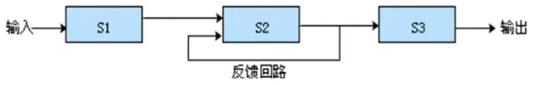

## 2.标量流水线的主要性能

1. 吞吐率$T_p$ 加速比 $S_p$
2. 效率

吞吐率是流水线单位时间内能流出的任务数或结果数
$$
T_p=\frac{n}{m\Delta{t}+(n-1)\Delta{t}}
$$
$\Delta{t}$: 时间（）

$m$: 指令可以分解为多少部分 

$n$: 指令条数

### 计算题

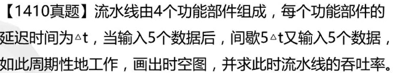

 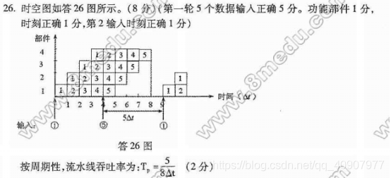

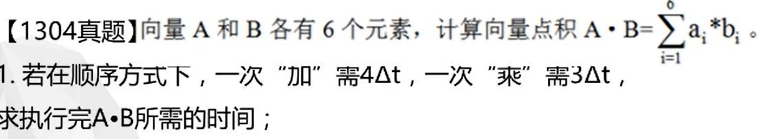

**顺序方式**

乘：3

加：4

一共有6次乘， 5次加

所以： $T=6*3\Delta{t}+5*4\Delta{t} = 38\Delta{t} $ 

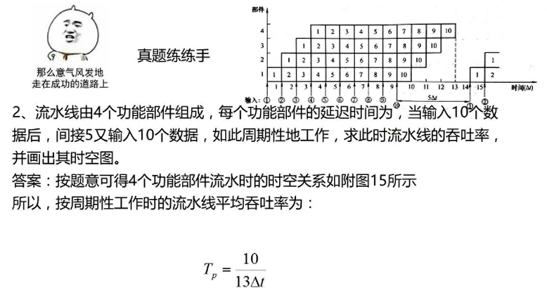

间歇开始时间是最后一条指令开始前开始。

#### 加速比

用加速比$S_p$表示流水方式相对于非流水顺序方式速度提高的比值，那么非流水顺序方式连续完成n个任务需要的$nm\Delta{t}$的时间，因此，流水方式工作的加速比为：
$$
\begin{align}
S_p & =\frac{nm\Delta{t_0}}{m\Delta{t_0}+(n-1)\Delta{t_0}}  \\
& =\frac{m}{1+\frac{m-1}{n}}
\end{align}
$$

#### 效率

流水线的效率是指流水线中设备的实际使用时间占整个运行时间之比，也称流水线设备的利用率。

## 3.标量流水线的相关处理和控制机构

### 局部性相关的处理

指令相关、访存操作数相关、通用寄存器组数相关等局部性相关都是由于在机器同时解释的多条指令之间出现了对同一主存单元或寄存器要求“先写后读”。

重叠机器处理这些局部性相关的方法有两种：

1. **推后**后续指令对相关单元的读，直到在先的指令写入完成
2. 设置**相关直接通路**，将运行结果经相关直接通路直接送入所需部件

任务在流水线中流动顺序的安排和控制方式：

1. **顺序流动方式**（同步流动方式）：

    让任务流出流水线的顺序保持与流入流水线的顺序一致

2. **异步流动方式**

    让流出流水线的任务顺序可以和流入流水线的顺序不同

### 全局性相关的处理

全局性相关指的是已进入流水线的**转移指令**（尤其是条件转移指令）和其后续指令间的相关

处理办法：

1. 使用猜测法
2. 加快和提前形成条件码
3. 采取延迟转移
4. 加快短循环程序的处理

### 流水机的中断处理

中断会引起流水线断流，但是出现概率比条件转移的概率低得多，且又是随机发生的。

所以流水机器中断主要是如何处理好**断点现场**的保存和恢复，而不是缩短流水线的**断流**时间。 

### 非线性流水线的调度 \*\*\*\*

具有反馈回路的流水线。

`非线性流水线`在段间设有反馈回路，一个任务在流水的全过程中，可能会多次通过同一段或越过某些段。

如果每拍向流水线送入一个新的任务，将会发生多个任务争用同一功能段的使用冲突现象

解决办法：

间隔适当的拍数之后再向流水线送入下一个任务。 

1. 找出延迟进制表F F={8,1,3,4}（预约表中相差的拍数）
2. 根据延迟禁止表F计算冲突向量C（延迟禁止表中中的值表示冲突向量对应位数为1（从左向右）） 10001101
3. 根据冲突向量表， 将每一位0所在的位右移对应的位数后，与C或运算得到新的状态

10001101>>2 后与C或运算: `10101111`  继续右移后与C进行或运算

10001101>>5 后与C或运算: 10001101 与C相同

10001101>>6 后与C或运算: `10001111`  继续右移后与C进行或运算

10001101>>7 后与C或运算: 10001101 与C相同

---

10101111>>7 后与C或运算: 10001101 与C相同

10101111>>5 后与C或运算: 10001101 与C相同

---

10001111>>7 后与C或运算: 10001101 与C相同

10001111>>6 后与C或运算: 10001111

10001111>>5 后与C或运算: 10001101 与C相同

直到没有新的状态

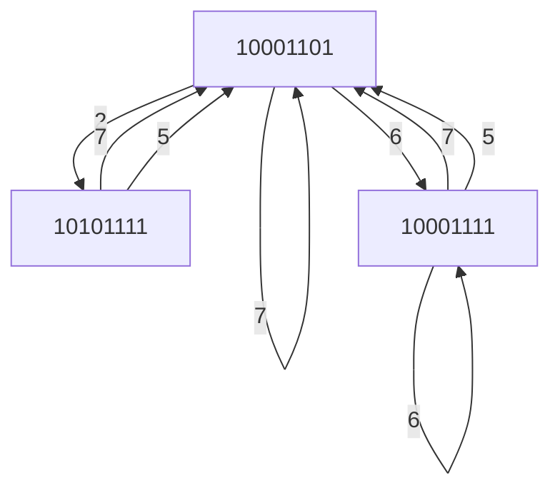

# 3.指令级高度并行的超级处理机

## 超标量处理机

在超标量流水线处理机中配置多套功能部件，指令译码电路和多组总线，寄存器也配有多个端口和多组总线。

主要靠编译程序来优化编排指令的执行顺序，将可并行的指令搭配成组，硬件将不调整指令顺序，这是实现容易些。

## 超长指令字处理机

## 超流水线处理机

将$\Delta{t}$分为更小的$\Delta{t}^{'}$。

一台度为m的超流水线处理机的$\Delta{t}^{'}$只是基本机器周期$\Delta{t}$的$\frac{1}{m}$。

 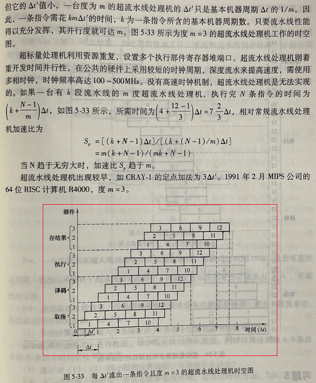

## 超标量超流水线处理机
