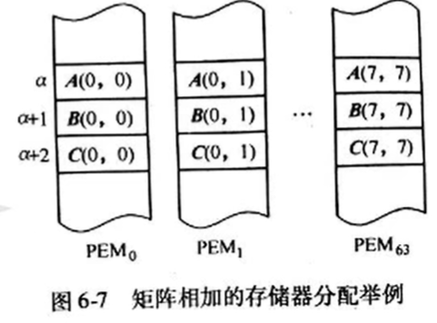

# 向量的流水处理与向量流水处理机


## 向量处理的三种方式

- 横向（水平）处理方式
    - 是向量的处理方式， 但不是向量的流水处理方式
- 纵向（垂直）处理
    - 是向量的处理方式，也是向量的流水处理方式
- 分组纵横处理
    - 是向量的处理方式，也是向量的流水处理方式


计算$D=A \times (B+C)$, A,B,C,D 都是有N个元素的向量。

- 横向
    - 采用逐个求D向量元素的方法
    - 即：访存取$A_i$、$B_i$、 $C_i$ 元素再求$d_{i}$， 再取$A_{i+1}$、$B_{i+1}$、 $C_{i+1}$求$d_{i+1}$
    - 宜于在标量处理机上采用循环程序实现，但是难以使流水线连续流动（**频繁出现先写后读的操作数相关**）

- 纵向
    - 采取对整个向量按相同操作都执行完之后再转去执行别的操作
    - 即：先执行 $b_i+c_i \to k_i (i=1, \cdots ,N)$，再执行 $k_i \times a_i \to d_i   (i=1, \cdots , N)$

- 分组纵横
    - CRAY-1向量流水处理机改成把流水线输入、输出端连到容量足够大的向量寄存器组，采用面向寄存器-寄存器型结构的流水线处理机。**向量寄存器组与主存之间采用成组传送**
    - 若向量的长度N太长，超出了向量寄存器组中寄存器个数， 则将该向量分割为若干组，使每组都可以放入向量寄存器组。
    - 每一组中采用纵向方式处理， 组之间则采用软件方法编制循环程序方式依次循环处理。


## 向量的流水处理方式


### CRAY-1

cray-1为向量运行提供的六个流水线单功能部件与流水经过时间（<font color=red size=5>记住</font>）：

| 功能部件       | 流水经过时间（拍），每拍12.5ns |
| -------------- | ------------------------------ |
| 整数加         | 3                              |
| 逻辑运行       | 2                              |
| 移位           | 4                              |
| 浮点加         | 6                              |
| 浮点乘         | 7                              |
| 浮点迭代求倒数 | 14                             |
| 访存           | 6                              |
| 存寄存器       | 1                              |


例题：

求向量$D=A \times (B+C)$， 向量为浮点数，各向量元素个数均为N， 参照 CRAY-1方式分解为3条向量指令：

1. $V_3 \leftarrow{存储器}$； 访存取A送入$V_3$寄存器
2. $V_2 \leftarrow V_0+V_1$;  $B+C \to K$
3. $V_4 \leftarrow V_2 \times V_3$;  $K \times A \to D$ 

当采用下列三种方式工作时，各需要多少拍才能得到全部结果

> CRAY-1 各部件流水经过时间：
>
> 浮点加 6拍， 浮点乘 7拍， 存入寄存器 1拍， 主存取值 6拍


- 1，2，3串行执行
    - 7拍 + N  + 7拍 + N  + 8拍 + N， 每一个操作都有一个加N
    - 22+3N(拍)    
- 1、2 并行执行后， 再执行3
    - 7+N + 8 + N
    - 15+2N(拍)
- 采用链接技术
    - 16+N(拍)


## 向量指令集并行、链接、串行的条件

一般可以采用让多个流水线功能部件并行、流水线链接、加快条件语句和系数矩阵处理、加快向量的规约操作等办法来提高向量流水处理的性能。

前两者主要是加快相邻向量指令的执行

后两者主要是让循环向量化


把寄存器组既作为结果寄存器组有作为源寄存器组的做法，可以实现将两条或多条向量指令链接成一个链来提高**向量操作的并行程度**和**功能部件流水的效能**。

条件：

不出现$V_i$冲突和功能部件冲突

- $V_i$冲突
    - 指的是并行工作的各向量指令的源向量和结果向量使用了相同的$V_i$
- 功能部件冲突
    - 指的是同一个功能部件被要求并行工作的多条向量指令所使用


# 阵列处理机原理

## 阵列处理机的构型和特点

阵列处理机有两种构型， 差别主要在于存储器的组成方式和互联网络的作用不同


### 构型1

具有<font color=red>分布式存储器</font>阵列的阵列处理机构型


- 各处理单元有<font color=red>局部存储器</font>存放被分布的数据，只能被本处理单元直接访问
- 控制部件内有一个存放程序和数据的 <font color=red>主存储器</font>
- 执行主存储器中的用户程序时，所有指令都在控制部件中进行译码
- 把只适合串行处理的标量或控制类指令留给控制部件直接执行
- 把适合并行处理的向量类指令”播送“给各个处理单元
- 各个处理单元（PE）之间通过ICN（Interconnection Network）交换数据


> 采用这种构型的阵列处理机是<font color=red>SIMD</font>（单指令流多数据流）的主流
>
> 典型的机器有： <font color=red>ILLIAC IV</font>、MPP、DAP、CM-2、MP1、DAP6000


### 构型2

具有<font color=red>集中式共享存储器</font>的阵列处理机构型


- 系统存储器由 $K$ 个存储分体集中组成， 经ICN（互联网络）为全部$N$个处理单元共享
- 为了可以并行处理， $K \ge N \qquad\text{N:处理单元}$ 
- 各处理单元在访主存时为避免分体冲突，要求有合理的算法将数据合理地分配到各个存储分体中
- 
- ICN用于在处理单元与存储器分体之间进行转接构成数据通路， 有的阵列处理机称它为”对准网络“

 

采用集中式共享存储器的阵列处理机构型的典型机器有<font color=red>BSP</font>


### 阵列处理机的特点 \*\*\*\*

- 利用<font color=red>多个处理单元</font>对向量或数组所包含的各个分量进行同时计算，从而易于获得很高的处理速度
- 与同样擅长向量处理的流水线处理机比，阵列处理机利用的是<font color=red>资源重复</font>，而不是<font color=red>时间重叠</font>
- 利用的是并行性中的<font color=red>同时性</font>， 而不是<font color=red>并发性</font>
- 阵列处理机提高速度主要是靠<font color=red>增大处理单元数</font>


### ILLIAC IV的并行算法

####  矩阵加

阵列处理机解决矩阵加是最简单的一维情况

两个矩阵相加减，即它们相同位置的元素相加减！
**注意：**只有对于两个行数、列数分别相等的矩阵（即同型矩阵），加减法运算才有意义，即加减运算是可行的．


两个8x8 的矩阵相加：



将矩阵A、B、C相应位置的分量存放在同一个PEM中， 且在全部64个PEM中， 让A、B、C的各分量地址均对应取相同地址 $\alpha$、 $\alpha +1$、$\alpha + 2$。


#### 矩阵乘


#### 累加和

这是一个将$N$个数的顺序相加转换为并行相加的问题。

为得到各项累加的部分和最后的总和，要用到处理单元中的**活跃标志位**.

只有处于活跃状态的处理单元才能执行相应的操作。

为叙述方便，取$N=8$， 即有8个数$A(I)$顺序累加， 其中 $0 \le i \le 7$。

```fortran
   C = 0
   DO 10 I=0,7
10 C=C+A(I)
```

将$N$个数的顺序相加 <font color=red size=6>背</font>

计算步骤：

>1. 置全部$PE_i$为活跃状态， $0 \le i \le N$
>2. 全部$A(I)$从$PEM_i$的$\alpha$单元读取到相应的$PE_i$的累加器寄存器$RGA_i$中，  $0 \le i \le N$
>3. 令 $K=0$
>4. 将全部$PE_i$的（$RGA_i$）转送到传送寄存器 $RGR_i$，  $0 \le i \le N$
>5. 将全部$PE_i$的（$RGR_i$）经过互联网络向下传送$2^K$步距， $0 \le i \le N$
>6. 令$j=2^k-1$
>7. 置$PE_0\backsim PE_j$为不活跃状态
>8. 处理活跃状态的所有$PE_i$执行 ($RGA_i$) := ($RGA_i$) + ($RGR_i$),  $j \lt i \le 7$
>9. $K := K + 1$
>10. 如果 $K \lt \log_2N$， 则转回（4）， 否则继续执行; <font color=red>K 小于以2为底N的对数</font>
>11. 置全部$PE_i$为活跃状态
>12. 将全部$PE_i$的累加寄存器内容（$RGA_i$）存入相应 $PEM_i$的$\alpha +1$ 单元中，  $0 \le i \le N$


# SIMD计算机的互联网络 \*\*\*

SIMD系统的互联网络的设计目标：

- 结构不要过于复杂，以降低成本
- 互联要灵活， 以满足算法和应用的需要
- 处理单元间信息交换所需的传送步数要尽可能少， 以提高速度性能
- 能用规整单一的基本构件组合而成，或者经多次通过或者经多级连接来实现复杂的互联，使模块性好， 以便于用VLSI（超大型集成电路）实现并满足系统的可扩充性

> 简单， 规整，让系统又好又快又便宜


## 1. 互联网络应抉择的几个问题

1. 操作方式
    1. 同步、异步、同步与异步组合
    2. 阵列处理机根据SIMD性质，均采用同步方式，让所有PE按时钟同步操作
    3. 异步或组合一般多用于多处理机
2. 控制策略
    1. 集中式、分布式
    2. 多数现有的SIMD互联网络采用由集中控制部件对全部开关单元执行集中控制的策略
3. 交换方法
    1. 线路交换、包交换、线路与包交换组合
4. 网络拓扑结构
    1. 指的是互联网络入端、出端可以连接的模式
    2. 有静态、动态两种


### 静态网络

两个PE之间的链是固定的， 总线不能重新配置成与其他PE相连。

### 动态网络

两个PE之间的链通过置定网络的开关单元状态可以重新配置。

具有单级和多级两类。


## 2.基本的单级互联网络

1. 立方体
2. PM2I
3. 混洗交换
4. 蝶形

进制转换

0-15 的二进制

0000， 0001， 0010， 0011， 0100， 0101， 0110， 0111

1000， 1001， 1010， 1011， 1100， 1101， 1110， 1111 

$2^{10}$的以内的数

1， 4， 8， 16， 32， 64， 128， 256， 512， 1024

### 立方体单级网络

 立方体（Cube）单级网络的名称来源于三维立方体结构。

立方体结构的每个**顶点**（网络的结点）代表一个处理单元， 共8个处理单元， 用xyz三位二进制码编号。

它所能实现的入、出端连接如同立方体各顶点间能实现的互连一样， 即：每个处理单元只能连接到其二进制编号的某**一位**<font color=red>取反</font>的其它三个处理单元上。


所以三维立方体单级网络有三种互联函数：`Cube0`, `Cube1`,`Cube2`。 $Cube_i\text{ i=0,1,2}$函数表示只在右起第$i$位上0，1互反。


推广到$n$维时， **N个结点**的立方体单级网络共有$n=\log_2N$种互联函数。

当n>3时，称为超立方体网络。 单级立方体网络的最大距离为$n$, 即：反复使用单级网络， 最多经n次传送就可以实现任意一对入、出端的连接。

任意两点之间至少有n条不同的路径， 容错性高。


### PM2I

PM2I 单级网络是"加减$2^i$"（$Plus-Minus 2^i$）单级网络的简称。

能实现与$j$号处理单元之间相连的是号为 $j \pm 2^i$ 的处理单元。
$$
\left\{
	\begin{array}{c}
		PM2_{+i}(j)=j+2^i \qquad mod \; N \\
		PM2_{-i}(j)=j-2^i \qquad mod \; N \\
	\end{array}
\right.
$$
式中，$0\le j\le N-1, \quad 0\le i\le n-1, \quad n=\log_2N$。它共有$2n$个互联函数。

对于有N=8的三维PM2I互联网络的函数， 有 $PM2_{+{0}}$、$PM2_{-{0}}$、$PM2_{+{1}}$、$PM2_{-{1}}$、$PM2_{\pm{2}}$（这是两个函数）等五个不同的互联函数。

$j=(0,1,2,3,4,5,6,7) \quad i=(0,1,2) \quad n=3$

分别为：
$$
\left\{
	\begin{array}{l}
            PM2_{+0}: (01234567) \\
            PM2_{-0}: (76543210) \\
            PM2_{+1}: (0246)(1357)\\ 
            PM2_{-1}: (0246)(1357)\\
            PM2_{\pm{2}}: (04)(15)(26)(37)\\
	\end{array}
\right. \qquad
\left\{
	\begin{array}{l}
			\text{升序} \\
            \text{降序} \\
			\text{前一个数比后一个数大}2^1\text{， 升序}\\ 
			\text{前一个数比后一个数小}2^1{， 降序}\\
			\text{前一个数比后一个数}\pm{2^2 \;(4)}\\
	\end{array}
\right.
$$
$+$是升序， $-$是降序。


01234567, 表示0连到1， 1连到2， 2连到3， ..., 6连到7， 7连到0

76543210与上连接方法一样，只是方向相反。


-  $n=log_216=4$, 共有$2n$个互联函数， 所以一共有8个互联函数

答， 

>1. 
>
>$$
>\left\{
>	\begin{array}{l}
>	PM2_{+0}(j)=j + 2^0 \qquad mod \; 16 \\
>	PM2_{-0}(j)=j - 2^0 \qquad mod \; 16 \\
>	PM2_{+1}(j)=j + 2^1 \qquad mod \; 16 \\
>	PM2_{-1}(j)=j - 2^1 \qquad mod \; 16 \\
>	PM2_{+2}(j)=j + 2^2 \qquad mod \; 16 \\
>	PM2_{-2}(j)=j - 2^2 \qquad mod \; 16 \\
>	PM2_{\pm{3}}(j)=j + 2^3 \qquad mod \; 16 \\
>	\end{array}
>
>\right.
>$$
>2. $$
>    \left\{
>    	\begin{array}{l}
>                PM2_{+0}: (0,1,2,3,4,5,6,7,8,9,10,11,12,13,14,15) \\
>                PM2_{-0}: (15,14,13...0) \\
>                                  
>                PM2_{+1}: (0,2,4,6,..14)(1,3,5,7...15)\\ 
>                PM2_{-1}: (14,12,10...4,2,0)(15,13,11...5,3,1)\\
>                                  
>                PM2_{+2}: (0,4,8,12)(2,6,10,14)（1,5,9,13)(3,7,11,15)\\ 
>                PM2_{-2}: ...\\
>                                  
>                PM2_{\pm3}: (0,8)(4,12)(2,10)(6,14)(1,9)(5,13)(3,11)(11,15)\\ 
>    	\end{array}
>    \right.
>    $$
>
>    所以3号处理单元可以连接1，2，4，5，7，11，15


#### PM2I特例

1. 处理器间采用单向环网或双向环网
2. ILLIAC IV处理单元采用$PM2_{\pm0}$和$PM2_{\pm{\frac{n}{2}}}$四个互联函数

### 混洗交换单级网络

1. 包含两个互联函数

    1. 全混 

        1. $(P_{n-1}P_{n-2}\cdots P_2P_0)=(P_{n-2}\cdots P_1P_0P_{n-1})$
        2. $n=\log_2N$, $(P_{n-1}P_{n-2}\cdots P_2P_0$为入端编号的二进制码
        3. 就是把二进制编号的最高位移动到最低位

    2. 交换

        1. 单纯的全混互联网络无法实现全0和全1两个处理单元与其他单元的连接， 所以需要增加$Cube_0$函数
        2. 在混洗交换网络中，最远的的两个入、出端号是**全0**和**全1**，他们的连接需要n次交换和n-1次混洗， 所以最大距离为$2n-1$

         

### 蝶形单级网络

蝶形互联网络是将二进制编号的最高位与最低位互换位置。


## 3.基本的多级互联网络

不同的多级互联网络在所用的<font color=red>交换开关</font>、<font color=red>拓扑结构</font>、<font color=red>控制方式</font>上各有不同

 交换开关是具有两个入端和两个出端的交换单元， 用作各种多级互联网络的基本构件

#### 开关状态

无论入端、出端， 如果令居于上方的都用$i$表示， 居于下方的都用$j$表示，则可以定义以下4种开关状态或连接方式：

1. 直连， $i_入$、$i_出$， $j_入$$j_出$
2. 交换， $i_入$、$j_出$， $j_入$$i_出$
3. 上播， $i_入$、$i_出$$j_出$， $j_入$悬空
4. 下播， $j_入$、$i_出$$j_出$，$i_入$悬空

只有前两种的是二功能交换单元，有全部四种的是4功能交换单元。


#### 控制方式

控制方式是对各个交换开关进行控制的方式，以多级立方体互联网络为例，有3中状态：

1. 级控制
    1. 同一级的所有开关只用一个控制信号控制，同时只能处于一种状态
2. 单元控制
    1. 每一个开关都由自己独立的控制信号控制，可以各自处于不同的状态
3. 部分级控制
    1. 第$i$级的所有开关分别用$i+1$个信号控制，$0 \le i \le n-1$, n为级数

利用上述交换开关、控制方式、拓扑结构三个参量， 可以描述各种多级互联网络结构。


### 多级立方体互联网络

多级互联立方体网络有STARAN网络、间接二进制n方体网络等。

STARAN 网络用作交换网络时，采用<font color=red>级控制</font>、实现的是<font color=red>交换函数</font>

- 所谓交换函数是将一组元素首位对称地进行交换。

间接二进制n方体网络采用<font color=red>单元控制</font>

#### 

### 多级混洗交换网络


## 4.共享主存构型的阵列处理机中并行存储器的无冲突访问

情况1.

对一维数组而言，假定并行存储器分体数m=4, 交叉存储一维数组 a0, a1, a2....


情况2

对于二维（多维）数组，假设主存有m个分体并行，从中访问有n个元素的数组子集。这n个元素的编制跳距对于二维数组的行、列、主对角线、次对角线都是不一样的，但是要求能够实现无冲突访问。

由于变址可能导致访问同一个主存单元出现冲突。

解决：

为例能够使行或列的各元素都能够并行访问，采取将数据在存储器中<font color=red>错位存放</font>，但是该方案可能造成**主对角线**上各元素的并行访问冲突，致使实际频宽下降一半；

对角线上个元素的访问则都发生冲突，使实际频宽降低与串行一样。 


情况3

并行存储器中存放的数组大小不是固定的，多维数组各维的元素个数也不一定相等，他们还可以超出已选定的分体数d的值。

  

## 5.脉动阵列流水处理机

脉动阵列结构是由一组处理单元（PE）构成的阵列，每个PE内部结构相同。

运算时数据在阵列结构的各个处理单元间沿各自的方向<font color=red>同步</font>向前推进,就像血液受心脏有节奏地搏动在各条血管中间同步向前流动一样。

实际上，为例执行多种计算，脉动型系统内的<font color=red>输入数据流</font>和<font color=red>结果数据流</font>可以在多个不同的方向上以不同的速度向前搏动。

阵列内部各PE只接收前一组单元传送来的数据， 并向后一组处理单元发送数据。 只有位于阵列边缘的处理单元才能与存储器IO端口进行数据通信。

根据计算问题不同，脉动阵列可分为：一维线型， 二维矩形/六边形/二叉树型/三角形等互联构型。


### 脉动型阵列结构的原理


#### 特点：

1. 结构简单、规整、模块化强，**可扩充性好**， 非常适合用超大规模集成电路（VLSI）实现
2. PE间数据通信距离短、规则，是数据流和控制流的设计、同步控制等均**简单规整**
3. 脉动阵列中所有PE能同时运算，具有极高的计算**并行性**，可通过流水获得很高的运算效率和吞吐率。 输入数可以被多个处理单元重复使用，大大减轻了阵列与外界的IO通信量，降低了对系统主存和IO系统频宽的要求。
4. 脉动阵列结构的构型与特定计算任务和算法密切相关，具有某种**专用线**，限制了应用范围，这对VLSI是不利的。

 

> 脉动阵列机适用于要求计算量大的信号/图像的处理


### 通用脉动阵列结构

造成脉动阵列处理机应用范围有限的关键因素：

1. 不同的算法往往要求有不同的阵列结构，以及大小不同的阵列


发展通用脉动阵列结构的途径主要有三种：

1. 通过增设附加的硬件，对阵列的拓扑结构和互联方式用可编程开关进行重构，即：经程序重新配置阵列 结构
2. 用软件把不同的算法映像到固定的阵列结构上
3. 探寻与问题大小无关的脉动处理方法，以及VLSI运算系统的分割矩阵算法
