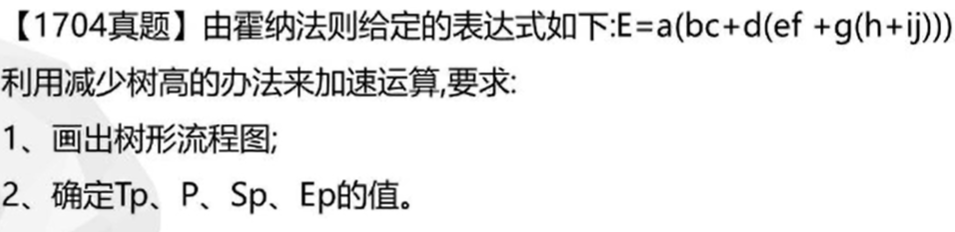
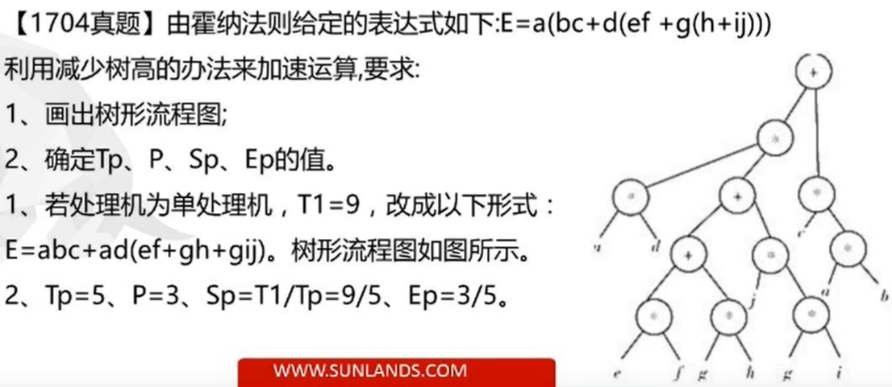
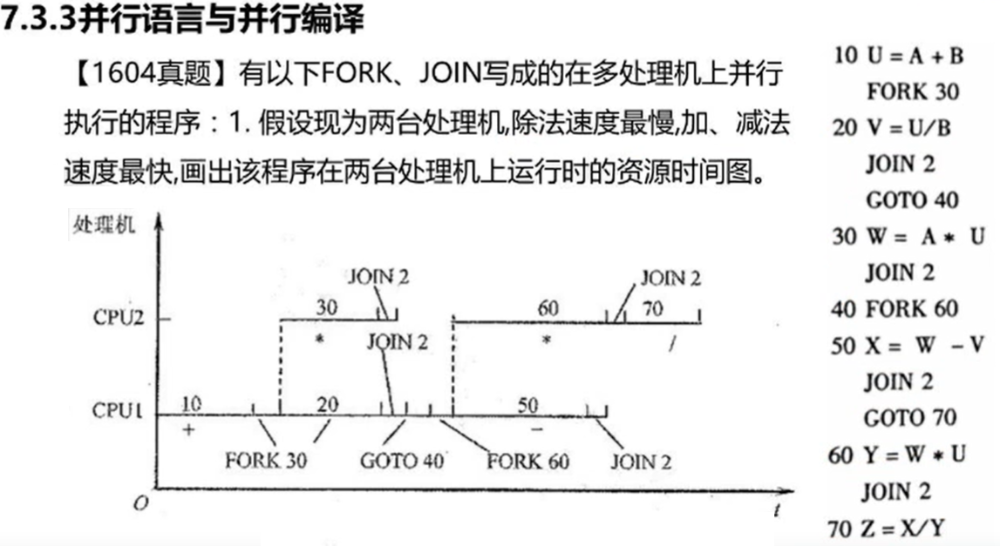

# 1.概念、问题、硬件结构

## 基本概念和要处理的问题

多处理机指的是有两台以上的处理机，**共享IO子系统**，机间经**共享主存**或**高速通信网络**进行通信。

在统一操作系统控制下，协同求解大而复杂问题的计算机系统。


使用多处理机的目的：

1. 通过多台处理机对多个**作业、任务**进行**并行**执行， 提高解题速度，从而提高系统的整体性能
2. 使用冗余的多个处理机通过重新组织来提高系统的**可靠性**、**适应性**、和**可用性**。


多处理机的构型：

1. 同构型: 处理机型号结构相同
2. 异构型: 处理机型号结构不同
3. 分布型: 


多处理机是`多指令流和多数据流`的系统。与SIMD的阵列处理机有很大不同。主要差别来源于并行的等级不同。

阵列处理机主要是针对向量、数组处理，实现**向量指令操作级**的并行，是开发并行性中的同时性（资源重复）。

多处理机实现的则是更高一级的**作业、任务**间的并行，是开发并行性中的并发性(针对指令而言)。


实现方法：

1. 在硬件上， 他的多个处理机要用多个指令部件和控制部件，通过共享主存或机间互联网络实现异步通信。
2. 在算法上， 不限于向量、数组处理，还要挖掘和实现更多通用算法中隐含的并行性。
3. 在系统管理上，要更多地依靠操作系统等软件手段，有效的解决资源分析和管理，特别是任务分配，处理机调度、进程的同步和通信等问题


多处理机执行并发任务所需要的处理机的机数是不固定的。 各处理机进入或退出任务的时间及所需资源的变化是比较大的。 

必须研究如何较好地解决动态的资源分配和任务调度， 让各处理机的**负荷**尽可能均衡，并要防止**死锁**。 


结论：

多处理机的结构（同构、异构等）、机间互联、并行算法、并行语言、编译、操作系统等都会直接影响到系统的性能和效率


## 硬件结构

### 紧耦合松耦合


多处理机有紧耦合和松耦合两种不同的构型。

**紧耦合**

通过共享主存实现处理机间通信，其通信速率受限于主存频宽。

一般情况下多机系统采用的都是紧耦合系统 。

在紧耦合多处理机中就各处理机而言，又有同构对称型和异构非对称型。

当多处理机用于并行任务时，常采用同构对称性的紧耦合多处理机。


**松耦合**

 松耦合多处理机中，每台处理机都有一个容量较大的局部存储器，用于存储常用的指令和数据， 减少紧耦合系统中存在的访主存冲突。

不同处理机间通过**通道互联**实现通信，以共享某些外围设备； 或通过**消息传送系统**来交换信息，这时各台处理机可带有自己的外围设备。 

松耦合多处理机可以分为 层次型和非层次型。


### 机间互联形式

多处理的互联一般采用：

**总线形式**

**环形互联形式**

**交叉开关形式**

**多端口存储器形式**：适用于松耦合多处理机

**蠕虫穿洞寻径网络**

**开关枢纽结构形式**-分布结构的多处理机


### 存储器的组织

多处理机的主存一般都采用又多模块构成的并行存储器。为减少访问主存冲突，采用的方式一般是：**并行多体交叉主存系统**


# 2.紧耦合多处理机多Cache的一致性问题

## 问题的产生

由于每个处理机都有自己的专用cache，当主存中的信息块在多个cache中都有时，会出现多个cache之间的相应信息块的内容不一致的问题。

 

## 解决办法


### 解决进程迁移引起的cache不一致性

进程迁移： 为了提高系统的效率， 有时允许将一个尚未执行完而被挂起的进程调度到另一个空闲的处理机上去执行，使各处理机符合保持均衡。

这会造成cache不一致的问题， 因为被迁移的进程中最近修改过的信息只保留在原处理机的cache中，迁移后就会使用主存中已过期的旧信息。


1. 进制进程迁移
2. 在进程挂起时靠硬件方法将cache中该进程改写过的信息块强制写回主存

### 以硬件为基础实现多cache的一致性

1. 监视Cache协议法：各个处理机中的cache控制器随时都在监视着其他cache的行动。
    1. 写作废法
    2. 写更新法
2. 目录表法
    1. 全映像目录表法
    2. 有限目录表法
    3. 连接目录表法

### 以软件为基础实现多cache的一致性

1. 用软件限制，不把一些公用的可写数据存入Cache中。
    1. 在编译时，通过编译程序分析，将信息分为可存储cache和不可存入cache两部分。

### 


# 3.多处理机的并行性和性能


## 并行算法


### 定义和分类

并行算法是指可同时执行的多个进程的集合，各进程可相互作用、协调和并发操作。


#### 运算基本对象

按运算基本对， 并行算法可以分为

- 数值型
    - 基于代数运算， 如矩阵运算、多项式求值、线性方程组求解等称为：数值型并行算法
- 非数值型
    - 基于关系运算， 如选择、排序、查找、字符处理的并行主要是对符号操作，称为：非数值型并行算法


#### 按并行进程间的操作顺序不同

按并行进程间的操作顺序不同，分为：

- 同步型
    - 指并行的各进程间由于相关，必须顺次等待
- 异步型
    - 指并行的各进程间执行相互独立，不会因相关而等待，只是根据执行情况决定终止或继续
- 独立型
    - 并行的各进程之间完全独立， 进程之间不需要相互通信


#### 根据各处理机计算任务大小不同

根据各处理机计算任务大小不同，并行算法可以分为：

- 细粒度
    - 一般指向量或循环级的并行
- 中粒度
    - 一般指较大的循环级并行，并确保这种并行的好处可以补偿因并行带来的额外开销
- 粗粒度
    - 一般指子任务级的并行

 

### 多处理机并行算法思路

 为了评价所提出的并行算法的性能效率， 用$P$表示可并行处理的处理机机数；

用$T_p$表示$P$台处理机运算的级数， 即：树高；

用多处理机的加速比$S_p$表示**单**处理机顺序运算的级数$T_1$与$P$台处理机并行运算的级数$T_p$之比；

用$E_p$表示$P$台处理机的设备利用率（效率）

$S_p=\frac{T_1}{T_p}$


$E_p=\frac{S_p}{P}=\frac{\frac{T_1}{T_p}}{P}$ 


可见：$S_p \ge 1$ 时，会使 $E_p \le 1$

即运算的加速总是伴随着效率的下降。




>1.  画出流程图
>
>- 先求出$T_1$, 即采用单处理机需要几步（书搞）
>
>```mermaid
>flowchart TB
>
>p(*9) --> a
>p(*9) --> o(*)
>
>o(+8) --> n(*)
>o(+8) --> m(*)
>
>n(*7) --> b
>n(*7) --> c
>
>
>m(*6) --> d
>m(*6) --> l(+)
>
>l(+5) --> k(*)
>l(+5) --> x(*)
>
>k(*4) --> e
>k(*4) --> f
>
>x(*3)--> g
>x(*3)--> y(+)
>
>
>y(+2)-->h
>y(+2) --> z(*)
>z(*1)--> i
>z(*1)-->j
>```
>
> 
>
>2. 
>    $$
>    T_1=9 \\
>    	P=3 \\
>    	T_p=5 \\
>    	S_p=T_1/T_p = 9/5\\
>    	E_p= 9/5/3 = 3/5
>    $$
>
>


## 程序并行性分析

任务能否并行，除了算法外，很大程度上还取决于程序的结构。

程序中的各类数据相关是限制并行的重要因素。

数据相关即可存在于指令之间，也可存在于程序段之间。


指令之间数据相关可能有“先写后读”， “先读后写”、“写-写” 三种。

### 数据相关


两个程序段之间

- 若有<font color=red>先写后读</font>的数据相关，**不能并行**，只在特殊情况下可以交换串行；
    - 不能并行
        $$
        P_i \qquad A = B + D \\
        P_j \qquad C = A * E
        $$
    
    - 不能并行，但可以交换串行
        $$
        P_i \qquad A = 2 * A \\
        P_j \qquad A = 3 * A
        $$
        
    
- 若有<font color=red>先读后写</font>的数据**反相关**，可以并行执行，但必须保证其写入共享主存时的先读后写次序，**不能**交换串行
    - $$
        P_i \qquad C = A + E\\
        P_j \qquad A = B + D
        $$

- 若有<font color=red>写-写</font>的**数据输出相关**，可以并行执行，但同样需要保证其写入的先后次序，**不能**交换串行；
    - $$
        P_i \qquad A = B + D \\
        P_j \qquad A = C + E
        $$

- 若<font color=red>同时</font>有先写后读和先读后写两种相关， 以交换数据为目的时**必须**并行执行，且读、写要完全同步，不许顺序串行和交换串行；

    - $$
        P_i \qquad A=B \\
        P_j \qquad B=A
        $$

- 若没有任何相关或**仅有源数据**相同时，可以并行、顺序串行和交换串行

    - $$
        P_i \qquad C = A + B \\
        P_j \qquad D = A + B
        $$


## 并行语言与并行编译

在普通顺序性语言上加以扩充，增加明确表示并行进程的成分。但经过扩充的语言仅能支持一种类型的并行性；


并行程序设计语言的基本要求：

- 能使程序员在其程序中灵活、方便地表示出各类并行性
- 能在各种并行/向量计算机中高效地实现


并行进程的特点：

- 在时间上重叠地进行，一个进程未结束另一个进程就已开始


包含并行性的程序在多处理机上运行时，需要有相应的控制结构来管理，其中包括并行任务的**派生**和**汇合**。

- 派生
    - 使一个任务在执行的同时，派生出可与它并行执行的其他一个或多个任务，分配给不同的处理机完成
    - 具体步骤：
        - 准备好这个新进程启动和执行所必须要的信息
        - 如果是共享主存，则产生存储器指针、映像函数和访问权数据；
        - 将空闲的处理机分配给派生的新进程，如果没有空闲处理机，则让他们排队等待
        - 继续执行在原处理机上执行fork语句的原进程
    - fork
- 汇合
    - 将多个派生的任务执行完后汇合起来继续执行后续的单任务或并行任务
    - join


- FORK m ， m为新进程的标号
    - 执行fork m时， 派生出标号为m开始的新进程
- JOIN n， n为并发进程的个数
    - join语句附有一个计数器， 初始值为0。每当执行join n时值加1，并与n比较。


结论：

从表面上看，多处理机的每一个处理机和并行处理机的每一个处理单元求解矩阵cheng





## 多处理机的性能

任务粒度对性能影响：

​	任务粒度的大小会显著影响多处理机的性能和效率。

- 任务粒度过小
    - 辅助开销大， 系统效率低
- 任务粒度过大
    - 并行度低，性能不会很高


衡量任务粒度大小的一个依据是：

- 程度用于有效计算的执行时间$E$ 
- 处理机间的通信等辅助开销时间$C$
- 只有$\frac E{C}$值较大时，开发并行性才有好处


# 多处理机的操作系统

多处理机操作系统有三类：

1. 主从型 Master-Slave Configuration
2. 各自独立型 Separate Supervisor
3. 浮动型 Floating Supervisor


## 主从型

管理程序只在一个指定的处理机（主处理机）上运行。 也称集中控制或专门控制方式

从处理机是通过访管指令或自陷软中断来请求主处理机服务的。


### 优点

- 主从型操作系统的结构比较简单
- 真个管理程序只在一个处理机上运行，除非某些需递归调用或多重调用的公共程序，一般都不必是可再入的
- 只有一个处理机访问执行表，不存在系统管理控制表格的访问冲突和阻塞，简化了管理控制的实现
- 所有这些均使操作系统能最大限度利用已有的单处理机多道程序分时操作系统的成果， 只需要对它稍加扩充即可
- 因为，实现起来简单、方便、经济，是目前大多数多处理机操作系统所采用的方式

### 缺点

- 对主处理机的可靠性要求很高， 一旦发送故障很容易使整个系统瘫痪，这时必须由操作员干预才行
- 如果主处理机不是设计成专用的，操作员可用其他处理机作为新的主处理机来重新启动系统。
- 整个系统显得不够灵活，同时要求主处理机必须能快速执行其管理功能，提前等待请求，以便及时为从处理机分配任务，否则将使从处理机因长时间空闲而显著较低系统效率
- 即使主处理机是专门的控制处理机，如果负荷过重，也会影响真个系统的性能。特别是当大部分任务都很短时，由于频繁要求主处理机完成大量的管理操作，系统效率会显著降低


### 适用场合

- 适用于工作负荷固定，从处理机能力明显低于主处理机
- 功能相差很大的处理机组成的异构型多处理机


## 各自独立型

将控制功能分散给多台处理机，共同完成对整个系统的控制工作。

管理程序必须是可再入的或为每个处理机提供专门的管理程序副本。


### 优点

- 很适应分布处理的模块化结构特定， 减少对大型控制专用处理机的需求
- 某个处理机发生故障，不会引起整个系统的瘫痪，有较高的可靠性
- 每台处理机都有其专用控制表格，使访问系统表格的冲突较少，也不会有许多公用的执行表
- 同时控制进程和用户进程一起进行调度，能取得较高的系统效率


### 缺点

- 实现复杂
    - 仍有一些共享表格，会增加共享表格的访问冲突，导致进程调度的复杂性和开销加大
    - 某台处理机发生故障，要想恢复和重新执行未完成的功能较困难
    - 各处理机负荷平衡比较困难


### 适用场合

- 适用于松耦合多处理机


## 浮动型

基于主从和各自独立， 其管理程序可以在处理机之间浮动。

在一段较长的时间里指定某一台处理机为控制处理机， 但是指定哪一台处理机依据多长时间是不固定的

- 各类资源可以较好地做到负荷均衡


### 缺点

设计最为困难


# 多处理机的发展

1. 分布式共享存储器多处理机
2. 对称多处理机
3. 多向量多处理机
4. 并行向量处理机
5. 大规模并行处理机
6. 机群系统


### 计算机系统的3T性能目标

- 1 TFLOPS 的计算能力 Floating Point Operations Per Second
- 1 Tbyte 的主存容量
- 1 Tbyte /s的I/O带宽


### 机群系统

机群系统是将多个高性能的工作站或高档微型计算机，使用高速的通信网络加以互联组成的系统。


**机群系统比起传统并行处理系统有如下明显的优点**

1. 系统有较高的性能价格比
2. 系统的开发周期短
3. 系统的可扩展性好
4. 系统的资源利用率高
5. 用户投资风险低
6. 用户编程方便

  

# End
