# 1.基本概念


## 1. 计算机网络的定义


计算机诞生之初，每台计算机都只能在“自己范围”内处理信息，不同计算机之间交换或分享信息只能通过**存储介质**

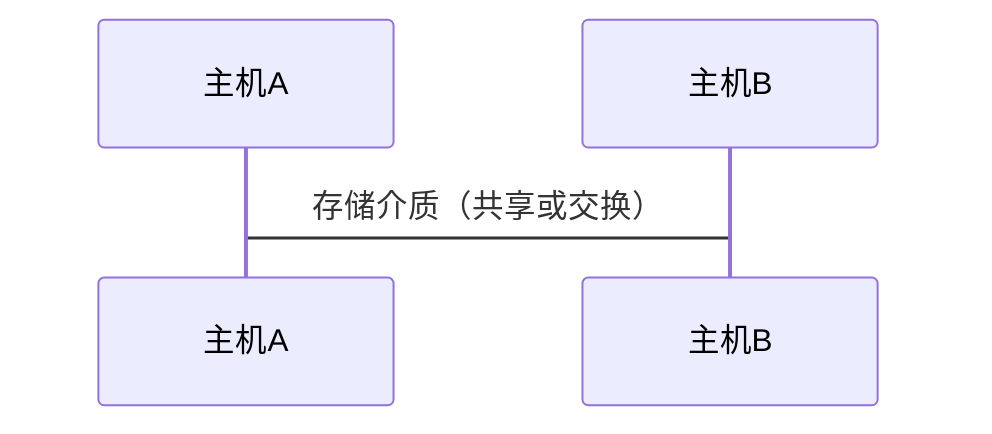

将计算机技术与通信技术进行结合，诞生了计算机网络，所以从技术范畴来看，计算机网络是计算机技术与通信技术相互融合的产物。


> 计算机网络是利用通信设备与通信链路或者通信网络，互联`位置不同、功能自治`的计算机系统，并遵循一定的规则实现计算机系统之间`信息交换`。


**简短、概括性定义**：

> ==计算机网络是互联的、自治的计算机的集合==
>
> 自治：是指互联的计算机系统彼此独立，不存在主从或者控制与被控制的关系。
>
> 互联：是指利用通信链路连接相互独立的计算机系统。


通信链路：可以是双绞线，光纤，微波，通信卫星等。不同链路速率（带宽）不同， 单位：bit/s、bps、b/s

计算机网络中的计算机应理解为计算机设备，通常称为`主机`或`端系统`。


目前最大的，应用最广泛的计算机网络是Internet（英特网）

ISP（Internet Service Provider）


```markdown
**Internet 互连**

家庭用户端系统构成小型家庭网络， 并借助电话网络、有线电视网络等接入**局域或本地ISP**
企业网络、校园网等网络，通常构成一定规模的**局域网**，然后在接入区域或本地ISP
区域或本地ISP再与更大规模的**国家级ISP**互连
国家级ISP再与其他国家级ISP或全球性ISP互连， 从而实现全球性端系统的互联

```


```markdown
**ISP**

ISP 网络有许多有线或无线通信链路互连分组交换设备构成。
**分组交换设备**
可以实现数据分组的接收与转发， 是构成Internet的重要基础， 存在多种形式，最典型的就是**路由器和交换机**。
```


## 2.协议的定义

> Internet 中互连的端系统、分组交换设备或其他网络设备在进行信息的发送，接收或转发的过程中，都需要遵循一些规则或约定， 即**网络协议**
>
> 
>
> 网络中的通信实体之间进行数据交换时，在不同的情况下需要遵循不同的协议。
>
> 计算机网络中的所有通信过程都需要遵循某个或某些协议。例如： HTTP， TCP， IP， ARP 等


#### 协议

> 概括的说，协议约定了实体之间交换的信息类型，信息各部分的含义，信息交换顺序以及收到特定信息或出现异常时应采取的行为。


#### 协议三要素

> 任何协议都会显示或隐式地定义3各基本要素：**语法** syntax、**语义** semantics、**时序** timing

**语法**

> 定义实体之间交换信息的格式与结构， 或定义实体（如硬件设备）之间传输信号的电平等。

**语义**

> 就是定义实体之间交换信息中需要发送哪些控制信息， 这些控制信息的含义，以及针对不同含义的控制信息，接收信息端应如何响应。
>
> 语义还需要定义彼此采用何种差错编码，以及采取何种差错处理机制等。

**时序**

> 也称为同步
>
> 定义实体之间交换信息的顺序以及如何匹配或适应彼此的速度。


## 3.计算机网络的功能

计算机网络的功能是在不同主机之间实现快速的信息交换。 通过信息交换可以实现<font color=red>资源共享</font>这一`核心`功能。


资源共享包括

- 硬件资源共享

> 通过计算机网络，一台主机可以共享使用另一台主机的硬件资源
>
> 包括：计算资源（CPU）、存储资源、打印机、扫描仪等IO设备（例如：云计算和云存储）

- 软件资源共享

> 网络上的主机可以远程访问、似乎用服务器计算机上运行的各类大型软件（例如，数据库）。
>
> 软件的共享可以避免软件的重复投资，重复部署，有效节省成本
>
> 
>
> 近年来，许多软件提供商改变了传统的软件销售模式， 诞生了软件即服务（Software as a service， SaaS）
>
> SaaS 是目前互联网环节下软件共享的典型模式

- 信息资源共享

> 计算机网络所支持的信息交换就是典型的信息共享。


## 4.计算机网络的分类


### 分类方式

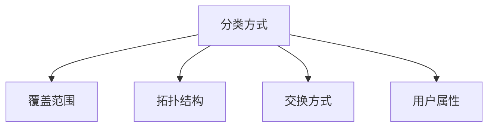


### 分类-覆盖范围

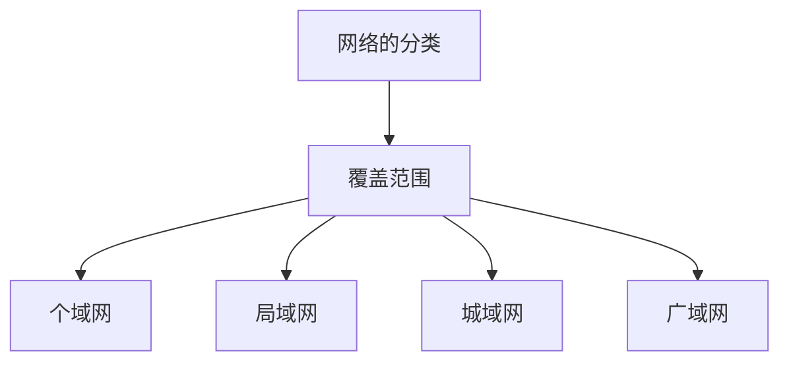

#### 个域网

- 由个人设备通过无线通信技术构成小范围的网络
- 实现个人设备间的数据传输
- 覆盖范围:1m-10m


#### 局域网

- 部署在办公室/办公楼/厂区等局部区域内
- 采用高速有线或无线链接主机
- 实现局部范围内的高速数据传输
- 覆盖范围:10m-1km


#### 城域网

- 覆盖一个城市范围的网络

- 覆盖范围5-50km


#### 广域网

- 跨越更大地理空间范围的网络
- 实现异地城域网或局域网的互连
- 覆盖范围在几十到几千千米


### 分类-拓扑结构

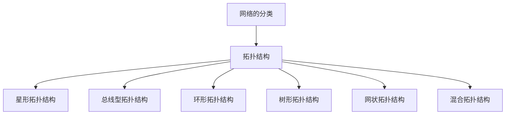

**星形拓扑结构**

> 包含一个中央结点
>
> 网络中的主机通过点对点通信链路与中央结点连接， 主机之间的通信都需要通过中央结点进行
>
> 多见于局域网，个域网
>
> 
>
> 易于监控与管理，故障诊断与隔离容易
>
> 中央结点是网络的瓶颈


**总线型拓扑结构**

> 采用一条广播信道作为公共传输介质，所有结点与总线连接并通过总线进行通信
>
> 任一结点通过总线发送数据，其他结点都会收到信号
>
> 同一时间有多个结点发送数据时会产生**冲突**
>
> 
>
> 机构简单，电缆数少，易于扩展
>
> 通信范围受限，故障诊断与隔离较为困难，容易产生冲突


**环形拓扑结构**

>
>
>

**网状拓扑结构**

>
>
>

**树形拓扑结构**

>
>
>

**混合拓扑结构**

>
>
>

### 分类-交换方式

数据交换是指网络通过彼此互连的结点间的**数据转接** ，实现将数据从发送结点送到目的结点的过程和技术。

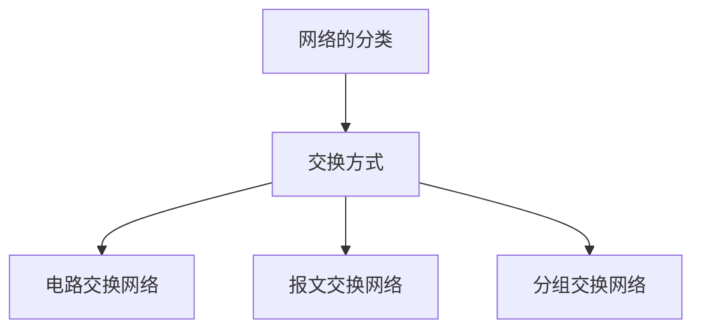


### 分类-用户属性

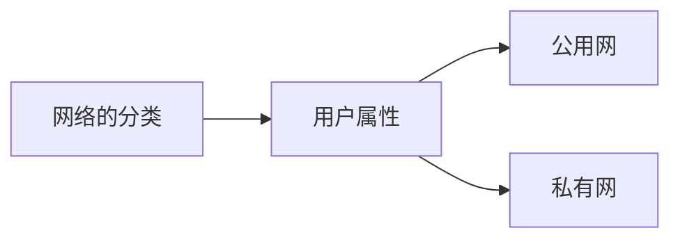

公用网：面向公众提供收费或免费服务， 移动电信网络

私有网：面向组织内部成员提供服务， 军事专用网络


# 2.计算机网络结构


大规模现代计算机网络的结构包括：**边缘网络**， **接入网络**， **网络核心** 三部分


## 网络边缘

连接到网络上个的计算机，服务器，智能手机，智能传感器，智能家电等主机(端系统)位于网络的最边缘。

这些连接到网络的所有端系统构成了**网络边缘**。

网络边缘上的端系统运行分布式网络应用，在端系统之间进行数据交换，实现应用目的。

普通网络用户在使用网络时就是在网络边缘中通过使用某网络应用，实现网络边缘的端系统之间的信息交换。

> 可以说网络边缘为网络用户提供了网络应用服务

网络边缘的端系统可以通过通信链路直接连接


## 接入网络

在大规模、复杂的网络中，大部分端系统距离遥远，甚至在不同的国家， 这些端系统之间的网络连接和通信需要**网络核心**进行数据**中继或转发**。

> 通常情况下，网络核心是由一些电信网络运营商等企业运营的ISP网络，不能直接延申到用户区域。

接入网络是实现*网络边缘的端系统*与**网络核心**进行*连接与接入*的网络

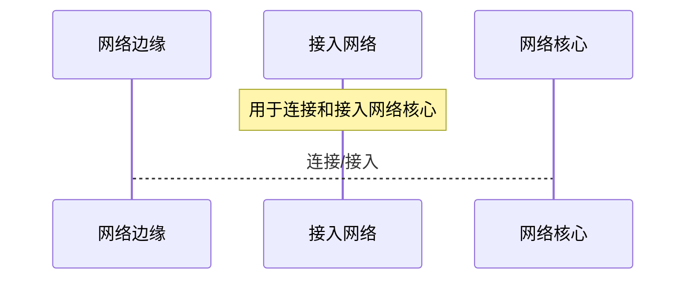

**接入网络技术**

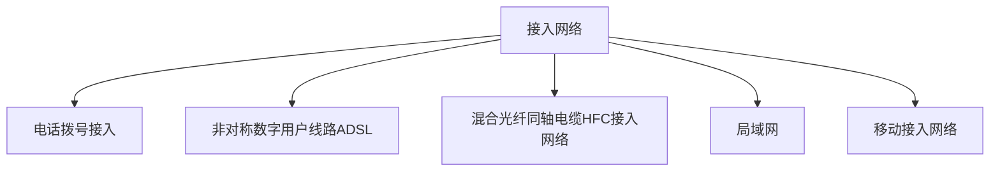

**电话拨号接入**

>利用电话网络，同调制解调器（modem）将数字信号调制到模拟电话线路，通过电话网络的模拟语音信号作为载波传送到远端
>
>再利用调制解调器将数字信号从模拟信号调解出来
>
>早期用于家庭网络接入， 带宽小（56Kbit/s)
>
>

**非对称数字用户线路ADSL**

>也是利用现有电话网络的用户线路实现的接入网络， 现在家庭用户接入网络的常见方式
>
>基于频分多路复用技术实现电话语音通信和数字通信共享一条用户线路。
>
>非对称：上行带宽比下行带宽小
>
>带宽与用户线路长度有关
>
>**独享式**

**混合光纤同轴电缆HFC接入网络**

>也称为电缆调制解调器（cable modem）接入。
>
>利用有线电视网络实现网络接入的技术。
>
>**共享式**：同一栋楼共用一条HFC电缆， 共享带宽
>
>HTC没有ADSL接入速率快。

**局域网**

>在组织范围内建设局域网，连接所有需要接入外部网络的主机，然后通过企业网络或校园网络的边缘路由器连接网络核心。
>
>典型技术：以太网，Wi-Fi

**移动接入网络**

>利用移动通信网络（3G，4G，5G）实现智能手机，移动终端等设备的网络接入。
>
>个人设备接入网络的首选途径。


## 网络核心


>网络核心是由通信链路互连的**分组交换设备**构成的网络， 作用是实现网络边缘中的主机之间的数据**中继与转发**
>
>
>
>交换机与路由器都是典型的分组交换设备
>
>对于网络中的每个路由器，必须能够为去往不同目的的数据做出合理决策，选择如何转发数据， 如转发给哪个相邻的路由器
>
>网络核心通过**数据交换**实现数据的中继与转发。


# 3.数据交换技术

数据交换是实现在大规模网络核心上进行数据传输的技术基础。

常见的数据交换技术包括：电路交换、报文交换、分组交换。

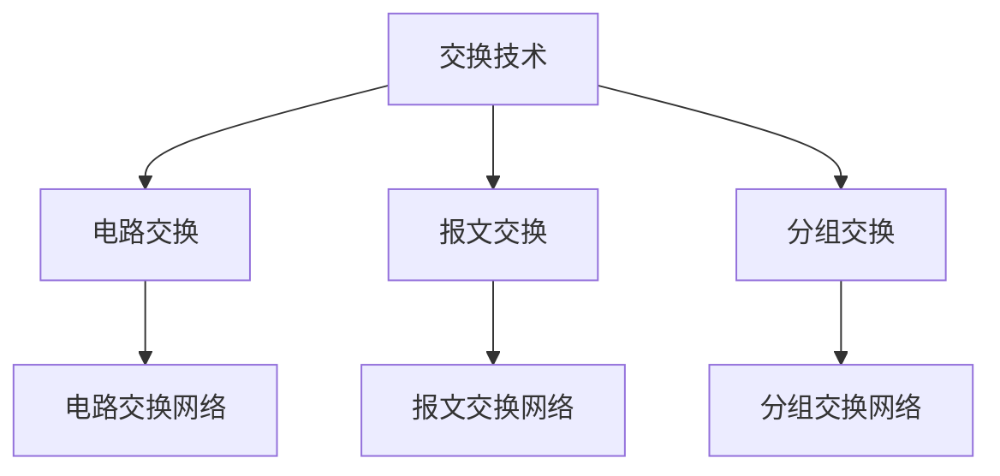


> 计算机网络的根本目的是在网络边缘的主机之间实现相互的数据传输，信息交换。

一个主机为了与其他所有主机交通信可以构建一个完全网状网络， 如果主机数为N，则各主机之间的网络需要有$N*(N-1)/2$条链路。

当网络规模较大时，通过通信链路连接所有通信终端时不可行的。于是诞生了交换设备。


> 交换设备具有多通信端口，可以同时与多个通信结点连接，实现通信端口间物理或逻辑上的**动态**、**并行**通信
>
> **数据交换网络**
>
> 为了连接更大范围、更多数量的主机，将许多交换设备互连，构成一个数据中继与转发的“**中间网络**”。这个中间网络只提供将数据从一个结点到另一个结点直到目的结点的数据中继与交换功能。因此称为数据交换网络。


## 电路交换

电路交换是最早出现的交换方式，电话网络是最早最大的电路交换网络。

利用电路交换网络进行通信包括三个阶段：**建立电路**，**传输数据**，**拆除电路**

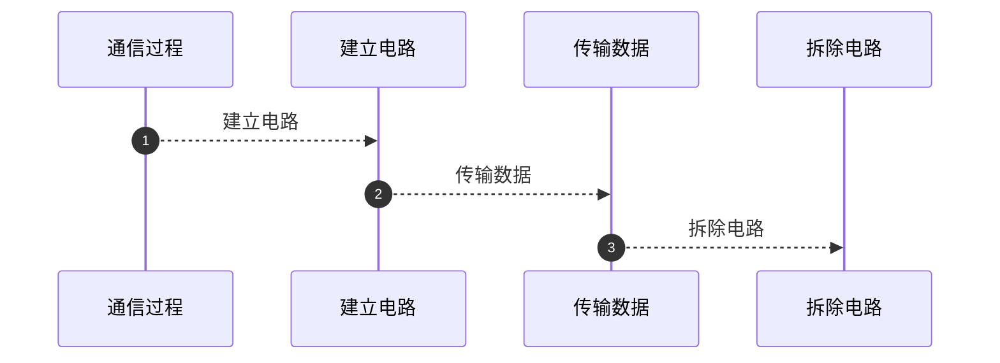

> 电路交换网络中，首先需要需要通过中间结点为两台主机之间建立一条专用通信线路，称为：**电路**
>
> 其次利用电路进行通信
>
> 最后拆除电路
>
> 电话**拨号呼叫**过程就是请求建立电路的过程


### 建立电路

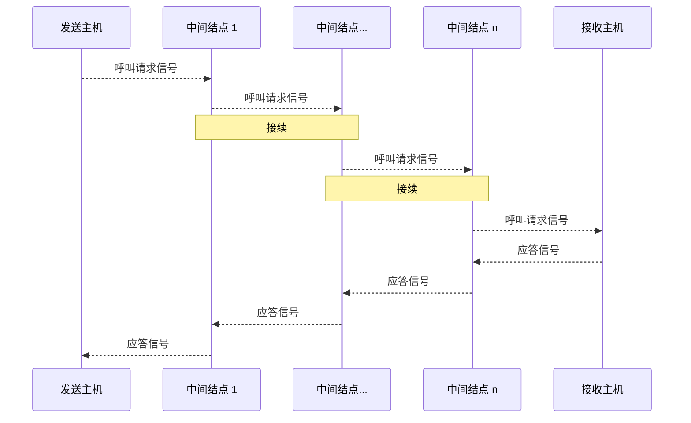

>
>
>建立电路的过程就是一系列交换结点的接续过程
>
>**电路建立过程**
>
>两个主机之间的通信，首先需要发送主机发出呼叫请求信号
>
>呼叫请求信号经若干结点沿途接通一条物理链路
>
>接收主机发出应答信号
>
>电路建立时间与中间交换结点的个数有关


### 数据传输

电路建立之后，就可以进行数据传输。

被传输的数据可以是**数字数据**，也可以是**模拟数据**

数据的传输可以是**单工**，也可以是**全双工**


### 拆除电路

数据传输完成后，需要释放（拆除）电路。

释放动作可以由发起、接收任意一方发起并完成。

释放信号必须传送到电路所经过的各个结点


### 总结

1. 有连接的
2. 要先建立电路连接
3. 通信过程独占一个信道
4. 通信结束需要拆除电路连接
5. 优点：实时性高，时延和时延抖动都较小
6. 缺点：对于突发性数据传输，信道利用率低，传输速率单一
7. 适用于语音，视频等实时性强的业务


## 报文交换

也称为消息交换

> 1. 不需要建立连接
> 2. 只有当报文被转发时才占用相应信道
> 3. 交换结点需要缓冲存储，报文需要排队，增加了时延
> 4. 存储空间不足或输出链路被占用不能及时转发时会丢弃报文（可能丢弃报文）

**工作过程**

> 发送方把要发送的信息附加上发送/接收主机的地址及其他控制信息，构成一个完整的报文（message）
>
> 然后以报文为单位在交换网络的各个结点之间以 `存储-转发` 的方式传送，直至送到到目标主机
>
> **延迟时间**
>
> 一个报文在每个结点之间的延迟时间，等于接收报文所需的时间+向下一个结点转发所需的排队延迟时间之和
>
> **存储-转发**
>
> 该方式只有在报文被转发时才占用相应的信道，相对电路交换而言线路利用率高


**缺点**

>  交换网络中的结点需要缓冲存储，报文需要排队，因此会导致**延迟时间变长**并且**不固定**
>
> 报文过多而存储空间不足时或输出链路被占用不能及时转发时，会**丢弃报文**


> 现代计算机网络没有采用报文交换技术的


## 分组交换

### 基本原理

> 分组交换是计算机网络使用最广泛的一种数据交换技术，现代计算机网络几乎都是分组交换网络。

分组交换需要将待传输的数据（报文，message）拆分为较小的数据块， 每个数据块附加上地址，序号等控制信息构成数据分组（包，packet），每个分组独立传输到目的地， 目的地将收到的分组重新组装，还原为报文。

分组传输过程通常也采用 `存储-转发` 交换技术

> 分组交换是报文交换的一种改进，它将一个完整的报文拆分为若干个分组，每个分组长度有一个上限。
>
> 有限长度的分组使得每个结点所需的存储能力降低，分组可以存储到内存提高交换速度。


### 分组交换的优点

与报文交换相比，分组交换的优点：

> 交换设备存**储容量要求低**，**交换速度快**，**可靠传输效率高**，**更加公平**

- 交换设备存储容量要求低

    - 理论上只要能缓存一个分组即可

- 交换速度快

    - 分组更小，可以利用主存储器，不用访问较慢的外存
    - 多个分组可以在网络中的不同链路进行并发处理，提高传输效率和线路利用率

- 可靠传输效率高

    - 分组交换在出现差错时可以只重传错误的分组
    - 报文交换时需要重传全部报文，即使只有1位数据错误

- 更加公平

    - 以报文为单位进行存储转发，大小差异较大的报文，在大报文后面的小报文也需要等待很长时间
    - 分组后，所有报文都可以在不同的交换结点交替排队，每个分组通过网络的时间相当

    

    

### 分组长度的确定


**分组长度与延迟时间**

- 基于**排队论**，相同长度的分组在交换过程中延迟时间较小
- 其他条件相同，分组**长度**越长延迟**时间**越长。实时交互式通信适合分组长度小， 文件传输等非实时通信，长度可以适当增加。
- 分组太小，有效数据传输效率会降低， 需要在**延迟时间**与**开销**之间进行平衡

**分组长度与误码率**

- 分组长度 $L=x+h$,  x：数据长度， h：分组头长度
- $P_e$为信道误码率， 分组传输正确概率为：$P_s=（1-P_e）^{x+h}$     $P_s=（1-P_e）^L$
- 重发概率为 $1-P_s$
- 最佳分组长度为 $L_{opt}=\sqrt{\frac{h}{P_e}}$
- 最高信道利用率为 $\eta_{max}=(1-\sqrt{hP_e})^2$
- 分组长度建议在16B到4096B之间的$2^n$B为标准分组长度


> 误码率越小，最佳长度越长
>
> 信道利用率随头长度、误码率增大而降低
>
> 最佳长度与信道利用率对误码率敏感


# 4.计算机网络性能

计算机网络的性能指标主要包含： 数据传输速率、时延、时延带宽积、丢包率、吞吐量。


## 带宽与速率

**速率**，是计算机网络中最重要的性能指标之一。

> 速率指的是网络单位时间内传送的数据量，用以描述网络传输数据的快慢
>
> 又称为：数据传输速率，数据速率
>
> ==重要==$T=10^{12}$ $G=10^{9}$ $M=10^6$ $K=10^3$ $bit/s$
>
> 通常给出的网络速率是指网络的**额定速率**或**标称速率**，网络在实际运行时的速率并不总能达到额定速率。


**带宽**

通信信号领域指信号具有的频带宽度,即信号成分的*最高频率*和*最低频率* **之差**。 单位：$Hz$

一条链路或信道在不失真地传播电磁信号的最高频率和最低频率称信道的带宽。单位：$Hz$

在计算机网络中描述一条链路或信道的**数据传输能力**时用带宽表示链路或信道的**最高数据速率**。 单位： $bit/s$


## 时延

> 时延是指数据从网络中的一个结点到达另一个结点所需要的时间。


```markdown
计算机网络中通常将连接两个结点的直线链路称为一个**跳步**（hop），简称 **跳**

一个分组从源主机到达目的主机的时延是由分组所经过的所有跳时延**之和**。
在~存储-转发~方式的分组交换网络中，只要分析清楚在每一跳过程的延迟，就可以求得任意情况下，分组从源结点到达目的结点的时延。
```


**分组的每跳传输过程主要有四类时间延迟**：

### **结点处理时延 **$d_c$

> 每个分组达到交换结点时，交换设备可能需要验证分组是否有差错，检索转发表，修改分组控制信息等
>
> 这些处理时间之和构成了结点处理时延
>
> 通常很小，且不同分组的结点处理时延变化很小，在网络总时延时常被忽略

### **排队时延 $d_q$**

> 分组在交换结点内被交换到输出链路时，可能存在其他分组正在或等待交换到输出链路
>
> 或分组在交换到输出链路后有其他分组正在等待通过输出链路进行发送， 这些都需要分组等待

### **传输时延** $d_t$

> 当一个分组在输出链路发送时，从第一位开始到发送完最后一位，所用的时间。 也称发送时延
>
> 设分组长度为$L_{bit}$, 链路带宽（速率）为$R_{bit/s}$
>
> $d_t=L/R$

### **传播时延** $d_p$

> 分组中的每个比特在发送到物理介质上时，是利用物理信号的某种特征表示的。
>
> 信号从发送端发送出来，经过一定距离的物理链路到达接收端所需的时间
>
> 不同的物理介质，具有不同的传播速度。光：$3\times10^8m/s$, 电信号在铜介质：$2\times10^8m/s$
>
> 传输时延=物理链路长度/信号传播速度
>
> $d_p=D/V$, D：物理链路长度， V：信号传播速度


综上，一个分组经过一个跳步的时间为： $d_h=d_c+d_q+d_t+d_p$


一个分组经过n个结点的总时延为
$$
T = \sum_{i=1}^{n+1}d_h^i
$$


## 时延带宽积

> 一段物理链路的传播时延与链路带宽的乘积
>
> $G=d_p\times R$ 单位是位
>
> 物理意义
>
> 如果将物理链路看作一个传输数据的管道，时延带宽积表示一段链路可以容纳的数据位数。 也称**以位为单位的链路长度**


## 丢包率

> 当网络拥塞严重时，新达到的分组没有缓存空间暂存该分组，此时交换结点就会丢弃分组，发生"丢包"现象。

$$
\begin{align}
\eta &= \frac{N_l}{N_s}=\frac{N_s-N_r}{N_s} \\
	 
& N_s\text{:发送分组总数} \\
& N_r\text{:接收分组总数} \\
& N_l\text{:丢失分组总数} \\

\end{align}
$$

## 吞吐量

表示单位时间内源主机通过网络向目标主机实际送达的数据量， 单位：$bit/$ 或 $B/s$ 字节每秒. 记作：$Thr$

用于度量网络的实际数据传送能力。

源主机到目的主机的吞吐量在理想情况下约等于**瓶颈链路**的带宽。（取链路中带宽最小的）


# 5.计算机网络体系结构

在制定网络协议时常采用的思路是将复杂的网络通信功能划分为由若干协议分别完成，然后将这些协议按照一定的方式组织起来，最终实现网络通信的所有功能。

最典型的划分方式是分层划分。

> 分层的核心思想是上一层的功能建立在下一层的功能基础上，并且在每一层内均要遵守一定的通信规则，即协议。
>
> 这样**计算机网络所划分的层次**以及**各层协议**的集合称为计算机网络体系结构。这种分层体系结构通常是**按功能划分**的，并不是按实现方式划分。
>
> 体系结构应当具有足够的信息，以便软件设计人员为每层编写实现该层协议的有关程序，即**协议软件**。


目前典型的层次化体系结构有OSI参考模型和TCP/IP参考模型。

OSI（Open System Interconnection）开放系统互连参考模型，按照这个标准建成的计算机网络中的设备都可以互相通信。


## OSI参考模型

---

实际应用的网络中集合没有严格按照OSI参考模型建立的。

OSI参考模型的重要意义在于它是一种计算机网络的理论体系结构，是目前学习，讨论计算机网络的一种工具。

---


OSI参考**分层结构化**技术，将整个计算机网络的通信功能分为7层，由低至高为： 物理层、数据链路层、网络层、传输层、会话层、表示层、应用层。


协议数据单元（PDU）

OSI中的数据并不是从一端的第N层直接送到另一端的对等层。

> 第N层接收N+1层（上一层）的协议数据单元（PDU），按第N层协议进行封装构成第N层PDU， 然后通过**层间接口**传递给N-1层（下一层），以此类推。
>
> 最后数据链路层PDU传递给最底层物理层。
>
> 数据在垂直的层次中依次自上而下地逐层传递至物理层，在物理层的两个端点进行**物理通信**，这种通信称为**实通信**。
>


实通信：在物理层两个端点进行物理通信，称为实通信

虚通信 ：不直接进行通信的对等层通信称为虚拟通信

中间系统（如路由器）通常只实现物理层，数据链路层，网络层功能。 因此OSI中物理层，数据链路层，网络层称为**结点到结点层**

传输层，会话层，表示层，应用层称为**端到端层**


### 物理层

主要功能是

1. 在传输介质上实现**无结构**比特流传输，需要实现信号编码功能。

2. 规定数据终端设备（**DTE**）与数据通信设备（**DCE**）直接接口的相关特性，主要包括**机械**、**电气**、**功能**和**规程**4个方面的特性。

```markdown
无结构指不关心比特流实际代表的信息内容，只关心如何将0，1这些比特以合适的信号传输到目的地。
```


- **机械特性**：也叫物理特性， 说明硬件连接接口的机械特性。接口的形状，尺寸..
- **电气特性**：规定了在物理连接上，导线的电气连接及有关电路的特性。信号电平的大小..
- **功能特性**：说明物理接口的各条信号线的用途。
- **规程特性**：指明利用接口传输比特流的全过程及各项用于传输的事件发生的合法顺序，包括事件的执行顺序和数据传输方式。
    - 即在物理连接建立、维持和交换信息时，首发双方在各自电路上的动作序列。典型的物理层协议有：RS-232c、RS-449


### 数据链路层

主要功能是：

1. 实现相邻结点中间数据可靠而有效的传输。
    1. 采用以帧为单元的数据库传输方式。成帧功能（帧同步）
2. 实现相邻结点间通信的流量控制
    1. 某些网络的数据链路层还提供连接管理功能（**链路管理**）。（建立和释放数据链路）
3. 寻址，如局域网广泛采用MAC地址


### 网络层

主要功能是

1. 网络需要解决的核心问题是如何将**分组**通过交换网络传送到目的主机，所以主要功能是**数据转发**与**路由**
2. 路由：路径选择。一个包含源结点，中继结点，目标结点的集合称作源结点到目的结点的路径。
3. 网络层还需要对进入交换网络的通信量加以控制，避免交换网络性能下降。
4. 寻址功能。如Internet中的IP地址


### 传输层

第一个端到端的层次，也是进程-进程的层次。数据的通信实际发生在两个主机的进程之间。OSI自下而上的前三次可组成公共网络，被多设备共享。

两个主机之间需要实现端到端的控制，避免传送中报文丢失。

传输层的功能主要包括复用/分解、端到端的可靠数据传输、连接控制、流量控制和拥塞控制等


### 会话层

指用户与用户的连接，在两台计算机中间建立、管理、终止通信来完成对话。

主要功能

1. 在建立会话时合适双方身份是否有权参见会话
2. 确定双方支付通信费用
3. 双方在各种选择功能方面取得一致
4. 会话建立后需要对进程间的对话进行控制

==实际网络中，会话层功能已经被应用层覆盖，很少单独存在==


### 表示层

主要用于处理应用实体间交换数据的语法，其目的是解决格式和数据表示的差异，从而为应用层提供一个一致的数据格式，使字符、格式等有差异的设备之间相互通信。

还可以实现文本压缩/解压、数据加密/解密、字符编码的转换等功能

这一层功能在某些实际通信网络中由应用层实现，而且，**表示层不独立存在**


### 应用层

应用层与提供给用户的网络服务有关，这些服务非常丰富，包括文件传送、电子邮件、P2P应用等

应用层为用户提供了一个使用网络应用的**接口**


OSI参考模型中,1,2,3层主要是完成数据交换与数据传输，称为网络低层

5,6,7主要完成信息处理服务，称为网络高层, 低层与高层通过第4层进行衔接。


### OSI相关术语

- 数据单元
    - 在层的实体之间传送的比特组称为数据单元
    - 在对等层之间传送的数据单元是按照本层协议进行的，此时的数据单元称为**协议数据单元PDU**
    - PDU：协议数据单元
    - SDU：服务数据单元
    - PCI：协议控制信息
- 服务访问点
    - Service Access Point
    - 相邻层间的服务是通过其接口面上的服务访问点（SAP）进行的， N层SAP就是不进行（N+1）层访问N层的地方。 每个SAP都有一个地址号码
- 服务原语
    - 第N层向N+1层提供服务，或N+1层请求第N层提供服务，都是用一组原语描述的.
    - 请求：Request 用户实体请求服务做某种工作
    - 指示：Indication 用户实体被告知某件事发生
    - 响应：Response 用户实体表示对某件事的响应
    - 证实：Confirm 用户实体收到关于它的请求的答复
- 面向连接的服务和无连接服务
    - 分层体系结构中，下层向上层提供服务通常有两种形式：面向连接发服务和无连接服务。
    - 面向连接的服务,以电话为典型
        - 某一方欲传送数据，首先给出对方的全称地址，并请求建立连接。当双方同意后，双方之间的通信链路就建立起来
        - 传送数据时，通常以组为单位按序传送，不再标称地址，只标称所建立的链路号，并由收方对收到的分组予以确认，称为可靠传送方式；不确认则称为**不可靠传送**方式
        - 最后拆除链路
    - 无连接服务
        - 没有建立和拆除链路的过程
        - 又称数据报服务（Datagram）要求每一个分组信息带有全称地址，独立选择路径，到达目的地的顺序不确定，并且需要重新对分组进行排序


## TCPIP

作为最大、最重要的计算机网络-因特网的体系结构可以用TCP/IP参考模型进行描述


TCP/IP 参考模型包括4层。通常每一层封装的数据包采用不同的名称。


### 应用层

TCP/IP将OSI中的会话层与表示层的功能合并到了应用层来实现。Internet 上常见的一些网络应用大多都在这一层，用户通过该层使用各种服务，如WWW、文件传输、电子邮件等。

每一种应用都是用相应的协议来将用户的数据按照协议定义的格式进行封装，以便达到控制功能，然后再利用下一层（传输层）的协议进行传输。

例如WWW服务的应用层协议为HTTP， 文件传输的应用层协议为FTP， 电子邮件的应用层协议又SMTP\POP3等


每一个应用层协议都会使用到两个传输层协议之一进行数据传输

- **TCP**：面向连接的传输控制协议
- **UDP**：无连接的用户数据报协议


### 传输层

传输层协议为运行在不同主机上的进程提供了一种**逻辑通信机制**（因为两个进程之间的通信就像所在的两个主机存在直接连接一样）

传输层可以解决诸如端到端的可靠性、保证数据按照正确的顺序到达等问题

> TCP/IP参考模型的传输层主要包括
>
> 1. 面向连接、提供可靠数据流传输的**传输控制协议**TCP
> 2. 无连接的不可靠数据传输的**用户数据报协议**UDP


### 网络互连层

==是整个参考模型的核心。==主要解决把数据分组发往目的网络或主机的问题。

- 为分组的传输选择路径（路由选择），完成分组的转发
- 提供网络层寻址——IP地址

网络互连层还可以将不同类型的网络互连。

核心协议是IP， 负责定义分组的格式和传输。IP是无连接不可靠协议（分组到达顺序与发送顺序可能不同，可能丢失分组）

网络互连层还包**ICMP**（互联网络控制报文协议）、**IGMP**（互联网多播组管理协议）以及路由协议，如BGP、OSPF、RIP等


### 网络接口层

没有真正描述这一层的实现，只是要求给上层提供一个访问接口，以便在其上传递IP分组。

该层对应OSI的数据链路层和物理层。网络层IP分组在这一层被封装到底网络的链路层数据帧种，并最终以比特流的形式在物理介质上进行传输。


## 五层参考模型

结合OSI与TCP/IP提出了综合理论需求与实际网络的五层参考模型。

包括：物理层，数据链路层，网络层，传输层与应用层

近年来在描述计算机网络中最常用、最接近实际网络的参考模型


> 基于五层参考模型描述网络通信过程：
>
> 1. 用户的数据在应用层以报文的形式开始向下一层进行分组，形成段、数据报、帧，最后以比特流的形式进行传输。
> 2. 在中间结点处，分别从对应的数据报、帧中取出相应的路由或地址信息并进行处理，并依据转发策略向正确的接口转发数据报或帧。
> 3. 当数据到达目的主机后，自下而上，逐层处理并去掉相应的头部信息，还原为最初的报文交付给用户e
