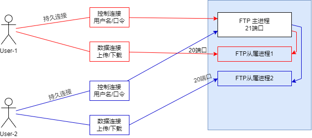
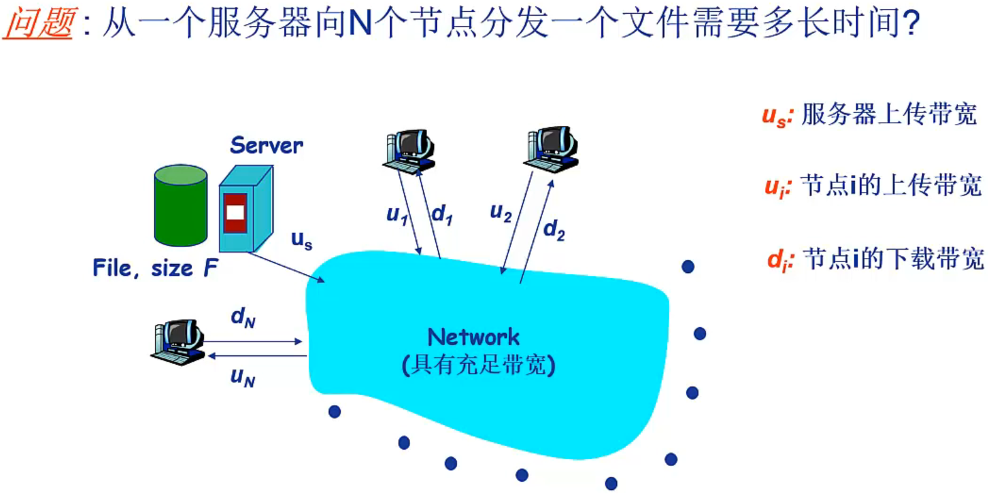
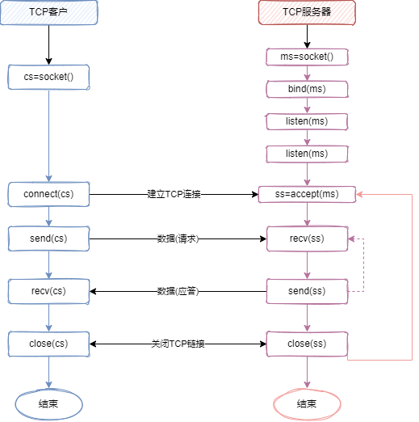
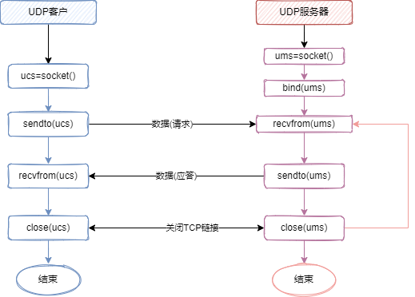

# 计算机网络应用体系结构


计算机网络应用是运行在计算机网络环境下的分布式软件系统，从体系结构角度可以分为：**客户/服务器结构** C/S、**纯P2P结构**Peer to Peer、**混合结构**三种类型。

## C/S结构网络应用

是最典型、最基本的网络应用。

网络应用的通信双方分为服务器程序和客户程序，服务器程序需要先运行做好通信准备，客户程序后运行，主动请求与服务器进行通信。


服务器计算机一般具有固定的网络地址，长期运行，以便服务器软件随时被请求服务。

CS网络应用最主要的**特征**是：通信只在客户与服务器之间进行，客户之间不进行直接通信。

主动发起通信的一方是客户， 被动接受通信的一方就是服务器。


## 纯P2P网络应用

在P2P网络应用中没有一直运行的传统服务器，所有通信都是在对等的通信方之间进行，通信方之间没有传统意义上的客户与服务器之分，“地位”对等。


## 混合结构网络应用

混合结构网络应用将C/S应用与P2P应用结合，既有中心服务器的存在，又有对等端间的直接通信。

通常每个客户通过C/S方式向服务器注册自己的网络地址，声明可共享的资源或可提供的服务，并通过中心服务发现其他在线的客户，检索其他客户可以共享的资源等信息。当需要获取另一个客户的资源或服务时便直接与该客户发起通信，请求其提供服务。


# 网络应用基本通信原理

> 网络应用的**本质**是运行在不同主机上（也可以是同一主机上）的应用进程之间的通信。 
>
> 无论哪种应用类型,基本通信方式都是C/S通信，所以网络应用的基本通信过程就是运行在不同主机上的应用进程间以C/S方式进行通信。
>
> C/S网络应用中，应用进程间遵循应用层协议交换应用层报文。 

应用层协议定义了应用进程间交换的报文类型，报文构成部分具体含义、交换时序等。

当进程组织好应用层报文后，需要通过**层间接口**将报文传递给相邻的**传输层**，请求传输层协议提供`端到端`传输服务。


典型的网络应用编程接口是`套接字`（Socket）。应用进程可以通过创建套接字实现与底层协议**接口**（动词），并可以进一步通过套接字实现应用进程与底层协议之间的报文交换。

Socket是应用进程间进行网络通信时真正收发报文的通道。

一个应用进程可以创建多个套接字与同一个或多个不同的传输层协议进行接口。对于一个传输层协议，需要为与其接口的每个套接字分配一个编号（端口）。

客户进程的套接字会绑定一个随机的端口，而服务器进程会绑定一个固定的端口号。

客户进程的端口有两种绑定方式： 自动绑定、bind()绑定

**熟知端口号**（well-known port，WEB应用的80端口）：`标准化应用`中，为不同的服务器分配了不同的默认端口号。


通过主机IP和套接字端口号可以标识一个应用进程。


**传输层的局限**

> 传输层能够提供的`服务类型`以及`服务性能`都是有限的， 例如Internet传输层提供的服务只有两类，它们都不能提供延时保障和带宽保障服务
>
> 1. 面向连接的可靠`字节流`传输服务 TCP
> 2. 无连接的不可靠数据传输服务 UDP


**TCP**

> TCP服务模型包括面**向连接服务**、**可靠数据传送服务**。
>
> - **面向连接服务**
>     - 在应用层报文开始传送之前，TCP客户端与服务器互相交换传输层控制信息完成握手，在客户进程与服务进程的套接字之间建立一条逻辑的TCP连接
>     - 这里连接是全双工，即连接双方的进程可以在此连接上同时进行报文的收发。
>     - 当结束报文发送时，必须拆除该连接
> - **可靠数据传送服务**
>     - 依靠TCP应用进程可以实现端到端的`无差错`、`按序交付`所有发送数据的服务。
>     - 当应用程序的一端将字节流通过本地套接字传送时，它能依靠TCP将相同的字节流交付给接收方的套接字，而`没有字节丢失和冗余。`

**UDP**

> 一种不提供传输和服务保障的轻量级传输层协议，提供最小的“尽力”服务。
>
> 无连接的， UDP不保证将报文送达到接收进程，而且到达接收进程也可能是乱序到达。


# 域名系统DNS

**用户代理**：user agent

用户用于使用网络应用的一系列软件， 例如浏览器。

**域名**：网络中IP地址难以记忆，所以为主机定义的一个容易记忆，有一定自然语义含义的名字。

**域名系统**：domain name system, DNS，将主机的域名映射为协议使用的IP地址的系统。

**域名解析**：实现将域名映射为IP地址的过程称为域名解析

**域名服务器**：存储网络中域名与IP地址映射关系数据的服务器。


## 层次化域 

DNS服务器按层次结构进行组织以实现域名的高效管理和高效查询，且该层次结构与域名结构相对应。

层次树状结构命名方法。

域名的结构由标号序列组成，各标号之间用逗号隔开。`….三级域名.二级域名.顶级域名`,各标号分别代表不同级别的域名。

1. `国家顶级域名` nTLD：cn代表中国，us表示美国，uk表示英国
2. `通用顶级域名` gTLD：com 公司和企业，net 网络服务机构，org 非盈利组织，edu 教育机构， gov 政府部门，mil 军事机构，int国际组织
3. `基础结构域名`：arpa ， 这种顶级域名只有一个， 用于**反向域名解析**


## 域名服务器

一个服务器所管辖的范围叫做区（zone），每一个区设置相应的**权威域名服务器**用来保存该区中所有主机的域名到IP地址的映射。

DNS 服务器管辖的范围以区为单位。


**本地域名服务器**

> 任何一台主机在进行网络地址配置时都会配置一个域名服务器作为默认域名服务器（本地域名服务器）
>
> 本地域名服务器是进行域名查询时首先被查询的域名服务器。


> 域名服务器根据主要保存的域名信息以及在域名解析过程中的作用等可以分为4类
>
> `根域名服务器`、`顶级域名服务器`、`权威域名服务器`、`中间域名服务器`


**根域名服务器**

> 根域名服务器是最重要的域名服务器。
>
> 全球互联网中部署了有限几个根域名服务器，每个根域名服务器都知道所有的顶级域名服务器的域名和IP地址。

**顶级域名服务器**

> TLD服务器， 负责管理在该顶级域名服务器注册的所有二级域名。
>
> 顶级域名服务器的名称对应一个域名的最后一个名字， 是对一个行业的命名。 如com， org

**权威域名服务器**

> 负责一个区的域名服务器， 保存该区中所有主机的域名到IP地址的映射。
>
> 在进行域名解析时，只要查询到被查询主机注册的权威域名服务器就可以获得该域名对应的IP地址


## 域名解析过程

域名解析过程分为：`递归解析`、`迭代解析`。

**递归解析**

> 提供递归查询的服务器可以代替查询主机或其他域名服务器，进行进一步的域名查询，并最终将查询结果发送给查询主机或服务器。
>
> 通常本地域名服务器都提供递归查询服务。

**迭代解析**

> 提供迭代查询的服务器不会代替查询主机或其他域名服务器进行进一步的查询，只是将接下来要查询的服务器告知查询主机或服务器。


**域名解析效率**

> 无论是递归解析还是迭代解析，只要本地域名不能直接响应解析结果，就需要从根服务器开始查询。这样根服务器压力很大，查询效率和响应时间都很低。
>
> 处理策略
>
> - 域名服务器增加`缓存机制`，在获取查询结果后将结果缓存下来，当再次收到相同域名查询时就使用缓存中的数据
> - 在本地域名服务器中存储顶级域名服务器，在域名解析时`跳过根域名服务器`直接查询顶级域名服务器


# 万维网应用


## 结构

Web 应用操作简单、按需浏览、图形化界面等特点深受用户喜爱。主要包括web服务器、浏览器、超文本传输协议等部分。 

web服务器是web应用的服务器软件，存储并管理供用户浏览的web页面。

web应用是典型的客户/服务器结构，客户与服务器之间基于HTTP协议进行交互。

web页面由对象组成。一个对象通常分别存储为一个文件，如HTML， 图片，视频文件等

web应用中通过URL来访问web页或web对象。

URL由两部分组成：服务器域名+对象路径


## HTTP

### 概述

http 是web应用的应用层协议，定义浏览器如何向web服务器发送请求以及web服务器如何向浏览器进行响应。

目前使用的是HTTP/1.0 和 HTTP/1.1 两个版本， 尤其以HTTP/1.1为主流。


HTTP/1.1的重点是矫正了HTTP设计中的结构缺陷，明确了语义，引入了重要的性能优化措施，并删除了一些不良特性。

HTTP/2.0 的探索中， 最典型的是SPDY协议。SPDY协议的目标是优化HTTP性能，通过压缩，多路复用和优先级等技术缩短网页的加载时间并提高安全性。

SPDY的核心思想是尽量减少TCP连接数。


### HTTP连接

> http 基于传输层的TCP传输报文。
>
> 浏览器在向服务器发送请求之前，首先需要建立TCP连接，然后才能发送HTTP请求报文，并接收HTTP请求报文。
>
> 根据HTTP在使用TCP连接的策略不同，可以分为：`非持久连接的HTTP` 、`持久连接的HTTP`


#### 非持久连接

> 指HTTP客户在与HTTP服务器建立TCP连接后，通过该连接发送HTTP请求报文，就收HTTP响应报文，然后断开连接。
>
> http/1.0默认使用非持久连接，每次请求传输一个新对象都要新建一个TCP连接。


**往返时间**

> 从客户端发送连接请求，到收到服务器的连接确认，用时为一个往返时间（Round Trip Time， RTT）
>
> `请求一个资源需要2个往返时间RTT`（请求连接+传输报文）


串行请求每个资源对象时，每次都要新建一个TCP连接，因此都要经历TCP`拥塞控制`的`慢启动`阶段，使得TCP连接工作在较低的吞吐量状态，延迟会更加明显。


为了改善HTTP性能，需要对这种非持久连接进行优化：

1. `并行连接`， 通过建立多条TCP连接，并行发送请求，并行接收响应
2. `持久连接`， 重用已建立的TCP连接发送新的请求和接收响应，消除新建TCP连接的时间开销


#### 并行连接

通过建立多条TCP连接，并行发送请求，并行接收响应。

目前几乎所有浏览器都支持并行连接，但是`并行连接数有限`。


并行连接并不是总能减少延迟，例如，客户主机接入链路带宽受限。

并行连接会增加客户主机的资源开销，如内存。同样服务器通常也会对同一客户的并行TCP连接数进行限制。


#### 持久连接

在请求web页后，继续传输引用的其他对象，这些对象通常与web页同在一个服务器。(站点局部性)。

在建立TCP连接并传输数据后并不立即断开连接,而是使用该连接继续请求资源.

根据持久连接传输多个对象的策略不同可以分为两种工作方式

- `非流水`方式持久连接
- `流水`方式持久连接


**非流水方式持久连接**

> 非管道方式持久连接
>
> 客户端在通过持久连接收到前一个报文后,才能发出对下一个对象的请求报文.
>
> 在连续请求多个对象时只需要建立一次TCP连接,每获取一个对象只需要1个RTT时间

**流水方式持久连接**

> 管道方式持久连接
>
> 客户端在通过持久连接收到前一个对象的响应报文之前,连续依次发送对后续对象的请求报文,然后再通过连接依次接收服务器发送的响应报文.
>
> 该方式获取一个对象平均时间远小于1RTT, 如果忽略传输时间,连续请求多个对象只需要1个RTT时间.


HTTP/1.1默认情况下使用流水方式持久连接.

HTTP/1.1的持久连接默认是激活的,除非特别声明,否则假定所有的连接都是持久的.

通过在报文中添加 `connection:close` 首部可以结束持久连接. 

没有connection首部,服务器并不承诺永久保存连接,例如在超过一定时间后就会主动关闭.


**HTTP/1.1使用持久连接的主要约束与规则**

> 1. 若客户端不期望在连接上发送其他请求,则应在最后一条请求报文中包含 `connection:close` 首部
> 2. 若客户端在收到的响应报文中包含 connecton:close 首部, 则客户端不能在该连接上发送更多的请求
> 3. 每个持久连接只适用于`一跳`传输, HTTP/1.1代理必须能够分别管理与客户端和服务器的持久连接
>     1. 即两个结点之间没有中间结点(没有转发)
> 4. HTTP/1.1代理服务器不应该与HTTP/1.0客户端建立持久连接

计算机网络中通常将连接两个结点的直线链路称为一个`跳步`（hop），简称 **跳**


### HTTP报文

Http报文由4部分组成：起始行、首部行、空白行、`实体主体`， 起始行与首部是行分隔的ASCII文本， 每行由CRLF终止。

**请求报文**

```http
请求行		GET /index.html HTTP/1.1 
首部行		Accept: application/json
空白行		
实体主体   {} 
```

**响应报文**

```http
状态行		HTTP/1.1 200 OK
首部行		content-length: 2000
空白行 
报文主体   {}
```

**起始行**

- 请求起始行：请求行 `请求方法` `资源路径` `协议/版本`

- 响应起始行：状态行 `协议/版本` `状态码` `短语`

**首部**

- 请求首部：只能用于请求报文的首部
- 响应首部：只能用于响应报文的首部
- 通用首部：请求报文和响应报文都可以使用的首部
- 实体首部：专门用于描述实体相关属性的首部， 例如 Content-type, Content-Length
- 扩展首部：由应用程序员创建的，不是HTTP规范中的首部

**空白行**

必须存在， 用于分隔首部与实体

**实体**


**状态码**

响应报文通过状态码向客户端通告响应情况， 

HTTP响应报文的状态码决定了客户端如何处理该响应， 例如转移请求等。


**状态码分类**

| 状态码类别 | 取值范围 | 作用       | 说明**                              |
| ---------- | -------- | ---------- | ----------------------------------- |
| 1xx        | 100~199  | 信息提示   | 通告信息，可能需要进一步交互        |
| 2xx        | 200~299  | 成功       | 成功完成客户请求的操作，并进行响应  |
| 3xx        | 300~399  | 重定向     | 表示资源已移走，需要向新的URL发请求 |
| 4xx        | 400~499  | 客户端错误 | 由于客户端请求错误，无法成功响应    |
| 5xx        | 500~599  | 服务器错误 | 由于读取段错误，无法成功响应        |


常见状态码

- 100 Continue 成功收到请求的初始部分，请客户端继续
- 200 OK 成功
- 301 Moved Permanently 重定向
- 400 Bad Request 客户端错误，服务端无法响应
- 401 Unauthorized 未授权
- 404 Not Found 资源不存在
- 451 Unsupported Media Type 不支持的媒体类型或请求方法不支持
- 505 HTTP Version Not Supported 服务器不支持的协议或版本


### Cookie

HTTP 协议是无状态协议（stateless protocol），因为服务器不保存任何关于客户的信息。因此客户端与服务器之间数据交换完毕后，它们的连接就会关闭，再次交换时需要重新建立连接。这意味着服务器无法跟踪用户的会话。


> Cookie的出现，是为了解决用户会话跟踪问题。
>
> Cookie：小型文本文件，指某些网站为了识别用户身份，进行会话跟踪而存储在用户本地终端上的数据。
>
> Cookie 由服务器生成，发送给User-Agent， 客户端会将Cookie的key/value保存到某个目录下的文本文件内， 下次请求同一网站就发送该Cookie给服务器。==`需要启用Cookie`==


**Cookie 技术主要包含4个部分**

>1. HTTP 响应报文中的Cookie首部： `Set-Cookie.` 发送大小一般不超过4K
>
>2. 用户浏览器在本地存储、维护和管理的Cookie文件. 
>
>   每当获得新的Cookie信息，便会在Cookie文件中追加一行Cookie信息，包括网站的`域、路径、内容、有效期、安全`5个字段
>
>3. HTTP请求报文中的 Cookie 首部：`Cookie`
>
>4. 网站在后台数据库中存储、维护Cookie信息


#### Cookie 的有效(生命周期)

Cookie可以实现在无状态HTTP之上建立用户会话。

> Cookie　可以存储在客户端计算机的硬盘中，也可以存储在客户计算机的内存中。
>
> 保存在硬盘中的Cookie通常称为**永久cookie**，Cookie的有效周期可以进行设置， 关闭浏览器不影响Cookie的有效周期
>
> 保存在内存中的Cookie称为会话Cookie，Cookie有效周期是浏览器的会话期间，关闭浏览器窗口，cookie就会消失


#### Cookie 使用场景

> 1. 利用Cookie的ID统计网站的使用情况， 例如：实际访问人数，新用户比例， 访问频率等
> 2. 利用Cookie限制特定用户的访问
> 3. 利用Cookie存储用户访问过程中的操作习惯和偏好，对不同用户提供不同的界面等
> 4. 记录用户登录网站使用的用户名密码等信息，不用重复输入
> 5. 电子商务网站通过Cookie实现购物车功能


#### Cookie 带来的问题

> 跟踪用户的信息，一旦泄露会给用户造成很大损失
>
> 在公共场所，多用户使用一台计算机时，cookie会暴露用户的网络操作行为
>
> 一台计算机中的多个浏览器之间Cookie不共享，用户在不同计算机中登录会得到不同的Cookie
>
> 在同一计算机上的多用户，Cookie不会区分用户的身份


# Internet 电子邮件

Internet电子邮件实现了电子化邮件的`异步传输`。 更加快捷、方便、便宜。


## 电子邮件系统的结构

电子邮件系统主要包含`邮件服务器`、`简单邮件传输协议`（SMTP）、`用户代理`和`邮件读取协议`等。


**邮件服务器**

> 邮件服务器是电子邮件系统的核心， 其功能是`发送`和`接收`邮件，同时还要向发信人报告邮件的传送情况，例如：已交付，被拒绝，丢失等。
>
> 邮件服务器会为每个注册的邮箱分配一定的存储空间
>
> 邮箱格式：`收件人邮箱姓名@邮箱所在主机地址`。
>
> 邮件服务器维护管理一个外出邮件队列，队列中暂存注册用户等待向外发送的邮件。 

**用户代理**

> 用户代理是电子邮件应用的客户端软件,为用户提供使用电子邮件的接口.
>
> 主要功能：支持用户撰写、显示、处理和收发邮件，为用户阅读、回复、转发、保存和撰写邮件等提供操作环境。


**邮件服务器的工作方式**

> 邮件服务器之间发送和接收邮件时按照C/S方式工作。实现邮件服务器之间发送邮件的应用层协议是SMTP协议（用户代理向注册邮箱服务器发送邮件时也是基于SMTP）
>
> 从客户/服务器通信方式来看， 一个邮件服务器既可以作为客户，也可以作为服务器。
>
> 一个邮件服务器通常至少包含两个进程或线程：`邮件发送进程`mail sender，`邮件接收进程`mail receiver
>
> 邮件接收进程实现SMTP的服务端，通常绑定默认的熟知端口号25
>
> 邮件发送进程实现SMTP的客户端，实时检测外出邮件队列，只要队列不空就依次取出一个邮件，向接收方发邮件服务器的25端口发送。
>
> 邮件读取协议：POP， IMAP


## SMTP （简单邮件传输协议）

SMTP是Internet电子邮件中核心的应用层协议， 实现邮件服务器之间或用户代理到邮件服务器之间的邮件传输。

SMTP 使用传输层TCP实现可靠数据传输，从`发送方 C`向`接收方 S`发送邮件。

> 当TCP连接建立成功后，SMTP通过三个阶段的<u>应用层交换</u>完成邮件的传输：**握手阶段**、**邮件传输阶段**、**关闭阶段**
>
> `握手阶段`：客户端，服务端各自声明自己的身份
>
> `邮件传输阶段`：开始传输邮件数据
>
> `关闭阶段`：声明邮件传输结束，并关闭TCP连接


SMTP的基本交互方式是SMTP客户端发送命令，命令后面可能携带参数， SMTP服务器对命令进行应答。

SMTP定义了14条命令和21中应答消息， 每条命令由4个字母组成， 每一种应答信息一般只有一行信息，由一个3位数字的代码开始，后面附上简单说明


**SMTP 的特点**

> 1. SMTP 只能传送7位ASCII码文本内容， 包括SMTP命令、应当消息、邮件内容。
>     1. 因此SMTP不能直接传送可执行文件或其他二进制文件，其他非英语国家的文字（如中文）。
>     2. 需要将此类信息转换为7位ASCII码文本形式， 接收邮件一方再将其还原
> 2. SMTP邮件中的内容不能包含 "`CSRF.CSRF`", 该信息用于表示邮件内容的结束。如果有，需要先转义
> 3. SMTP是“推动”协议。客户端有邮件时主动建立TCP连接将邮件推送给服务器。 HTTP是从服务器**拉取**数据
> 4. SMTP使用TCP连接是持久的。完成一封邮件后，若还有同一个服务器的邮件，可以继续发送。


## 电子邮件的格式与MIME

邮件内容的基本格式包括 首部、空白行、主体三个部分


**首部**

> 邮件内容的首部包含一条或多条首部行， 首部行格式为 `首部关键字:首部值`
>
> TO:收件人地址， 一个或多个。必选。
>
> Subject：邮件的主题
>
> Cc：给某人发送一个邮件副本。 抄送
>
> From：发信人
>
> Date：发信日期
>
> Reply-To：对方回信使用的地址


**MIME**

SMTP只能传输7为ASCII码文本， 在将非ASCII转换为ASCII码时需要有一个标准。MIME 多用途互联网邮件扩展就是该问题的解决方案。

> MIME定义了将非7位ASCII码内容转换为7位ASCII码的编码规则，并在邮件首部增加MIME首部行。
>
> 
>
> MIME 主要包括3个部分
>
> 1. 5个MIME邮件首部字段，可包含在邮件首部中
>     1. MIME-Version：版本， 目前1.0。没有改行则邮件为普通7位ASCII码文本邮件
>     2. Content-Description：邮件内容的概述
>     3. Content-Id：邮件的唯一标识符
>     4. Content-Transfer-Encoding：邮件主体编码，quoted-printable 适合数据中只有少量非ASCII码， 对于任意二进制文件采用base64编码。
>     5. Content-Type：必须包含两个标识符 `内容类型`和`子类型`， image/jpeg
> 2. 定义了多种邮件内容格式，对多媒体电子邮件的表示方法进行了标准化
> 3. 定义了邮件传送编码， 可对任何内容格式进行转换，从而适合通过SMTP进行传送


## 邮件读取协议

邮件读取服务器的主要作用是**用户身份鉴定**、**访问用户邮箱**、**根据用户请求对邮箱中的邮件进行操作**等。


Internet邮件系统中流行的邮件读取协议有：

- `第三版邮局协议` POP3 Post Office Protocol-Version3
- `互联网邮件访问协议` IMAP， Internet Mail Access Protocol
- `HTTP`, 用作Web Mail 系统中的邮件读取协议

### POP3-第三版邮局协议

POP3是一个简单邮件读取协议， 基于TCP。熟知端口号110；

> POP3协议交互过程分为三个阶段：
>
> 1. 授权：用户代理向服务器发送用户名和口令（明文），安全性差; 两个主要命令：`user<username> 和 pass<password>`
> 2. 事务处理：用户代理向服务器发送POP3命令，实现邮件读取、为邮件做删除标记，获取邮件的统计信息等操作;
> 3. 更新：客户发出quit命令， 结束POP3会话，服务器删除被标记为删除的邮件
>
> POP3的消息应答主要有两种：
>
> 1. +OK 表示前面的命令是正常的
> 2. -ERR 表示前面的命令出现了差错
>
> 

### IMAP-互联网邮件访问协议

POP3不具备支持用户创建远程文件夹并为邮件指派文件夹的功能。

IMAP 比POP3具有更多特性，也更加复杂。


IMAP将每个邮件与一个文件夹关联，邮件第一次到达服务器时，与收件人的INBOX文件夹关联。

收件人可以通过IMAP创建文件夹，对邮件进行移动，查询，阅读，删除等操作。

IMAP 服务器维护了IMAP会话的用户状态信息。

IAMP 运行用户代理只读取邮件的部分内容，例如邮件首部。


### HTTP

优点：

1. 使用浏览器， 无需安装专门的用户代理软件；
2. 基于熟悉的Web操作方式收发邮件，用户体验更好；
3. 浏览器与邮件服务器之间的收发邮件使用HTTP， 而邮件服务器之间的收发则是使用SMTP


# FTP

文件传输协议是在互联网的两个主机之间实现文件互传的**网络应用**，其应用层协议也称为FTP。

FTP屏蔽了各计算机系统的细节，消除了不同操作系统下处理文件的不兼容性，适合在任意异构计算机间传输文件。


> FTP的服务器进程一般由两大部分组成：
>
> - 一部分为`主进程`，负责接受新的客户请求
> - 一部分为若干`从属进程`，负责处理单个用户的请求，与具体客户进行交互
>
> FTP服务器就可以同时为多个客户进程提供服务


**工作方式**

> 1. 客户进程请求与FTP服务器的21号端口建立TCP连接， 称为`控制连接`，然后开始会话
> 2. 用户通过控制连接向服务器发送用户名/口令进行登录
> 3. 执行文件上传或下载, 文件传输使用新建TCP连接， 称为`数据连接`


> FTP的一个显著特点是在传输文件时需要`新建`一个数据连接，专门用于文件传输，传输结束后即关闭连接。 FTP使用两个“并行”TCP连接：`控制连接` `数据连接`
>
> 控制连接时持久连接， 会话期间一直打开，不用于文件传输
>
> 服务器端的控制进程在接收到FTP客户发送的文件传输请求后就创建`数据传送进程`和`数据连接`， 用来连接客户端和服务器端的数据传送进程。
>
> 服务器进程用自己传送数据的熟知端口20与客户进程所提供的端口号建立数据连接。



**带内控制&带外控制**

> 由于FTP专门使用一个独立的`控制连接`传输<u>控制信息</u>，与传输文件信息进行分离，所将FTP这种控制信息的传送方式称为带外控制
>
> 与之对应，将数据、命令都通过一个TCP连接传输的应用层协议称为带内控制， 如HTTP。


FTP 是有状态的协议。

FTP 的会话形式是客户向服务器发送命令， 服务器发送状态码和短语作为应答。

FTP 的命令和应答都是以7位ASCII码格式在控制连接上传送的， 所以它们都可读。

FTP 的命令由4个大写字母ASCII组成


**常用命令**

> USER username
>
> PASS password
>
> LIST 读取服务器当前目录中的所有文件列表， 数据连接传送
>
> RETR filename , 从服务器的当前目录下载文件
>
> STOR filename , 向服务器的当前目录上传文件


# P2P 应用


Peer to Peer

- 没有服务器
- 任意端系统之间直接通信
- 结点阶段性接入Internet
- 结点可能更换IP地址


**文件分发应用**

> 





# Socket 编程基础

> 识记：socket的基本概念，主要是Socket API系统调用及其过程


网络应用程序有两类：

- `实现标准协议`的网络应用程序
    - 应用层协议遵循某个或某些标准， 客户程序和服务器程序可以由不同的个人或组织开发
- 专用网络应用
    - 针对某组织或个人的特殊需求编写的网络应用程序， 其应用层协议是专门设计的，没有公开在RFC或在小范围内公开


网络应用进程通信时需要通过API接口请求底层协议的服务，如传输层；目前在Internet中应用最广泛的网络应用编程接口就是Socket API；无论是客户进程还是服务器进程都需要创建Socket，实现与底层协议**接口（动词）**，从而通过Socket发送或接收数据。


通过创建不同的Socket，可以与不同的底层协议接口，从而使用不同底层协议提供的不同类型的服务。

> 网络应用进程可以创建三类Socket
>
> - `数据报类型套接字` SOCK_DGRAM
>     - SOCK_DGRAM 面向传输层`UDP`接口
> - `流式套接字` SOCK_STREAM
>     - SOCK_STREAM 面向传输层`TCP`接口
> - `原始套接字` SOCK_RAW
>     - SOCK_RAW 面向网络层协议（如IP、ICMP）接口。


> SOCK_DGRAM、SOCK_STREAM 都是面向应用层相邻的传输层接口。
>
> SOCK_RAW 跳过了传输层，面向网络层接口；创建原始套接字有权限控制（在Linux中需要root权限），可以实现一些特殊功能，如收发ICMP报文


## Socket API 函数

Socket 提供了一组Socket API（函数）, 调用不同的Socket API 函数可以实现创建套接字、发送数据、接收数据等功能。

```c
/*
 * 创建套接字
 * 返回值：-1（SOCKET_ERROR） 表示失败， 非负数为成功，返回值为套接字描述符
 * family  	协议族  	通常取值为： PF_INET AF_INET, 面向IPv4协议栈 
 * type    	套接字类型	取值 SOCK_DGRAM、SOCK_STREAM、SOCK_RAW
 * protocol	协议   	取值 IPPROTO_TCP、IPPROTO_UDP 
 */
int socket(int family, int type, int protocol);

/*
 * 关闭一个描述符为 sockfd 的套接字。 
 * 返回值：0 成功， -1 失败
 * 多个进程共享一个套接字，调用close()将套接字引用计数减一， 直到为0才关闭套接字
 * 一个进程中的多个线程对套接字的使用不存在计数，若一个线程调用close，进程中的其他线程就不能访问该套接字
 */
int close(int sockfd);

/*
 * 绑定套接字的本地端点地址
 * sockfd 本地套接字的描述符
 * myaddr 为结构sockaddr_in 指针，本地端点地址
 * addrlen 端点地址长度
 * 成功返回0，失败返回-1
 * 服务器程序需要调用该函数， 为服务器套接字绑定特定端口号；客户程序一般不需要调用该函数，操作系统会自动为客户套接字绑定端口号
 */
int bind(int sockfd, const struct sockaddr *myaddr, socklen_t addrlen);

/*
 * 置服务器端的流（TCP）套接字sockfd为监听状态
 * sockfd：本地（服务器）套接字描述符；
 * backlog：连接请求队列大小
 * 成功返回0， 失败返回-1
 * 该函数只用于服务器端，且仅用于面向连接的流套接字，即TCP服务器套接字。
 */
int listen(int sockfd, int backlog);

/*
 * 将客户套接字sockfd 与服务器连接。程序调用connect函数来使客户套接字（sd）与特定计算机的特定端口（saddr）的套接字进行连接
 * sockfd 本地（客户）套接字的描述符；
 * servaddr 指向结构 sockaddr_in 的指针，存储服务器端点地址
 * 成功返回0 ，失败返回-1
 * 该函数用于客户端； 可用于tcp/udp客户端；TCP客户端则真正建立与服务器的TCP连接；UDP客户端只是指定服务器端点地址
 */
int connect(int sockfd, const struct sockaddr *servaddr, socklen_t addrlen);

/*
 * 从监听状态的流套接字sockfd 的客户连接请求队列中，取出第一个客户请求，并创建一个新的套接字来与客户套接字建立TCP连接
 */
int accetp(int sockfd, struct sockaddr *cliaddr, socklen_t addrlen);

/*
 * 发送数据
 * sockfd 本地套接字描述符
 * buff 指向存储代发数据的缓存指针
 * nbytes 数据长度
 * flags 控制比特， 一般取0
 */
ssize_t send(int sockdf; const void *buff, size_t nbytes, int flags);

/*
 * 发送数据
 * 
 */
ssize_t sendto(int sockfd, const void *buff, size_t nbytes, int flags, const struct sockaddr *to, socklen_t addrlen);

/*
 * 接收数据
 */
ssize_t recv(int sockfd, void *buff, size_t nbytes, int flags);

/*
 * 接收数据
 */
ssize_t recvfrom(int sockfd, const void *buff, size_t nbytes, int flags, struct sockaddr *from, socklen_t addrlen);

/*
 * 设置套接字选项
 */
int setsockopt(int sockfd, int level, int optname, const void *optval, socklen_t addrlen);

/*
 * 读取套接字选项
 */
int getsockopt(int sockfd, int level, int optname, void *optval, socklen_t addrlen);
```


## 基于TCP的C/S应用中SocketAPI函数调用过程



1. 服务器先启动，调用`socket()`创建SOCK_STREAM类型的主套接字 `ms`
2. 服务器调用 `bind()`绑定本地端点地址
3. 服务器调用 `listen(ms)`置ms为监听模式
4. 调用accept(ms)函数通过主套接字接收客户连接请求，并阻塞服务器进程直到客户连接请求到达， accept()函数调用成功，返回（创建）连接套接字 ss
5. 客户端创建本地SOCK_STREAM类型的套接字
6. 客户端调用connect()函数请求与服务器建立TCP连接， connect函数调用成功表明TCP连接建立成功
7. 客户端与服务器端调用send与recv函数发送与接收数据
8. 通信结束后，客户端与服务器端分别调用close函数释放套接字cs、ss，从而关闭TCP连接


服务器关闭的是与客户端连接的ss套接字而不是主套接字


## 基于UDP的C/S应用中SocketAPI函数调用过程



1. 服务器调用 `socket` 函数创建`SOCK_DGRAM`类型的套接字 `ums`
2. 服务其调用 `bind` 函数绑定本地端点地址
3. 客户端调用 `socket` 函数创建本地 `SOCK_DGRAM` 类型的套接字 `ucs`
4. 客户端与服务器通过调用 sendto/recvfrom 函数实现数据的发送与接收
5. 客户端调用close释放ucs
6. 服务器继续调用recefrom通过套接字ums接收下一个客户端发送的数据报

通常服务器程序不会关闭套接字ums


