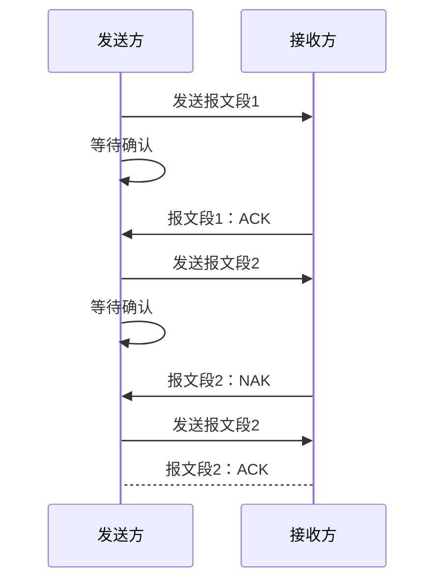
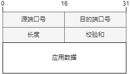
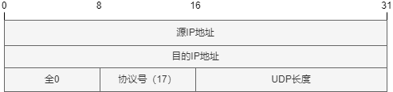
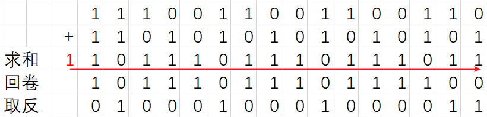
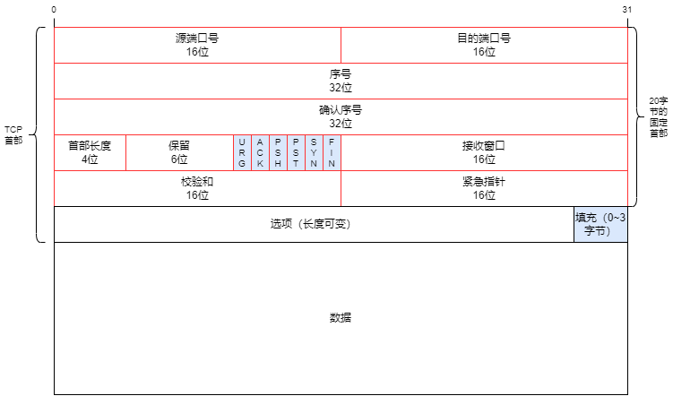
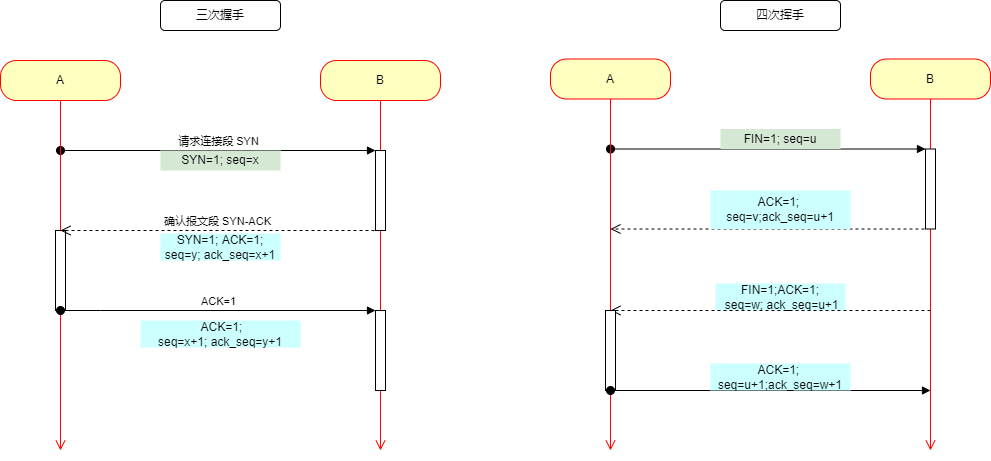
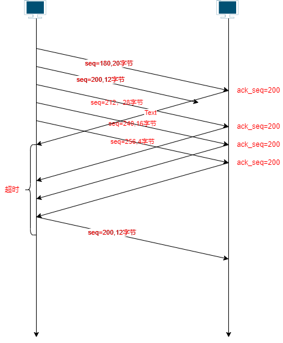

# 传输层

传输层为网络应用`进程之间`的通信提供了`端到端`的`报文`传输服务。位于应用层和网络层之间，向上为各种网络应用提供端到端的报文传输服务，向下使用网络层的提供的分组传输服务。

重点：

传输层提供的服务、可靠数据传输基本原理、停-等协议、滑动窗口协议、UDP、TCP

信道利用率的计算

应用层的`PDU`称为数据报文；传输层的PDU称为数据段； 网络层的PDU称为数据包；网络接口层得PDU称为帧

# 传输层的基本服务

## 传输层功能

传输层的核心任务是为应用进程之间提供端到端的`逻辑通信`服务。

传输层主要实现功能

1. 传输层寻址
2. 对应用层报文进行分段和重组
3. 对报文进行差错检测
4. 实现进程间的端到端可靠数据传输控制
5. 面向应用层实现复用与分解
6. 实现端到端的流量控制
7. 拥塞控制等

通常大部分传输层只实现其中一部分功能。

基于传输层提供的`逻辑通信`，运行在不同主机上的进程好像直接相连，彼此之间直接通信，直接交换应用层报文，但实际上主机可能相距遥远，它们之间通过很多路由器及多种不同类型的链路相连。

作为向上层应用提供端到端通信服务的传输层协议，只需要在端系统中实现，在路由器等网络设备中理论上无效实现。

### 端系统运行传输层协议

- 发送方
    - 将应用递交的报文切分并封装成一个或多个传输层数据包，并向下传给网络层
- 接收方
    - 将接收到的传输层数据包组装成应用报文并向上传递给应用层

### 传输层VS网络层

- 网络层：提供主机之间的逻辑通信机制
- 传输层：提供应用进程之间的逻辑通信机制
    - 位于网络层之上
    - 依赖于网络层服务
    - 对网络层服务进行（可能的）增强

**复用与分解**

一台主机可能同时有多个应用与其他多个应用进行通信，传输层必须确保应用进程之间的通信不会交叉交付。

### Internet传输层协议

TCP

- 可靠的、按序交付服务
- 拥塞控制
- 流量控制
- 连接建立（面向连接）

UDP

- 不可靠的交付服务
- 基于尽力而为的网络层，没有做（可靠性方面的）扩展

两种服务都不保证延迟和带宽

## 传输层寻址与端口

为了使运行在不同操作系统中的网络应用进程能够互相通信、就必须使用统一的方法对网络中的应用进程进行标识，而这种方法必须与特定的操作系统无关。

TCP/IP 体系结构网络的解决办法是在传输层使用`协议端口号`(protocol port number)，通常简称为端口port，在全网范围内使用`IP地址+端口`号唯一标识一个通信端点。

IP决定一个唯一的主机，端口号决定主机上唯一的进程。

这种应用层与传输层之间抽象的`协议端口`是软件端口，与路由器或交换机上的硬件端口是完全不同的概念。

传输层端口号是一个16的整数

- 0~1023为熟知端口号； 
- 1024~49151 为登记端口号，为没有熟知端口号的应用程序（服务器）使用，必须在互联网数字分配结构登记，以防重复。
- 49152~65535 为客户端口号或短暂端口号，留给客户进程或用户开发的非标准服务器暂时使用

## 无连接服务与面向连接服务

`无连接服务`指在数据传输之前无需与对端进行任何信息交换（握手），直接构造传输层报文端并向接收端发送。类似邮政服务，无需与收信人提前交换信息。

`面向连接服务`是指在数据传输之前，需要双方交换一些控制信息，建立逻辑连接，然后再传输数据，数据传输结束后还需要`拆除连接`。

类似电话通信，需要先拨号，建立电话连接，对方接起电话后才可以进行交互通信，结束后需要挂断电话拆除连接。

# 传输层的复用与分解

支持众多应用进程共用同一个传输层协议，并能够将接收到的数据准确交付给不同的应用进程，是传输层需要实现的一项基本功能，称为传输层的多路复用与多路分解，简称为复用与分解，也称复用与分用。

复用与分级在其他层协议也需要实现。

- 复用（发送时）
    - 同一主机上多个应用进程同时利用同一个传输层协议进行网络通信，此时该传输层协议就被多个进程复用

- 分用（接收时）
    - 传输层接收到的报文段中，可能封装了不同应用程序的数据，传输层协议需要将数据交付给正确的应用进程

> 实现复用与分用的关键是传输层协议能够唯一标识一个套接字

一个网络应用进程通过一个或多个套接字，实现与传输层之间的数据传递，因此在接收主机中的传输层实际并没有直接将数据交付给进程，而是将数据交付给了与接收进程相关联的一个中间套接字。每个套接字都有一个唯一标识符，传输层基于这个标识符将数据交付给正确的套接字，进而交付给正确的进程。

为了实现分解，每个传输层报文段必须`源端口号`和`目的端口号`

## 无连接的多路复用与多路分解

Internet传输层提供无连接服务的传输层协议是UDP。为UDP套接字分配端口号的方法有两种：

- 自动分配， 1024~65535
- 手动指定（bind()函数）

UDP的Socket用二元组标识

- 目的IP地址
- 目的端口号

主机收到UDP报文段后，检查段中的目的端口号，根据目的端口号将数据报交付给绑定在该端口的socket，进而交付给对应的应用进程。

使用无连接UPD服务的应用进程，可以接收来自任何一个主机、使用任意一个端口号的应用进程发送的具有相同目的ip和目的端口号的UDP报文段，这些报文段被交付给同一个socket。

## 面向连接的多路复用与多路分解

TCP的Socket是由一个四元组来唯一标识的

- 源IP地址
- 源端口号
- 目的IP地址
- 目的端口号

TCP服务器可以同时支持多个TCP套接字， 每一个套接字与一个进程（或线程）相关联， 并由一个四元组来标识每个套接字。

> 源IP地址、目的IP地址是封装TCP报文段的IP数据报的首部字段

# 停-等协议与滑动窗口协议

很多网络应用都希望传输层能够提供可靠数据传输服务，因此大部分网络在传输层都会设计提供可靠数据传输服务的传输层协议来满足可靠数据传输的需求。

TCP就是提供可靠数据传输的协议，但是TCP发送的报文段都是交给IP传送的，而IP只提供“尽力 best effort”服务， 也就是不可靠数据报传输服务。所以TCP需要采取适当的措施来实现在不可靠的网络层基础上进行可靠的数据传输服务。

## 可靠数据传输基本原理

**理想信道**

理想传输信道是不产生差错并提供按序交付的物理或逻辑信道。实际中大部分信道都是不可靠的。

底层信道完全可靠

- 不会发生错误 bit error
- 不会丢弃分组

### 不可靠传输信道的不可靠表现在

1. 传输过程中可能发生`比特差错`，即比特跳变， 1变为0， 0变为1的现象
2. 传输过程中可能出现`乱序`， 即先发的数据包到
3. 传输过程中可能出现`数据丢失`，

### 实现可靠数据传输的主要措施

1. 差错检测
    1. 利用**差错编码**（`校验和`）实现数据包传输过程中的比特差错检测。
    2. 差错编码是在数据上附件冗余信息，建立数据（位）之间的逻辑关系
    3. 数据发送方对需要差错检测的数据进行差错编码
    4. 数据接收方依据相同的差错编码规则或算法，检验是否发生比特差错
2. 确认
    1. 接收方向发送方反馈接收状态。ACK肯定确认， NAK否定确认
3. 重传
    1. 发送方 重新发送接收方没有正确接收的数据。 NAK时重传
4. 序号
    1. 为数据包编号，确保数据按序提交。即使接收方没有按序接收，也可以根据数据包编号纠正顺序。
    2. 同时编号可以避免同一数据包重复提交问题
5. 计时器
    1. 解决数据丢失问题
    2. 在超时后没有收到接收方的确认，就主动重发

## 停-等协议

基于这种重传机制的可靠数据传输协议称为：**自动重传协议**（Automatic RepeatQuest， ARQ）

### 停等协议的主要特点

> 每发送一个报文段后就停下来等待接收方确认。
>
> 简单、所需缓冲存储空间小

### 停等协议的工作过程

> 1. 发送方发送经过差错编码和编号的报文段，等待接收方确认
> 2. 接收方如果正确接收到报文段（差错检测无误且序号正确）则接收报文段，并向发送发发送ACK
>     1. 如果没有正确接收则丢弃报文段，并向发送方发送NAK
> 3. 发送方如果接收到ACK，则继续发送后续报文段
> 4. 发送方如果接收到NAK，则重发失败的报文段

### 停等协议需要考虑的细节

1. 关于差错检测
    1. ACK、NAK数据包也可能发生比特差错，同样需要差错检测

2. 关于序号
    1. 停等协议只需要1位即可，因为在停等协议中只需要区分报文是新发还是重发即可

3. 关于ACK和NAK
    1.  利用ACK代替NAK， 降低协议复杂度。
    2. 在ACK数据包中带上所确认的`报文段序号`， 如果错误就发送上一个数据包的ACK即发送方接收到重复的ACK就表示当前数据包发送失败

4. 关于ACK和NAK差错
    1. 发送方接收到有差错的ACK或NAK时无法确定接收方是否正确接收数据，发送方采取“有错推断”而重传报文段

 

### 停等协议的性能问题 \*\*

停等协议能够正确工作，是一个功能正确的协议，但是性能很差。

> 停等协议的主要性能问题在于它的停-等机制降低了信道利用率。
>
> **信道利用率**定义为：发送方实际利用信道发送数据的时间与总时间之比。

---

$t_{Seg}$ 发送方发送报文段的时间，即报文段的传输时延(发送时延)（数据的第一位到最后一位发送完的时间）

$t_{ACK}$ 接收方发送ACK需要的时间

$RTT$ 往返时间
$$
\begin{align}
U_{sneder} & = \frac{t_{Seg}}{t_{Seg}+RTT+T_{ACK}}  
\end{align}
$$

如果假设ACK分组很小，可以忽略发送时间，则发送方发送**一个报文段需要的传输时延**为：
$$
\begin{align}
t_{Seg} & = \frac{L \text{(Packet length in bits)}}{R\text{ (transmission rate, bps)}}
\end{align}
$$
停等协议的**信道利用率**为：发送数据的时间/往返时间+发送数据的时间
$$
\begin{align}
U_{sneder}  & = \frac{传输时延}{往返时间+发送数据的时间} \\
& = \frac{t_{Seg}}{t_{Seg}+RTT}  \\
& = \frac{L/R}{RTT+L/R}
\end{align}
$$

---

**示例**：1Gbps 的网络， 15ms端到端传播延迟(RTT=15*2=30ms)， 1kb分组

L=1KB = 1024*8bit=8kbit

R=1Gbps = $10^9$b/s

传输时延：
$$
\begin{align*}
T_{transmit} & =\frac{L \text{(Packet length in bits)}}{R\text{ (transmission rate, bps)}} \\
& =\frac{8kb/pkt}{10^9/sec}\\
& =0.000008192s\\
& =8 微秒 \\

U_{sender} &= \frac{L/R}{RTT+L/R} \\
&=\frac{0.008}{30+0.008} \\
&=0.00027

\end{align*}
$$

在1Gbps链路上每30毫秒才发送一个分组（1KB），1秒才发送33KB数据

==网络协议限制了物理资源的利用==

---

## 滑动窗口协议

解决停等协议的这种性能问题的一种简单方法是：不使用停等协议的停止-等待运行方式，允许发送方在没有收到确认之间连续发送分组。

在这种可靠数据传输协议中，从发送方向接收方发送的系列分组可以看作为填充到一条流水线（或一条管道）中，所以称这种协议为`流水线协议`或`管道协议`

相对于停等协议，**流水线协议**在实现可靠数据传输时需要做出如下改进：

1. 必须增加分组序号范围
2. 协议的发送和（或）接收方必须缓存多个分组（更大的存储空间）

**滑动窗口协议**

1. 将可靠数据传输的工作过程抽象到分组序号空间，发送方确保按序发送，接收方确保按序提交
2. 发送方和接收方分别维护一个窗口，发送窗口$W_s$、接收窗口$W_r$
3. 发送窗口的大小表示发送方可以发送未确认分组的最大数量， 发送窗口的最小序号称为**基序号/发送窗口下沿**
4. 接收窗口大小表示接收方可以接收并缓存的正确达到分组的最大数量
4. 发送窗口内序号有三种状态：已用未确认序号、已用已确认序号，可用但尚未使用序号
4. 接收窗口内序号有两种状态：期望接收但未接收、已接受序号（暂存在缓存中）

具有代表性的滑动窗口协议：回退N步协议（Go-Back-N, GBN）、选择重传协议(Selective-Repeat, SR)

### 1、GBN	

> 1. 发送端缓存能力较高，可以在未得到确认的情况下连续发送多个分组，因此GBN的发送窗口$W_s\geq1$
> 2. 接收端的缓存能力很低，只能接收1个按序到达的分组，不能缓存未按序到达的分组，通常称GBN接收端无缓存能力，$W_r=1$

GBN `发送方`必须对三类事件进行响应

1. 上层调用， 接收到上层调用时先检查发送窗口是否已满
    1. 窗口未满则使用下一个可用序号发送新的分组，更新下一个可用序号
    2. 窗口已满，暂不响应上层调用
2. 收到1个ACKn
    1. GBN采用`累计确认`方式，接收到ACKn表示接受方已接收所有小于等于n的分组
    2. 窗口可以滑动到基序号为 n+1的位置
    3. 发送方可能重复收到ACKn确认
3. 计时器超时
    1. GBN只使用一个计时器，且对当前发送窗口的基序号指向的分组计时
    2. 如果超时则重传发送窗口中所有的已发送未确认分组
    3. 如果滑动后仍然已发送未确认分组，则重启计时器，否则定时器终止

GBN 接收方

1. 只接收当前接收窗口中基序号对应的分组
2. 如果正确接收到接收窗口中基序号n对应的分组，则发送ACKn，向上交付分组并滑动窗口到n+1
3. 其他情况则直接丢弃接收到的分组，发送ACKn-1

#### 分组序号长度

分组序号通常是一个分组首部的一个固定长度的字段，因此分组序号长度取决于序号字段长度

1. 如果分组序号字段长度为b位，则分组范围是[0~$2^k-1$]

#### GBN特点

1. GBN在差错率较低的情况下信道利用率可以得到很大提高，差错率较高时会导致大量重传
2. GBN适合于低误码率、低丢包率、带宽高时延积信道，对接收方缓存能力要求低

 

### 2、SR

选择重传，即通过让发送方仅重传那些未被接收方确认（丢失或出错）的分组，避免不必要的重传

SR 解决了GBN中不必要的分组重传。

> 1. 对每一个分组进行单独确认
> 2. 增加了接收方的缓存能力， 缓存正确接收但失序的分组，等确认分组到达后一并向上层按序提交
> 3. 发送方为每个分组单独设置定时器， 只重传没有接收到ACK的分组

SR`发送方`主要响应以下三个事件

1. 上层调用，请求发送数据。 检查下一个可用序号是否在当前窗口，若在则进行编号发送，否则缓存分组或返回给上层以便后续传输
2. 计时器超时，SR对每一个已发送分组进行计时，当某个已发送未确认分组超时则重传该分组
3. 收到ACNn， SR收到ACKn时需要对确认的序号进行判断
    1. n在当前发送窗口内则将该序号标记为已确认
    2. 若n等于基序号，则窗口向右滑动到具有最小序号的未被确认分组序号处
    3. 如果窗口滑动后有未发送分组待发送，则利用下一个可用序号进行编号分组并发送
    4. 其他情况发送方可以不响应

SR`接收方`主要响应以下3中情况

1. 正确接收到序号在接收窗口范围内的分组 PKTn
    1. n 在接收窗口范围内则发送ACKn
    2. 如果n不等于基序号，则缓存该分组
    3. 如果n等于基序号，则该分组及原来收到的，序号与n连续的分组一并向上提交，窗口滑动到当前未接的收最小序号
2. 正确接收到序号在接收窗口左侧的分组PKTn
    1. 即分组序号小于基序号，接收方丢弃分组，发送ACKn
    2. 之所以要确认已确认的分组，是为了避免极端情况下协议处于"死锁"状态。例如ACKn丢失
3. 其他情况，接收方可以直接丢弃分组，不做响应

### 3、信道利用率

假设报文段的序号采用k位二进制串进行编号，则其编号空间为：$0 \backsim 2^k-1$ 共$2^k$个编号。

滑动窗口协议的窗口大小与序列号空间需要满足以下约束：

1. $W_s + W_r \leq 2^k$

2. 特殊情况下， 对于GBN协议 $W_r=1$, 则 $W_s\leq2^k-1$

3. 对于典型的$W_s=W_r=W$的SR协议，有：$W_s \leq 2^{k-1}$, 发送方与接收方窗口的大小一致，各占一半

4. 停等协议，GBN，SR协议信道利用率可以统一表示为
    $$
    U_{sender}=\frac{W_s\times{t_{Seg}}}{t_{Seg}+RTT+t_{ACK}}
    $$
    $W_s=1$ 就是停等协议

    对于滑动窗口协议，信道利用率与发送窗口的大小有关，$W_s$足够大时，可以使$W_s\times{t_{Seg}}$大于$t_{Seg}+RTT+t_{ACK}$成立， 此时利用率为100%

    

# 用户数据报协议 UDP 

User Datagram Protocol

>Internet 传输层协议
>
>提供无连接的、不可靠的、数据报尽力传输服务
>
>轻量级传输层协议，只提供最基本的传输服务。
>
>UDP不保证将数据送达目的接收进程，不保证按序送达且没有拥塞控制。 

**最简单的传输层协议也必须实现复用/分解以实现在网络层与正确的进程之间传递数据****

DNS 就采用UDP协议

**UDP的优势**

> 1. 应用程序更容易控制发送什么数据以及何时发送
>     1. 应用进程将数据给UDP，UDP就立即发送， 而TCP存在拥塞控制
>     2. TCP 为了实现可靠传输有重传机制，直到接收端接收到报文，有更高的事件延迟
> 2. 无需建立连接
>     1. TCP需要三次握手建立连接，UDP则直接传送数据
> 3. 无连接状态
>     1. TCP需要在端系统中维护连接状态，包括接收和发送缓冲、拥塞控制参数及序号与确认号的参数等
>     2. UDP则无需维护连接状态，系统开销更小
> 4. 首部开销小
>     1. TCP每个报文段都至少有20字节的首部开销
>     2. UDP仅有8字节的开销
>
> 
>
> 应用层使用UDP时可以通过在应用层中设计可靠传输机制实现可靠数据传输

## UDP数据报结构

> 1. 应用层数据占用UDP报文段的数据字段
> 2. UDP只包含4个首部：源端口号，目的端口号，长度，校验和
> 3. 源端口号，目的端口号实现复用与分解

## UDP校验和

UDP的校验和用于检测报文段从源到目的地传送过程中，其数据是否发生了改变（位跳变）

**发送方**

1. 对所参与计算的内容按16位对齐求和（将段的内容视为16位整数）
2. 计算校验和： 计算所有整数的和，求和过程中任何溢出都被回卷（进位与和的最低为再加），将得到的和取反码得到校验和
3. 发送方将校验和填入校验和字段（UDP生成校验和时校验和字段全部取0）

**接收方**

1. 计算收到段的校验和
2. 将校验和与报文段中的校验和比对
    1. 相等：没有检测出错误（但可能存在错误）
    2. 不相等：检测出错误

参与检验和计算的内容包括三部分：UDP伪首部、UDP首部、应用数据

**伪首部**：

UDP 长度参与计算两次

协议号，UDP对应的值是17

**校验和示例**

# 传输控制协议 TCP

TCP 提供面向连接的、可靠的、有序的**字节流**传输服务。

TCP采取了多种手段确保数据可靠传输：差错检测、重传、累计确认、定时器、序号和确认序号等

TCP采用流水线机制，通过拥塞控制和流量控制机制设置窗口尺寸

TCP连接的两端都设有发送缓存和接收缓存临时存放双向通信的数据

TCP提供全双工通信服务，允许通信双方在任何时候都能发送数据和接收数据

TCP面向连接

- 通信双方在发送数据前必须建立连接，传输完毕后必须释放连接
- 连接状态只在连接的两端维护，在沿途结点中并不维护状态
- TCP连接包括：两台主机上的缓存、连接状态变量、Socket等

TCP提供流量控制机制

MSS指报文段中封装应用层数据的最大长度，不包括TCP首部

## TCP报文段结构

>TCP报文段由一个首部字段和一个数据字段组成。
>
>源端口号和目的端口号用于多路复用/多路分用
>
>序号：TCP的序号是对每个应用层数据的每个字节进行编号， 每个报文段的序号是该段中应用层数据的第一个**字节**的序号
>
>确认序号：期望从对方接收数据的字节序号
>
>首部长度：指出TCP首部的长度，以4字节为一个单位， 5表示有20字节首部。首部长度最大值为$2^4-1$，即15，表示TCP最大首部有60字节。所以TCP选项字段最多40字节（20字节固定首部）
>
>URG、ACK、PSH、PST、SYN、FIN 各占一位。
>
>URG=1 表明紧急指针有效，通知系统此报文段含有紧急数据，需要尽快传送
>
>ACK=1 表示确认序号字段有效， ACK=0 表示确认序号字段无效
>
>PSH=1 时会尽快将此报文段交付给接收应用，不等待缓存填满后交付 push
>
>RST=1 表明TCP出现严重差错，必须释放连接后重建连接 
>
>SYN=1表示该TCP报文段是一个重新建立连接请求控制段或同意建立新连接的确认段（ACK=1）
>
>FIN=1 表明TCP报文段的发送端数据已发送完毕，请求释放TCP
>
>接收窗口：用于向对方通知接收窗口大小（字节），是本端接收对方数据的缓存剩余空间，用于实现**流量控制**
>
>校验和：类型UDP的校验和， 包括TCP伪首部、TCP首部、应用层数据3部分

 

**序列号**

- 指的是segment的第一个字节的编号，而不是segment的编号
- 建立TCP连接时，双方随机选择序列号

**ACKs**

- 希望接收到的下一个字节的序列号
- 累计确认：该序号之前的所有字节均已被正确接收到

**Q:接收方如何处理乱序到达的Segment**

- A：TCP规范中没有规定， 由TCP实现者做出决策

## TCP连接管理

TCP连接管理包括**连接建立**于**连接拆除**。

主机A的TCP会通过以下过程于主机B的TCP建立一条TCP连接

1. 主机A的TCP向主机B发出`连接请求段`（第一次握手）
    - 该报文段中不包含应用层数据
    - 首部中SYN=1， 并选择初始序号seq=$x$表明传输数据时第一个数据字节的序号是$x$
    - 该报文段称为 `SYN段`
    - SYN段虽然不会发送数据，但是会消耗一个序号，即发送了1字节的空数据
    - SYN段被封装到IP数据报中发送给主机B
2. 一旦SYN报文段的IP数据报到达主机B，SYN段数据从IP数据报中提取出来。主机B的TCP收到请求段后，如同意则发回`确认报文段`（`SYN-ACK段`）
    - SYNACK段不包含应用层数据
    - SYNACK段首部包含三个重要信息：确认段中SYN=1， ACK=1， 确认序号 ack_seq=$x+1$ ，主机B自己选择初始序号seq=$y$
    - SYNACK 不包含应用层数据，但是会消耗一个序号，即y
3. 主机A收到SYNACK后， 给该连接分配缓存和变量，并向主机B发送确认报文
    - ACK=1， SYN=0（连接已建立）
    - seq=$x+1$, ack_seq=$y+1$
    - 第三次握手的ACK报文段可以携带从主机A到主机B的应用层数据

TCP拆除连接采用四次挥手的对称断连机制：

1. 当客户向服务器发送完最后一个数据段后，可以发送一个FIN段（FIN=1, seq=u）请求断开客户到服务器的连接（客户端能收不能发）,不能携带应用层数据
2. 服务器收到FIN段后，向客户发送ACK段（ACK=1， seq=v, ack_seq=u+1）(服务器能发，不能收)， 客户端收到ACK后，能收服务器数据。
3. 服务器发送完最后一个数据段后，向客户发送FIN段（FIN=1, ACK=1,seq=w, ack_seq=u+1）后，服务器可以接收数据
4. 客户端收到服务器FIN段后，向服务器发送ACK段（ACK=1,seq=u+1, ack_seq=w+1）

## TCP可靠数据传输

TCP可靠数据传输实现机制包括：差错检测，确认，序号，重传，计时器等。

TCP可靠数据传输基于滑动窗口协议， 但是发送窗口大小动态变化，发送窗口大小取决于流量控制的接收端通告的窗口大小以及实现拥塞控制的拥塞窗口大小。

任一时刻，发送窗口的大小都取这两个窗口的最小值

TCP实现可靠数据传输的工作机制

1. 应用数据被分割成TCP认为最适合发送的数据块，封装成TCP段传递给IP
2. 发送端发送TCP报文后会启动一个计时器，等待接收端确认接收这个报文，如果超时未收到确认则重传该段。接收端收到报文段后会发送一个确认段
3. TCP报文中设有校验和字段，用于检测报文在传输过程中是否发生差错。
    1. 如果通过校验检测发送有差错，TCP丢弃该报文段，不确认此段
    2. 将已接收的应用层数据最后一个字节的序号+1作为确认序号发送确认段
4. 乱序，由于TCP将报文封装到IP中进行传输而造成乱序。如果有必要TCP根据序号对接收到的报文进行排序，将接收到的数据以正确顺序交付给应用层
5. 重复报文，TCP对于可能重复接收的报文，根据序号将重复的报文丢弃
6. 流量控制，TCP接收端只允许发送端发送接收端所能接纳的数据，防止接收端缓冲区溢出

TCP发送方有三个与发送和重传有关的事件

- 从上层应用接收数据
- 计时器超时
- 收到ACK, 更新基序号为ack_seq, 滑动窗口到ack_seq, ack_seq-1是已接收数据

### 定时器超时时间设置

1. 如何设置超时时间？

    1. 大于RTT， 但是RTT是动态变化的
    2. 超时过短会导致不必要的重传
    3. 超时过长则对段丢失反应慢，

2. 采用报文段的RTT采样计算RTT

    1. 从某报文段发出到接收到确认的时间间隔来估计RTT大小

    2. TCP仅在某一时刻做一次SampleRTT测量，而不是为每一个报文测量一个RTT

    3. TCP不对重传的报文段测量RTT， 只对传输一次的报文段测量SampleRTT

    4. 测量多个SampleRTT，求平均值形成RTT估计值（**指数加权移动平均**）
        $$
        EstimatedRTT=(1-\alpha)\cdot{EstimatedRTT}+\alpha\cdot{SampleRTT}
        $$

    5. $\alpha$为指数加权系数， 典型值为0.125，越新的RTT采样所占权重越大

3. `RTT偏差` 

    1. RTT变化小说明网络稳定， RTT变化大表示网络不稳定

    2. 超时时间设置为 EstimatedRTT加一个较大的**安全边界值**
        $$
        DevRTT=(1-\beta)\cdot{DevRTT}+\beta\cdot{\mid{SampleRtt-EstimatedRTT\mid{}}}
        $$

    3. $\beta$ 推荐值为0.25

4. `超时时间`设置为：$TimeoutInterval=EstimatedRTT+4\times{DevRTT}$

### 接收方生成ACK的策略

1. 具有`所期望序号的报文段`（基序号指向的段）按序到达，期望序号之前的段都已被确认。接收方延迟发送ACK，等待最多500ms，若无下一个按序到达报文段发送ack确认此段
2. 具有`所期望序号的报文段`按序到达，且有另一个报文段在等待ACK传输，接收方立即发送`单个累积`ACK，确认两个段。
3. 拥有序号大于期望序号的失序报文到达，TCP立即发送重复ACK，对当前接收窗口的基序号进行确认。
4. 接收到一个报文，部分或全部填充接收数据间隔。
    1. 序号等于接收窗口的基序号，发送累积ACK，其确认序号是期望接收但未接收到字节序号的最小值
    2. 序号大于下一个期望的、按序到达的报文段，接收方检测到缺失，对已接收的到的最后一个按序字节数据进行重复确认

### 快速重传机制

如果发送方多次重复收到对相同序号的3次ACK，相当于隐式的否定确认，说明重复确认的报文段已丢失。所以一旦收到3次重复ACK，即便没有超时也会立即重发该段。重复三次是第4次收到ACK时。

快速重传的基本思想：

接收端每收到一个失序到达的报文段就立即发送重复确认，以便更早地通知发送端有丢包情况发生。

## TCP流量控制

**流量控制的目的**

协调发送方与接收方的数据发送与接收速度，避免数据到达速度超出接收方的接收、缓存或处理能力导致数据在接收方被丢弃。

**基本原理**

可以采用停等协议或滑动窗口协议来实现。 基于滑动窗口协议时，接收窗口的大小反映了接收方接收和处理数据的能力。窗口越大处理能力越高。

**TCP流量控制**

> TCP连接建立时，收发双方都分配了固定大小的缓冲空间。TCP接收端只允许对方发送接收缓冲区能够容纳的数据
>
> TCP首部的接收窗口字段占16位，用于向对方通告接收窗口大小(字节)，值是本端接收缓存的剩余空间
>
> TCP接收到正确的、按序到达的字节流后，将其放入缓存。相关应用会从中读取数据（不一定及时读取）

## TCP拥塞控制

拥塞是指太多主机以太快的速度向网络中发送太多的数据，超出了网络处理能力。

直接后果：

1. 数据分组通过网络的时延显著增加
2. 由于队列满导致分组被大量丢弃

`拥塞控制`就是通过合理调度、规范、调整向网络中发送数据的主机数量、发送速率或数据量，以避免拥塞或尽快消除已发生的拥塞。

拥塞控制策略有两类：`拥塞预防`、`拥塞消除`

>TCP通过是否发生报文段超时（或3次重复确认）来推断网络是否发生拥塞。
>
>TCP网络拥塞采用窗口机制，通过调节窗口大小实现对`发送数据速率`的调整。
>
>
>
>窗口调整的基本策略：
>
>网络未发生拥塞时逐渐“加性”增加窗口大小， 发生拥塞时“乘性”快速减小窗口大小。Additive Increase， Multiplicative Decrease， AIMD
>
>
>
>TCP拥塞控制窗口的调节分为两个阶段
>
>1. 慢启动阶段：窗口从一个MSS快速增长达到某个阈值后转为拥塞避免阶段
>2. 拥塞避免阶段：窗口增长放慢
>
>
>
>TCP进行拥塞控制的算法有4种：慢启动，拥塞避免，快速重传，快速恢复
>
>**慢启动**
>
>1. 设置一个拥塞控制窗口状态变量： cwnd
>2. 只要没有发生拥塞就可以再增大拥塞窗口， 只要出现或可能出现拥塞则必须减小窗口
>3. 如何知道拥塞？超时或重复ACK确认
>4. 思路
>   - 当开始发送数据时由于不知道网络负荷情况，需要先探测（窗口逐渐增加）
>   - 开始发送报文时， cwnd=1
>   - 每接收到一个对新报文段的ACK时就增加最多一个SMSS， 增加的cwnd=min(N,SMSS), N是刚被确认报文段所被确认的字节数
>   - 每收到一个ACK就加1， 即成倍增长
>   - 慢启动时的阈值：一般默认16，当cwnd>阈值时采用拥塞避免算法， cwnd<阈值采用慢启动算法
>
>
>
>**拥塞避免算法**
>
>1. 每经过一个RTT， cwnd就加1， 而不是成倍增长。 一个RTT不是一个ACK
>2. 加性增长
>3. 当出现拥塞时：设置阈值=cwnd/2(窗口大小的一般); cwnd=1
>4. 减小窗口后重新从慢启动开始
>
>**快速重传、快速恢复**
>
>1. 当重复收到一个ACK3次时，说明报文丢失（未必发生拥塞）
>2. 此时不用等待超时，可立即重传， 且设置：阈值=cwnd=cwnd/2；阈值设置为原来cwnd的一半（快速恢复）
>3. 此时切换为拥塞避免算法
>4. 快速恢复不再从慢启动开始而是从一个新的阈值开始
>
>
>
>

### TCP网络拥塞控制流程

1. 实现可靠数据传输的主要措施有哪些？这些措施主要用于解决哪些问题
2. UDP、TCP分别如何实现复用与分解
3. 画出TCP报文结构，简要说明各字段的主要作用
4. TCP为何采用3次握手来建立连接？若采用二次握手可以吗？为什么
5. 说明TCP建立连接与断开连接的过程，给出主要状态迁移
6. TCP如何保证可靠数据传输时
7. 简述GBN和SR协议的工作过程
8. 说明TCP滑动窗口协议，对比TCP滑动窗口与GBN的异同
9. TCP如何实现拥塞控制
10. 
