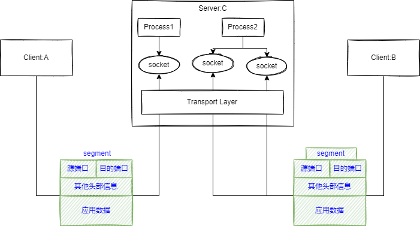
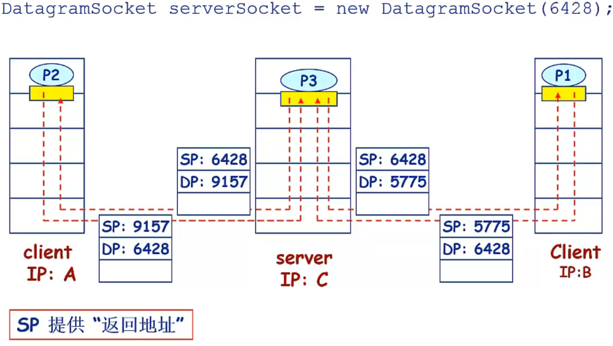
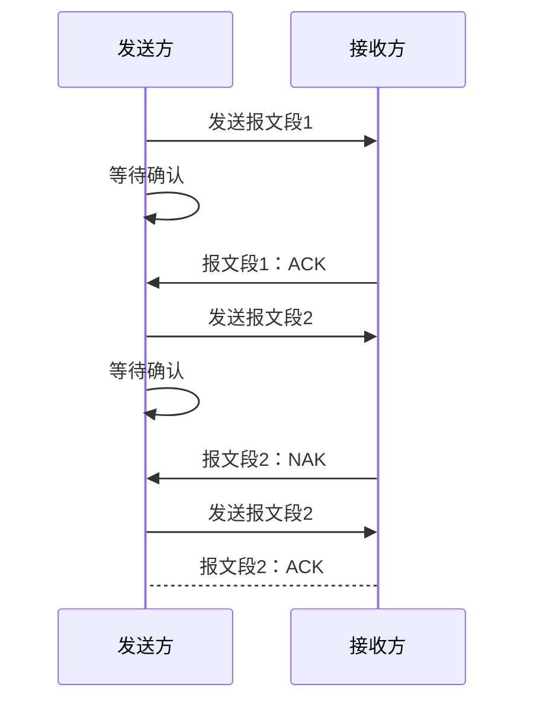
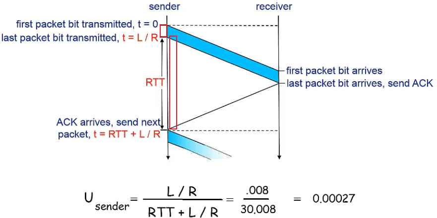
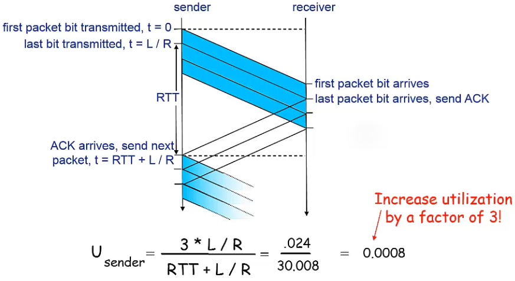
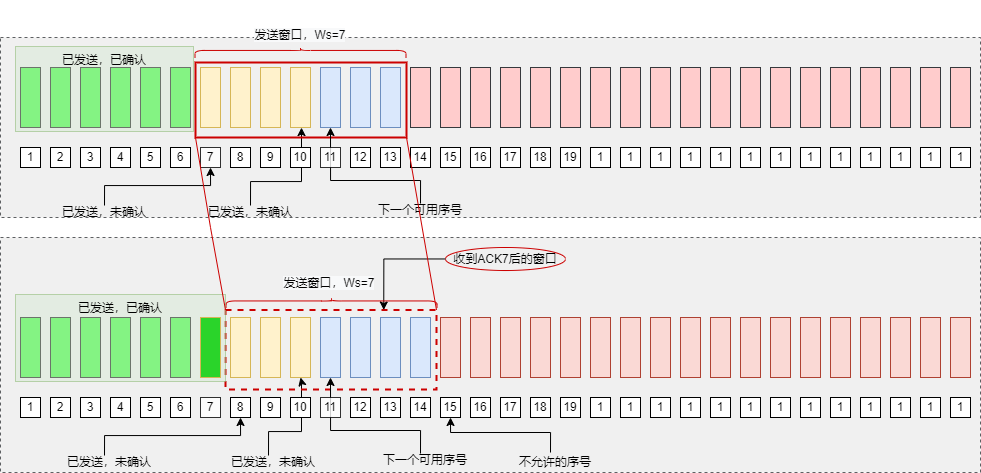

# 传输层

传输层为网络应用`进程之间`的通信提供了`端到端`的`报文`传输服务。位于应用层和网络层之间，向上为各种网络应用提供端到端的报文传输服务，向下使用网络层的提供的分组传输服务。

重点：

传输层提供的服务、可靠数据传输基本原理、停-等协议、滑动窗口协议、UDP、TCP

信道利用率的计算

# 传输层的基本服务

## 传输层功能

传输层的核心任务是为应用进程之间提供端到端的`逻辑通信`服务。

传输层主要实现功能

1. 传输层寻址
2. 对应用层报文进行分段和重组
3. 对报文进行差错检测
4. 实现进程间的端到端可靠数据传输控制
5. 面向应用层实现复用与分解
6. 实现端到端的流量控制
7. 拥塞控制等

通常大部分传输层只实现其中一部分功能。

基于传输层提供的`逻辑通信`，运行在不同主机上的进程好像直接相连，彼此之间直接通信，直接交换应用层报文，但实际上主机可能相距遥远，它们之间通过很多路由器及多种不同类型的链路相连。

作为向上层应用提供端到端通信服务的传输层协议，只需要在端系统中实现，在路由器等网络设备中理论上无效实现。

### 端系统运行传输层协议

- 发送方
    - 将应用递交的报文切分并封装成一个或多个传输层数据包，并向下传给网络层
- 接收方
    - 将接收到的传输层数据包组装成应用报文并向上传递给应用层

### 传输层VS网络层

- 网络层：提供主机之间的逻辑通信机制
- 传输层：提供应用进程之间的逻辑通信机制
    - 位于网络层之上
    - 依赖于网络层服务
    - 对网络层服务进行（可能的）增强

**复用与分解**

一台主机可能同时有多个应用与其他多个应用进行通信，传输层必须确保应用进程之间的通信不会交叉交付。

### Internet传输层协议

TCP

- 可靠的、按序交付服务
- 拥塞控制
- 流量控制
- 连接建立（面向连接）

UDP

- 不可靠的交付服务
- 基于尽力而为的网络层，没有做（可靠性方面的）扩展

两种服务都不保证延迟和带宽

## 传输层寻址与端口

为了使运行在不同操作系统中的网络应用进程能够互相通信、就必须使用统一的方法对网络中的应用进程进行标识，而这种方法必须与特定的操作系统无关。

TCP/IP 体系结构网络的解决办法是在传输层使用`协议端口号`(protocol port number)，通常简称为端口port，在全网范围内使用`IP地址+端口`号唯一标识一个通信端点。

IP决定一个唯一的主机，端口号决定主机上唯一的进程。

这种应用层与传输层之间抽象的`协议端口`是软件端口，与路由器或交换机上的硬件端口是完全不同的概念。

传输层端口号是一个16的整数

- 0~1023为熟知端口号； 
- 1024~49151 为登记端口号，为没有熟知端口号的应用程序（服务器）使用，必须在互联网数字分配结构登记，以防重复。
- 49152~65535 为客户端口号或短暂端口号，留给客户进程或用户开发的非标准服务器暂时使用

## 无连接服务与面向连接服务

`无连接服务`指在数据传输之前无需与对端进行任何信息交换（握手），直接构造传输层报文端并向接收端发送。类似邮政服务，无需与收信人提前交换信息。

`面向连接服务`是指在数据传输之前，需要双方交换一些控制信息，建立逻辑连接，然后再传输数据，数据传输结束后还需要`拆除连接`。

类似电话通信，需要先拨号，建立电话连接，对方接起电话后才可以进行交互通信，结束后需要挂断电话拆除连接。

# 传输层的复用与分解

支持众多应用进程共用同一个传输层协议，并能够将接收到的数据准确交付给不同的应用进程，是传输层需要实现的一项基本功能，称为传输层的多路复用与多路分解，简称为复用与分解，也称复用与分用。

复用与分级在其他层协议也需要实现。

- 复用（发送时）
    - 同一主机上多个应用进程同时利用同一个传输层协议进行网络通信，此时该传输层协议就被多个进程复用

- 分用（接收时）
    - 传输层接收到的报文段中，可能封装了不同应用程序的数数据，传输层协议需要将数据交付给正确的应用进程

> 实现复用与分用的关键是传输层协议能够唯一标识一个套接字

一个网络应用进程通过一个或多个套接字，实现与传输层之间的数据传递，因此在接收主机中的传输层实际并没有直接将数据交付给进程，而是将数据交付给了与接收进程相关联的一个中间套接字。每个套接字都有一个唯一标识符，传输层基于这个标识符将数据交付给正确的套接字，进而交付给正确的进程。

为了实现分解，每个传输层报文段必须`源端口号`和`目的端口号`

## 无连接的多路复用与多路分解

Internet传输层提供无连接服务的传输层协议是UDP。为UDP套接字分配端口号的方法有两种：

- 自动分配， 1024~65535
- 手动指定（bind()函数）

UDP的Socket用二元组标识

- 目的IP地址
- 目的端口号

主机收到UDP报文段后，检查段中的目的端口号，根据目的端口号将数据报交付给绑定在该端口的socket，进而交付给对应的应用进程。

使用无连接UPD服务的应用进程，可以接收来自任何一个主机、使用任意一个端口号的应用进程发送的具有相同目的ip和目的端口号的UDP报文段，这些报文段被交付给同一个socket。

## 面向链的多路复用与多路分解

TCP的Socket是由一个四元组来唯一标识的

- 源IP地址
- 源端口号
- 目的IP地址
- 目的端口号

TCP服务器可以同时支持多个TCP套接字， 每一个套接字与一个进程（或线程）相关联， 并由一个四元组来标识每个套接字。

> 源IP地址、目的IP地址是封装TCP报文段的IP数据报的首部字段

# 停-等协议与滑动窗口协议

很多网络应用都希望传输层能够提供可靠数据传输服务，因此大部分网络都在传输层都会设计提供可靠数据传输服务的传输层协议来满足可靠数据传输的需求。

TCP就是提供可靠数据传输的协议，但是TCP发送的报文段都是交给IP传送的，而IP只提供“尽力 best effort”服务， 也就是不可靠数据报传输服务。所以TCP需要采取适当的措施来实现在不可靠的网络层基础上进行可靠的数据传输服务。

## 可靠数据传输基本原理

**理想信道**

理想传输信道是不产生差错并提供按序交付的物理或逻辑信道。实际中大部分信道都是不可靠的。

底层信道完全可靠

- 不会发送错误 bit error
- 不会丢弃分组

### 不可靠传输信道的不可靠表现在

1. 传输过程中可能发生`比特差错`，即比特跳变， 1变为0， 0变为1的现象
2. 传输过程中可能出现`乱序`， 即先发的数据包到
3. 传输过程中可能出现`数据丢失`，

### 实现可靠数据传输的主要措施

1. 差错检测
    1. 利用**差错编码**（`校验和`）实现数据包传输过程中的比特差错检测。
    2. 差错编码是在数据上附件冗余信息，建立数据（位）之间的逻辑关系
    3. 数据发送方对需要差错检测的数据进行差错编码
    4. 数据接收方依据相同的差错编码规则或算法，检验是否发生比特差错
2. 确认
    1. 接收方向发送方反馈接收状态。ACK肯定确认， NAK否定确认
3. 重传
    1. 发送发重新发送接收方没有正确接收的数据。 NAK时重传
4. 序号
    1. 为数据包编号，确保数据按序提交。即使接收方没有按序接收，也可以根据数据包编号纠正顺序。
    2. 同时编号可以避免同一数据包重复提交问题
5. 计时器
    1. 解决数据丢失问题
    2. 在超时后没有收到接收方的确认，就主动重发

## 停-等协议

基于这种重传机制的可靠数据传输协议称为：**自动重传协议**（Automatic RepeatQuest， ARQ）

### 停等协议的主要特点

> 每发送一个报文段后就停下来等待接收方确认。
>
> 简单、所需缓冲存储空间小

### 停等协议的工作过程

> 1. 发送发发送经过差错编码和编号的报文段，等待接收方确认
> 2. 接收方如果正确接收到报文段（差错检测无误且序号正确）则接收报文段，并向发送发发送ACK
>     1. 如果没有正确接收则丢弃报文段，并向发送方发送NAK
> 3. 发送方如果接收到ACK，则继续发送后续报文段
> 4. 发送发如果接收到NAK，则重发失败的报文段

### 停等协议需要考虑的细节

1. 关于差错检测
    1. ACK、NAK数据包也可能发生比特差错，同样需要差错检测

2. 关于序号
    1. 停等协议只需要1位即可，因为在停等协议中只需要区分报文是新发还是重发即可

3. 关于ACK和NAK
    1.  利用ACK代替NAK， 降低协议复杂度。
    2. 在ACK数据包中带上所确认的`报文段序号`， 如果错误就发送上一个数据包的ACK即发送方接收到重复的ACK就表示当前数据包发送失败

4. 关于ACK和NAK差错
    1. 发送方接收到有差错的ACK或NAK时无法缺点接收方是否正确接收数据，发送方采取“有错推断”而重传报文段

 

### 停等协议的性能问题

停等协议能够正确工作，是一个功能正确的协议，但是性能很差。

> 停等协议的主要性能问题在于它的停-等机制降低了信道利用率。
>
> **信道利用率**定义为：发送方实际利用信道发送数据的时间与总时间之比。

---

$t_{Seg}$ 发送方发送报文段的时间，即报文段的传输时延/发送时延（数据的第一位到最后一位发送完的时间）

$t_{ACK}$ 接收方发送ACK需要的时间

$RTT$ 往返时间
$$
\begin{align}
U_{sneder} & = \frac{t_{Seg}}{t_{Seg}+RTT+T_{ACK}}  
\end{align}
$$

如果假设ACK分组很小，可以忽略发送时间，则发送方发送**一个报文段需要的传输时延**为：
$$
\begin{align}
t_{Seg} & = \frac{L \text{(Packet length in bits)}}{R\text{ (transmission rate, bps)}}
\end{align}
$$
停等协议的**信道利用率**为：发送数据的时间/往返时间+发送数据的时间
$$
\begin{align}
U_{sneder}  & = \frac{传输时延}{往返时间+发送数据的时间} \\
& = \frac{t_{Seg}}{t_{Seg}+RTT}  \\
& = \frac{L/R}{RTT+L/R}
\end{align}
$$

---

**实例**：1Gbps 的网络， 15ms端到端传播延迟(RTT=15*2=30ms)， 1kb分组

L=1KB = 1024*8bit=8kbit

R=1Gbps = $10^9$b/s

传输时延：
$$
\begin{align*}
T_{transmit} & =\frac{L \text{(Packet length in bits)}}{R\text{ (transmission rate, bps)}} \\
& =\frac{8kb/pkt}{10^9/sec}\\
& =0.000008192s\\
& =8 微秒 \\

U_{sender} &= \frac{L/R}{RTT+L/R} \\
&=\frac{0.008}{3\add+0.008} \\
&=0.00027

\end{align*}
$$

在1Gbps链路上每30毫秒才发送一个分组（1KB），1秒才发送33KB数据

==网络协议限制了物理资源的利用==

---

## 滑动窗口协议

解决停等协议的这种性能问题的一种简单方法是：不使用停等协议的停止-等待运行方式，允许发送方在没有收到确认之间连续发送分组。

在这种可靠数据传输协议中，从发送方向接收方发送的系列分组可以看作为填充到一条流水线（或一条管道）中，所以称这种协议为`流水线协议`或`管道协议`

相对于停等协议，**流水线协议**在实现可靠数据传输时需要做出如下改进：

1. 必须增加分组序号范围
2. 协议的发送和（或）接收方必须缓存多个分组（更大的存储空间）

**滑动窗口协议**

1. 将可靠数据传输的工作过程抽象到分组序号空间，发送方确保按序发送，接收方确保按序提交
2. 发送方和接收方分布维护一个窗口，发送窗口$W_s$、接收窗口$W_r$
3. 发送窗口的大小表示发送方可以发送未确认分组的最大数量
4. 接收窗口大小表示接收方可以接收并缓存的正确达到分组的最大数量

用户数据报协议 UDP

传输控制协议