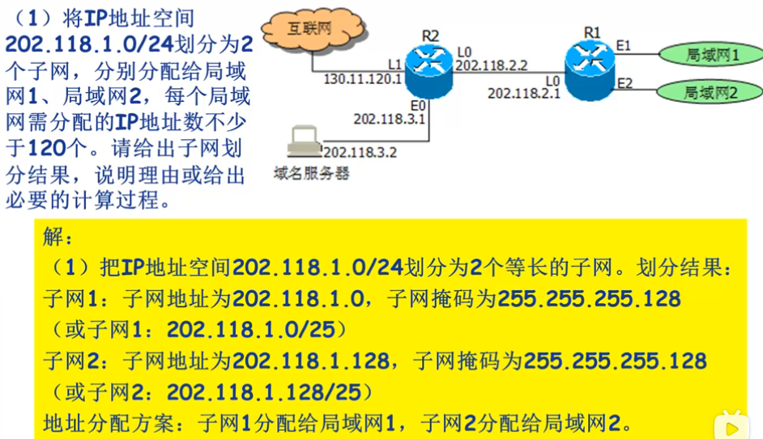

# 1、网络层服务

网络层介于传输层和数据链路层之间。

传输层用于提供端到端的进程间通信服务。数据链路层用于实现物理链路直接相连的两个结点的`数据帧`传输服务。

> 网络层关注如何将承载传输层报文段的网络层数据报从`源主机`送达`目的主机`。

网络层需要实现的两项重要功能：

- 转发 forwarding
- 路由 routing


**转发**

当通过一条输入链路接收到一个分组后，路由器需要决策通过哪条输出链路将分组发送出去，并将`分组从输入接口转移到输出接口`。

**路由**

当分组从源主机流向目的主机时必须通过某种方式`决定分组经过的路由`或路径，计算分组所经过的路径的算法称为`路由选择算法`或路由算法


路由选择可以通过相应的路由选择算法实现，路由器会通过一张转发表（路由表）和分组的网络层首部地址字段的值查询转发到哪条链路上。


**转发表的建立**

路由选择与转发是相互作用的，路由器运行路由协议在网络上交换或收集计算路由所需要的信息，并基于某种路由选择算法计算路由，然后将路由信息存储到路由转发表中。

常见路由器都会提供`静态路由配置`，此时不需要任何路由选择协议。


提供面向连接服务的网络提供一个重要功能：

- 建立连接

> 与TCP的端到端的连接不同，网络层连接是从源主机到目的主机所经过的一条路径，该路径上所经过的**每一个**路由器等网络设备都要参与网络层连接的建立。


根据是否在网络层提供连接服务，分组交换网络可以分为：

1. 仅在网络层提供连接服务的`虚电路网络` Virtual-Circuit
2. 仅在网络层提供无连接服务的`数据报网络` Datagram-Network


# 2、数据报网络&虚电路网络

## 数据报网络

> `按照目的主机地址进行路由选择的网络`称为数据报网络。
>
> 因特网的`IP`都是按照目的地址进行路由选择的，所以它是一个数据报网络。


数据报分组交换是分组交换的一个业务类型，属于`无连接`业务。 

> 数据报方式将每个分组作为一个独立的数据报进行传送。每个分组都是一个数据报，都携带源主机和目的主机的信息。开始通信前不需要建立连接。
>
> 每个分组交换机收到一个数据报时，根据携带的目的主机信息查询转发表，将数据报发送到对应的输出链路。

数据报网络中，无连接的发送方与接收方之间不存在固定的连接，所以发送和接收的分组次序不一定相同，接收方需要根据相应的协议，对分组进行排序从而生成原始的完整报文（这个任务通常由传输层完成）。

如果在网络层传输过程中出现丢失或差错，数据报网络本身也不做处理，可以由通信双方的传输层协议进行处理。


## 虚电路网络

> `虚电路网络在网络层提供面向连接的分组交换服务`，通信之前需要先建立虚电路，通信结束后再拆除虚电路
>
> 虚电路是在源主机到目的主机之间的一条路径上建立的一条网络层逻辑连接，为区别电路交换中的电路，称为虚电路。
>
> 虚电路只是标识了从源到目的的一条网络逻辑连接，并不需要为每条虚电路分配独享资源。
>
> 每条虚电路都有虚电路号，虚电路标识VCID


虚电路在源和目的之间确定了一条路径，可以保证分组顺序到达（丢失除外）。

**虚电路构成的3要素**

1. 从源主机到目的主机之间的一条路径（一系列的链路和分组交换机）
2. 该路径上的每一条链路都各有一个`虚电路标识`VCID
3. 该路径上的每台交换机中的`转发表`中记录虚电路标识的接续关系


每台交换机维护一个VCID转换表

为什么不使用同一个VCID？

1. 缩短VCID长度
2. 简化网络管理功能，可以独立于其他链路选择一个VCID
3. 使用一个VCID需要链路上的各分组交换机交换并处理大量信息


虚电路通常提供的是`统计多路复用传输服务`


虚电路分组交换有`永久型`和`交换型`两种。

**永久型虚电路**

是一种提前建立、长期使用的虚电路。建立时间开销几乎可以忽略。

**交换型虚电路**

是根据通信需要而临时建立的虚电路，通信结束后立即拆除，虚电路的建立和拆除时间有时影响较大


> `数据报网络与虚电路网络的差别`主要是将顺序控制、差错控制、流量控制等功能交由网络来完成还是由端系统完成。
>
> - 虚电路网络通常由网络完成顺序控制、差错控制、流量控制等功能，向端系统提供无差错数据传送服务
>
> - 数据报网络通常实现的功能很简单，如基本的路由与转发，顺序控制、差错控制、流量控制等功能则由端系统来完成


# 3、网络互连与网络互连设备


## 异构网络互连

> 异构网络主要是指两个网络的通信技术与运行协议的不同。


实现异构网络互连的基本策略

1. 协议转换
2. 构建虚拟互连网络

**协议转换**

采用一类支持异构网络之间协议转换的`网络中间设备`，实现异构网络之间数据分组的`转换`与转发

**构建虚拟互连网络**

在现有的异构网络基础上构建一个同构的虚拟互连网络。异构网络只需封装、转发虚拟互连网络分组，同时引入“虚拟互联网中间设备”互连异构网络，实现异构网络间转发统一的虚拟互联网的数据分组。


IP是虚拟互联网络。 Internet采用同构的`网络层协议：IP协议`、`网络寻址：IP地址`、引入`网络互联设备：IP路由器`

同构网络的互连，典型技术是`隧道技术`。


## 路由器

> 路由器是一种具有多个输入端口和多个输出端口的专用计算机，其任务是获取与维护`路由信息`及`转发分组`


路由器在功能体系结构下可以分为：输入端口、交换结构、输出端口、路由处理器


### 1、输入端口

> 工作过程：
>
> 1. 从物理接口接收信号
> 2. 还原数据链路层帧、提取IP数据报(或其它协议分组)
> 3. 根据IP数据报目的IP检索路由表确定数据报交换到哪一个输出端口

- 每个输入端口都有一份路由表副本，提高检索速度（集中转分布）
- 路由器需要实现查找、转发、缓存排队功能（交换效率低于接收时缓存或丢弃）

### 2、交换结构

实现具体的分组转发

交换结构对分组的转发有多种实现方式：

- 基于内存交换：由路由处理器控制，在内存中直接将分组复制到输出端口
- 基于总线交换：输入输出端口同时连接到一条总线，分组经总线传输到指定输出端口。类似ＤＭＡ。总线具有`独占性`，同时到达的分组只有一个可以传输，其他等待。
- 基于网络交换：可以实现并行交换传输.不同输入端口到达且都要转发到同一个输出端口的分组同一时刻只有一个分组可转发,另一个需要等待


### 3、输出端口

> 输出端口首先提供一个缓存排队功能,排队交换到该端口的待发送分组,并从队列中不断取出分组进行数据链路层数据帧的封装,通过`物理线路端接`发送出去.
>
> 输入与输出速率一样同样可能出现排队,因为多个输入可能同时需要转发到同一个输出端口.

输出端口对队列中的分组实行FCFS调度策略, 也可以实行按优先级、按IP数据报的服务类型调度等。

### 4、路由处理器

就是路由器的CPU，负责执行路由器的指令，包括路由协议的运行、路由计算与路由表的更新维护等。

路由器的基本功能：转发与路由选择。


最长前缀匹配优先原则。

无匹配：默认

有匹配：1个直接采用， 多个采用前缀匹配最多位数的项。


# 4、网络层拥塞控制

拥塞是一种持续的过载状态，此时用户对网络资源的总需求超过了网络固有的容量。


膝点：负载在膝点附近，网络吞吐量与分组平均延迟达到平衡；超过膝点后吞吐量增长缓慢，分组平均延迟增长较快；

崖点：负载超过崖点后，吞吐量随负载增加而降低，分组平均延迟急剧增加


**拥塞控制**就是在端系统或网络结点，通过采取某些措施来避免拥塞或对已经发生的拥塞做出反应，尽快消除拥塞。


拥塞控制措施很多情况下采取`约束、限制或降低`端系统向网络发送数据的速率或数量用来避免或消除拥塞。

流量控制措施很多情况下也是采取约束、限制或降低端系统向网络发送数据的速率或数量。


有流量控制还需要拥塞控制吗？

- 流量控制是数据发送一方根据`数据接收方`的接收能力，包括接收缓存、数据处理能力等，调整数据发送的速率和数据量，避免数据接收方被数据淹没
- 拥塞控制是根据`网络`的通过能力或网络拥挤程度，来调整数据发送速率和数据量
- 两者的目标和解决的问题不同，调整速率的依据也不同，所以不能互相替代


发生拥塞的原因有四种

1. 缓冲容量有限
2. 传输线路带宽有限
3. 网络结点的处理能力有限
4. 网络中某些部分发生了故障


处理拥塞的两个方面：增加网络资源、减小网络负载


简述流量控制与拥塞控制主要考虑的问题、目的及任务上的区别	


> 答案：
>
> （1）考虑的问题：
>
> 1. 拥塞控制主要考虑端系统之间的网络环境；
> 2. 流量控制主要考虑接收端的数据接收与处理能力；
>
> （2）目的：
>
> 1. 拥塞控制目的是使网络负载不超过网络的传送能力；
> 2. 流量控制目的是使发送端的发送速率不超过接收端的接收能力；
>
> （3）任务：
>
> 1. 拥塞控制的任务是确保网络能够承载所达到的流量；
> 2. 流量控制的任务只与特定的发送方和特定的接收方之间的点到点流量有关

## 网络层采用的拥塞处理措施

流量感知路由，准入控制、流量调节、负载脱落


**流量感知路由**

根据网络负载动态调整权值，将网络流量引导到不同的链路上。 链路的权值以链路带宽、传输延迟、链路负载情况动态变化，通过路由选择算法逐步使网络各结点的路由表得到更新。

解决大量流量转移到其他链路上，可以采用多路径路由或将流量过大的链路上的流量缓慢转移到另一条链路。

流量感知路由是一种拥塞预防措施


**准入控制**

是一种广泛应用于`虚电路`网络的拥塞`预防`技术。

核心思想

> 对新建虚电路进行审核，如果新建虚电路会导致网络变得拥塞，就拒绝建立新虚电路。

准入控制的关键是新建一条虚电路可能导致网络拥塞时应如何反应。 

需要对网络中的流量、拥塞状况进行量化： 常基于`平均流量`和`瞬时流量`来判断是否有能力接受新虚电路而不会发生拥塞。


**流量调节**

通过调节发送方向网络发送数据的速率来消除拥塞。 当网络结点感知到当前网络发生了拥塞，可以通知其上游结点降低发送速率而逐渐消除拥塞。

需要解决两个问题：

1. 网络结点如何感知发生了拥塞？
   - 通过输出窗口的排队延迟来对网络的拥塞状况进行感知
   - 通过过去一段时间的排队延迟和当前瞬时排队延迟的加权组合
2. 感知拥塞后如何将拥塞信息通知到上游结点？
   - `抑制分组`， 直接告知发送方。感知到拥塞的路由器选择一个被拥塞的数据报，给该数据报的源主机发送一个`抑制分组`。
   - `背压`，源主机与感知到拥塞的结点之间距离（或跳数）较远，在抑制分组到达源主机的过程中又有许多新分组进入网络。
     - 解决方法是：让抑制分组在拥塞结点到源主机的每一跳都发挥抑制作用
     - 代价是抑制分组途径的每一跳都需要分配更大的缓冲区（接收多，发送慢）

**负载脱落**

有选择地丢弃一些数据报，来减轻网络负载，从而缓解或消除拥塞。

`首要关系`：哪些数据报应被丢弃（与上层应用有关）。有时需要丢弃新分组，有时需要丢弃旧分组


# 5、Internet网络层

Internet网络层主要包括`网际协议`（Internet Protocol，IP）、`路由协议`以及互`联网控制报文协议`（Internet Control Message Protocol， `ICMP`）等内容

## IPv4协议

IP具有两个版本：v4、v6.

IP定义了如何封装上层协议的报文段，定义了Internet网络层寻址以及如何转发IP数据报等。

### IP数据报格式

IP是典型的数据报网络。


1. 首部长度，4位最大值15， 即首部最大60字节。在没有选项字段的情况，实际IP数据报的第一个字节是45H. 路由器在解析IP数据报是只需要解析首部。首部长度之后的就是传输层数据
2. 区分服务，8位（服务类型字段：TOS），基本不使用该字段。实际IP数据报中值为00H
3. 数据报长度（总长度）字段。IP数据报的总字节数，最长$2^{16}=65535$字节，减去最小首部，最大可以封装65515字节数据。实际网络中没有这么大的IP数据报，MTU
4. 标识字段,不是唯一标识， 在IP数据报分片和重组过程中用于标识属于同一原IP数据报
5. 标志位：`保留位、DF位、MF位`. DF:禁止分片， MF:更多分片
   - DF：0 表示允许路由器分片，1 不允许分片（若超出MTU则丢弃）
   - MF：0表示数据报未分片或被分片IP数据报的最后一片；1表示数据报是一个IP数据报的分片且不是最后一片；
6. 片偏移：相对原数据报的偏移量，以8字节为单位。
7. 生存时间：表示IP数据报在网络中可以通过的路由器数（跳数），每经过一个路由器就减1等于0就丢弃，确保一个IP数据报不会永远在网络中游荡（环形路由）。
8. 上层协议：指示IP数据报封装的是哪个上层协议的报文段。 6TCP， 17UDP。 IP使用该字段`实现多路复用与多路分解`
9. 首部校验和：初始全为0，计算后全为1，有一位不是1就是出现错误。首部校验和是逐步校验逐步计算的。
10. 选项长度字段：1~40字节。 
11. 数据字段：数据字段存放IP数据报所封装的传输层报文段，在目的主机将所承载的数据交付给相应的上层协议。


### IP数据报分片

**MTU**

一个数据链路层协议帧所能承载的最大数据量称为该链路的最大传输单元（Max Transmission Unit， MTU）

如果一个IP数据报长度超过了MTU，则需要采取某些措施：

1. 丢弃数据报, DF=1
2. 数据报分片, DF=0


> 每个分片的首部中，源、目的IP，协议版本，标识等继承自原IP数据报对应字段值
>
> 路由器只负责对数据报进行分片，不负责对数据报分进行重组， 其重组任务由最终的目的主机的IP来完成。
>
> 目的主机根据IP分片是否具有同一个标识字段判断是否属于同一个IP数据报、其分片的首部字段标识字段MF位可以判断是否是最后一个分片。


**分片重组**

> 首先根据各分片的首部标识字段来判断这些分片是否属于同一各IP数据报，即同一个IP数据报分出来的IP分片具有相同的标识字段；
>
> 其次，目的主机通过各分片首部的标志字段可以判断某个分片是否是最后一个分片
>
> 最后，目的主机根据各分片的片偏移字段，判断各IP分片的先后顺序，结合每个IP分片首部的数据报长度字段，还可以判断是否缺少IP分片

**分片规则**

>假设IP数据报总长度为$L$字节， MTU为$M$字节， 且 $L>M \;\&\; DF=0$ 是路由器可以进行分片
>
>每分片最大可封装的数据长度(字节) 
>$$
>d = \lfloor{\frac{M-20}{8}}\rfloor\times{8}
>$$
>分片总数
>$$
>n=\lceil\frac{L-20}{d}\rceil
>$$
>每分片片偏移量字段值
>$$
>F_i=\frac{d}{8}(i-1)\;,\; 1\leq{i}\leq{n}
>$$
>每个分片的总长度字段值
>$$
>L_i=\begin{cases}  d+20\;,\; 1\leq{i}<n \\
>L-d\times{(i-1)}\;,\; i=n
>\end{cases}
>$$
>每个分片MF值
>$$
>MF_i=\begin{cases} 1 \;,\; 1\leq{i}<n\\
>0\;,\; i=n
>\end{cases}
>$$
>

## IPv4编址

一台主机在不同的网络，可以同时具有多个IP地址。

> 路由器通常有多个网络接口（主机或路由器与物理链路的连接边界），每个接口都具有一个IP地址。
>
> 很多主机通常情况下只有一个网络接口（网卡）连接网络，所以只有一个IP地址。


IPv4地址长度为32位，即$2^{32}$ 约43亿。

具有三种地址表示法：二进制标记法， 点分十进制标记法， 十六进制标记法

| 标记法           | 示例                                 |
| ---------------- | ------------------------------------ |
| 二进制标记法     | 11000000 101010000 00000001 01100101 |
| 点分十进制标记法 | 192.168.1.101                        |
| 十六进制标记法   | 0xC0A80165                           |


左侧互连的三台主机与路由器左侧接口的网络称为一个IP子网。 在IP编址中会为每一个IP子网分配一个子网地址。

左侧子网的地址为： `203.1.1.0/24` 其中 `/24（24位前缀，对应子网掩码）` `11001011 00000001 00000001 xxxxxxxx`对子网的地址进行了定义`。

IP子网相当于为网络地址引入了层次。

基于IP子网的概念， 可以将主机IP地址划分为两个部分

1. 前缀， 即网络部分， 用于描述主机属于哪个网络
2. 后缀， 即主机部分， 用于表示主机在网络内的唯一地址


用于表示主机所属网络的前缀，其长度可以是定长也可以是不定长的。 

早期IP地址被设计为定长前缀，此方式称为`分类地址`；目前主流方法是前缀长度是可变的， 即`无类地址`。


### 分类地址

因特网发展早期采用定长前缀，考虑到不同组织要使用的地址数量不同，设计了三种长度的前缀： 8位， 16位， 24位。

整个地址网络空间被非为： A、B、C、D、E五类。 且ABC三类可以分配给主机和路由器使用。D作为组播地址， E类地址保留。 该方案称为**分类寻址**

分类方法为依次从最高比特位“二分”

| 类   | 前缀长度 | 前缀                                | 首字节  |
| ---- | -------- | ----------------------------------- | ------- |
| A    | 8位      | 0xxxxxxx                            | 0~127   |
| B    | 16位     | 10xxxxxx xxxxxxxx                   | 128~191 |
| C    | 24位     | 110xxxxx xxxxxxxx xxxxxxxx          | 192~223 |
| D    | 不可用   | 1110xxxx xxxxxxxx xxxxxxxx xxxxxxxx | 224~239 |
| E    | 不可用   | 1111xxxx xxxxxxxx xxxxxxxx xxxxxxxx | 240~255 |

A 类有$2^7$共128个A类网络， 每个A类网络的IP地址总数为$2^{24}$共16777216

B 类有$2^{14}$共16384个B类网络， 每个B类网络的IP地址总数为$2^{16}$共65535

C 类有$2^{21}$共2097152个网络， 每个C类网络有的IP地址总数为$2^8$共256


### 特殊地址

占IP地址空间87.5%的ABC类地址中有一部分是特殊用途的IP，不能分配给主机和路由器使用：

1. **本地主机地址**， `0.0.0.0/32`.在主机不知道自己IP的时候使用本地主机填充IP数据报的源地址字段。 路由表中，0.0.0.0/0用于表示默认路由。
2. **有限广播地址**，`256.256.256.256/32`.当主机或路由器某接口需要向其所在的网络中所有的设备发送数据报时，用该地址作为IP数据报的目的地址。有限广播地址仅限于发送数据报的主机所在的子网范围内。
3. **回送地址**，`127.0.0.0/8`.如果数据报的目的地址位于该地址块中， 该数据报不会发送到源主机之外。


### 私有地址

有一部分地址保留用于内部网络， 称为私有地址。 不能在公共互联网上使用（直接丢弃）。

| 私有地址类别 | 范围                                          |
| ------------ | --------------------------------------------- |
| A类          | 10.0.0.0~10.255.255.255（`10.0.0.0/8`）       |
| B类          | 172.16.0.0~172.31.255.255(`172.16.0.0/12`)    |
| C类          | 192.168.0.0~192.168.255.255(`192.168.0.0/16`) |


### 无类地址

为了解决地址空间不足的问题， 可以增加地址长度（IPv6）,但目前IPv4的解决方案是网络前缀不再是固定长度。

在无类地址中，网络地址形式为a.b.c.d/x, x为网络前缀长度。 这种地址形式称为CIDR， 无类域间路由 classless inter-domain routing


### 子网划分

为了缓解地址空间不足， 提高IP地址空间利用率， 还有另外两种解决方案：子网化和超网化。

**子网化**

将一个较大的子网划分为多个较小子网的过程。前提是其所属组织愿意将将IP地址空间分配给更多的组织来使用

**超网化**

将具有较长前缀的相对较小的子网合并为一个具有较短前缀的相对较大的子网。





**子网掩码**

> 有子网化和超网化之后，只给出一个子网地址是无法准确描述一个子网的规模的，还需要给出`子网前缀`或`子网掩码`
>
> 213.111.0.0 无法知道子网的规模，
>
> 213.111.0.0/24就是一个C类网络， 子网 213.111.0.0/23 就是一个超网， 包括：`213.111.0.0/24`和`213.111.1.0/24`两个C类网络
>
> 子网掩码也可以用来定义一个子网的网络前缀长度。
>
> 子网掩码是一个32位数，其取值规则为：
>
> - 对应网络前缀全部为1， 其余部位全部为0
>
> - 子网213.111.0.0/24的子网掩码为: 255.255.255.0 
>
> - 子网213.111.0.0/23的子网掩码为: 255.255.254.0
>
> - 下面是等价的
>   $$
>   213.111.0.0/23=\begin{cases}213.111.0.0  \;\;\;\;\;\;IP\\
>   	255.255.254.0 \;\;掩码
>   \end{cases}
>   $$
>
> - IP地址与子网掩码按位与运算，可以得到子网地址（与：都是1取1，否则取0）
>
> - IP地址与子网掩码的反码做按位或运算，可以得到子网的直接广播地址（或：都是0取0， 否则取1）


**示例**

> 一个主机地址是203.123.1.135， 子网掩码是255.255.255.192
>
> 求：1.子网地址； 2.直接广播地址； 3.子网IP地址总数； 4.子网可分配IP地址数；5.可分配IP地址范围；
>
> 解：
>
> *子网地址*：
>
> IP地址与子网掩码按位与可求得子网地址：
>
> 203.123.1.135  = 11001011 01111011 00000001 10000111
>
> 255.255.255.192= 11111111 11111111 11111111 11000000
>
> `203.123.1.128`  = 11001011 01111011 00000001 10000000
>
> *直接广播地址*：
>
> 子网掩码的反码与IP地址按位或可求得直接广播地址：
>
> 203.123.1.135 =  11001011 01111011 00000001 10000111
>
> 255.255.255.192= 11111111 11111111 11111111 11000000 > 00000000 00000000 00000000 00111111
>
> 11001011 01111011 00000001 10000111
>
> 00000000 00000000 00000000 00111111 
>
> 11001011 01111011 00000001 10111111 = `203.123.1.191`
>
> *IP地址总数*：11111111 11111111 11111111 11`000000` $2^6$=`64`个(203.123.1.128~203.123.1.191)
>
> *可分配地址*：64-2 =`62`个 （减去子网地址和广播地址）
>
> *可分配地址范围*：129~190 (203.123.1.129~203.123.1.190)


英特网名称和编号分配组织， ICANN。 

网络地址块的分配通常满足两个条件：地址块中的地址总数是2的整数次幂；地址块中的地址是连续的。


**子网划分的一般性办法**

对于一个给定的IP网络 $a.b.c.d/x$,如果需要将其划分为多个子网，可以利用主机域（HostId）的位中部分位加以区分。

如果用主机域中的$r$位划分子网（$r\in{[1，30-x]}$）,可以将原网络划分为$2^r$个等长的子网。

每个子网IP地址总数为：$2^{(32-x-r)}$ 其中每个子网中除前缀x位与子网区分的r位外， 剩余位全0位子网地址，全1位子网直接广播地址。


**示例**

> 将I网络12.34.56.0/24划分为3个子网
>
> 要求：1.第一个子网可分配地址不少于50个；2.第二个子网可分配地址不少于60个；3.第三个子网可分配地址不少于120个
>
> 答： 12.34.56.0/24 共有254个可分配地址，根据三个子网地址可分配地址要求，先将12.34.56.0/24划分为2个子网：12.34.56.0/25；12.34.56.128/25.
>
> 将12.34.56.128/25作为第三个子网，其子网掩码为256.256.256.128，子网地址为12.34.56.128，广播地址：12.34.56.255
>
> 其可分配网络地址为 $2^{(32-24-1)}-2$共 126个；
>
> 
>
> 将子网12.34.56.0/25进一步划分2个子网：12.34.56.0/26；12.34.56.64/26；分别作为第一子网，第二个子网。
>
> 第一个子网掩码为：12.34.56.192, 子网地址为：12.34.56.0 广播地址： 12.34.56.63; 可分配地址为 62个
>
> 第二个子网掩码为：12.34.56.192， 子网地址为：12.34.56.64 广播地址：12.34.56.127；可分配地址为 62个


### 路由聚合

转发表包含的主要信息：网络地址、子网掩码、下一跳地址、路由器接口；网络地址、子网掩码可以分别给出，也可以是CIDR格式


查找转发表：

1. 将目的IP地址与路由表中的子网掩码按位与运算
2. 将结果与路由表中的网络地址进行匹配，相同则成功

如果只有一个匹配表项（除默认外 ），则直接转发。 如果有多个匹配表项，选择匹配前缀最多的项转发。 如果没有则采用默认路由表项转发。


**路由聚合**：将具有相同的下一跳地址和接口，且可以合并为一个较大的子网时，路由聚合可以有效减少路由表项，提高查找效率。


## 动态主机配置协议

DCHP 是在应用层实现的，传输层使用UDP。实现动态IP地址分配的网络需要运行DHCP服务器（端口：67），并配置其可以为其他主机进行动态地址分配的IP地址范围等


当一台主机接入网络或新启动是，运行DHCP客户（端口：68），申请DCHP服务器为其分配IP地址，工作过程

1. DHCP服务发现
2. DHCP服务器提供
3. DHCP请求
4. DHCP确认


## 网络地址转换

NAT运行在私有网络的边缘路由器或专门的服务器上，同时连接内部私有网络和公共互联网，拥有公共IP地址。

NAT通过替换进出内部私有网络的IP数据报的IP地址与端口号，支持使用私有地址的内部主机与公共互联网中的服务器或其他主机进行通信。


**NAT一般工作原理**

> 对于从内外出去，进入公共互联网的IP数据报，将其源IP地址替换为NAT服务器拥有的合法的公共IP地址，同时替换源端口号，并将替换关系记录到NAT转换表中。
>
> 对于从各个互联网返回的IP数据报，根据目的IP地址与目的端口号检索NAT转换表，并利用检索到的内部私有IP地址与对应端口号替换IP地址与目的端口，然后将IP数据报转发到内部网络。
>
> 只能由内部网络主机主动发起与公共互联网的通信，而不能被动接受外网主机主动与内网主机的通信（没有记录转换关系）


NAT穿透技术

> 在外网主机主动与内网主机进行通信时，先在NAT转换表中建立好内网到外网的映射，使内网运行的服务以NAT公网地址的合法身份暴露出去。
>
> 1. 手动配置
> 2. 基于UPnP协议


## ICMP

互联网控制报文协议ICMP主要目的是在主机或路由器之间实现`差错信息报告`与`网络探测`。

通过主动发送ICMP询问请求报文，并通过接受ICMP响应报文可以实现网络可达性（如ping）或特定信息（时间戳）的探询。

ICMP的消息需要封装到IP数据报中。


ICMP报文分为两类： `差错报告报文`、`询问报文`。


ICMP前四个字节是统一格式，包括：类型，代码，校验和。

ICMP差错报文有`5种`：终点不可达，源点抑制、时间超时、参数问题、路由重定向。

`终点不可达`：路由器或主机不能将IP数据报成功交付到目的网络、主机、端口时丢弃报文后ICMP报文

`源点抑制`：路由器由于拥塞控制丢弃了数据报

`时间超时`：路由器收到IP数据报的TTL为1，减1后变为0，丢弃该报文

`路由重定向`：默认网关路由器认为主机向某目的网络发送IP数据报应选择更好的路由时发送， 主机收到报文后更新路由表且新数据报采用新路由发送


## IPv6


### 数据报格式


- 流量类型，具有与TOS相似功能
- 流量标签：用于表示一系列数据报的流
- 有效载荷：说明数据报中数据的字节数量
- 下一个首部：表示数据报中承载的数据应给交付给哪一个上层协议，如UDP，TCP；或指向其他选项首部
- 数据：数据报中承载的有效载荷，上层协议报文段


ipv6中，如果数据长度超过了MTU，路由器直接丢弃，并发送ICMP告诉源主机分组太大。


### IPv6地址

IPv6地址长度为128位，通常采用8组16进制数地址形式表示，每组之间使用`:`分割。

IP地址中连续的0之间可以用 `::`来省略，但只能出现一次。

IP地址包含三种类型：

- **单播地址**：唯一标识网络中的一个主机或路由器接口，可作为数据报的源地址和目的地址
- **组播地址**：标识网络中的一组主机，只能用作数据报的目的地址，且该组播地址中的每一个成员都会收到一个数据报副本
- **任播地址**：标识网络中的一组主机，只能用作数据报的目的地址，只有该任播地址标识的任播组中的某个成员收到IP数据报


### v4到v6的迁移

v4与v6共存，解决方案是采用`双协议栈`，即支持v6的结点同时也支持v4，同时具备发送v4与v6的数据报的能力。

要求一个双协议栈结点，能够感知到另一个结点是否提供IPv6服务。可以通过DNS解决，返回的是v4地址即只能支持v4数据报。


解决链路中的某结点不支持IPv6时，采用隧道解决。

**隧道方案**

> 通信源端与目的端都提供IPv6服务，但途径IPv4网络，为了使IPv6数据报成功通过IPv4网络，可以在IPv4网络上建立IPv6隧道。
>
> 即：在v6数据报进入隧道前的最后一个IPv6路由器上，该路由器将整个v6数据报封装进一个v4数据报中作为其数据，并将该v4数据报目的地址修改为隧道的末端（隧道后第一个IPv4路由器）；
>
> 在v4数据报到达隧道出口的v6路由器上，IPv6的数据报从IPv4的数据报有效载荷中取出，并继续转发至通信目的主机


# 6、路由算法与路由协议

当分组到达一台路由器时，Internet中需要根据分组的目的IP进行转发，虚电路中需要根据分组的VCID进行转发，而转发的决策依据是存储在路由器上的转发表中的路由选择信息。


实际网络中，一台主机通常是通过局域网与一台路由器直接相连，这台路由器称为该主机的`默认路由器`；连接该主机所在子网的路由器接口就是该主机的`默认网关`；


路由选择的关键：就是从源主机的默认路由器到目的主机的默认路由器之间的`路径优选`。

路由选择的目的：就是在给定一组网络中的路由器及路由器间的连接链路的情况下，寻找一条从源路由器到目的路由器的`最优路径`。


> 将网络抽象为一个带权无向图 G=(N,E)， N是结点的集合， E是边的集合。
>
> 即将网络中的路由器抽象为图G的结点；连接两个路由器之间的链路抽象为图G的边；网络链路的费用（速率、时延等）抽象为G中边的权值；
>
> 权值是链路的费用，可以代表实际物理链路的传播时延、传输速率、拥塞状态等，有时广义地称为距离。
>
> 结点x、y之间存在边，其权值表示为$c(x,y)=值$；不存在边表示为$c（x,y)=\infty$；
>
> 一条路径的费用（距离）是从源结点到目的结点所经过每条链路的权值之和；


路由选择算法分类

- 根据计算路由时是否基于网络全局信息分类
  - 全局式路由选择算法
    - 需要根据网络的完整信息（完整的网络拓扑结构）计算最短路径
    - 并不是路由计算只在某个路由器上计算，而是在计算路由时每个路由器都要获取完整的网络拓扑信息
    - 典型的算法：链路状态路由选择算法， LS算法
  - 分布式路由选择算法
    - 此类算法只需获知与其相连的链路费用信息，以及邻居结点通告的到达其他结点的最短距离（估计）信息，经过不断迭代计算，最终获知经由哪个邻居可以具有到达目的结点的最短距离
    - 典型的算法：距离向量路由选择算法， DV算法
- 根据静态或动态分类
  - 静态路由选择算法：通常指人工进行网络配置
  - 动态路由选择算法：在网络状态发生变化时，自动计算最佳路由，具有更好的自适性。
  - 典型的算法：LS算法、DV算法
- 根据对负载的敏感与否
  - 负载敏感的路由选择算法：能够在网络发生拥塞时迅速对路由做出调整
  - 负载迟钝的路由选择算法：无法对网络拥塞变化做出快速响应


## 链路状态路由选择算法

- 每个路由器在计算路由时需要构建出整个网络的拓扑图
  - 周期性检测、收集与其直接相连的链路的费用及直接相连的路由器ID等信息，构建链路状态分组，并向全网扩散
  - 于是网络中每个路由器都会周期性收到其他路由器广播的链路状态分组，并存储到每个路由器的链路状态数据库中
- 最短路径的经典算法：Dijkstra；链路状态路由选择算法根据Dijkastra算法求最短路径


**Dijkstra 算法描述**

- D(v)：
  - 到本次迭代为止，源结点（计算结点）到目的结点v的当前路径距离。
  - 初始化时，如果结点v到源结点直接相连，那么D(v)就是其链路上的权值，否则就是$\infty$
- P(v)
  - 到本次迭代为止，在源结点到目的结点v的当前路径上，结点v的前序结点。
- c(x,y)
  - 结点x到结点y直接链路的费用，如果xy没有直接链路，则$c(x,y)=\infty$
- S
  - 结点的集合，用于存储从源结点到该结点的最短路径已求出的结点集合，初始值只有源结点自己


输入：无向图 G， 源结点 u
输出：源结点u到无向图G所有结点的最短路径

```ABAP
Digkstra(G,u)
	S={u}
	for i = 2 to n
   		D[i]=G[u][i]
       P[i]=u
   for i = 1 to n-1
		选择不在集合S中且使得D[w]最小的结点w
		将结点w加入集合S
		for v not  in S
			if D[w] + c(w,v) < D[v]
			P[v]=w
```


[bilibili 视频讲解](https://www.bilibili.com/video/BV1yy4y187QK?p=2&spm_id_from=pageDriver&vd_source=185c65e662905046f7b6d99056231763 "包含bellman-ford")

## 距离向量路由选择算法

异步的、迭代的分布式路由选择算法。


每个结点可以测得与所有邻居结点之间的直接链路代价，并将其到达每个目的结点的最短距离（可能是），以（目的，最短距离）的距离向量形式交换给所有的邻居结点。


距离向量路由选择算法基于Bellman-ford方程。

令$d_x(y)$表示结点x到结点y的路径的最低费用。根据B-F方程，有以下公式成立：
$$
d_x(y)=min\lbrace c(x,v) + d_v(y) \rbrace \\
v\in \lbrace x的邻居 \rbrace
$$
$c(x,v)$ 表示结点x与邻居结点v之间的直接链路距离。

$d_v(y)$ 是邻居结点v通告给结点x的， v到y的最短距离。 x-v-y


**基本思想**

> 网络中每个结点x，估计从自己到网络中所有结点y的最短距离， 记为 $D_x(y)$ , 称为结点x的距离向量。该向量维护了从结点x出发到网络中所有结点的最短距离的估计；
>
> 每个结点向其邻居发送它的距离向量的一个拷贝；
>
> 当结点收到来自邻居的一份距离向量拷贝或是观察到相连链路上的费用发生了变化后，根据B-F方程对自己的距离向量进行计算更新；
>
> 如果结点的距离向量发生了改变，那么该结点会将更新后的距离向量发生给它所有邻居结点。
>
> 


 

$d_v(z)=5$, $d_x(z)=3$，$d_w(z)=3$

根据B-F方程：
$$
d_u(z)=min\lbrace  
	c(u,v) + d_v(z),
	c(u,x) + d_x(z), 
	c(u,w) + d_w(z) \\ = \lbrace 2+5,1+3,5+3 \rbrace
\rbrace \\ = 4
$$
重点：结点获得最短路径下一跳，该信息用于转发表中。


解决无穷计数问题的方案：

1. 毒性逆转计数
2. 通过定义最大有效费用度量值，来限制无穷计数问题的影响


## 层次化路由选择

LS需要在全网广播链路状态分组，DV需要在邻居路由器之间交换距离向量。这些算法应用于大规模网络，网络设备庞大，无论是广播还是交换都会极大消耗网络带宽与时间


实现大规模网络路由选择最有效、可行的解决方案就是层次化路由。

**层次化**

> 将大规模的互联网按组织边界、管理边界、网络技术边界或功能边界划分为多个自治系统 AS.
>
> 每个自治系统由一组运行相同路由协议和路由选择算法的路由器组成。LS、DV都可以在AS中运行，而不会产生性能问题。
>
> **自治系统内路由协议**
>
> 在同一个自治系统内，路由器运行相同的路由协议，按相同的路由选择算法计算AS内的路由。
>
> **AS之间互连**
>
> 每个自治系统都至少存在一个与其他AS互连的路由器，称为**网关路由器**，负责与其他自治系统**交换**跨越AS的路由可达信息
>
> 层次化路由选择将大规模互联网的路由选择划分为两层：
>
> 1. 自治系统内的路由选择-路由器运行AS内路由选择协议，计算AS内目的网络的路由
> 2. 自治系统间的路由选择-路由网关运行AS间路由选择，将跨越AS的网络可达性信息交换给其所在的AS内的其他路由器


# Internet路由选择协议

internet路由就是层次化路由选择。

Internet自治系统内/外部路由选择协议分别称为：

- 内部网关协议（**IGP**，Interior Gateway Protocol）
- 外部网关协议（**EGP**，Exterior Gateway Protocol）


**内部网关协议 IGP**

典型的IGP有：路由信息协议（Routing Information Protocol，**RIP**）、开放最短路径优先协议（Open Shortest Path First, **OSPF**）

**外部网关协议 EGP**

典型的EGP：边界网关协议 （BGP，Border Gateway Protocol）


## RIP（IGP）

一种距离向量选择算法。

RIP在使用DV时有其特性：

1. RIP在度量路径时采用`跳数`；即每条链路的费用都是1
2. RIP的费用是定义在源路由器到目的子网之间的；最短路径的费用就是从源路由器到目的子网的最短路径所经过的`子网数量`
3. RIP被限制在网络直径不超过15跳的自治系统内使用；即分组从一个子网到另一个子网穿越的最多的子网数目不超过15；RIP中16代表无穷
4. RIP路由向量表中记录了下一跳信息，有助于消除无穷计数现象
5. RIP规定如果超过180s仍没有从某个邻居收到任何RIP响应报文，则认为该邻居不可达


RIP使用传输层的UDP封装RIP报文。


## OSPF（IGP）

RIP主要应用于较小规模的AS，如更接近用户的ISP或企业网络。


OSPF更多应用于较大规模的AS，如骨干网络。

OSPF基于链路状态选择算法，使用Dijkstra算法求解最短路径。OSPF和RIP都是将网络抽象为无向图，RIP将边的权值固定为跳数，OSPF则对权值表示的意义没有限制。


运行OSPF的AS内，每台路由器都要向与其在同一个AS内的路由器广播链路状态分组。为了适应网络拓扑及流量变化，路由器需要在链路费用发生变化时及时广播链路状态分组。


OSPF优点：

1. 安全
2. 支持多条相同费用路径
3. 支持区别化费用度量
4. 支持单播路由与多播路由
5. 分层路由


一个OSPF自治系统，可以配置成多个区域（主干区域+局部区域），每个区域内的路由器仅在其区域范围内运行OSPF链路状态路由选择算法，这相当于限制了链路状态分组的广播范围。

其中路由器可以分为以下几类

- 区域边界路由器；负责为发送到区域外的分组进行路由选择
- 主干路由器；在主干区域内运行OSPF的路由器
- AS边界路由器；负责连接其他AS


## BGP（EGP）

用于实现跨自治系统的路由信息交换。

每个AS可以通过BGP实现以下功能：

- 从相邻AS获取某子网的可达性信息
- 向AS内部的所有路由器传播跨AS的某子网的可达性信息
- 基于某子网的可达性信息与AS路由策略，决定到达该子网的最佳路由

BGP使用传输层的TCP，一个路由器通过BGP与另一个路由器交换跨自治系统的网络可达信息时，使用179号端口建立的半永久TCP连接交换BGP报文。

BGP建立的两端路由器称为BGP对等方。沿着TCP连接发送BGP报文的过程称为`BGP会话`；

- 内部BGP会话：BGP对等方位于同一个自治系统
- 外部BGP会话：BGP对等方位于不同自治系统


BGP报文有4种：

- OPEN报文， 与BGP对等方建立BGP会话
- UPDATE报文，通告某一路由可达性信息或撤销已有路由
- KEEPALIVE报文，用于对open报文的确认，或周期性证实会话有效
- NOTIFICATION报文，通告差错


BGP网络中每一个AS都有一个全局唯一的ASN：AS的标识

BGP的路由选择信息中，用于表示目的子网的是进行了`地址聚合`后的网络前缀。 156.12.32.0/22

BGP的路由属性：

1. AS-PATH：到达前缀需要经过的AS路径；当一条路由达到一个AS网关路由器时，网关路由器会将其所属AS的ASN添加到该路由的AS-PATH中；

   - 可以有效预防重复通告

2. NETT-HOP：是一个开始AS-PATH的

   

当一条路由到达一台网关路由器后，其要基于一定的策略来决定是否接受该路由：

1. 本地偏好值属性；AS管理员设定，具有最高偏好值的路由被选择
2. 多条路由偏好值相同，则选择AS-PATH最短者
3. 多条路由偏好值相同，AS-PATH长度相同，则选择NEXT-HOP最近者

 


