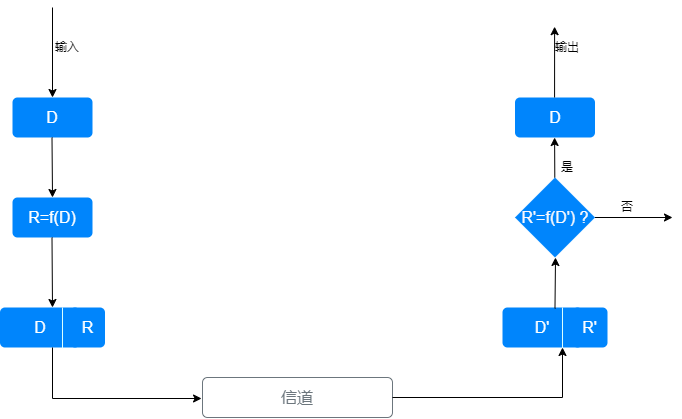
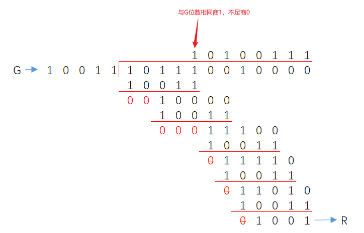
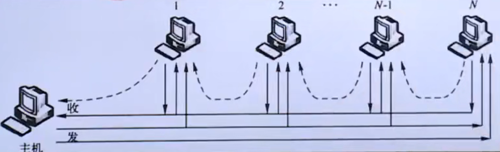
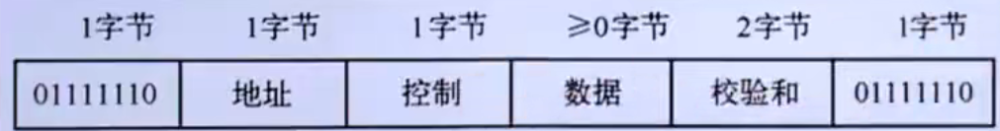

# 1、数据链路层服务

数据链路层负责通过一条链路，从一个结点另一个物理链路`直接相连`的相邻结点，传送网络层数据报，中间不再经过任何其他交换结点。

网络层数据报被封装进数据链路层的帧中传送。

**数据链路**是在物理线路之上，基于通信协议来控制数据帧传输的`逻辑`数据通路

实现数据链路层（协议）功能的典型硬件实体是`网络适配器`（NIC，网卡），网络适配器实质上需要实现数据链路层和物理层的功能。

**链路**

沿着通信链路连接的相邻结点的通信信道称为链路，数据链路层传输的数据单元称为`帧`。

**数据链路层提供的服务**

1. 组帧（成帧）

   1. 将需要传输的数据封装成帧；
   2. 在组成时会在数据的基础上增加帧头（帧首）和帧尾；
   3. 帧头通常包含发送结点和接受结点的地址信息等；帧尾通常包含用于差错检测的差错编码；
   4. 帧头和帧尾还包含一部分用于帧定界的信息，确保接受结点从物理层收到的比特流中依据定界字符或定界比特串识别帧的开始和结束；

2. 链路接入

   1. 物理链路分为`点对点链路`和`广播链路`两大类。
   2. 点对点链路，发送结点和接收结点独占通信链路，只有链路空闲就可以发送/接收帧；链路控制简单
   3. 广播链路，通信链路被多个结点共享，任意两个结点同时通过链路发送帧都会彼此干扰；每个结点必须运行`媒介访问控制MAC`Medium Access Control协议来协调各结点使用共享的物理传输媒介，实现帧的成功传输。

3. 可靠交付

   1. 数据链路层协议也可能提供可靠交付的服务，在相邻结点间经数据链路实现数据报的可靠传输。
   2. 停等协议、滑动窗口协议等都适用于数据链路层
   3. 实际上支持可靠数据传输的数据链路层协议多用于高出错率的链路中，如无线链路；
   4. 对于低出错率的链路如光纤等，实施可靠传输似乎没有太大必要；通常有线链路的数据链路层协议不提供可靠数据传输服务

4. 差错控制

   1. 数据链路层在物理媒介上传播的过程中，可能产生`比特翻转`差错；
   2. 在一定时间内，传输过程中出错的比特数占所传输比特总数的比率，称为`误比特率`
   3. 误比特率与线路的信噪比有很大关系。
   4. 通过确认重传或直接丢弃差错帧

   

# 2、差错控制

> 差错控制就是通过差错编码技术，实现对信息传输差错的检测，并基于某种机制进行差错纠正和处理，是计算机网络实现可靠传输的重要技术手段

**噪声**

信号在信道传输过程中，会受到各种噪声的干扰，从而导致传输差错。

噪声可以大致分为两类：`随机`噪声、`冲击`噪声。

> 随机噪声
>
> - 包括热噪声、传输介质引起的噪声等，具有典型的`随机`特征；
> - 引起的差错称为：随机差错/独立差错；具有独立性、稀疏性、非相关性；对于二进制传输通常呈现为随机的比特差错；
>
> 冲击操作：
>
> - 指突然发生的噪声，如雷击、电机启停等，具有强`突发性`；容易造成一段时间的传输差错
>
> - 引起的差错称：突发差错；通常是连续或成片的信息差错，差错具有相关性
> - 差错通常集中发生在某段信息；
> - `差错长度`：突发错误发生的第一位错误与最后一位错误中间的长度

## 差错控制的基本方式

不同网络对数据传输速率、实时性、可靠性、信道特征等需求不同；对于差错处理可以选择不同的差错控制方式

> 典型的差错控制方式包括：检错重发、前向纠错、反馈校验、检错丢弃

**检错重发**

> 发送端对待发送数据进行差错编码，编码后的数据通过信道传输；接收方利用差错编码检测数据是否出错，对于错误数据请求发送端重新发送；

**前向纠错**

> FEC(Forward Error Correction); 是接收端进行差错纠正的一种差错控制方法；
>
> 前向纠错需要利用`纠错编码`，这类编码不仅可以检测数据传输过程中是否发生了错误，还可以定位错误位置并直接加以纠正
>
> 适用于单工链路或对实时性要求比较高的应用

**反馈校验**

> 接收端将收到的数据发回给发送端，发送端对比接收端反馈的数据与发送的数据是否一致可以确认接收端是否正确接收数据；
>
> 如果不同则重新发送；直到反馈数据与发送数据一致。
>
> 优点是原理简单、易于实现、无需差错编码；
>
> 缺点：需要相同传输能力的反向信道，传输效率低，实时性差

**检错丢弃**

> 不纠正错误，而是直接丢弃错误数据；
>
> 适用于允许一定比例的差错存在，适用于实时性较高的系统

## 差错编码的基本原理

**香浓信道编码定理**指出：

> 对于一个给定的有干扰的信道，只要发送端以低于`信道容量`$C$的`数据速率`$R$发送信息，则一定存在一种编码方法，使得`编码错误概率`$P$随着`码长`$n$的增加而按指数下降到任意小的指。
>
> 即:理论上可以通过编码使得数据传输过程不发生错误，或者将数据错误概率控制在很小的数值之下；
>
> 

差错编码的基本原理：

> 1. 在带传输（或待保护）的数据信息的基础上附加一定的冗余信息；
> 2. 该冗余信息建立起数据信息的某种关联关系，将数据信息与冗余信息一起发送给接收端
> 3. 接收端可以检测冗余信息表征的数据信息的关联关系是否存在，如果不存在就有错误

## 差错编码的检错与纠错能力

检测码分为`检错码`与`纠错码`。

不同差错编码的检错或纠错能力是不同的；其与编码集的汉明距离有关。

**汉明距离**

> 两个等长码字的之间，`对应位`不同的位数，称为两个码字的汉明距离， 记为：$d_c$
>
> 01100101与10011101之间的汉明距离$d_c=5$; 有5位对应位不同。

**编码集的汉明距离**

> 定义一个编码集的汉明距离为该编码集中任意两个码字之间的汉明距离的最小值， 记为$d_s$

差错编码的所有有效码字的集合称为该差错编码的编码集。编码集的汉明距离与该编码的检错或纠错能力有关：

1. 对于`检错编码`，如果编码集的汉明距离$d_s=r+1$， 则该差错编码可以`检测`$r$位的差错
2. 对于`纠错编码`，如果编码集的汉明距离$d_s=2r+1$，则该差错编码可以`纠正`$r$位的差错
   1. 错码距离发生错误的有效码字的汉明距离最近，可以恢复为该有效码字
   2. 例：差错编码采用两次重复编码，$d_s=3$; 若数据为2位数据，采用二重重复编码的编码集为：{000000，010101，101010，111111}，$d_s=3$；
      1. r=(3-1)/2=1;可以纠正一位差错
      2. 如果发生一位差错，例如：收到码字100010，与有效码字的汉明距离分别为：2，5，1，4；100010与101010的汉明距离最小，因此将其恢复为101010
      3. 事实上101010错成无效码字100010的概率最大，所以恢复为101010

## 典型的差错编码

XOR按位异或运算操作

> 参与运算的两个位值，如果两个位值相同则结果为0，否则为1；
>
> 该操作等价于模2算数操作。用符号$\bigoplus$表示；

### 奇偶校验码

包含奇校验码、偶校验码；是一种最简单的`检错码`；奇偶校验码利用1为冗余信息实现差错检测，可以表示为（n, n-1）;

**奇校验码**

使得编码后的码字中“1”的个数为奇数；$a_{n-1} \oplus{\;}  a_{n-2}\;\oplus\; ... a_0=1$, $a_0$是冗余位， 其他位是数据位

**偶校验码**

使得编码后的码字中“1”的个数为偶数；$a_{n-1}\;\oplus{\;}  a_{n-2}\; \oplus\; ... a_0=0$, $a_0$是冗余位， 其他位是数据位

> 只有50%的检错率；有50%的漏检率；
>
> 编码简单；效率高；是开销最小的检错编码

### 汉明码

典型的线性分组码，可以实现单个比特`差错纠正`;当信息位足够长时，它的编码效率很高。

若一个信息位为$k=n-1$位的比特流($a_{n-1}a_{n-2}...a_1$)加上偶校验位$a_0$;构成一个n位的码字($a_{n-1}a_{n-2}...a_1a_0$)
$$
S=a_{n-1} \oplus \;a_{n-2} \;\oplus\; ...a_1\;\oplus\; a_0
$$
若S=0则无错， S=1则有错

S称作`校正因子`， 其表达式称为`监督表达式`

### 循环冗余码 \*\*\*\*

广泛应用的差错编码， 循环冗余检测编码（Cyclic Redundancy Check, CRC）;是一类重要的线性分组码， 也称多项式编码；该编码可以将要发送的位串看作为一个系数为0或1的多项式，对位串的操作被解释位`多项式算数运算`；

**CRC编码的基本思想**

> 将二进制位串看成是系数0或1的多项式的系数；
>
> 一个$k$位二进制数据可以看作是一个$k-1$次多项式的系数列表， 该多项式共有$k$项， 从$x^{k-1}\;到\;x^0$ ；称为 `k-1 阶`多项式
>
> 例：100101； 共有6位， 代表一个6项的多项式；系数分别是1，0，0，1，0，1； 即：$1x^5+0x^4+0x^3+1x^2+0x^1+1x^0=x^5+x^2+1$

使用CRC编码时，发送方与接收方必须预先商定一个`生成多项式`$G(x)$; 生成多项式的最高位与最低位必须是1；数据必须比生成多项式长；

在帧的尾部附加一个校验和，使得附加校验和之后的帧所对应的多项式可以被G(x)除尽；如果无法除尽则有错。

假设G(x)的阶为r， 则对应的位串有r+1位；

1. 在帧的低位加r个0位， 使该帧扩展位 m+r 位； m：数据位；对应的多项式为 $x^rM(x)$
2. 用G(x)系数对应的串，去除$x^rM(x)$系数对应的串， 求得r的余数 R
3. 用$x^rM(x)$系数对应的位串，减去余数R，结果就是完成CRC编码的帧。

例： 假设CRC编码采用的生成多项式为$G(x)=x^4+x+1$，请为10111001进行CRC编码

> $G(x)=x^4+x+1$对应的比特串为10011, 在待编码位串10111001后添加0000， 得到 101110010000。按如下计算过程求余数R=1001
>
> 
>
> 得到CRC编码后的结果为：101110011001

CRC编码的检错性能与选择的G(x)有很大关系。经过优选的典型G(x)

CRC-12, CRC-16, CRC-CCITT

# 3、多路访问控制协议

数据链路层使用的信道有两种：点对点信道和`广播信道`。

点对点信道：通信双方独享

广播信道：一对多通信，广播信道上连接的结点很多，信道被所有结点共享；必须使用`多路访问控制协议 MAC`来调节结点的数据发送；

MAC协议类型：信道划分MAC协议；随机访问MAC协议；受控接入MAC协议；

MAC协议的根本任务：解决信道的共享问题

## 信道划分MAC协议

**多路复用技术**

是实现物理信道共享的经典技术，基本思想是将信道资源划分后，分配给不同的结点；各结点通信时只使用其分配到的资源，从而实现了信道共享；避免多结点通信时的相互干扰；

多路复用是在物理线路的传输能力远远超过单一信道所需的传输能力时，可以将多条信道复合在一条物理线路上的技术；

采用`多路复用技术`的实现信道共享的MAC协议，称为信道划分MAC协议

多路复用包括：

1. 频分多路复用 FDM,Frequency Division Multiplexing；对应协议：FDMA
2. 时分多路复用 TDM,Time Division Multiplexing; 对应协议：TDMA
3. 波分多路复用 WDM,Wave Division Multiplexing; 对应协议：WDMA
4. 码分多路复用 CDM,Code Division Multiplexing; 对应协议：CDMA

### 频分多路复用

- `频域划分制`；在频域内将信道带宽划分为多个子信道，并利用`载波调制`技术将原始信号调制到对应某个子信道的波信号上，使得同时传输的多路信号在整个物理信道带宽允许范围内频谱不重叠，从而公用一个信道。
- 信道带宽与子信道的带宽决定了FDM的容量（同时可以传输多少路信号）；为了防止多路信号之间相互干扰，会使用`隔离频带`来隔离每个子信道
- 接收端利用`带通滤波器`对信号进行`分离、复原`
- FDM常用于`模拟传输`的带宽网络中

> 分路方便，模拟通信中常采用的一种复用方式：有线与微波通信系统应用广泛
>
> 各路信号之间存在干扰：`串扰`；滤波器特性不够理想；信道中的非线性特性造成的一条信号频谱展宽
>
> FDM系统所需设备随输入路数增加而增多，不易小型化；FMD不提供差错控制技术，不便于性能检测

### 时分多路复用

时域划分

将通信信道的传输信号在时域内划分为多个等长的时隙，每路信号占用不同的时隙，在时域上互不重叠，使多路信号合用单一通信信道从而实现信道共享

TDM系统的接收端，根据各路信号在通信信道上所占用的时隙分离并还原信号。

时分多路复用可以分为：

1. 同步时分多路复用：STDM；按照固定的顺序把时隙分配给各路信号；接收端采用严格同步的时隙分割方式以及完全相同的接收顺序进行多路信号的分离、还原
2. 异步时分多路复用：ATDM；为提高设备利用率，可以为有大量数据发送的用户分配较多的时隙；数量少的分配较少的时隙；没有数据的用户不分配时隙；这种分配方法叫做异步时分，也叫统计时分多路复用；
   1. ATDM中用户的数据并不是按照固定的时间间隔发送的，所以称为异步
   2. 信道传输速率最高为信道的总信息传输速率
   3. 可能导致多个用户访问信道带来的信道共享冲突问题

### 波分多路复用

广泛应用于光纤通信中；实质是一种频分多路复用，只是由于在光纤通信中，光载波频率很高，通常用光的波长来代替频率来讨论；另外光波在光纤中的传播有其特殊性

> 在一根光纤中，传输多路不同波长的光信号；由于波长不同所以各路光信号互不干扰
>
> 最有用波长解复用器将各路波长的光载波分解出来。

光纤中的波分多路复用开包括`密集`波分复用技术;波长划分更密集；复用度更高信道利用率更高，通信容量更大；

### 码分多路复用

从编码域划分。

通过利用更长的相互正交的码组分别编码各路原始信息的每个码元，使得编码后的信号在同一信道中混合传输，接收端利用码组的正交特性分离各路信号，从而实现信道共享。

## 随机访问MAC协议

所有用户都可以根据自己的意愿随机地向信道上发送信息，如果两个及以上用户都在共享信道上发送信息，则产生冲突（碰撞）导致用户信息发送失败；信息发送失败后，每个用户随机退让一段时间后，再次尝试，直到成功；

实际上是争用接入；竞争胜利者可以暂时占用共享信道来发送信息；竞争失败者随机等待一段时间后再次竞争直到竞争成功；

随机访问协议的特定：站点可以随时发送数据；争用信道容易发生冲突，需要消解冲突的机制；能够灵活适应站点数量及通信量的变化；

典型的随机访问MAC协议：ALOHA协议；载波监听多路访问协议；带冲突检测的载波监听多路访问协议；

### ALOHA

分为两种：纯ALOHA协议；时隙ALOHA协议

**纯ALOHA协议**

> 任何一个站点有数据想要发送就直接发送至信道；
>
> 发送站在发送数据后要对信道侦听一段时间，如果接收到接收站发送来的应答信号说明发送成功。否则随机等待一段时间后再进行重发；直至成功。
>
> 吞吐量 S：
>
> 在一帧的发送时间$T_0$帧时内成功发送的平均帧数。 0<S<1;
>
> 网络负载 G：
> 在一帧的发送时间$T_0$内发送的平均帧数，包括发送成功的帧和重发的帧； G>=SG; 只有不冲突时G=S
>
> 纯ALOHA中网络负载不大于0.5

**时隙ALOHA**

把信道时间分成离散的时隙，每个时隙为发送一帧需要的发送时间；每个通信站只能在每个时隙开始时刻发送帧，如果在一个时隙内发送帧出现冲突，下一个时隙以概率$P$重发该帧，直到帧发送成功。

P不能等于1， 否发生协议死锁。需要所有通信站在时间上同步；

降低了冲突的概率；

ＡＬＯＨＡ根本缺点：发送之前无论信道是否空闲都进行发送，会大大增加冲突的可能性；

### 载波监听多路访问协议CSMA

通过硬件装置（载波监听装置）使通信站在发送数据之前`监听`信道上其他站点是否在发送数据；如果在发送则暂时不发送，从而`减少冲突`的可能；（先听后说）

根据监听策略不同可以分为三种不同类型的CSMA

**非坚持CSMA**

侦听->空闲（发送）-> 忙/冲突(随机等待)->侦听

在随机等待的期间，可能信道已经空闲；或在等待期间其他站点抢先占用了信道导致延迟增加；

**1-坚持CSMA**

发送前先侦听，空闲时立即发送；忙时继续侦听直到发现信道空闲，然后立即发送

多个信道同时侦听到空闲后立即发送数据，会出现冲突；发送冲突后会等待一个随机时间后重新开始发送过程

**P-坚持CSMA**

适用于时隙信道。 

发送数据前侦听信道；

信道空闲时以概率P在最近时隙开始时刻发送数据，以概率$Q=1-P$延迟至下一个时隙发送；

若下一个时隙仍空闲，重复此过程直到数据发送或时隙被其他通信站占用；

信道忙时，则等待下一个时隙，重新开始发送过程；若冲突则等待一个随机时间然后重新开始发送过程；

### 带冲突检测的载波监听多路访问协议

CSMA/CD

在发现存在冲突时所有通信站都立即停止继续发送数据（冲突数据都无法使用）；这需要通信站在发送数据同时还要监听信道这就是CSMA/CD;（先听后说，边听边说）

**基本原理**

通信站使用CSMA发数据；在发送期间检测到碰撞后立即终止发送，并发出一个冲突强化信号，使所有通信站都直到重复发生；发出冲突强化信号后，等待一个随机时间后重复此过程。

CSMA/CD的工作状态可以分为：传输周期、竞争周期、空闲周期；对应信道有三种状态：传输状态、竞争状态、空闲状态；

## 受控接入MAC协议

特点是各用户不能随意接入信道而必须服从一定的控制；可分为`集中式控制`、`分散式控制`；

**集中式控制**

该方式系统中有一个主机负责调度其他通信站接入信道，从而避免冲突

- 主要方法是轮询技术

  - 轮叫轮询

    - 主机轮流查询各站是否有数据需要发送；无数据时通信站发送控制帧给主机
    - 轮询帧在共享线路上不断往返，形成较大开销，增加了帧发送的等待时延

  - 传递轮询

    - 主机先向站点N发送`轮询帧`，站点N没有数据发送时告诉主机并附加上其相邻主机（N-1）地址;

    

  

**分散式控制**

比较典型的分散式控制方法是`令牌技术`

令牌是一种特殊的帧，表示通信站使用信道的许可；在信道空闲时一直在信道上传输，一个通信站想要发送数据就要先获取令牌然后在一定时间内发送数据；数据发送完毕后重新产生新的令牌并发送到信道上，以便其他通信站使用信道。

最典型的令牌实现的多路访问控制的是`令牌环网`；

# 4、局域网

局部区域网络， 特点是覆盖范围小，网络传输速率高，误码率低。 拓扑类型主要包括星形网络、总线形网络、环形网络；常见是星形网络及星形网络为基础的树形网络；

IEEE802委员会将局域网数据链路层拆分为两个子层：逻辑链路控制（LLC）子层（IEEE802.2标准）和介质访问控制（MAC）子层；

## 数据链路层寻址、ARP

数据链路层的帧需要携带发送方与接收方的数据链路层地址；尤其在广播链路中必不可少，结点需要根据帧中的地址判断数据是否发送给自己；

ARP:实现网络层地址与链路层地址映射的`地址解析协议`

### MAC

用来表示局域网中的结点或网络接口，是结点的网络适配器具有链路层地址,称为MAC地址、物理地址、局域网地址；

链路层交换机是没有链路层地址的；链路层交换机的任务是实现透明地实现链路层帧的选择性转发；

MAC地址有6个字节48位，前24位是厂商地址；后24位是厂商自己分配的网卡地址；

特殊的广播帧：适配器发送一个希望其他所有适配器都接收并处理的帧；广播帧地址字段位特殊的MAC广播地址：全部是1的（FF-FF-FF-FF-FF-FF）

### 地址解析协议

用于根据本网目的主机或默认网关IP获取对应的MAC地址；

**ARP基本思想**

> 在每一台主机中设置专用内存区域（ARP高速缓存）记录主机所在局域网中其他主机和路由器的IP地址与MAC的映射关系，并且这个映射表要经常更新；
>
> ARP通过广播`ARP查询报文`来询问某目的IP地址对应的MAC地址；
>
> ARP模块：每个主机和路由器都有一个ARP模块（实现ARP的软件实体），ARP模块以主机的IP地址为输入然后返回其MAC地址；

**ARP工作过程** 查询/响应

> 每台主机或路由器在其内存都有一个ARP表, 存储IP到MAC的映射关系;
>
> - ARP表不必包含子网内所有主机的和路由器接口的映射;
> - 同一子网下,ARP通过ARP查询分组并广播该分组查询目的IP对应的MAC; 目的IP对应的网络适配器通过IP匹配到后,单播一个`ARP响应分组`返回其对应的MAC地址
> - 不同子网下,源主机通过路由可以知道目的主机是否为同一子网,不同子网时将IP数据报发送给源主机的默认网关;

**ARP&DNS**

> 解析内容不同 DNS:域名->IP; ARP:IP->MAC
>
> 解析范围不同 DNS:全网; ARP:子网内
>
> 实现机制不同 DNS:分布式数据库,在层次结构的DNS服务器之间查询; ARP:在局域网内广播ARP查询;

## 以太网 Ethernet

经典以太网是采用粗同轴电缆连接的总线型以太网(10base-5);传输速率为10Mbit/s,一个冲突域内最多有5个网段; 每段最长500米; 网段之间用中继器连接;

MAC协议采用CSMA/CD协议; 

## 以太网帧结构

| 目的地址(6字节) | 源地址(6字节) | 类型(2字节) | 数据(46~1500字节) | CRC(4字节) |
| --------------- | ------------- | ----------- | ----------------- | ---------- |

### 以太网技术

Base 基带传输

- 10Base-5、10Base-T、10Base-2
  - 10Base-5 10Mbit/s; 采用`粗同轴电缆`；单段距离最大`500m`
  - 10Base-T 10Mbit/s; 采用非屏蔽`双绞线UTP`, 一段双绞线的最大长度`100m`
  - 10Base-2 10Mbit/s; 采用`细同轴电缆`；单段距离最大200m（实际185m)
- 快速以太网 100Base-T
  - 在传统以太网基础上发展的，1`00Mbit/s`; 
  - 三种物理层规范： 
    - 100Base-TX;  双绞线；采用两对5类UTP
    - 100Base-T4;  双绞线；采用四对3、4、5类UTP
    - 100Base-FX;  双绞线；采用光缆
- 千兆以太网；`1000Mbit/s`; 完全兼容传统以太网；支持各种已有设备和应用；
  - 多种物理层规范
    - 1000Base-SX 、1000Base-LX 采用光纤；
    - 1000Base-T 采用5类UTP，最长距离100m
    - 1000Base-CX 采用150欧平衡屏蔽双绞线（STP);最大传输距离`25m`；使用9芯D型连接器连接电缆；适用于交换机之间连接及主干交换机与主服务器间短距离连接；
- 万兆以太网

## 交换机

可以根据收到的链路层帧的目的MAC地址，选择性地转发到相应的端口；交换机的转发与过滤功能；

以太网交换机转发和过滤

当帧到达交换机时，交换机先确认丢弃或转发；如果转发，则判断转发到哪个端口；

- 以目的MAC为键查询内部交换表；
  - 丢弃：如果有目的MAC地址对应的表项，且对应的端口与接收端口相同
  - 转发：
    - 如果有目的MAC地址对应的表项，且对应的端口与接收端口不同
    - 如果没有目的MAC地址对应的表项，向除接收端口外其他端口转发帧（`泛洪`）
- 交换机的交换表时在网络的运行过程中，通过自学习算法自动地逐渐建立起来的；
- 通过交换机互连的主机不再属于一个冲突域，不会发送传统的冲突；实现了冲突域的分割；交换以太网；
- 交换机的优点
  - 消除冲突
  - 支持异质链路
  - 网络管理

## 虚拟局域网

1. 虚拟局域网是一种基于交换机（支持VLAN功能）的逻辑分割广播域的局域网应用形式； 可以不受物理位置的限制，以软件的方式划分和管理局域网中的工作组，限制接收广播信息的主机数，抑制广播风暴；
2. 划分方法
   1. 基于交换机端口划分
   2. 基于MAC地址划分
   3. 基于上层协议类型或地址

3. 优点
   1. 抑制广播风暴
   2. 逻辑工作组划分灵活
   3. 提高安全性

# 5、点对点链路协议

## PPP协议

Point to Point Protocol

能够处理差错检测、支持多种上层协议、允许在连接时刻协商IP地址、允许身份认证

主要提供3类功能

1. 成帧; 确定帧的开始结束
2. 链路控制协议 LCP, Link Control Protocol
3. 网络控制协议 NCP，Network Control Protocol

典型应用场景：拨号上网；

## HDLC协议

High-level Data Link Control 高级数据链路可攻至协议； 可以应用于点对点链路和点对多点链路； HDLC面向位的协议；

帧定界： `0`111111`0`

HDLC三种类型的帧：

1. 信息帧
2. 管理帧
3. 无序号帧

**位填充**

发送端：当发现数据字段有5个连续的1，就立即插入一个0；保证数据字段不会出现6个连续的1

接收端：当发现数据流中5个连续的1，就删除其后的0，还原成原来的信息；

