# 数据通信基础

信道容量

基带传输编码

频带传输与调制技术

## 数据通信基本概念

**消息**：将人类能够感知的描述称为消息；声音，味道等

**信息**：抽象概念；信息是对事物状态或存在方式的不确定性表述；是可以度量的，其大小与消息的不确定性成反比；

**通信**的本质就是在一点精确或近似地再生另一点的信息；通信的目标是尽可能远、准确、快速地传递信息；

**通信系统**：能够实现通信功能的各种技术、设备、和方法的总体称为通信系统

**信号**：通信系统中，在传输通道中传播的信息的载体；

- 连续信号
- 离散信号

**数据**：数据是对客观事物的性质状态以及相互关系等进行记载的符号及其组合；

信道：是信号的传输介质；以传输介质为基础的信号通道；狭义信道、广义信道

## 数据通信系统模型

### 通信系统的构成

任何通信系统的核心都包括：信源、发送设备、信道、接收设备、信宿，噪声源

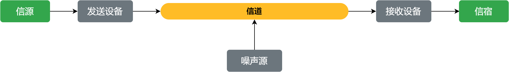

信源：将消息转换为信号的设备，电话机，计算机

发送设备：将信源产生的信号进行适当变换的装置，使信号适合在信道中传输（编码和调制）

信道：信号传输的媒介（有线信道、无线信道）

接收设备：完成发送设备的反变换；译码、解调

信宿：信号的终点；将信号转变为人们可以识别的消息

噪声：对通信信号产生干扰和影响的各种信号；

数据通信系统将信源、信宿限定为能够产生、存储和处理二进制数据的设备；如计算机、智能终端等；

### 模拟通信、数字通信

通信系统根据信号种类可分为：模拟通信系统、数字通信系统

模拟通信系统：传输模拟信号

数字通信系统：传输数字信号

模拟信号：信号的因变量是连续的

数字信号：信号的因变量是离散的

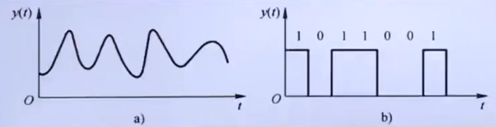

### 数据通信方式

1. 数据传输方向
   1. 单向通信、双向交替通信、双向同时通信（单工、半双工、全双工）
2. 按二进制数据传输的时空顺序
   1. 并行通信：为一个字节的每一位都设置一个传输通道，全部位同时进行传送；速度快、造价高
   2. 串行通信：每一位依次在一条通道中传输； 速度慢、开销小
3. 按收发双方对数据保持步调一致的措施
   1. 异步通信 
   2. 同步通信

### 通信系统的功能

- 信道的利用
- 接口及信号产生
- 同步
- 差错检测与纠正
- 寻址与路由
- 网络管理
- 安全保证

# 物理介质

通信时需要将信号通过某种介质进行传输，即物理介质；是传输信息的载体，常用介质分为`引导型`介质和`非引导型`介质；

## 导引型传输介质

又称为有线信道，以导线为传输介质；信号沿导线进行传输；信号能量集中在导线附近，因此传输`效率高`； 部署不够灵活；

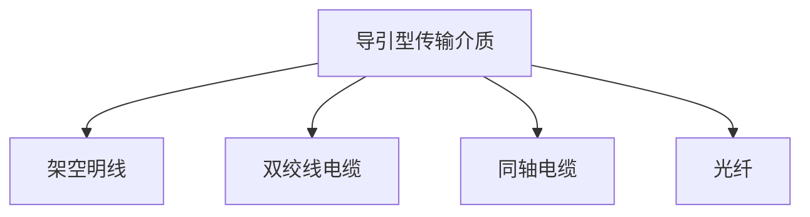

- 架空明线；淘汰
  - 指平行且相互分离的或绝缘的架空裸线线路；
  - 通常采用铜线或铝线等金属导线
  - 长距离传输的最高允许频率为150KHz左右；可以复用16路语音信号
  - 短距离传输频率可达300kHz左右，可再增加复用12路语音信号
- 双绞线电缆
  - 将两根相互绝缘的铜线并排绞合在一起， 减少对相邻导线的电磁干扰； 
  - 屏蔽双绞线 STP： 在护套与线对之间有一层由金属丝编制的屏蔽层；可以提高抗电磁干扰能力
  - 非屏蔽双绞线 UTP：没有屏蔽层；
    - UTP规定了5个种类，3类UTP用于电话网络；5类UTP常用与局域网；不同类别双绞线主要差异是单位长度的绞合次数；
- 同轴电缆
  - 类似有线电视线路；抗电磁干扰性能好；现主要用于频带传输（有线电视）；
- 光纤
  - 利用光的`全反射`现象；由两种折射率不同的导光介质复合纤维制成，内层为`纤芯`；外层为`包层`
  - 通信容量大、距离远、抗电磁干扰性能好、保密性好、； 易断、接线安装复杂；
  - 多模光纤
  - 单模光纤

## 非导引型传输介质

利用无线电在自由空间的传播实现多种通信；将自由空间称为“非导引型传输媒介”；

根据电磁波频率、通信距离与位置不同，电磁波的传播可分为：

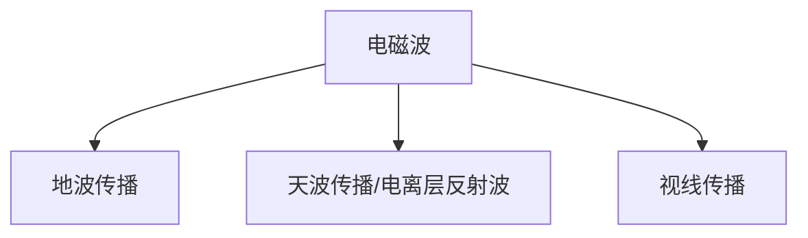

- 地波传播
  - 频率低 2MHz的电磁波趋于沿地球表面传播；
  - 低频信号；数百、数千米
- 天波传播
  - 利用电离层反射的传播方式为天波传播；
  - 高频信号（2-30MHz），利用电离层的反射传播；最大距离达4000KM；多次反射可1万km以上
  - 信道特征随时间变化；典型的随参信道
- 视线传播
  - 高于30MHz的电磁波将穿透电离层，不会反射会回来；
  - 常用于视线无障碍的点对点直线传播（视距传播）
  - 通过中继站或卫星接力传输实现远距离通信

# 信道与信道容量

狭义信道：信号传输介质

广义信道：信号传输介质+通信系统的一些变换装置

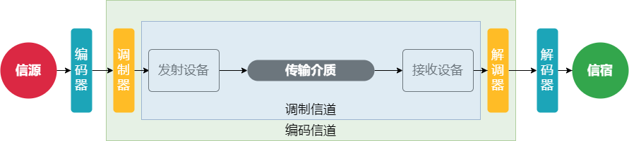

- 广义信道可以分为
  - 调制信道：信号从调制器的输出端传输到解调器的输入端经过的部分；
  - 编码信道：数字信号由编码器输出端传输到译码器的输入端所经过的部分；包括其中所有的变换装置和传输介质；

## 信道传输特性

- `恒参信道`：信号通过信道发生的畸变与时间无关的各种信道；有线信道、部分无线信道（中长波地波、超短波及微波视距传播、卫星中继）
- `随参信道`：信号通过信道发生的畸变是时变的；

- 恒参信道传输特性
  - 传输特性变换小、缓慢；微波视线传播、卫星链路等
  - 对信号`幅值`产生`固定的衰减`
  - 对信号输出产生`固定的时延`
- 随参信道传输特性
  - 传输特性随时间随机快速变化；
  - 信号的传输`衰减`随时间`随机`变化
  - 信号的传输`时延`随时间`随机`变化
  - 存在`多径传播`现象
    - 发射天线发射出的电磁波可能经过多条路径到达接收端，每条路径对信号的衰减和时延都随机变化；

## 信道容量 \*\*\*\*

信道的带宽：能够有效通过该信道的信号的最大频带宽度；

传输速率：描述信道单位时间内传输码元（或符号）或信息的能力； 前者用码元速率描述(单位：Baud)；后者由传信率描述（单位：bit/s）

信道容量指信道无差错传输信息的最大平均信息速率。

信息论中将信道划分为连续信道和离散信道（数字信道）； 连续：输入输出信号都是取值连续的； 离散：输入输出信号都是取值离散的时间函数；

**连续信道容量**

> 根据奈奎斯特第一准则，对于理想无噪声的基带传输系统，最大频带利用率为 $2Baud/Hz$;
>
> 如果传输$M$进制基带信号，则理想`无噪声`信道的信道容量为：
> $$
> C=2B\log_{2}M
> $$
>
> 香浓公式给出了`有噪声`连续信道的信道容量公式:
> $$
> C=B\log_2(1+\frac{S}{N})
> $$
> B: 信道的带宽、S: 输入信号的功率、N: 信道加性高斯白噪声
>
> S/N: 信噪比
>
> 信噪比转换关系：
> $$
> (\frac{S}{N})_{dB}=10\log_{10}(\frac{S}{N})_{功率}
> $$

示例

已知某信道容量为8kHz; 信噪比为30dB； 求该信道的信道容量C

1. 先转换信噪比
2. 在利用公式计算容量

> 信噪比$\frac{S}{N}_{功率}=10\log_{10}(\frac{S}{N})=10^{\frac{\frac{S}{N}}{10}}=10^{30/10}=1000$
>
> $C=B\log_2(1+\frac{S}{N})=8*10^3\log_2(1+1000)\approx 80kbit/s$

**离散信道容量**

可以用两种方式度量：

1. 每个符号能够传输的最大平均信息量表示的信道容量$C$
2. 单位时间内能够传输的最大平均信息量表示的信道容量$C_t$

## 基带传输

信源可以分为模拟信源、数字信源； 模拟信源发出的原始电信号是`模拟基带信号`；数字信源发出的基带信号为`数字基带信号`；

模拟基带信号 ->【信源编码】->数字基带信号

数字信号在数字通信系统中的主要传输方式：基带传输、频带传输

### 基本概念

基带传输：直接在信道中传输基带信号；

数字基带传输系统基本结构

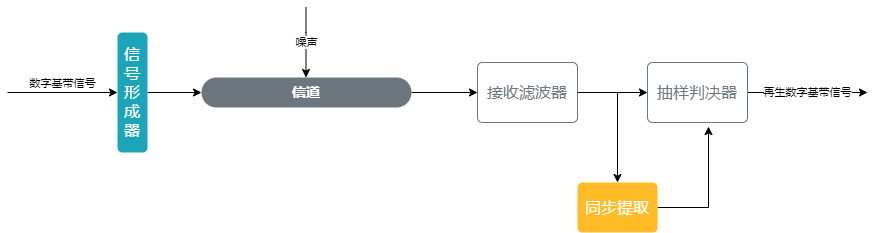

信号形成器：

负责对数字基带信号进行码型变换和波形变换，以匹配信道的传输特性；

把原始的数字基带信号变换为适合信道传输特性的数字基带信号

接收滤波器：滤除噪声

### 数字基带传输编码

常见的信号码型、传输码型

常见的数字基带信号码型：利用矩形脉冲信号的幅值编码二进制数字数据；

#### 数字基带信号码型

- 单极不归零码 Not Return to Zero,NRZ
- 双极不归零码 
- 单极归零码 Return to Zero,RZ
- 双极归零码
- 差分码
- 多元码

单极：脉冲幅值要么是正电平，要么零电平；只有一个极性；

双极：脉冲幅值有正电平、负电平；

不归零：在整个脉冲持续时间内，电平保持不变；脉冲持续期结束时不要求必须回归零电平；

归零：每个正脉冲持续期的中间时刻，电平要由正电平回到零电平；

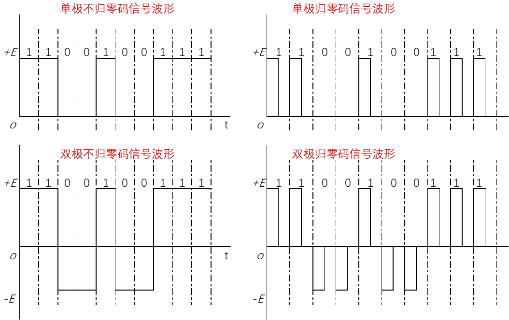

**差分码**： 利用电平的变换与否来表示信息。如：相邻脉冲用电平`跳变`表示1，无跳变表示0；

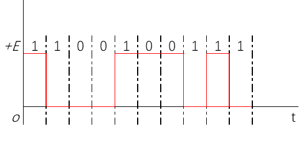

#### 传输码

**信号交替反转码 AMI**

用三种电平进行编码； 零电平编码二进制0；二进制信息1（传号）则`交替`用正电平和负电平表示；

`信号1交替用正、负电平表示`

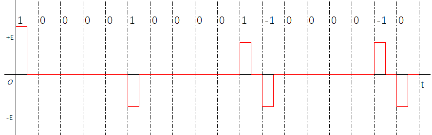

- 正负脉冲交替编码信息1，不会产生直流分量积累，有利于机械能基带传输；

- 编译码电路实现简单，可以利用正负脉冲交替变换的规律检测误码；
- 大连连续的0位串电平长时间不变，定时信息提取困难；

**双相码** 曼彻斯特码

只有正负两种电平，每位持续时间的中间时刻要进行电平跳变；

正电平跳变到负电平表示1； 负电平跳变到正电平表示0；

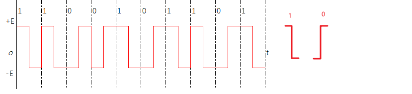

**差分双相码**

有跳变表示1， 无跳变表示0；

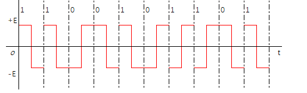

1： 相对于前一位的电平（后半周期）进行跳变

0： 先对于前一位的电平（后半周期）保持不变

每一周期内都要跳变

**CMI码 传号反转码**

CMI 码的编码规则是将信息码的 0 编码为双极不归零码的 01，信息码的 1 交替编码为双极不归零码的 11 和 00。

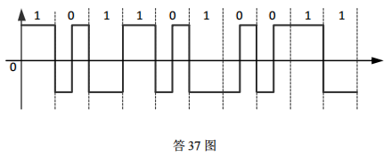

## 频带传输

模拟调制：利用模拟基带信号调制载波

数字调制：利用数字基带信号调制载波

**数字调制**

> 利用数字基带信号控制载波信号的某些特征参量，使载波信号的这些参量的变化反映数字基带信号的信息，进而将`数字基带信号`变化为`数字通带信号`；

**数字频带传输系统**

> 将实现调制、传输与解调的传输系统称为数字频带传输系统；
>
> 频带传输也称通带传输、载波传输

**键控法**

> 利用两种不同的幅值、频率、相位来分别表示基本信息0或1； 这种调制方法称为键控法；
>
> 分别有：幅移键控 ASK、频移键控 FSK、相移键控 PSK

### 二进制数字调制

- 二进制幅移键控 2ASK
- 二进制频移键控 2FSK
- 二进制相移键控 2PSK
- 二进制差分相移键控 2DPSK

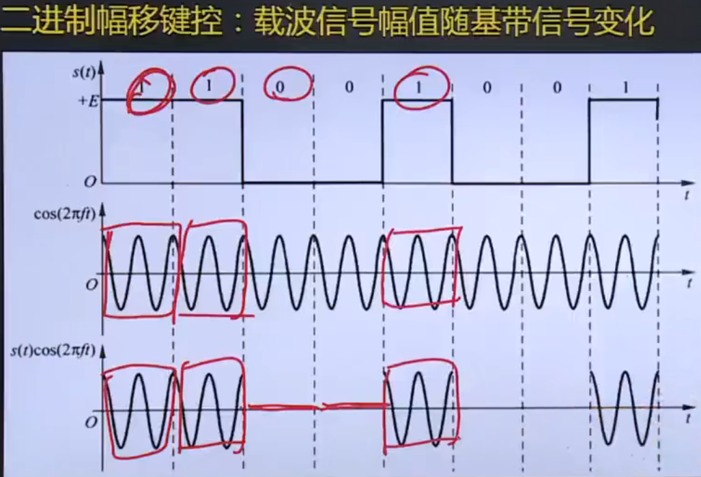

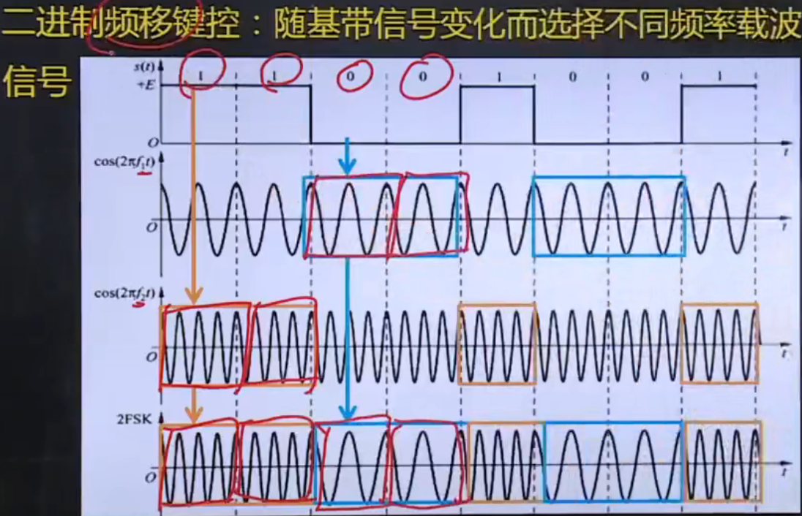

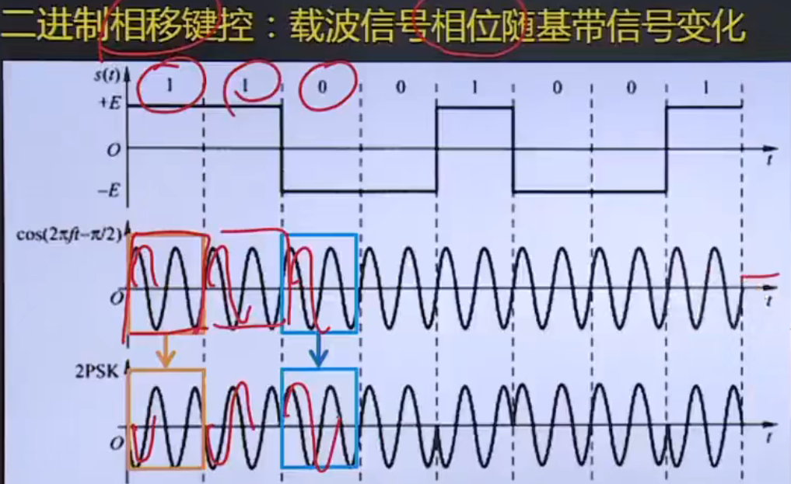

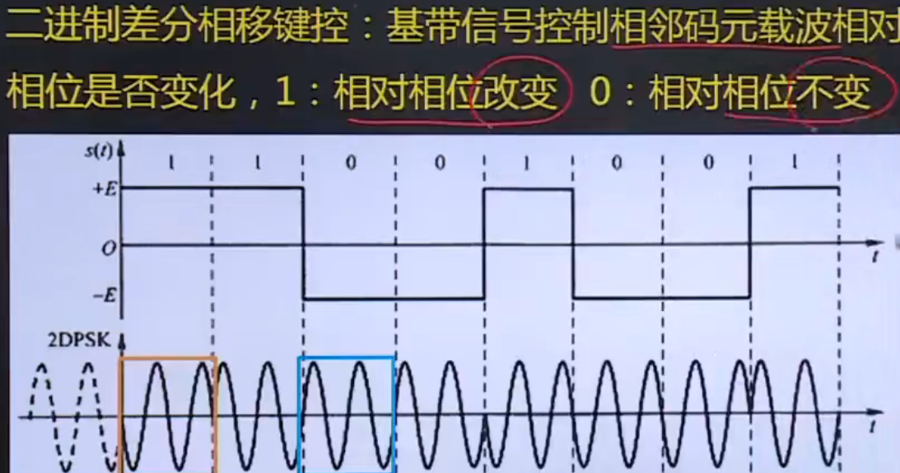

## 物理层接口规程

物理层接口规范的定义包含4个特性：

- 机械特性
  - `指明通信实体间硬件接口的机械特点`；形状、尺寸、引线数目和排列、锁定装置等
- 电气特性
  - `在物理连接上导线的电气特性及有关电路的特性`；信号的电平、最大传输速率、发送器输出阻抗
- 功能特性
  - `指明物理接口各条信号线的用途`；数据信号线、控制信号线、定时信号线、接地线等
- 规程特性
  - `通信协议；指明利用接口传输比特流的全过程；各项用于传输的事件发生的合法时序`；事件的执行顺序和数据传输方式；

物理层接口规范定义DTE、DCE之间的接口特性；

DET: 数据终端设备

DCT：数据电路端设备
