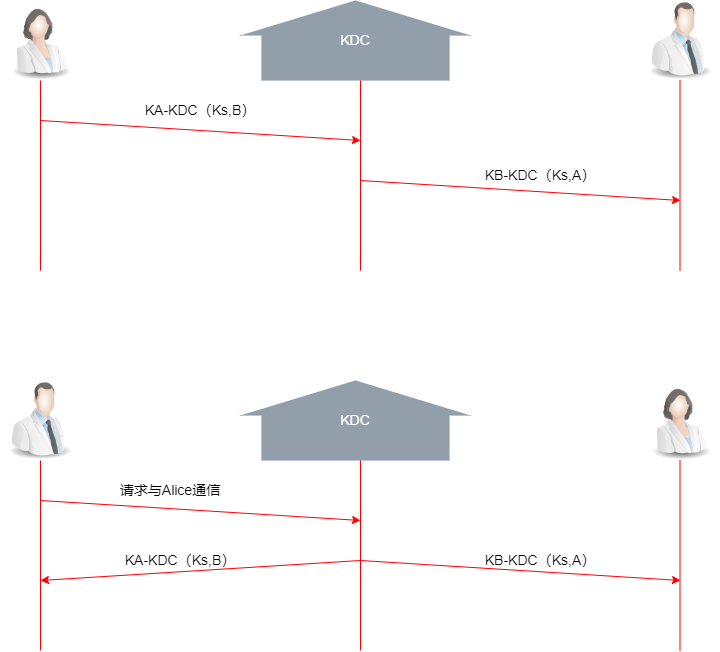

# 网络安全概述

网络安全指的是网络系统中的硬件、软件及其系统中的数据收到保护，不因偶然或恶意的原因而遭受到破坏、更改、泄露，系统连续可靠正常地运行，网络服务不中断；

网络安全通信所需要的**基本属性**：

1. 机密性

   只有发送方与预定接收方能够理解报文内容； 加密、解密； 是保证网络信息安全的重要手段；

2. 消息完整性

   发送方与接收方希望确保消息未被篡改，发生篡改一定会被检测到；

3. 可访问与可用性

   网络信息可被授权实体访问并按需求使用的特点； 

4. 身份认证

   发送方与接收方希望确认彼此的真实身份；

## 网络安全威胁

- 报文传输方面： 窃听、插入、假冒、劫持等
  - 窃听：报文传输过程中窃听信息、获取报文信息
  - 插入：在信息中插入信息，混淆信息
  - 假冒：伪造分组中的源地址或其他字段
  - 劫持：通过移除、取代发送方或者接收方“接管”连接

- 拒绝服务DoS以及分布式拒绝服务DDoS；
  - 拒绝服务：阻止服务器为其他用户提供服务；
  - DDoS: 首先选择目标，然后入侵网络中的主机，构建僵尸网络； 然后再控制僵尸主机向目标发送分组；
- 映射：
  - 在发起攻击前先”探路“，找出网络上在运行什么服务；然后利用ping命令确定网络上的主机的地址；最后利用`端口扫描`的方法依次尝试与每个端口建立TCP连接；
- 分组”嗅探“
  - 通常发送在共享式以太网或无线网络中，”嗅探“主机通过混杂模式网络接口卡，可以接收或记录所有广播介质上的分组/帧，可以读到所有未加密数据； Wireshark
- IP欺骗
  - 直接由应用生成”原始“IP分组，设置分组的源IP地址字段为任意值，接收方无法判断源地址是否被欺骗，可能导致错误数据的接收或隐藏网络安全攻击身份；

# 数据加密

> 明文: 未加密的消息；
>
> 密文: 被加密后的消息
>
> 加密: 伪装消息以隐藏消息的过程， 即明文转变为密文的过程；
>
> 解密: 密文转变为明文的过程

根据密码学的定义，可以得到一套完整密码体制，包括MCKED五个部分:

- M 是可能明文的有限集，称为明文空间
- C 是可能密文的有限集，称为密文空间
- K 是一切可能密钥构成的有限集， 称为密钥空间
- E 是加密算法， 对于任一密钥，都能够有效地计算
- D 是解密算法， 对于任一密钥，都能够有效地计算

## 传统加密方式

历史上加密方法被分为`替代密码`和`换位密码`两类；

替代密码：将明文替换为其他字母数字或符号的方法

换位密码：通过置换而形成新的排列

### 替代密码

将明文字母表M中的每个字母用密文字母C中的相应字母来代替； 常见的加密模型有移位密码、乘数密码、仿射密码；

**移位密码**

> 将字母表中的字母右移$k$个位置，并对字母表长度做模运算， 每一个字母具有两个属性：本身代表的含义；可计算的位置序列值
>
> 加密函数：
> $$
> E_k(M)=(M+k) \mod q
> $$
> 解密函数：
> $$
> D_k(C)=(K-k)\mod q
> $$
> 应用：恺撒密码；  将字母顺序推后3位
>
> ”bob, i love you. alice“; 利用k=3的恺撒密码加密；
>
> abcdefg...xyz
>
>    defghi...abc; 于是 ”bob, i love you. alice“ 加密后的密文为："ere, i oryh brx, Dolfh"
>
> | a    | b    | c    | d    | e    | f    | g    | h    | i    | j    | k    | l    | m    | n    | o    | p    | q    | r    | s    | t    | u    | v    | w    | x    | y    | z    |
> | ---- | ---- | ---- | ---- | ---- | ---- | ---- | ---- | ---- | ---- | ---- | ---- | ---- | ---- | ---- | ---- | ---- | ---- | ---- | ---- | ---- | ---- | ---- | ---- | ---- | ---- |
> | d    | e    | f    | g    | h    | i    | j    | k    | l    | m    | n    | o    | p    | q    | r    | s    | t    | u    | v    | w    | x    | y    | z    | a    | b    | c    |
> |      |      |      |      |      |      |      |      |      |      |      |      |      |      |      |      |      |      |      |      |      |      |      |      |      |      |
> | M:   | b    | o    | b    | i    | l    | o    | v    | e    | y    | o    | u    | a    | l    | i    | c    | e    |      |      |      |      |      |      |      |      |      |
> | C:   | e    | r    | e    | l    | o    | r    | y    | h    | b    | r    | x    | d    | o    | l    | f    | h    |      |      |      |      |      |      |      |      |      |

**换位密码**

根据一定规则重新排列明文；以便打破明文的结构特性；

换位密码可分为：列置换密码、周期置换密码；

> 列置换密码
>
> 明文按照密钥的规定，按列换位，并且按列读出新的序列得到密文；
>
> | 1    | 2    | 3    | 4    | 5    | 6    | 7    | 8    | 9    | 10   | 11   | 12   | 13   | 14   | 15   | 16   | 17   | 18   | 19   | 20   | 21   | 22   | 23   | 24   | 25   | 26   |
> | ---- | ---- | ---- | ---- | ---- | ---- | ---- | ---- | ---- | ---- | ---- | ---- | ---- | ---- | ---- | ---- | ---- | ---- | ---- | ---- | ---- | ---- | ---- | ---- | ---- | ---- |
> | a    | b    | c    | d    | e    | f    | g    | h    | i    | j    | k    | l    | m    | n    | o    | p    | q    | r    | s    | t    | u    | v    | w    | x    | y    | z    |
> |      |      |      |      |      |      |      |      |      |      |      |      |      |      |      |      |      |      |      |      |      |      |      |      |      |      |
> | 4    | 3    | 1    | 2    |      | 相   | 对   | 次   | 序   |      |      |      |      |      |      |      |      |      |      |      |      |      |      |      |      |      |
> | n    | i    | c    | e    |      | K    |      |      |      |      |      |      |      |      |      |      |      |      |      |      |      |      |      |      |      |      |
> |      |      |      |      |      |      |      |      |      |      |      |      |      |      |      |      |      |      |      |      |      |      |      |      |      |      |
> | b    | o    | b    | i    |      |      |      |      |      |      |      |      |      |      |      |      |      |      |      |      |      |      |      |      |      |      |
> | l    | o    | v    | e    |      |      |      |      |      |      |      |      |      |      |      |      |      |      |      |      |      |      |      |      |      |      |
> | y    | o    | u    | x    | 填   | 充   | 符   |      |      |      |      |      |      |      |      |      |      |      |      |      |      |      |      |      |      |      |
> |      |      |      |      |      |      |      |      |      |      |      |      |      |      |      |      |      |      |      |      |      |      |      |      |      |      |
> | 按   | 相   | 对   | 次   | 序   | 对   | 应   | 的   | 列   | 顺   | 序   | 输   | 出   |      |      |      |      |      |      |      |      |      |      |      |      |      |
> | 1    |      |      |      | 2    |      |      |      | 3    |      |      |      | 4    |      |      |      |      |      |      |      |      |      |      |      |      |      |
> | b    | v    | u    |      | i    | e    | x    |      | o    | o    | o    |      | b    | l    | y    |      |      |      |      |      |      |      |      |      |      |      |

## 现代密码加密

现代密码将替代密码、换位密码结合，并利用复杂的加密过程，提高密码的安全性；

现代密码分为：对称密钥加密、非对称密钥加密

对称密钥： 加密密钥和解密密钥是相同的；

非对称密钥：加密密钥和解密密钥是不同的；

### 对称密钥加密

对称密钥加密系统分为：`分组`密码、`流`密码（序列密码）;

**流密码（序列密码）**

通过伪随机数发生器产生随机序列（密钥流）按密钥流加密明文消息流

解密时用相同密钥流按加密逆过程解密；

**分组密码（块密码）**

将消息按固定长度分成若干组，每组长度单独加密解密

> - DES 56位密钥；64位分组； 16轮加密，每轮都进行复杂的替代和置换操作；
> - 三重DES 两个不同的密钥（112位）；执行三次DES算法；
> - AES 128位分组； 密钥128/192/256位； 加密过程涉及4种操作：字节替代、行移位、列混淆、轮密钥加
> - IDEA 64位分组； 128位密钥；

### 非对称/公开密钥加密

密钥成对使用；公钥用于加密（公钥公开）；私钥用于解密（只有自己有）；

公钥：$K^+_B$; 私钥：$K_B^-$

典型公钥算法：

Diffie-Hellman 算法

RSA 算法

# 消息完整性与数字签名

报文/消息完整性主要目标：

1. 证明报文确实来自声称的发送方
2. 验证报文在传输过程中没有被篡改
3. 预防报文的时间、顺序被篡改
4. 预防报文持有期被篡改
5. 预防抵赖（发送方否认已发送消息、接收方否认已接受消息）

**消息完整性检测方法**

密码散列函数

- 算法公开；快速计算；
- 定长输出（任意长度的报文进行多对一映射均能产生定长输出）
- 对任意报文无法预知其散列值
- 不同报文不能产生相同散列值
- 单向性（无法根据散列值逆推出报文）
- 抗碰撞性（无法找到具有相同散列值的两个报文）

典型散列函数

- MD5 128位散列值；

- SHA-1 106位散列值； 用于计算数字签名

## 报文认证

报文认证是使消息的接收者能够检验收到的消息是否是真实的认证方法；

两个目的： 1. 消息来源的真实性；2.消息的认证（消息传送过程中没有被篡改）

- 报文摘要（数字指纹） H(m)

**简单报文认证**

使用报文摘要对消息进行认证（消息是否被篡改），但是无法认证消息源； H(m)算法是公开的

**报文认证码**

MAC(message authentication code)

收发双方使用共享密钥； 发送方根据共享密钥发生扩展报文$(m, H(m+s))$;

- 接收方可以自己篡改消息

## 数字签名

可以做到：身份认证；数据完整性；不可否则

**简单数字签名**

直接对报文签名

**签名报文摘要**

对报文摘要进行签名；

## 身份认证

口令： 会被窃听

加密口令：可能遭受回放（重放）攻击

加密一次性随机数：可能遭受中间人攻击

# 密钥分发中心、证书认证机构 

KDC ： 密钥分发中心； 证书认证机构：CA

基于KDC的密钥生成与分发

1. 通信发起方生成密钥，KDC进行分发
2. KDC生成并分发密钥；

**证书认证机构**

认证中心CA：将公钥与特定的实体绑定；（确保通信实体与公钥是一致的）

作用：

1. 证实一个实体的真实身份
2. 为实体颁发数字证书（实体身份与公钥绑定）

# 防火墙

防火墙能够隔离组织内部网络和公共互联网，允许某些分组通过而阻止其他分组进入或离开内部网络的软件、硬件或软件硬件结合的一种设施；

发挥作用的`前提`：要保证从内部到外部和从外部到内部的所有流量都经过防火墙，并且仅被授权的流量允许通过，防火墙能够限制对授权流量的访问；

## 分类

大致可以分为三类：有状态分组过滤器；无状态分组过滤器；应用网关；

### 无状态分组过滤器

部署在内部网络和边缘网络路由器上；

> 一个机构网络通常都会有至少一个将其内部网络与外部网络相连的`网关路由器`；所有进出流量都会经过网关路由器；
>
> 分组过滤是网关路由器的重要功能之一；路由器逐个检查数据报，然后`基于特定规则对分组是通过还是丢弃进行决策`。
>
> 决策参数：
>
> - IP数据报的源IP、目的IP
> - TCP/UDP报文段的源端口号、目的端口号
> - ICMP报文类型
> - TCP报文段的SYN和ACK标志位等
>
> 使用访问控制列表 ACL 实现防火墙规则

### 有状态分组过滤器

> 有状态分组过滤器使用连接表跟踪每个TCP连接； 分组过滤器跟踪建立（SYN)、拆除（FIN)，根据状态确定是否放行进入或外出的分组；
>
> 对于超时的非活动连接，则不再允许通过；

### 应用网关

> 鉴别用户身份或针对授权用户开放特定服务；

## 入侵检测系统 IDS

> IDS 是当观察到潜在的恶意流量时，能够产生警告的设备或系统；
>
> IDS不仅仅针对TCP/IP首部进行操作，还会进行深度包检测，并检测多数据之间的相关性；
>
> IDS 会对分组进行深度检查，同时每个过往分组都要与大量特征进行比较，可能导致极大的数据处理量；

# 网络安全协议

## 安全电子邮件

电子邮件对网络安全的需求体现在：

1. 机密性：只有接收方可以阅读
2. 完整性：邮件在传输中不被篡改；可以判断邮件是否被篡改
3. 身份认证性：接收方可以确认发送方的身份，且不能被假冒
4. 抗抵赖性：收发双方都不能对已发/收操作否认

电子邮件还具有单向性、非实时性

安全电子邮件标准： PGP； 

## 安全套接字层 SSL

1. SSL是介于应用层和传输层之间的安全协议
2. SSL协议栈
3. SSL握手过程

简化SSL包含4个部分

1. 发送方和接收方利用各自的证书、私钥认证、鉴别彼此；并交换共享密钥；
2. 密钥派生或密钥导出，发送方和接收方利用共享密钥派生出一组密钥
3. 数据传输，将数据分割成一系列记录，加密后传输
4. 连接关闭，通过发送特殊消息，安全关闭连接，不能留有漏洞被攻击方利用

SSL协议栈

## VPN

建立在公共网络上的安全通道，实现远程用户，分支结构、业务伙伴等与机构总部网络的安全连接，从而构建特定组织机构的专用网络。

关键技术： 隧道技术； 如IPSec

隧道技术包含：`乘客`协议；`封装`协议；`承载`协议；

典型的网络层安全协议-`IPSec`

提供机密性、身份鉴别、数据完整性验证和防重放攻击服务；

体系结构：认证头AH协议； 封装安全载荷ESP协议

**运行模式**

- 传输模式 （AH传输模式、ESP传输模式）
- 隧道模式 （AH隧道模式、ESP隧道模式）

