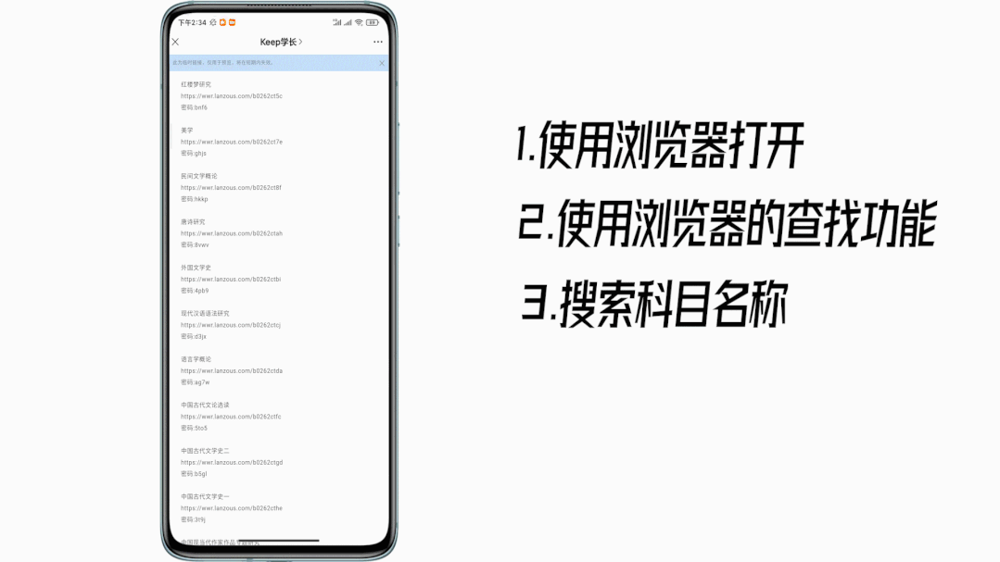

# 自考各科目重点笔记资料

keep学长 [Keep学长](javascript:void(0);) *2021-09-09 11:08*

**如何找到你想找的资料？**

**
**

**注意事项：**

***1.*****本资料整理了汉语言文学、行政管理、人力资源、英语、学前教育、经管类专业（工程管理、工商管理、会计金融）等在内的400多门科目
**

***2.*****本资料免费提供，为防止被机构批量下载贩卖所以的是一科一科分享的（找到资料的方法如上图所示）**

**
**

***3.*****本资料免费提供，难免会不全或存在错误，望各位同学见谅**

***4.***看在我这么辛苦真理的份上，也希望你能够把本公众号推荐给更多的人！谢谢！

***5.***这篇文章里主要是自考的**重点笔记资料**，如果你想要真题可以在下边两个文章里查看

中国近现代纲要

https://wws.lanzoui.com/b026gpqvc 
密码:1687

红楼梦研究

https://wwr.lanzoux.com/b0262ct5c 

密码:bnf6

美学

https://wwr.lanzoux.com/b0262ct7e 

密码:ghjs

民间文学概论

https://wwr.lanzoux.com/b0262ct8f 

密码:hkkp

唐诗研究

https://wwr.lanzoux.com/b0262ctah 

密码:8vwv

外国文学史

https://wwr.lanzoux.com/b0262ctbi 

密码:4pb9

现代汉语语法研究

https://wwr.lanzoux.com/b0262ctcj 

密码:d3jx

语言学概论

https://wwr.lanzoux.com/b0262ctda 

密码:ag7w

中国古代文论选读

https://wwr.lanzoux.com/b0262ctfc 

密码:5to5

中国古代文学史二

https://wwr.lanzoux.com/b0262ctgd 

密码:b5gl

中国古代文学史一

https://wwr.lanzoux.com/b0262cthe 

密码:3t9j

中国现当代作家作品专题研究

https://wwr.lanzoux.com/b0262ctjg 

密码:4bd7

儿童文学概论

https://wwr.lanzoux.com/b0262cudg 

密码:3onf

古代汉语

https://wwr.lanzoux.com/b0262cufi 

密码:cm8u

普通逻辑

https://wwr.lanzoux.com/b0262cuha 

密码:9d37

外国文学作品选

https://wwr.lanzoux.com/b0262cuib 

密码:5j7a

文学概论（一）

https://wwr.lanzoux.com/b0262cujc 

密码:948a

现代汉语

https://wwr.lanzoux.com/b0262cukd 

密码:4hya

写作（一）

https://wwr.lanzoux.com/b0262cule 

密码:95qt

心理学

https://wwr.lanzoux.com/b0262cumf 

密码:3yjh

中国当代作品选

https://wwr.lanzoux.com/b0262cung 

密码:ecpo

中国古代文学作品选一

https://wwr.lanzoux.com/b0262cupi 

密码:63p1

中国古代文学作品选二

https://wwr.lanzoux.com/b0262cuqj 

密码:6o6m

中国现代文学作品选

https://wwr.lanzoux.com/b0262cusb 

密码:3r8y

法律文书写作

https://wwr.lanzoux.com/b0262cv3c 

密码:erwo

公司法

https://wwr.lanzoux.com/b0262cv4d 

密码:ebv7

国际经济法概论

https://wwr.lanzoux.com/b0262cv5e 

密码:cv96

国际私法

https://wwr.lanzoux.com/b0262cv7g 

密码:8zq8

合同法

https://wwr.lanzoux.com/b0262cv8h 

密码:etir

环境与资源保护法

https://wwr.lanzoux.com/b0262cv9i 

密码:grfl

婚姻家庭法

https://wwr.lanzoux.com/b0262cvba 

密码:ghet

劳动法

https://wwr.lanzoux.com/b0262cvcb 

密码:2qwn

知识产权法

https://wwr.lanzoux.com/b0262cved 密码:2xpc

保险法

https://wwr.lanzoux.com/b0262cvji 

密码:70e8

金融法

https://wwr.lanzoux.com/b0262cvnc 

密码:bj6r

外国法制史

https://wwr.lanzoux.com/b0262cvpe 

密码:fwsc

高级英语

https://wwr.lanzoux.com/b0262cwid 

密码:5ivu

英美文学选读

https://wwr.lanzoux.com/b0262cwoj 

密码:7r5r

英语词汇学

https://wwr.lanzoux.com/b0262cwte 

密码:apf6

英语翻译

https://wwr.lanzoux.com/b0262cwza 

密码:g1pz

马原

https://wwr.lanzoux.com/b0262cxgh 

密码:d6y2

毛概

https://wwr.lanzoux.com/b0262cy9g 

密码:3ouz

思修

https://wwr.lanzoux.com/b0262cycj 

密码:171g

英语（二）

https://wwr.lanzoux.com/b0262cyvi 

密码:gkbm

英语（一）

https://wwr.lanzoux.com/b0262cyzc 

密码:fr87

行政法学

https://wwr.lanzoux.com/b0262czbe 

密码:hiex

当代中国政治制度

https://wwr.lanzoux.com/b0262czeh 

密码:2btq

西方政治制度

https://wwr.lanzoux.com/b0262czfi 

密码:5xd9

公共政策

https://wwr.lanzoux.com/b0262czha 

密码:9ne5

行政组织概论

https://wwr.lanzoux.com/b0262czib 

密码:bihg

领导科学

https://wwr.lanzoux.com/b0262czkd 

密码:g1a4

公务员制度

https://wwr.lanzoux.com/b0262czmf 

密码:1jg4

财务管理学

https://wwr.lanzoux.com/b0262czng 

密码:5elo

行政法与行政诉讼法

https://wwr.lanzoux.com/b0262czoh 

密码:9oyb

社会学概论

https://wwr.lanzoux.com/b0262czpi 

密码:csdu

西方行政学说史

https://wwr.lanzoux.com/b0262czqj 

密码:c442

中国行政史

https://wwr.lanzoux.com/b0262czra 

密码:etij

中国文化概论

https://wwr.lanzoux.com/b0262czsb 

密码:3xv7

公共经济学

https://wwr.lanzoux.com/b0262cztc 

密码:eviq

电子政务

https://wwr.lanzoux.com/b0262d1pa 

密码:c951

法学概论

https://wwr.lanzoux.com/b0262d1te 

密码:dy42

市场营销学

https://wwr.lanzoux.com/b0262d1wh 

密码:bn8i

现代管理学

https://wwr.lanzoux.com/b0262d1yj 

密码:cxu8

人力资源管理（一）

https://wwr.lanzoux.com/b0262d1za 

密码:5kkq

管理心理学

https://wwr.lanzoux.com/b0262d21c 

密码:crx4

行政管理学

https://wwr.lanzoux.com/b0262d24f 

密码:f9xl

市政学

https://wwr.lanzoux.com/b0262d26h 

密码:avcr

政治学概论

https://wwr.lanzoux.com/b0262d2ab 

密码:e6m0

公文写作与处理

https://wwr.lanzoux.com/b0262d2cd 

密码:d3mu

社会研究方法

https://wwr.lanzoux.com/b0262d2de 

密码:gq5z

财政学

https://wwr.lanzoux.com/b0262d2fg 

密码:3mhm

工商行政管理概论

https://wwr.lanzoux.com/b0262d2hi 

密码:1lae

市场调查与预测

https://wwr.lanzoux.com/b0262d2lc 

密码:9jsj

公共关系学

https://wwr.lanzoux.com/b0262d35c 

密码:3g72

市场营销学

https://wws.lanzoux.com/b0262g40b 

密码:2c49

国际贸易理论实务

https://wws.lanzoux.com/b0262g41c 

密码:7t82

金融理论实务

https://wws.lanzoux.com/b0262g42d 

密码:gbw6

资产评估

https://wws.lanzoux.com/b0262g43e 

密码:35eb

高级财务会计

https://wws.lanzoux.com/b0262g45g 

密码:6hmb

审计学

https://wws.lanzoux.com/b0262g46h 

密码:a0h0

财务报表分析

https://wws.lanzoux.com/b0262g47i 

密码:3evx

会计制度设计

https://wws.lanzoux.com/b0262g49a 

密码:at0u

概率论与数理统计

https://wws.lanzoux.com/b0262g4ab 

密码:hkz6

线性代数（经管）

https://wws.lanzoux.com/b0262g4cd 

密码:5j8m

基础会计学

https://wws.lanzoux.com/b0262g57e 

密码:blog

经济法概论（财）

https://wws.lanzoux.com/b0262g58f 

密码:i2cq

国民统计概论

https://wws.lanzoux.com/b0262g5bi 

密码:esa7

财务管理学

https://wws.lanzoux.com/b0262g5da 

密码:523v

政府与事业单位会计

https://wws.lanzoux.com/b0262g5gd 

密码:8ld9

企业管理概论

https://wws.lanzoux.com/b0262g5he 

密码:a8lk

中国税制

https://wws.lanzoux.com/b0262g5kh 

密码:2cgd

中级财务会计

https://wws.lanzoux.com/b0262g5mj 

密码:bc1t

成本会计

https://wws.lanzoux.com/b0262g5pc 

密码:dww6

管理会计（一）

https://wws.lanzoux.com/b0262g5qd 

密码:8sub

高等数学（工本）

https://wws.lanzoux.com/b0262g6ad 

密码:c9g9

概率论与数理统计

https://wws.lanzoux.com/b0262g6be 

密码:hc64

操作系统

https://wws.lanzoux.com/b0262g6cf 

密码:hcf3

离散数学

https://wws.lanzoux.com/b0262g6dg 

密码:87n9

计算机系统

https://wws.lanzoux.com/b0262g6eh 

密码:3e4a

数据结构

https://wws.lanzoux.com/b0262g6fi 

密码:51d3

数据库系统

https://wws.lanzoux.com/b0262g6jc 

密码:h4hp

C语言程序设计

https://wws.lanzoux.com/b0262g6le 

密码:dmas

计算机网络

https://wws.lanzoux.com/b0262g6ng 

密码:ab70

高等数学（工专）

https://wws.lanzoux.com/b0262g6ve 

密码:alsy

高级语言程序设计

https://wws.lanzoux.com/b0262g6zi 

密码:dqvm

数据库及其原理

https://wws.lanzoux.com/b0262g71a 

密码:bhk3

计算机网络技术

https://wws.lanzoux.com/b0262g73c 

密码:fnsy

数据架构导论

https://wws.lanzoux.com/b0262g74d 

密码:8ime

线性代数

https://wws.lanzoux.com/b0262g75e 

密码:4f22

计算机应用技术

https://wws.lanzoux.com/b0262g76f 

密码:14yz

计算机组成原理

https://wws.lanzoux.com/b0262g77g 

密码:fdsy

操作系统概论

https://wws.lanzoux.com/b0262g7aj 

密码:16q9

电子技术基础（三）

https://wws.lanzoux.com/b0262g7ba 

密码:9j92

微型计算机及其接口技术

https://wws.lanzoux.com/b0262g7cb 

密码:dlo6

学前教育与行政管理

https://wws.lanzoux.com/b0262ghfe 

密码:88y9

幼儿园课程

https://wws.lanzoux.com/b0262ghgf 

密码:6d1n

幼儿教育原理

https://wws.lanzoux.com/b0262ghhg 

密码:9edd

学前游戏论

https://wws.lanzoux.com/b0262ghji 

密码:20vc

学前比较教育

https://wws.lanzoux.com/b0262ghkj 

密码:cyj2

学前教育史

https://wws.lanzoux.com/b0262ghmb 

密码:9ay9

教育科学研究方法（二）

ttps://wws.lanzoux.com/b0262ghnc 

密码:4ntq

儿童发展理论

https://wws.lanzoux.com/b0262ghuj 

密码:487b

现代科学技术概论

https://wws.lanzoux.com/b0262ghwb 

密码:dy7o

中外文学精读

https://wws.lanzoux.com/b0262ghze 

密码:5ts7

学前教育理论基础

https://wws.lanzoux.com/b0262gi0f 

密码:6ycn

学前教育心理学

https://wws.lanzoux.com/b0262gi1g 

密码:ecyx

学前教育思修史

https://wws.lanzoux.com/b0262gi2h 

密码:5fr7

学前教育学

https://wws.lanzoux.com/b0262giqb 

密码:2ot4

学前心理学

https://wws.lanzoux.com/b0262girc 

密码:662j

学前卫生学

https://wws.lanzoux.com/b0262gisd 

密码:fir0

幼儿文学

https://wws.lanzoux.com/b0262giuf 

密码:aff7

幼儿园组织与管理

https://wws.lanzoux.com/b0262giwh 

密码:i2r6

学前教育科学研究

https://wws.lanzoux.com/b0262giyj 

密码:94xj

学前儿童语言教育

https://wws.lanzoux.com/b0262gj0b 

密码:elhg

幼儿园课程

https://wws.lanzoux.com/b0262gj1c 

密码:50kt

科学技术社会

https://wws.lanzoux.com/b0262gj2d 

密码:3fuw

学前儿童美术教育

https://wws.lanzoux.com/b0262gj3e 

密码:ez3p

学前教育政策与法规

https://wws.lanzoux.com/b0262gj4f 

密码:1rl1

管理学原理

https://wws.lanzoux.com/b02632q8d 

密码:g36k

管理数量方法

https://wws.lanzoux.com/b02632r7i 

密码:fta4

项目规范管理

https://wws.lanzoux.com/b02632ref 

密码:9stu

项目成本管理

https://wws.lanzoux.com/b02632rkb 

密码:acis

项目管理案例分析

https://wws.lanzoux.com/b02632rqh 

密码:2t1o

工程招标与合同管理

https://wws.lanzoux.com/b02632rri 

密码:bd9t

建筑法规

https://wws.lanzoux.com/b02632rub 

密码:34co

工程造价确定与控制

https://wws.lanzoux.com/b02632rwd 

密码:1now

管理经济学

https://wws.lanzoux.com/b02632rzg 

密码:dera

工程项目管理

https://wws.lanzoux.com/b02632s2j 

密码:hgj4

工程造价确定与控制(江苏)

https://wws.lanzoux.com/b02632s6d 

密码:glse

房地产开发与经营

https://wws.lanzoux.com/b02632s8f 

密码:3clt

人力资源管理一

https://wws.lanzoux.com/b02632sfc 

密码:a3pn

组织行为学

https://wws.lanzoux.com/b02632sjg 

密码:8lc5

概率论与数理统计（经管类）

https://wws.lanzoux.com/b02632spc 

密码:1cf7

线性代数（经管）

https://wws.lanzoux.com/b02632t9c 

密码:4jfj

管理系统中计算机应用

https://wws.lanzoux.com/b02632teh 

密码:bh01

管理学原理

https://wws.lanzoux.com/b02632tib 

密码:d3wj

财务管理学

https://wws.lanzoux.com/b02632tle 

密码:dbln

国际贸易理论与实务

https://wws.lanzoux.com/b02632toh 

密码:eey4

金融理论与实务

https://wws.lanzoux.com/b02632tsb 

密码:g9pn

企业经营战略

https://wws.lanzoux.com/b02632tzi 

密码:5mjx

企业管理咨询

https://wws.lanzoux.com/b02632u1a 

密码:hycl

江苏公司理财

https://wws.lanzoux.com/b02632u2b 

密码:dljd

江苏宏观经济

https://wws.lanzoux.com/b02632ued 

密码:fmve

江苏现代项目管理

https://wws.lanzoux.com/b02632ukj 

密码:2e8k

江苏数据模型与决策

https://wws.lanzoux.com/b02632upe 

密码:bws9

广播电视广告

https://wws.lanzoux.com/b02632uwb 

密码:dg69

中外广告史

https://wws.lanzoux.com/b02632uyd 

密码:aglr

新闻事业管理

https://wws.lanzoux.com/b02632v3i 

密码:eurg

美学

https://wws.lanzoux.com/b02632v7c 

密码:3wu3

现代管理学

https://wws.lanzoux.com/b02632v9e 

密码:2ghv

平面广告设计

https://wws.lanzoux.com/b02632vch 

密码:8q76

传播学概论

https://wws.lanzoux.com/b02632vej 

密码:hu95

护理教育导论

https://wws.lanzoux.com/b02632vqb 

密码:f1r2

护理学研究

https://wws.lanzoux.com/b02632vte 

密码:fn5e

护理学基础

https://wws.lanzoux.com/b02632vvg 

密码:b8yu

护理学教育导论

https://wws.lanzoux.com/b02632vyj 

密码:7o5t

急救护理学

https://wws.lanzoux.com/b02632w2d 

密码:5uuf

妇产科护理

https://wws.lanzoux.com/b02632w4f 

密码:cseq

预防医学二

https://wws.lanzoux.com/b02632wbc 

密码:e6x7

内科护理学

https://wws.lanzoux.com/b02632wne 

密码:evvh

公共关系学

https://wws.lanzoux.com/b02632wub 

密码:dgzp

精神障碍真题

https://wws.lanzoux.com/b02632x1i 

密码:czpz

金融本二版本，适合大部分省

https://wws.lanzoux.com/b02632xbi 

密码:9uxv

广东金融管理

https://wws.lanzoux.com/b02632xfc 

密码:by7g

投资学

https://wws.lanzoux.com/b02632xpc 

密码:7op8

人力资源专

https://wws.lanzoux.com/b02632xvi 

密码:f7cs

人力资源本

https://wws.lanzoux.com/b02632yad 

密码:fjto

政治经济学

https://wws.lanzoux.com/b02633eaj 

密码:2rgs

基础会计学

https://wws.lanzoux.com/b02633edc 

密码:f8a9

经济法概论（财经）

https://wws.lanzoux.com/b02633eih 

密码:4wkr

管理学原理

https://wws.lanzoux.com/b02633enc 

密码:i2ye

市场营销学

https://wws.lanzoux.com/b02633esh 

密码:gs23

国民经济统计概论

https://wws.lanzoux.com/b02633eze 

密码:5inx

企业管理概论

https://wws.lanzoux.com/b02633f2h 

密码:5yd7

概率论与数理统计（经管类）

https://wws.lanzoux.com/b02633f5a 

密码:4lcf

广东设计美学

https://wws.lanzoux.com/b02633fej 

密码:a3wu

现代设计史

https://wws.lanzoux.com/b02633fje 

密码:2bj6

广东设计原理

https://wws.lanzoux.com/b02633fkf 

密码:ag3c

数字媒体艺术本科（广东）

https://wws.lanzoux.com/b02633fpa 

密码:dv1e

物流管理本

https://wws.lanzoux.com/b02633fvg 

密码:8usv

科学，技术，社会

https://wws.lanzoux.com/b02633g9a 

密码:9l39

教育原理

https://wws.lanzoux.com/b02633gef 

密码:77fc

小学教育科学研究

https://wws.lanzoux.com/b02633gij 

密码:3ja0

小学教育心理学

https://wws.lanzoux.com/b02633gmd 

密码:dcu5

小学科学教育

https://wws.lanzoux.com/b02633gqh 

密码:glny

美育教育

https://wws.lanzoux.com/b02633gsj 

密码:8k2k

小学教育语文论

https://wws.lanzoux.com/b02633gvc 

密码:3l9v

小学数学教学论

https://wws.lanzoux.com/b02633gzg 

密码:djyp

小学班主任

https://wws.lanzoux.com/b02633h2j 

密码:93xi

现代教育技术

https://wws.lanzoux.com/b02633h5c 

密码:bzfq

中小学教育管理

https://wws.lanzoux.com/b02633hah 

密码:azzo

中外教育简史

https://wws.lanzoux.com/b02633hbi 

密码:1x4n

心理卫生与心理辅导

https://wws.lanzoui.com/b026gyhgh 
密码:7env

课程与教学论

https://wws.lanzoux.com/b02633hli 

密码:24w8

德育原理

https://wws.lanzoux.com/b02633hpc 

密码:236n

比较教育

https://wws.lanzoux.com/b02633htg 

密码:9xbb

小学艺术教育

https://wws.lanzoux.com/b02633hzc 

密码:hu6n

现代教育测量与评价学

https://wws.lanzoux.com/b02633i3g 

密码:6sgt

临床心理学

https://wws.lanzoux.com/b02633iad 

密码:afy9

心理卫生与心理咨询

https://wws.lanzoux.com/b02633ibe 

密码:dqyq

公关心理学

https://wws.lanzoux.com/b02633ifi 

密码:f7lj

社会心理学二

https://wws.lanzoux.com/b02633iib 

密码:4g1b

心理学史

https://wws.lanzoux.com/b02633ijc 

密码:huu2

生理心理学

https://wws.lanzoux.com/b02633ile 

密码:4tc0

学校心理学

https://wws.lanzoux.com/b02633ing 

密码:2ubb

心理学研究方法

https://wws.lanzoux.com/b02633ive 

密码:29hb

个性心理学

https://wws.lanzoux.com/b02633ixg 

密码:3l11

People who liked this content also liked

招人！有想法的自考生进！

...

Keep学长

不喜欢

不看的原因

OK

- 内容质量低
-  

- 不看此公众号

Scan to Follow