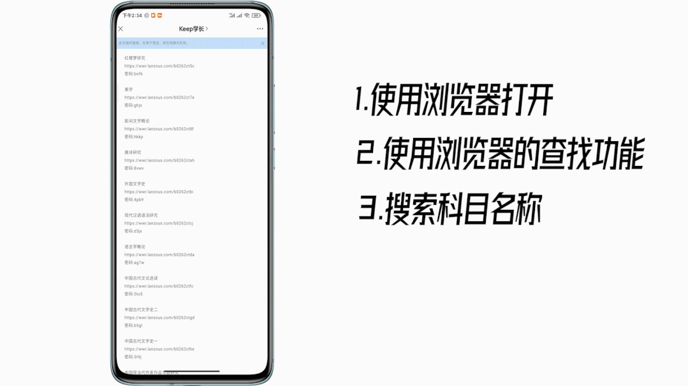
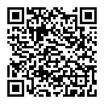

# 历年真题

Keep学长 [Keep学长](javascript:void(0);) *2021-09-06 16:36*

**如何找到你想要的科目？**

**注意事项：**

***1.*****真题整理了自考几乎所有专业的科目，一共860多套**

***2.*****本资料免费提供，为防止被机构批量下载贩卖所以的是一科一科分享的（找到资料的方法如上图所示）**

***3.*****本资料免费提供，难免会不全或存在错误，望各位同学见谅**

***4.***看在我这么辛苦真理的份上，也希望你能够把本公众号推荐给更多的人！谢谢！

***5.***这篇文章里主要是自考的真题，如果你想要自考网课或资料可以在下边两个文章里查看

| 课程代码 | 课程名称                                 | 网盘链接                                        | 密码 |
| -------- | ---------------------------------------- | ----------------------------------------------- | ---- |
| A00009   | 政治经济学                               | https://wws.lanzoui.com/b026byhcd               | 14m2 |
| A00012   | 英语（一）                               | https://pan.baidu.com/s/1WhsaFTbm4-N2mfiVmjPc9w | 7wfa |
| A00015   | 英语（二）                               | https://wws.lanzoui.com/b026ahjaf               | 3oot |
| A00016   | 日语（二）                               | https://www.lanzoux.com/i56pb0h                 | 2x5d |
| A00017   | 俄语（二）                               | https://www.lanzoux.com/i56pb3a                 | d56g |
| A00018   | 计算机应用基础                           | https://www.lanzoux.com/i56pb7e                 | g9fu |
| A00020   | 高等数学（一）                           | https://wws.lanzoui.com/b026byf0j               | fcy8 |
| A00022   | 高等数学（公专）                         | https://www.lanzoux.com/i56pbob                 | fp3s |
| A00023   | 高等数学（工本）                         | https://www.lanzoux.com/i56pbvi                 | eojw |
| A00024   | 普通逻辑                                 | https://www.lanzoux.com/i56pc2f                 | dkzz |
| A00031   | 心理学                                   | https://www.lanzoux.com/i56pcdg                 | 7f1c |
| A00034   | 社会学概论                               | https://wws.lanzoui.com/b026bykva               | fvfe |
| A00037   | 美学                                     | https://wws.lanzoui.com/b026bwxwh               | dlev |
| A00040   | 法学概论                                 | https://wws.lanzoui.com/b026bym6h               | erap |
| A00041   | 基础会计学                               | https://wws.lanzoui.com/b026byg2h               | e7bw |
| A00042   | 社会经济统计学原理                       | https://www.lanzoux.com/i56pcle                 | 6t69 |
| A00043   | 经济法概论                               | https://wws.lanzoui.com/b026byf3c               | 5ks1 |
| A00048   | 财政与金融                               | https://www.lanzoux.com/i56pila                 | 1vea |
| A00051   | 管理系统中计算机应用                     | https://wws.lanzoui.com/b026byfhg               | dob4 |
| A00053   | 对外经济管理概论                         | https://www.lanzoux.com/i56piqf                 | 2dtu |
| A00054   | 管理学原理                               | https://wws.lanzoui.com/b026byfyd               | f3ok |
| A00055   | 企业会计学                               | https://www.lanzoux.com/i57qq1a                 | a5q0 |
| A00058   | 市场营销学                               | https://wws.lanzoui.com/b026bychi               | 2at9 |
| A00060   | 财政学                                   | https://wws.lanzoui.com/b026bymef               | gg89 |
| A00061   | 国家税收                                 | https://www.lanzoux.com/i57qqcb                 | 3eew |
| A00062   | 税收管理                                 | https://www.lanzoux.com/i57r2ta                 | dpnh |
| A00065   | 国民经济统计概论                         | https://wws.lanzoui.com/b026byi8f               | au5r |
| A00066   | 货币银行学                               | https://www.lanzoux.com/i57r3li                 | b2jv |
| A00067   | 财务管理学                               | https://wws.lanzoui.com/b026bydhe               | 8jqc |
| A00068   | 外国财政（财税本）                       | https://www.lanzoux.com/i57r3xa                 | 9yz7 |
| A00069   | 国际税收（财税本）                       | https://www.lanzoux.com/i57r3yb                 | hp4b |
| A00070   | 政府与事业单位会计                       | https://wws.lanzoui.com/b026bydwj               | agzn |
| A00071   | 社会保障概论                             | https://www.lanzoux.com/i57r4ve                 | 5q3u |
| A00072   | 商业银行业务与经营                       | https://www.lanzoux.com/i57r4yh                 | 3v1h |
| A00073   | 银行信贷管理学                           | https://www.lanzoux.com/i57r50j                 | eak4 |
| A00074   | 中央银行概论                             | https://www.lanzoux.com/i57r54d                 | fznh |
| A00075   | 证券投资与管理                           | https://www.lanzoux.com/i57r59i                 | 3ifo |
| A00076   | 国际金融学                               | https://www.lanzoux.com/i57r5la                 | 70z5 |
| A00078   | 银行会计学                               | https://www.lanzoux.com/i57r5qf                 | 7ebb |
| A00079   | 保险学原理                               | https://www.lanzoux.com/i57r5sh                 | 2nyx |
| A00087   | 英汉互译教程                             | https://www.lanzoux.com/i57r5xc                 | fhr3 |
| A00087   | 英语翻译                                 | https://www.lanzoux.com/i57r68d                 | 1iqq |
| A00088   | 基础英语                                 | https://www.lanzoux.com/i57r6bg                 | 73uv |
| A00089   | 国际贸易                                 | https://wws.lanzoui.com/b026byboj               | 5wmr |
| A00090   | 国际贸易实务（一）                       | https://www.lanzoux.com/i57rkla                 | afoe |
| A00091   | 国际商法                                 | https://www.lanzoux.com/i57rm6h                 | 94uu |
| A00092   | 中国对外贸易                             | https://www.lanzoux.com/i57rn2j                 | bj5z |
| A00093   | 国际技术贸易                             | https://www.lanzoux.com/i57rnjg                 | 66i5 |
| A00094   | 外贸函电                                 | https://www.lanzoux.com/i57rnpc                 | cbn5 |
| A00096   | 外刊经贸知识选读                         | https://www.lanzoux.com/i57role                 | bxob |
| A00097   | 外贸英语写作                             | https://www.lanzoux.com/i57rong                 | 99ew |
| A00098   | 国际市场营销学                           | https://www.lanzoux.com/i57rora                 | 78b7 |
| A00100   | 国际运输与管理                           | https://www.lanzoux.com/i57rp3c                 | h88a |
| A00101   | 外经贸经营与管理                         | https://www.lanzoux.com/i57rp5e                 | 1ob3 |
| A00102   | 世界市场行情                             | https://www.lanzoux.com/i57rpgf                 | 9e7h |
| A00103   | 证券投资学                               | https://www.lanzoux.com/i57rphg                 | 17br |
| A00104   | 证券投资分析                             | https://www.lanzoux.com/i57rpla                 | dyn5 |
| A00107   | 现代管理学                               | https://wws.lanzoui.com/b026bylqb               | dx0y |
| A00108   | 工商行政管理学概论                       | https://www.lanzoux.com/i57rq4j                 | c1yr |
| A00138   | 中国近现代经济史                         | https://www.lanzoux.com/i57rq5a                 | 59au |
| A00139   | 西方经济学                               | https://www.lanzoux.com/i57rqje                 | h93s |
| A00140   | 国际经济学                               | https://www.lanzoux.com/i57rqpa                 | d5g0 |
| A00141   | 发展经济学                               | https://www.lanzoux.com/i57rqsd                 | aubo |
| A00142   | 计量经济学                               | https://www.lanzoux.com/i57rr6h                 | 7ays |
| A00143   | 经济思想史                               | https://www.lanzoux.com/i57s1sj                 | fnjh |
| A00144   | 企业管理概论                             | https://wws.lanzoui.com/b026byi2j               | 7w7l |
| A00145   | 生产与作业管理                           | https://www.lanzoux.com/i57s2wj                 | 6bwt |
| A00146   | 中国税制                                 | https://wws.lanzoui.com/b026bydre               | 8s97 |
| A00147   | 人力资源管理（一）                       | https://wws.lanzoui.com/b026byhvc               | 2qrp |
| A00148   | 国际企业管理                             | https://www.lanzoux.com/i57s3ib                 | 2fz1 |
| A00149   | 国际贸易理论与实务                       | https://wws.lanzoui.com/b026byc9a               | dxy1 |
| A00150   | 金融理论与实务                           | https://wws.lanzoui.com/b026byc6h               | 5uua |
| A00151   | 企业经营战略                             | https://www.lanzoux.com/i57s4mb                 | g1kw |
| A00152   | 组织行为学                               | https://wws.lanzoui.com/b026byg6b               | 6d15 |
| A00153   | 质量管理学（一）                         | https://www.lanzoux.com/i57s5ni                 | 57go |
| A00154   | 企业管理咨询+                            | https://www.lanzoux.com/i57s67i                 | hvbu |
| A00155   | 中级财务会计                             | https://wws.lanzoui.com/b026byegj               | cmtb |
| A00156   | 成本会计                                 | https://wws.lanzoui.com/b026byd9g               | daan |
| A00157   | 管理会计                                 | https://wws.lanzoui.com/b026bydeb               | 82nb |
| A00158   | 资产评估                                 | https://wws.lanzoui.com/b026bybza               | 6klh |
| A00159   | 高级财务会计                             | https://wws.lanzoui.com/b026bycqh               | fhic |
| A00160   | 审计学                                   | https://wws.lanzoui.com/b026bycvc               | atof |
| A00161   | 财务报告分析（一）                       | https://www.lanzoux.com/i57syqf                 | bbn1 |
| A00161   | 财务报表分析（一）                       | https://wws.lanzoui.com/b026byc3e               | 7exw |
| A00162   | 会计制度设计                             | https://wws.lanzoui.com/b026bybwh               | 768d |
| A00163   | 管理心理学                               | https://wws.lanzoui.com/b026byluf               | 5y2v |
| A00164   | 劳动经济学                               | https://wws.lanzoui.com/b026byikh               | 8sed |
| A00165   | 劳动就业概论                             | https://wws.lanzoui.com/b026byihe               | fkeh |
| A00166   | 企业劳动工资管理                         | https://wws.lanzoui.com/b026byh7i               | apmf |
| A00167   | 劳动法+2017                              | https://www.lanzoux.com/i57szte                 | c2uc |
| A00167   | 劳动法+2018                              | https://www.lanzoux.com/i57t0lc                 | 3pmc |
| A00169   | 房地产法                                 | https://www.lanzoux.com/i57t13a                 | 1ch6 |
| A00170   | 建筑工程定额与预算                       | https://www.lanzoux.com/i57t16d                 | h7p2 |
| A00172   | 房地产经营管理                           | https://www.lanzoux.com/i57t18f                 | 7hh0 |
| A00174   | 建筑工程概论                             | https://www.lanzoux.com/i57t1jg                 | 57ft |
| A00177   | 消费心理学                               | https://www.lanzoux.com/i57t1sf                 | fvxv |
| A00178   | 市场调查与预测                           | https://www.lanzoux.com/i58517g                 | ajez |
| A00179   | 谈判与推销技巧                           | https://www.lanzoux.com/i5851aj                 | 6b3t |
| A00180   | 企业定价                                 | https://www.lanzoux.com/i5851ba                 | dub1 |
| A00181   | 中国广告学                               | https://www.lanzoux.com/i5851ed                 | 76dn |
| A00182   | 公共关系学                               | https://wws.lanzoui.com/b026bylpa               | i3ej |
| A00183   | 消费经济学                               | https://www.lanzoux.com/i5851pe                 | 60p6 |
| A00184   | 市场营销策划                             | https://www.lanzoux.com/i5851sh                 | 96n6 |
| A00185   | 商品流通概论                             | https://www.lanzoux.com/i5851uj                 | 8m2h |
| A00186   | 国际商务谈判                             | https://www.lanzoux.com/i5851yd                 | eg68 |
| A00187   | 旅游经济学                               | https://www.lanzoux.com/i5851ze                 | fnph |
| A00188   | 旅游心理学                               | https://www.lanzoux.com/i58520f                 | 4t4b |
| A00191   | 旅行社经营与管理                         | https://www.lanzoux.com/i58521g                 | 9ebh |
| A00192   | 旅游市场学                               | https://www.lanzoux.com/i58522h                 | 52m4 |
| A00195   | 导游业务                                 | https://www.lanzoux.com/i58525a                 | 8u6v |
| A00196   | 专业英语                                 | https://www.lanzoux.com/i5852af                 | acy5 |
| A00197   | 旅游资源规划与开发                       | https://www.lanzoux.com/i5852gb                 | duub |
| A00201   | 饭店餐饮管理                             | https://www.lanzoux.com/i5852id                 | gu4p |
| A00204   | 企业投资学                               | https://www.lanzoux.com/i5852kf                 | 2af3 |
| A00205   | 企业融资学                               | https://www.lanzoux.com/i5852lg                 | g1af |
| A00207   | 高级财务管理                             | https://www.lanzoux.com/i5852mh                 | 1dzd |
| A00208   | 国际财务管理                             | https://www.lanzoux.com/i58584f                 | d54s |
| A00223   | 中国法制史                               | https://www.lanzoux.com/i58587i                 | 6vh9 |
| A00224   | 律师执业概论                             | https://www.lanzoux.com/i5858ab                 | dtwp |
| A00226   | 知识产权法                               | https://www.lanzoux.com/i5858ef                 | hurd |
| A00227   | 公司法                                   | https://www.lanzoux.com/i5858fg                 | adiq |
| A00228   | 环境与资源保护法学                       | https://www.lanzoux.com/i5858hi                 | 3srp |
| A00229   | 证据法学                                 | https://www.lanzoux.com/i5858ij                 | 7udp |
| A00230   | 合同法                                   | https://www.lanzoux.com/i5858ne                 | h2bh |
| A00233   | 税法                                     | https://www.lanzoux.com/i5858sj                 | fbnk |
| A00235   | 犯罪学                                   | https://www.lanzoux.com/i5858xe                 | 8y85 |
| A00242   | 民法学                                   | https://www.lanzoux.com/i5858yf                 | 1mbr |
| A00243   | 民事诉讼法学                             | https://www.lanzoux.com/i58590h                 | 8ab5 |
| A00244   | 经济法概论                               | https://www.lanzoux.com/i58591i                 | 9072 |
| A00245   | 刑法学                                   | https://www.lanzoux.com/i58593a                 | eq22 |
| A00246   | 国际经济法概论学                         | https://www.lanzoux.com/i58598f                 | 4dbx |
| A00247   | 国际法                                   | https://www.lanzoux.com/i5859da                 | 28rp |
| A00249   | 国际私法                                 | https://www.lanzoux.com/i5859if                 | 1boi |
| A00257   | 票据法                                   | https://www.lanzoux.com/i5859li                 | cxeg |
| A00258   | 保险法                                   | https://www.lanzoux.com/i5859mj                 | 6r3a |
| A00259   | 公正与法律制度                           | https://www.lanzoux.com/i5859ob                 | 3a8b |
| A00260   | 刑事诉讼法                               | https://www.lanzoux.com/i585dkb                 | 5cb6 |
| A00261   | 行政法学                                 | https://wws.lanzoui.com/b026bykod               | d618 |
| A00262   | 法律书文写作                             | https://www.lanzoux.com/i585dta                 | byxu |
| A00263   | 外国法制史                               | https://www.lanzoux.com/i585dwd                 | f0ii |
| A00264   | 中国法律思想史                           | https://www.lanzoux.com/i585dxe                 | 7b5a |
| A00265   | 西方法律思想史                           | https://www.lanzoux.com/i585e3a                 | 74jt |
| A00266   | 社会心理学（一）                         | https://www.lanzoux.com/i585e5c                 | a1dz |
| A00277   | 行政管理学                               | https://wws.lanzoui.com/b026bylni               | 1575 |
| A00284   | 心理卫生与心理咨询                       | https://www.lanzoux.com/i585eah                 | ckgx |
| A00292   | 市政学                                   | https://wws.lanzoui.com/b026bym5g               | dxcj |
| A00294   | 劳动社会学                               | https://wws.lanzoui.com/b026byglg               | 71yz |
| A00312   | 政治学概论                               | https://wws.lanzoui.com/b026bymbc               | 5fzu |
| A00315   | 当代中国政治制度                         | https://wws.lanzoui.com/b026bykti               | i5ye |
| A00316   | 西方政治制度                             | https://wws.lanzoui.com/b026byk9i               | 8ky4 |
| A00318   | 公共政策学                               | https://wws.lanzoui.com/b026bykkj               | 27oz |
| A00319   | 行政组织理论                             | https://wws.lanzoui.com/b026byk1a               | ha18 |
| A00320   | 领导科学                                 | https://wws.lanzoui.com/b026byked               | 38ll |
| A00321   | 中国文化概论                             | https://wws.lanzoui.com/b026bwzkh               | 1fqi |
| A00322   | 中国行政史                               | https://wws.lanzoui.com/b026byl0f               | cyme |
| A00323   | 西方行政学说史                           | https://wws.lanzoui.com/b026byl8d               | d1h5 |
| A00324   | 人事管理学                               | https://www.lanzoux.com/i585haf                 | 2bmk |
| A00341   | 公文写作与处理                           | https://wws.lanzoui.com/b026bym9a               | ec15 |
| A00342   | 高级语言程序设计                         | https://www.lanzoux.com/i585hej                 | 3x0o |
| A00344   | 办公室管理                               | https://www.lanzoux.com/i585hfa                 | 8by5 |
| A00346   | 办公自动化原理及应用                     | https://www.lanzoux.com/i585hhc                 | 8jvo |
| A00359   | 保卫学                                   | https://www.lanzoux.com/i585hid                 | 9cqc |
| A00360   | 预审学                                   | https://www.lanzoux.com/i585hje                 | 9w37 |
| A00361   | 公安法规                                 | https://www.lanzoux.com/i585hlg                 | efnu |
| A00369   | 警察伦理学                               | https://www.lanzoux.com/i585hni                 | f9xa |
| A00370   | 刑事证据学                               | https://www.lanzoux.com/i585hqb                 | a0ef |
| A00371   | 公安决策学                               | https://www.lanzoux.com/i585hte                 | cxp7 |
| A00372   | 公安信息学                               | https://www.lanzoux.com/i585huf                 | eynz |
| A00373   | 涉外警务概论                             | https://www.lanzoux.com/i585hyj                 | 19qy |
| A00383   | 学前教育学                               | https://www.lanzoux.com/i585hza                 | 97zz |
| A00384   | 学前心理学                               | https://www.lanzoux.com/i585i0b                 | gz96 |
| A00385   | 学前卫生学                               | https://www.lanzoux.com/i585i1c                 | i07s |
| A00386   | 幼儿文学                                 | https://www.lanzoux.com/i585i3e                 | fd4d |
| A00387   | 幼儿园组织与管理                         | https://www.lanzoux.com/i585i5g                 | 307y |
| A00388   | 学前儿童数学教育                         | https://www.lanzoux.com/i585i7i                 | 9az3 |
| A00389   | 学前教育科学研究                         | https://www.lanzoux.com/i585i9a                 | 5qg3 |
| A00390   | 学前儿童科学教育                         | https://www.lanzoux.com/i585l9i                 | 3zs8 |
| A00392   | 学前儿童体育                             | https://www.lanzoux.com/i585laj                 | 152v |
| A00393   | 学前儿童语言教育                         | https://www.lanzoux.com/i585lcb                 | bu1n |
| A00394   | 幼儿园课程                               | https://www.lanzoux.com/i585ldc                 | gje9 |
| A00395   | 科学.技术.社会 专科                      | https://www.lanzoux.com/i585led                 | dfig |
| A00396   | 学前儿童美术教育                         | https://www.lanzoux.com/i585lfe                 | 9454 |
| A00397   | 学前儿童音乐教育                         | https://www.lanzoux.com/i585lgf                 | 1zng |
| A00398   | 学前教育原理                             | https://www.lanzoux.com/i585lih                 | 4z2o |
| A00399   | 学前游戏论                               | https://www.lanzoux.com/i585lji                 | bgk5 |
| A00401   | 学前比较教育                             | https://www.lanzoux.com/i585lkj                 | g8yg |
| A00402   | 学前教育史                               | https://www.lanzoux.com/i585lnc                 | hh2h |
| A00405   | 教育原理                                 | https://www.lanzoux.com/i585lpe                 | 2wvu |
| A00406   | 小学教育科学研究                         | https://www.lanzoux.com/i585lrg                 | fbkw |
| A00407   | 小学教育心理学                           | https://www.lanzoux.com/i585lti                 | 5jsh |
| A00408   | 小学科学教育                             | https://www.lanzoux.com/i585lva                 | 2q4s |
| A00409   | 美育基础                                 | https://www.lanzoux.com/i585lxc                 | a75b |
| A00410   | 小学语文教学论                           | https://www.lanzoux.com/i585lze                 | 901c |
| A00411   | 小学数学教学论                           | https://www.lanzoux.com/i585m1g                 | 78dt |
| A00412   | 小学班主任                               | https://www.lanzoux.com/i585m3i                 | hwnu |
| A00413   | 现代教育技术                             | https://www.lanzoux.com/i585m4j                 | bsbb |
| A00415   | 中外文学作品导读                         | https://www.lanzoux.com/i585q4d                 | 1eab |
| A00416   | 汉语基础                                 | https://www.lanzoux.com/i585qed                 | 2exf |
| A00417   | 高等数学基础                             | https://www.lanzoux.com/i585qfe                 | 7nn6 |
| A00418   | 数论初步                                 | https://www.lanzoux.com/i585qkj                 | gq8w |
| A00420   | 物理（工）                               | https://www.lanzoux.com/i585qqf                 | byp8 |
| A00422   | 中国古代作家作品专题研究                 | https://www.lanzoux.com/i585qsh                 | 8j0j |
| A00429   | 教育学（一）                             | https://www.lanzoux.com/i585quj                 | bboo |
| A00442   | 教育学（二）                             | https://www.lanzoux.com/i585qva                 | f4rf |
| A00445   | 中外教育管理史                           | https://www.lanzoux.com/i585qyd                 | g4xf |
| A00448   | 学校管理学                               | https://www.lanzoux.com/i585r1g                 | 9mnx |
| A00449   | 教育管理原理                             | https://www.lanzoux.com/i585r2h                 | 905n |
| A00450   | 教育评估和督导                           | https://www.lanzoux.com/i585r4j                 | 7veg |
| A00451   | 教育经济学                               | https://www.lanzoux.com/i585r8d                 | 9bz5 |
| A00452   | 教育统计与测量                           | https://www.lanzoux.com/i585rgb                 | 1zgb |
| A00453   | 教育法学                                 | https://www.lanzoux.com/i585ryj                 | a636 |
| A00454   | 教育预测与规划                           | https://www.lanzoux.com/i585s1c                 | gxjo |
| A00455   | 教育管理心理学                           | https://www.lanzoux.com/i585s6h                 | 2jgh |
| A00456   | 教育科学研究方法(二)                     | https://www.lanzoux.com/i585shi                 | i8iz |
| A00457   | 学前教育管理                             | https://www.lanzoux.com/i585skb                 | 4rkh |
| A00458   | 中小学教育管理                           | https://www.lanzoux.com/i585sta                 | 9zk3 |
| A00463   | 现代人员测评                             | https://wws.lanzoui.com/b026bygvg               | 9w5f |
| A00464   | 中外教育简史                             | https://www.lanzoux.com/i585xbc                 | 5buv |
| A00465   | 心理卫生与心理辅导                       | https://www.lanzoux.com/i585xja                 | d0bd |
| A00466   | 发展与教育心理学+2018                    | https://www.lanzoux.com/i585xri                 | bvx7 |
| A00466   | 发展与教育心理学+2016                    | https://www.lanzoux.com/i585xlc                 | 2ozm |
| A00467   | 课程与教学论                             | https://www.lanzoux.com/i58723a                 | him8 |
| A00468   | 德育原理+2015                            | https://www.lanzoux.com/i58724b                 | 8wbb |
| A00468   | 德育原理+2017                            | https://www.lanzoux.com/i58725c                 | 5n86 |
| A00469   | 教育学原理                               | https://www.lanzoux.com/i58726d                 | 390b |
| A00471   | 认知心理                                 | https://www.lanzoux.com/i58728f                 | 2cw1 |
| A00472   | 比较教育                                 | https://www.lanzoux.com/i5872da                 | 2rby |
| A00481   | 现代科学技术与当代社会                   | https://www.lanzoux.com/i5872he                 | 3spk |
| A00488   | 健康教育学                               | https://www.lanzoux.com/i58731e                 | csdp |
| A00504   | 艺术概论                                 | https://www.lanzoux.com/i58732f                 | 81c0 |
| A00506   | 写作（一）+2015                          | https://wws.lanzoui.com/b026by8na               | 56sl |
| A00506   | 写作（一）+2018                          | https://www.lanzoux.com/i58736j                 | dpov |
| A00509   | 机关管理                                 | https://www.lanzoux.com/i58738b                 | eas8 |
| A00510   | 秘书实务                                 | https://www.lanzoux.com/i5873ha                 | adqa |
| A00511   | 档案管理学                               | https://www.lanzoux.com/i5873mf                 | 72gh |
| A00514   | 外国秘书工作概况                         | https://www.lanzoux.com/i5873ng                 | 41ff |
| A00522   | 英语国家概况                             | https://www.lanzoux.com/i58748h                 | h9jt |
| A00523   | 中国秘书史                               | https://www.lanzoux.com/i5874ba                 | ai9g |
| A00524   | 文书学                                   | https://www.lanzoux.com/i5874hg                 | d7x0 |
| A00525   | 公文选读                                 | https://www.lanzoux.com/i5874ji                 | a8yu |
| A00526   | 秘书参谋职能概论                         | https://www.lanzoux.com/i5874kj                 | f1my |
| A00527   | 中外秘书比较                             | https://www.lanzoux.com/i587sqj                 | hkmi |
| A00528   | 管理信息的收集与处理                     | https://www.lanzoux.com/i587ssb                 | 3533 |
| A00529   | 文学概论（一）                           | https://wws.lanzoui.com/b026by67c               | 44xt |
| A00530   | 中国现代文学作品选                       | https://wws.lanzoui.com/b026by91e               | gpgj |
| A00531   | 中国当代文学作品选                       | https://wws.lanzoui.com/b026by8re               | 96d6 |
| A00532   | 中国古代文学作品选（一）                 | https://wws.lanzoui.com/b026by8yb               | 5x6o |
| A00533   | 中国古代文学作品选（二）                 | https://wws.lanzoui.com/b026by8wj               | gqbh |
| A00534   | 外国文学作品选                           | https://wws.lanzoui.com/b026by44h               | 3e52 |
| A00535   | 现代汉语                                 | https://wws.lanzoui.com/b026by8li               | b56w |
| A00536   | 古代汉语                                 | https://wws.lanzoui.com/b026by41e               | 16mx |
| A00537   | 中国现代文学史                           | https://wws.lanzoui.com/b026bx27c               | 69vy |
| A00538   | 中国古代文学史（一）                     | chzhhttps://wws.lanzoui.com/b026bx0be           | chzh |
| A00539   | 中国古代文学史（二）                     | https://wws.lanzoui.com/b026bx1ed               | 2rew |
| A00540   | 外国文学史                               | https://wws.lanzoui.com/b026by3vi               | 3zh6 |
| A00541   | 语言学概论                               | https://wws.lanzoui.com/b026bwxxi               | gdx9 |
| A00595   | 英语阅读（一）                           | https://www.lanzoux.com/i58821e                 | f3bq |
| A00596   | 英语阅读（二）                           | https://www.lanzoux.com/i5882dg                 | 91ho |
| A00597   | 英语写作基础                             | https://www.lanzoux.com/i5882gj                 | 7e11 |
| A00600   | 高级英语                                 | https://www.lanzoux.com/i5882jc                 | 8vg8 |
| A00601   | 日语翻译                                 | https://www.lanzoux.com/i5882kd                 | 8bnd |
| A00603   | 英语写作                                 | https://www.lanzoux.com/i58830j                 | bqjn |
| A00604   | 英美文学选读                             | https://www.lanzoux.com/i588fta                 | 29kk |
| A00605   | 基础日语（一）                           | https://www.lanzoux.com/i5883aj                 | gad5 |
| A00606   | 基础日语（二）                           | https://www.lanzoux.com/i588dod                 | 7kso |
| A00607   | 日语语法                                 | https://www.lanzoux.com/i588g6d                 | 1tkm |
| A00608   | 日本国概况                               | https://www.lanzoux.com/i5883ed                 | humz |
| A00609   | 高级日语（一）                           | https://www.lanzoux.com/i588geb                 | 2690 |
| A00610   | 高级日语（二）                           | https://www.lanzoux.com/i588gqd                 | dsws |
| A00611   | 日语句法篇章法                           | https://www.lanzoux.com/i5883ih                 | ejn3 |
| A00612   | 日本文学选读                             | https://www.lanzoux.com/i588h3g                 | bbi8 |
| A00633   | 新闻学概论                               | https://www.lanzoux.com/i588h9c                 | 9zpv |
| A00640   | 平面广告设计                             | https://www.lanzoux.com/i588hdg                 | hix2 |
| A00642   | 传播学概论+2015                          | https://www.lanzoux.com/i588hfi                 | b969 |
| A00642   | 传播学概论+2017                          | https://www.lanzoux.com/i588hib                 | 36sd |
| A00643   | 公关心理学                               | https://www.lanzoux.com/i588hng                 | cr27 |
| A00644   | 公关礼仪                                 | https://www.lanzoux.com/i588hoh                 | 6np8 |
| A00646   | 公共关系写作                             | https://www.lanzoux.com/i588hqj                 | i478 |
| A00647   | 公关语言                                 | https://www.lanzoux.com/i588hra                 | 7jqj |
| A00653   | 中国新闻事业史                           | https://www.lanzoux.com/i588hsb                 | 1kmp |
| A00654   | 新闻采访写作                             | https://www.lanzoux.com/i588hud                 | es89 |
| A00655   | 报纸编辑                                 | https://www.lanzoux.com/i588hve                 | ejno |
| A00656   | 广播新闻与电视新闻                       | https://www.lanzoux.com/i588hwf                 | gciy |
| A00657   | 新闻心理学                               | https://www.lanzoux.com/i588hxg                 | cy14 |
| A00658   | 新闻评论写作                             | https://www.lanzoux.com/i588i1a                 | 25kc |
| A00659   | 新闻摄影                                 | https://www.lanzoux.com/i588i4d                 | i630 |
| A00660   | 外国新闻事业史                           | https://www.lanzoux.com/i589mqf                 | h3k3 |
| A00661   | 中外新闻作品研究+2013                    | https://www.lanzoux.com/i589msh                 | gmcd |
| A00661   | 中外新闻作品研究+2017                    | https://www.lanzoux.com/i589mwb                 | 5iyz |
| A00662   | 新闻事业管理                             | https://www.lanzoux.com/i589n5a                 | 2ob4 |
| A00675   | 构成（平面、色彩、立体）                 | https://www.lanzoux.com/i589n6b                 | dop6 |
| A00688   | 设计概论                                 | https://www.lanzoux.com/i589nbg                 | f02q |
| A00692   | 计算机辅助图形设计                       | https://www.lanzoux.com/i589nje                 | 3xxy |
| A00706   | 画法几何及工程制图                       | https://www.lanzoux.com/i589nwh                 | f2mz |
| A00707   | 建筑设计基础                             | https://www.lanzoux.com/i589nyj                 | 9odt |
| A00708   | 装饰材料与构造                           | https://www.lanzoux.com/i589o0b                 | 7b31 |
| A00709   | 室内设计                                 | https://www.lanzoux.com/i589o1c                 | ebqx |
| A00711   | 展示设计                                 | https://www.lanzoux.com/i589o2d                 | apgm |
| A00713   | 视觉传达设计专                           | https://www.lanzoux.com/i589o4f                 | 41zq |
| A00715   | 包装结构与包装装潢设计                   | https://www.lanzoux.com/i589o6h                 | i0c0 |
| A00716   | 印刷工艺                                 | https://www.lanzoux.com/i589o8j                 | e2is |
| A00717   | POP与DM广告设计                          | https://www.lanzoux.com/i589o9a                 | 49b5 |
| A00718   | 视觉传达设计                             | https://www.lanzoux.com/i589oab                 | frye |
| A00719   | 机构形象设计（Ⅵ）                        | https://www.lanzoux.com/i589obc                 | dnb4 |
| A00736   | 中外美术史                               | https://www.lanzoux.com/i589ocd                 | 8cj5 |
| A00744   | 美术鉴赏                                 | https://www.lanzoux.com/i589ode                 | 9y0x |
| A00755   | 广告设计与创意                           | https://www.lanzoux.com/i589oef                 | 3sc4 |
| A00794   | 综合英语（一）                           | https://www.lanzoux.com/i58aaoh                 | c9mq |
| A00795   | 综合英语（二）                           | https://www.lanzoux.com/i58aawf                 | anbk |
| A00795   | 综合英语（二）                           | https://www.lanzoux.com/i58ab6f                 | 1y8t |
| A00796   | 商务英语                                 | https://www.lanzoux.com/i58ab8h                 | 8ttb |
| A00797   | 企业组织与环境                           | https://www.lanzoux.com/i58abed                 | 8sji |
| A00798   | 商务交流                                 | https://www.lanzoux.com/i58abgf                 | cz34 |
| A00799   | 数量方法                                 | https://www.lanzoux.com/i58abih                 | bd4g |
| A00800   | 经济学                                   | https://www.lanzoux.com/i58abla                 | 7xqv |
| A00801   | 会计学                                   | https://www.lanzoux.com/i58abmb                 | fuo0 |
| A00802   | 管理信息技术                             | https://www.lanzoux.com/i58abnc                 | gymg |
| A00805   | 管理会计（二）                           | https://www.lanzoux.com/i58abod                 | ffxo |
| A00810   | 人力资源管理（二）                       | https://www.lanzoux.com/i58abrg                 | dn1k |
| A00812   | 鲁迅研究                                 | https://www.lanzoux.com/i58abti                 | erx7 |
| A00813   | 外国作家作品专题研究                     | https://www.lanzoux.com/i58abuj                 | 72f1 |
| A00814   | 中国古代文论选读                         | https://www.lanzoux.com/i58abwb                 | edxo |
| A00815   | 西方文论选读                             | https://www.lanzoux.com/i58abxc                 | fo6y |
| A00816   | 文艺心理学                               | https://www.lanzoux.com/i58ac0f                 | 4892 |
| A00818   | 文献学                                   | https://www.lanzoux.com/i58ac1g                 | fsms |
| A00821   | 现代汉语语法研究                         | https://www.lanzoux.com/i58ac2h                 | 2arj |
| A00830   | 现代语言学                               | https://www.lanzoux.com/i58ac7c                 | 9tuk |
| A00831   | 英语语法                                 | https://www.lanzoux.com/i58ahch                 | awtv |
| A00832   | 英语词汇学                               | https://www.lanzoux.com/i58ahhc                 | 8bc8 |
| A00832   | 英语词汇学                               | https://www.lanzoux.com/i58ahni                 | 2o06 |
| A00833   | 外语教学法                               | https://www.lanzoux.com/i58ahrc                 | 4mt7 |
| A00834   | 英语经贸知识                             | https://www.lanzoux.com/i58ahyj                 | bgfq |
| A00836   | 英语科技文选                             | https://www.lanzoux.com/i58ai4f                 | 4oxw |
| A00837   | 旅游英语选读                             | https://www.lanzoux.com/i58ai6h                 | g58x |
| A00838   | 语言与文化                               | https://www.lanzoux.com/i58aibc                 | hi32 |
| A00839   | 第二外语（俄语）                         | https://www.lanzoux.com/i58aide                 | cakp |
| A00840   | 第二外语（日语）                         | https://www.lanzoux.com/i58aigh                 | b0t0 |
| A00841   | 第二外语（法语）                         | https://www.lanzoux.com/i58aikb                 | 7cud |
| A00844   | 日语阅读（二）                           | https://www.lanzoux.com/i58aiqh                 | gpq6 |
| A00845   | 第二外语 （英语）                        | https://www.lanzoux.com/i58airi                 | abxv |
| A00853   | 广告学（二）                             | https://www.lanzoux.com/i58aivc                 | 9b8o |
| A00854   | 现代汉语基础                             | https://www.lanzoux.com/i58aiwd                 | byu6 |
| A00860   | 公安行政诉讼                             | https://www.lanzoux.com/i58aj4b                 | eb42 |
| A00882   | 学前教育心理学                           | https://www.lanzoux.com/i58aj5c                 | 3e4s |
| A00884   | 学前教育行政与管理                       | https://www.lanzoux.com/i58aj6d                 | 98m5 |
| A00885   | 学前教育诊断与咨询                       | https://www.lanzoux.com/i58aj8f                 | exvc |
| A00886   | 学前儿童心理卫生与辅导                   | https://www.lanzoux.com/i58ajah                 | d8wa |
| A00888   | 电子商务英语                             | https://www.lanzoux.com/i58aona                 | 44o0 |
| A00889   | 经济学（二）                             | https://www.lanzoux.com/i58aoqd                 | 772e |
| A00890   | 市场营销（三）                           | https://www.lanzoux.com/i58aosf                 | 9abb |
| A00891   | 国际贸易实务（三）                       | https://www.lanzoux.com/i58aowj                 | 91t4 |
| A00893   | 市场信息学                               | https://www.lanzoux.com/i58ap5i                 | 1j4o |
| A00894   | 计算机与网络技术基础                     | https://www.lanzoux.com/i58ap6j                 | 3e7v |
| A00896   | 电子商务概论                             | https://www.lanzoux.com/i58ap8b                 | 48q0 |
| A00898   | 互联网软件应用与开发                     | https://www.lanzoux.com/i58ap9c                 | 7uux |
| A00900   | 网页设计与制作                           | https://www.lanzoux.com/i58apcf                 | hcj8 |
| A00902   | 电子商务案例分析                         | https://www.lanzoux.com/i58apha                 | 7s16 |
| A00906   | 电子商务网站设计原理                     | https://www.lanzoux.com/i58apib                 | 5pyg |
| A00908   | 网络营销与策划原理                       | https://www.lanzoux.com/i58apjc                 | f9of |
| A00910   | 网络经济与企业管理                       | https://www.lanzoux.com/i58appi                 | bnap |
| A00911   | 互联网数据库                             | https://www.lanzoux.com/i58apud                 | gbzx |
| A00913   | 电子商务与金融                           | https://www.lanzoux.com/i58apwf                 | 4jur |
| A00915   | 电子商务与现代物流                       | https://www.lanzoux.com/i58apxg                 | 61an |
| A00917   | 民法原理与实务                           | https://www.lanzoux.com/i58apyh                 | bbwu |
| A00918   | 民事诉讼原理与实务（一）                 | https://www.lanzoux.com/i58aq0j                 | 3e0q |
| A00919   | 刑法原理与实务（一）                     | https://www.lanzoux.com/i58aq2b                 | 4rnq |
| A00920   | 刑事诉讼原理与实务（一）                 | https://www.lanzoux.com/i58aq3c                 | ar4d |
| A00921   | 商法原理与实务                           | https://www.lanzoux.com/i58av2b                 | 9ac4 |
| A00922   | 经济法原理与实务                         | https://www.lanzoux.com/i58avaj                 | 638i |
| A00923   | 行政法与行政诉讼法（一）                 | https://www.lanzoux.com/i58aved                 | 8zvt |
| A00924   | 婚姻家庭法原理与实务                     | https://www.lanzoux.com/i58avfe                 | gb5t |
| A00925   | 公证与基层法律服务实务                   | https://www.lanzoux.com/i58avih                 | dwc0 |
| A00926   | 司法鉴定概论                             | https://www.lanzoux.com/i58avkj                 | cbci |
| A00937   | 政府、政策与经济学                       | https://www.lanzoux.com/i58avnc                 | h4bn |
| A00938   | 组织行为学（二）                         | https://www.lanzoux.com/i58avqf                 | i1z1 |
| A00939   | 商业伦理导论                             | https://www.lanzoux.com/i58avti                 | 58ae |
| A00944   | 审计                                     | https://www.lanzoux.com/i58avuj                 | 4x2t |
| A00947   | 国际商务管理学                           | https://www.lanzoux.com/i58avwb                 | 6shj |
| A00952   | 国际市场营销学                           | https://www.lanzoux.com/i58avxc                 | fo0b |
| A00974   | 统计学原理                               | https://www.lanzoux.com/i58aw1g                 | 9g0b |
| A00993   | 法院与检察院组织制度                     | https://www.lanzoux.com/i58aw3i                 | 9y6f |
| A00994   | 数量方法（二）                           | https://www.lanzoux.com/i58aw4j                 | 7oxk |
| A00995   | 商法（二）                               | https://www.lanzoux.com/i58aw6b                 | 9t9y |
| A00995   | 商法（二）                               | https://www.lanzoux.com/i58aw8d                 | aiad |
| A00996   | 电子商务法概论                           | https://www.lanzoux.com/i58aw9e                 | he90 |
| A00997   | 电子商务安全导论                         | https://www.lanzoux.com/i58awbg                 | 5dju |
| A00999   | 政府预算管理                             | https://www.lanzoux.com/i58awdi                 | 7ign |
| A01114   | 对韩贸易实务                             | https://www.lanzoux.com/i58b1lg                 | 5wqh |
| A01115   | 韩国文学史与文学作品选读                 | https://www.lanzoux.com/i58b1mh                 | 1d95 |
| A01117   | 韩国语写作                               | https://www.lanzoux.com/i58b1ni                 | 4a4d |
| A01466   | 计算机辅助设计基础                       | https://www.lanzoux.com/i58b1oj                 | 4u0e |
| A01733   | 动画视听语言                             | https://www.lanzoux.com/i58b1qb                 | da4w |
| A01757   | 药物分析（三）                           | https://www.lanzoux.com/i58b1rc                 | bobs |
| A01759   | 药物化学（二）                           | https://www.lanzoux.com/i58b1te                 | fo9s |
| A01761   | 药剂学（二）                             | https://www.lanzoux.com/i58b1uf                 | bk5z |
| A01763   | 药事管理学（二）                         | https://www.lanzoux.com/i58b1vg                 | 1pf6 |
| A01772   | 电影读解                                 | https://www.lanzoux.com/i58b1wh                 | cgia |
| A01848   | 公务员制度                               | https://wws.lanzoui.com/b026bykhg               | ckss |
| A02051   | 物理化学（二）                           | https://www.lanzoux.com/i58b20b                 | g6r4 |
| A02068   | 人体解剖生理学                           | https://www.lanzoux.com/i58b21c                 | 5qkd |
| A02087   | 分子生物学                               | https://www.lanzoux.com/i58b28j                 | 92pf |
| A02113   | 医学心理学                               | https://www.lanzoux.com/i58b2bc                 | b0mu |
| A02120   | 数据库及其应用                           | https://www.lanzoux.com/i58b3zc                 | a8na |
| A02126   | 应用文写作                               | https://www.lanzoux.com/i58b43g                 | fdud |
| A02141   | 计算机网络技术                           | https://www.lanzoux.com/i58b46j                 | 59bu |
| A02142   | 数据结构导论                             | https://www.lanzoux.com/i58b47a                 | bkyt |
| A02159   | 工程力学（一）                           | https://www.lanzoux.com/i58b4jc                 | 8xzq |
| A02175   | 分析化学（一）                           | https://www.lanzoux.com/i58b8na                 | 8h79 |
| A02183   | 机械制图（一）                           | https://www.lanzoux.com/i58b96j                 | 5g0k |
| A02185   | 机械设计基础                             | https://www.lanzoux.com/i58b97a                 | 8btg |
| A02187   | 电工与电子技术                           | https://www.lanzoux.com/i58b99c                 | 6zp8 |
| A02194   | 工程经济                                 | https://www.lanzoux.com/i58b9be                 | 41a3 |
| A02195   | 数控技术及应用                           | https://www.lanzoux.com/i58b9fi                 | 3dom |
| A02197   | 概率论与数理统计（二）                   | https://wws.lanzoui.com/b026byccd               | ax1u |
| A02198   | 线性代数                                 | https://www.lanzoux.com/i58b9pi                 | ajbr |
| A02199   | 复变函数与积分变换                       | https://www.lanzoux.com/i58b9qj                 | 52qb |
| A02200   | 现代设计方法                             | https://www.lanzoux.com/i58ba0j                 | drae |
| A02202   | 传感器与检测技术                         | https://www.lanzoux.com/i58ba4d                 | gx2q |
| A02205   | 微型计算机原理与接口技术                 | https://www.lanzoux.com/i58ba6f                 | hsf4 |
| A02211   | 自动化制造系统                           | https://www.lanzoux.com/i58ba8h                 | 2ain |
| A02213   | 精密加工与特种加工                       | https://www.lanzoux.com/i58ba9i                 | fv1f |
| A02230   | 机械制造                                 | https://www.lanzoux.com/i58badc                 | 18ih |
| A02232   | 电工技术基础                             | https://www.lanzoux.com/i58bafe                 | 79y7 |
| A02234   | 电子技术基础（一）                       | https://www.lanzoux.com/i58banc                 | ba1s |
| A02236   | 可编程控制器原理与应用                   | https://www.lanzoux.com/i58baqf                 | fzhw |
| A02237   | 自动控制系统及应用                       | https://www.lanzoux.com/i58barg                 | czrd |
| A02238   | 模拟、数字及电力电子技术                 | https://www.lanzoux.com/i58baxc                 | 2qkz |
| A02240   | 机械工程控制基础                         | https://www.lanzoux.com/i58bhmd                 | hit8 |
| A02241   | 工业用微型计算机                         | https://www.lanzoux.com/i58bhub                 | 4vqu |
| A02243   | 计算机软件基础(一)                       | https://www.lanzoux.com/i58bhyf                 | 2zbk |
| A02245   | 机电一体化系统设计                       | https://www.lanzoux.com/i58bi1i                 | atmq |
| A02275   | 计算机基础与程序设计                     | https://www.lanzoux.com/i58bi6d                 | i7ys |
| A02316   | 计算机应用技术                           | https://www.lanzoux.com/i58biah                 | 5k0e |
| A02318   | 计算机组成原理                           | https://www.lanzoux.com/i58bibi                 | aa4q |
| A02323   | 操作系统概论                             | https://www.lanzoux.com/i58bihe                 | 8s1v |
| A02324   | 离散数学                                 | https://www.lanzoux.com/i58biob                 | 3j28 |
| A02325   | 计算机系统结构                           | https://www.lanzoux.com/i58biqd                 | gm8m |
| A02326   | 操作系统                                 | https://www.lanzoux.com/i58bj2f                 | 4ihm |
| A02331   | 数据结构                                 | https://www.lanzoux.com/i58bj3g                 | 345e |
| A02333   | 软件工程                                 | https://www.lanzoux.com/i58bj4h                 | daba |
| A02335   | 网络操作系统                             | https://www.lanzoux.com/i58bj5i                 | dasg |
| A02338   | 光纤通信原理                             | https://www.lanzoux.com/i58bj9c                 | ek3q |
| A02344   | 数字电路                                 | https://www.lanzoux.com/i58bjad                 | 9ws2 |
| A02356   | 计算机软件基础（二）                     | https://www.lanzoux.com/i58bjdg                 | 1umm |
| A02358   | 单片机原理及应用                         | https://www.lanzoux.com/i58bjib                 | 2jrv |
| A02364   | 数据通信原理                             | https://www.lanzoux.com/i58bk0j                 | h5mk |
| A02368   | 通信英语                                 | https://www.lanzoux.com/i58bk1a                 | 6p8u |
| A02369   | 计算机通信接口技术                       | https://www.lanzoux.com/i58bosb                 | awfz |
| A02372   | 程控交换与宽带交换                       | https://www.lanzoux.com/i58boyh                 | a45b |
| A02373   | 计算机通信网                             | https://www.lanzoux.com/i58bp1a                 | 6jvm |
| A02375   | 运筹学基础                               | https://www.lanzoux.com/i58bp4d                 | 912b |
| A02376   | 信息系统开发                             | https://www.lanzoux.com/i58bp5e                 | 9hg7 |
| A02378   | 信息资源管理                             | https://www.lanzoux.com/i58bp8h                 | bbp2 |
| A02379   | 计算机网络管理                           | https://www.lanzoux.com/i58bpcb                 | 4u4d |
| A02382   | 管理信息系统                             | https://www.lanzoux.com/i58bpgf                 | 2wgd |
| A02384   | 计算机原理                               | https://www.lanzoux.com/i58bphg                 | 2eb5 |
| A02386   | 土木工程制图                             | https://www.lanzoux.com/i58bpod                 | bo08 |
| A02387   | 工程测量                                 | https://www.lanzoux.com/i58bppe                 | 7iks |
| A02389   | 建筑材料                                 | https://www.lanzoux.com/i58bpti                 | 3uvj |
| A02391   | 工程力学（二）                           | https://www.lanzoux.com/i58bq1g                 | 1yb4 |
| A02393   | 结构力学（一）                           | https://www.lanzoux.com/i58bqaf                 | 1btz |
| A02394   | 房屋建筑学                               | https://www.lanzoux.com/i58bqbg                 | hkrg |
| A02396   | 混凝土及砌体结构                         | https://www.lanzoux.com/i58bqfa                 | fwi2 |
| A02398   | 土力学及地基基础                         | https://www.lanzoux.com/i58bqhc                 | 54jw |
| A02400   | 建筑施工(一)                             | https://www.lanzoux.com/i58bqlg                 | 70eo |
| A02404   | 工程地质及土力学                         | https://www.lanzoux.com/i58bqrc                 | 9euz |
| A02439   | 结构力学(二)                             | https://www.lanzoux.com/i58bqsd                 | gfuq |
| A02440   | 混凝土结构设计                           | https://www.lanzoux.com/i58buti                 | 3rvk |
| A02442   | 钢结构                                   | https://www.lanzoux.com/i58bv2h                 | gc9m |
| A02446   | 建筑设备                                 | https://www.lanzoux.com/i58bv3i                 | 4d7e |
| A02447   | 建筑经济与企业管理                       | https://www.lanzoux.com/i58bvbg                 | 76bp |
| A02448   | 建筑结构试验                             | https://www.lanzoux.com/i58bvdi                 | eek6 |
| A02535   | 有机化学（三）                           | https://www.lanzoux.com/i58bvfa                 | fmwq |
| A02600   | C语言程序设计                            | https://www.lanzoux.com/i58bvgb                 | hvfe |
| A02627   | 运筹学与系统分析                         | https://www.lanzoux.com/i58bvid                 | hyea |
| A02628   | 管理经济学                               | https://www.lanzoux.com/i58bvlg                 | b51s |
| A02629   | 基础工业工程                             | https://www.lanzoux.com/i58bvmh                 | gwca |
| A02631   | 计算机辅助管理                           | https://www.lanzoux.com/i58bvni                 | 4yqa |
| A02633   | 现代制造系统                             | https://www.lanzoux.com/i58bvoj                 | 9uu3 |
| A02647   | 生产管理与质量工程                       | https://www.lanzoux.com/i58bvpa                 | 21y5 |
| A02648   | 设施规划与设计                           | https://www.lanzoux.com/i58bvrc                 | fo0j |
| A02676   | 作物栽培生理                             | https://www.lanzoux.com/i58bvsd                 | 5bqw |
| A02677   | 田间试验与统计方法                       | https://www.lanzoux.com/i58bvuf                 | 40cg |
| A02827   | 农村企事业会计                           | https://www.lanzoux.com/i58bvvg                 | 1ubw |
| A02864   | 微生物学与免疫学基础                     | https://www.lanzoux.com/i58bvwh                 | dw4c |
| A02895   | 病原生物学与免疫学基础                   | https://www.lanzoux.com/i58bvza                 | 55ow |
| A02897   | 企业经营战略与市场营销                   | https://www.lanzoux.com/i58bw0b                 | fb33 |
| A02899   | 生理学                                   | https://www.lanzoux.com/i58c1fg                 | 92wv |
| A02901   | 病理学                                   | https://www.lanzoux.com/i58c1md                 | 7jkt |
| A02903   | 药理学（一）                             | https://www.lanzoux.com/i58c1qh                 | 3uw0 |
| A02911   | 无机化学（三）                           | https://www.lanzoux.com/i58c1ub                 | fyy7 |
| A02932   | 方剂学（二）                             | https://www.lanzoux.com/i58c1vc                 | 6g9u |
| A02974   | 中药学（一）                             | https://www.lanzoux.com/i58c1wd                 | bt8d |
| A02996   | 护理伦理学                               | https://www.lanzoux.com/i58c1yf                 | 3auc |
| A02997   | 护理学基础                               | https://www.lanzoux.com/i58c21i                 | fh9s |
| A02998   | 内科护理学(一)                           | https://www.lanzoux.com/i58c23a                 | 16oe |
| A03000   | 营养学                                   | https://www.lanzoux.com/i58c25c                 | gtoe |
| A03001   | 外科护理学(一)                           | https://www.lanzoux.com/i58c26d                 | 281u |
| A03002   | 妇产科护理学(一)                         | https://www.lanzoux.com/i58c2cj                 | dyz5 |
| A03003   | 儿科护理学（一）                         | https://www.lanzoux.com/i58c2eb                 | fj0y |
| A03004   | 社区护理学（一）                         | https://www.lanzoux.com/i58c2li                 | bvfb |
| A03005   | 护理教育导论                             | https://www.lanzoux.com/i58c2mj                 | dwyy |
| A03006   | 护理管理学                               | https://www.lanzoux.com/i58c2ob                 | ae3h |
| A03007   | 急救护理学                               | https://www.lanzoux.com/i58c2sf                 | hk7m |
| A03008   | 护理学研究                               | https://www.lanzoux.com/i58c2vi                 | hbbk |
| A03009   | 精神障碍护理学                           | https://www.lanzoux.com/i58c30d                 | 6cmw |
| A03010   | 妇产科护理学（二）                       | https://www.lanzoux.com/i58c33g                 | c50p |
| A03011   | 儿科护理学（二）                         | https://www.lanzoux.com/i58c7li                 | 8zg0 |
| A03024   | 生物化学及生物化学技术                   | https://www.lanzoux.com/i58c7mj                 | 4y84 |
| A03026   | 药理学（二）                             | https://www.lanzoux.com/i58c7na                 | 74gz |
| A03027   | 植物化学                                 | https://www.lanzoux.com/i58c7re                 | g3db |
| A03029   | 药剂学                                   | https://www.lanzoux.com/i58c7tg                 | 33k1 |
| A03031   | 药物分析                                 | https://www.lanzoux.com/i58c7wj                 | 6e10 |
| A03033   | 生物药剂及药物动力学                     | https://www.lanzoux.com/i58c7zc                 | evv8 |
| A03035   | 有机化学（四）                           | https://www.lanzoux.com/i58c88b                 | 7hmc |
| A03037   | 药用植物学                               | https://www.lanzoux.com/i58c8ad                 | gvcw |
| A03038   | 中药化学                                 | https://www.lanzoux.com/i58c8cf                 | 846r |
| A03040   | 中药鉴定学                               | https://www.lanzoux.com/i58c8mf                 | hxp7 |
| A03042   | 中药炮制学                               | https://www.lanzoux.com/i58c8ng                 | 4bwc |
| A03044   | 中药药剂学                               | https://www.lanzoux.com/i58c8oh                 | e7h5 |
| A03046   | 中药药理学                               | https://www.lanzoux.com/i58c8pi                 | 70vo |
| A03049   | 数理统计                                 | https://www.lanzoux.com/i58c8sb                 | 2acx |
| A03142   | 互联网及其应用                           | https://www.lanzoux.com/i58c8xg                 | 2hsg |
| A03179   | 生物化学（三）                           | https://www.lanzoux.com/i58c90j                 | bqja |
| A03200   | 预防医学（二）                           | https://www.lanzoux.com/i58c95e                 | 8bv2 |
| A03201   | 护理学导论                               | https://www.lanzoux.com/i58c96f                 | 88rf |
| A03202   | 内科护理学(二)                           | https://www.lanzoux.com/i58c9dc                 | cb76 |
| A03203   | 外科护理学（二）                         | https://www.lanzoux.com/i58cggh                 | 4db1 |
| A03291   | 人际关系学                               | https://www.lanzoux.com/i58cgof                 | hfpx |
| A03292   | 公共关系口才                             | https://www.lanzoux.com/i58cgqh                 | hbk8 |
| A03293   | 现代谈判学                               | https://www.lanzoux.com/i58cgri                 | f5rp |
| A03294   | 公共关系案例                             | https://www.lanzoux.com/i58cgvc                 | b84b |
| A03295   | 国际公共关系                             | https://www.lanzoux.com/i58cgwd                 | f7q8 |
| A03297   | 企业文化                                 | https://www.lanzoux.com/i58cgyf                 | hbe7 |
| A03298   | 创新思维理论与方法                       | https://www.lanzoux.com/i58cgzg                 | a32w |
| A03299   | 广告运作策略                             | https://www.lanzoux.com/i58ch4b                 | fwf2 |
| A03300   | 现代媒体总论                             | https://www.lanzoux.com/i58ch9g                 | 3sy3 |
| A03312   | 劳动和社会保障概论                       | https://www.lanzoux.com/i58chda                 | 62v7 |
| A03325   | 劳动关系学                               | https://www.lanzoux.com/i58chfc                 | 1k06 |
| A03339   | 信息化理论与实践                         | https://www.lanzoux.com/i58chif                 | gdjy |
| A03347   | 流体力学                                 | https://www.lanzoux.com/i58chkh                 | 8b7a |
| A03349   | 政府经济管理概论                         | https://www.lanzoux.com/i58chli                 | bbrk |
| A03350   | 社会研究方法                             | https://wws.lanzoui.com/b026bylyj               | 4bnm |
| A03364   | 供应链物流学                             | https://www.lanzoux.com/i58chsf                 | fubp |
| A03365   | 物流运输管理                             | https://www.lanzoux.com/i58chuh                 | g06e |
| A03412   | 韩语                                     | https://www.lanzoux.com/i58cidg                 | bnnd |
| A03512   | 剧本写作                                 | https://www.lanzoux.com/i58cifi                 | b9fb |
| A03513   | 影视编导                                 | https://www.lanzoux.com/i58dsnc                 | baa1 |
| A03516   | 媒体艺术概论                             | https://www.lanzoux.com/i58dsrg                 | 7gpc |
| A03525   | 旅游管理信息系统                         | https://www.lanzoux.com/i58dsti                 | 3qs1 |
| A03611   | 采购与供应谈判                           | https://www.lanzoux.com/i58dsva                 | c4jq |
| A03612   | 采购环境                                 | https://www.lanzoux.com/i58dsxc                 | bd5d |
| A03613   | 采购与供应关系管理                       | https://www.lanzoux.com/i58dt0f                 | 3q4o |
| A03616   | 采购战术与运营                           | https://www.lanzoux.com/i58dt5a                 | 40uy |
| A03626   | 社区康复护理                             | https://www.lanzoux.com/i58dt9e                 | 3k9n |
| A03627   | 社区卫生服务管理                         | https://www.lanzoux.com/i58dtgb                 | fgka |
| A03628   | 社区精神卫生护理                         | https://www.lanzoux.com/i58dtid                 | 4bjr |
| A03657   | 学前教育研究方法                         | https://www.lanzoux.com/i58dtkf                 | ct4a |
| A03700   | 护理社会学概论                           | https://www.lanzoux.com/i58dtmh                 | 2zbn |
| A03703   | 国际会计与审计准则                       | https://www.lanzoux.com/b921329/                | amkc |
| A03706   | 思想道德修养与法律基础                   | https://wws.lanzoui.com/b026ahj3i               | hiph |
| A03708   | 中国近现代史纲要                         | https://wws.lanzoui.com/b026ahj9e               | 7s1p |
| A03709   | 马克思主义基本原理概论                   | https://wws.lanzoui.com/b026ahj8d               | hc2v |
| A03836   | 动画造型与运动规律                       | https://www.lanzoux.com/i58dtza                 | c7t9 |
| A03869   | 策划学原理                               | https://www.lanzoux.com/i58du2d                 | f4bc |
| A03870   | 策划文案写作                             | https://www.lanzoux.com/i58du4f                 | 714p |
| A03871   | 市场调查与市场分析                       | https://www.lanzoux.com/i58dukb                 | 8o40 |
| A03872   | 会展营销                                 | https://www.lanzoux.com/i58e0xa                 | 7gif |
| A03873   | 现代商务礼仪                             | https://www.lanzoux.com/i58e0yb                 | 8mtt |
| A03874   | 商务谈判                                 | https://www.lanzoux.com/i58e0zc                 | d0qo |
| A03875   | 会展概论                                 | https://www.lanzoux.com/i58e10d                 | adrw |
| A03876   | 会展策划与管理                           | https://www.lanzoux.com/i58e13g                 | hggo |
| A03878   | 会议运营管理                             | https://www.lanzoux.com/i58e15i                 | anuk |
| A03903   | 服装画技法                               | https://www.lanzoux.com/i58e17a                 | 7yvg |
| A03908   | 服装材料学                               | https://www.lanzoux.com/i58e19c                 | 5k6w |
| A04026   | 设计美学                                 | https://www.lanzoux.com/i58e1be                 | gz4k |
| A04121   | 中国文化导论                             | https://www.lanzoux.com/i58e1fi                 | ccrb |
| A04123   | 外国文化导论                             | https://www.lanzoux.com/i58e1gj                 | 8srm |
| A04124   | 文化经济学                               | https://www.lanzoux.com/i58e1ha                 | 6ycb |
| A04183   | 概率论与数理统计（经管类）               | https://www.lanzoux.com/i58e1qj                 | h8si |
| A04184   | 线性代数（经管类）                       | https://wws.lanzoui.com/b026byclc               | bkqi |
| A04231   | 建设工程合同（含FIDIC）条款              | https://www.lanzoux.com/i58e20j                 | 2d4n |
| A04435   | 老年护理学                               | https://www.lanzoux.com/i58e21a                 | 4in9 |
| A04435   | 老年护理学                               | https://www.lanzoux.com/i58e24d                 | bkqq |
| A04436   | 康复护理学                               | https://www.lanzoux.com/i58e26f                 | 7wn7 |
| A04436   | 康复护理学                               | https://www.lanzoux.com/i58e27g                 | 6ebb |
| A04462   | 设计心理学                               | https://www.lanzoux.com/i58e29i                 | fffa |
| A04503   | 动画概论                                 | https://www.lanzoux.com/i58eb8b                 | 8a1i |
| A04531   | 微观经济学                               | https://www.lanzoux.com/i58eb9c                 | 8epr |
| A04532   | 财务会计专题                             | https://www.lanzoux.com/i58ebad                 | eu7m |
| A04534   | 财政与农村金融                           | https://www.lanzoux.com/i58ebbe                 | 90vd |
| A04540   | 写作基础与应用                           | https://www.lanzoux.com/i58ebeh                 | gbzh |
| A04624   | 工程经济学                               | https://www.lanzoux.com/i58ebgj                 | ej7r |
| A04729   | 大学语文                                 | https://wws.lanzoui.com/b026ahj5a               | 78ml |
| A04730   | 电子技术基础（三）                       | https://www.lanzoux.com/i58ebwf                 | 84pw |
| A04731   | 计算机网络原理                           | https://www.lanzoux.com/i58ebyh                 | gcwg |
| A04732   | 微型计算机及接口技术                     | https://www.lanzoux.com/i58ec9i                 | f7m7 |
| A04735   | 数据库系统原理                           | https://www.lanzoux.com/i58eckj                 | afnb |
| A04737   | C++程序设计                              | https://www.lanzoux.com/i58ecwb                 | b3tj |
| A04741   | 计算机网络原理                           | https://www.lanzoux.com/i58ed1g                 | d2a7 |
| A04742   | 通信概论                                 | https://www.lanzoux.com/i58ed4j                 | 6m4a |
| A04747   | Java语言程序设计（一）                   | https://www.lanzoux.com/i58edlg                 | gwbe |
| A04749   | 网络工程                                 | https://www.lanzoux.com/i58edmh                 | cnvp |
| A04751   | 计算机网络安全                           | https://www.lanzoux.com/i58edpa                 | g4bp |
| A04754   | 电子商务与电子政务                       | https://www.lanzoux.com/i58edte                 | 3bd2 |
| A04757   | 信息系统开发与管理                       | https://www.lanzoux.com/i58edvg                 | ez0k |
| A04758   | 人力资源管理（三）                       | https://www.lanzoux.com/i58edwh                 | db2i |
| A04762   | 金融学概论                               | https://www.lanzoux.com/i58en6b                 | b41h |
| A05034   | 旅游地理学                               | https://www.lanzoux.com/i58endi                 | 6981 |
| A05151   | 劳动与社会保障                           | https://www.lanzoux.com/i58enej                 | 5gsq |
| A05159   | WTO基础知识                              | https://www.lanzoux.com/i58enfa                 | i75z |
| A05171   | 中小企业战略管理                         | https://www.lanzoux.com/i58enoj                 | gt01 |
| A05318   | 企业信用管理学                           | https://www.lanzoux.com/i58ensd                 | dbvr |
| A05361   | 物流数学                                 | https://www.lanzoux.com/i58enuf                 | fkb8 |
| A05362   | 物流英语                                 | https://www.lanzoux.com/i58envg                 | fa73 |
| A05363   | 物流基础                                 | https://www.lanzoux.com/i58enxi                 | ffvt |
| A05364   | 物流企业会计                             | https://www.lanzoux.com/i58eocd                 | 1kk4 |
| A05365   | 物流信息技术                             | https://www.lanzoux.com/i58eode                 | c6wf |
| A05367   | 物流案例与实践（一）                     | https://www.lanzoux.com/i58eoef                 | esav |
| A05368   | 库存管理（一）                           | https://www.lanzoux.com/i58eogh                 | bje6 |
| A05370   | 运输管理（一）                           | https://www.lanzoux.com/i58eoij                 | a9z8 |
| A05371   | 仓储管理（一）                           | https://www.lanzoux.com/i58eoja                 | anq6 |
| A05372   | 国际物流导论                             | https://www.lanzoux.com/i58eomd                 | 4fbs |
| A05374   | 物流企业财务管理                         | https://www.lanzoux.com/i58eoof                 | 2sqd |
| A05377   | 采购与供应管理（二）                     | https://www.lanzoux.com/i58eoqh                 | 2g8m |
| A05378   | 运输管理（二）                           | https://www.lanzoux.com/i58eosj                 | 1855 |
| A05379   | 仓储管理（二）                           | https://www.lanzoux.com/i58eota                 | g9cp |
| A05380   | 供应链管理                               | https://www.lanzoux.com/i58exvg                 | g27q |
| A05424   | 现代设计史                               | https://www.lanzoux.com/i58exxi                 | 5b8j |
| A05522   | 有机化学(五)                             | https://www.lanzoux.com/i58ey0b                 | aauc |
| A05524   | 药用植物与生药学                         | https://www.lanzoux.com/i58ey2d                 | 6md5 |
| A05615   | 心理健康教育概论                         | https://www.lanzoux.com/i58ey3e                 | 9n3p |
| A05616   | 心理测量与评估                           | https://www.lanzoux.com/i58ey4f                 | form |
| A05618   | 青少年心理卫生                           | https://www.lanzoux.com/i58ey5g                 | i5mi |
| A05619   | 心理咨询与辅导（一）                     | https://www.lanzoux.com/i58ey6h                 | 536g |
| A05621   | 心理的生物学基础                         | https://www.lanzoux.com/i58ey8j                 | 8vbh |
| A05622   | 临床心理学                               | https://www.lanzoux.com/i58eybc                 | 1ofx |
| A05624   | 心理治疗（一)                            | https://www.lanzoux.com/i58eyhi                 | fjg7 |
| A05626   | 变态心理学（一）                         | https://www.lanzoux.com/i58eyja                 | 3wog |
| A05627   | 职业辅导                                 | https://www.lanzoux.com/i58eymd                 | 3bzm |
| A05628   | 团体咨询                                 | https://www.lanzoux.com/i58eypg                 | 47eu |
| A05677   | 法理学                                   | https://www.lanzoux.com/i58eyta                 | 92jb |
| A05678   | 金融法                                   | https://www.lanzoux.com/i58eyxe                 | 1i3p |
| A05679   | 宪法学                                   | https://www.lanzoux.com/i58eyzg                 | 6rfb |
| A05680   | 婚姻家庭法                               | https://www.lanzoux.com/i58ez6d                 | ep7c |
| A05712   | 艺术设计基础                             | https://www.lanzoux.com/i58ez7e                 | 8ttu |
| A05722   | 公共经济学                               | https://www.lanzoux.com/i58ezbi                 | 8bic |
| A05723   | 非政府组织管理                           | https://www.lanzoux.com/i58fgwb                 | hxgg |
| A05727   | 采购原理与战略                           | https://www.lanzoux.com/i58fgyd                 | d625 |
| A05728   | 采购谈判与供应商选择                     | https://www.lanzoux.com/i58fh2h                 | gq8t |
| A05729   | 国际物流                                 | https://www.lanzoux.com/i58fh3i                 | 9ye6 |
| A05730   | 采购环境与供应市场分析                   | https://www.lanzoux.com/i58fh5a                 | cf37 |
| A05734   | 商业组织与过程                           | https://www.lanzoux.com/i58fh7c                 | bcty |
| A05735   | 医学基础总论                             | https://www.lanzoux.com/i58fh8d                 | 5jnk |
| A05737   | 基础化学                                 | https://www.lanzoux.com/i58fhej                 | d7mu |
| A05739   | 生物化学（四）                           | https://www.lanzoux.com/i58fhlg                 | 7nx8 |
| A05741   | 微生物与食品微生物                       | https://www.lanzoux.com/i58fhni                 | d2a8 |
| A05743   | 基础营养学                               | https://www.lanzoux.com/i58fhoj                 | 1aib |
| A05744   | 食品加工与保藏                           | https://www.lanzoux.com/i58fhpa                 | 2yvz |
| A05745   | 人体营养                                 | https://www.lanzoux.com/i58fhsd                 | ag13 |
| A05746   | 食品卫生学                               | https://www.lanzoux.com/i58fhuf                 | hp07 |
| A05748   | 疾病的营养防治                           | https://www.lanzoux.com/i58fhvg                 | eo7u |
| A05753   | 食品化学与分析                           | https://www.lanzoux.com/i58fhwh                 | fjzu |
| A05755   | 实用卫生统计学                           | https://www.lanzoux.com/i58fhxi                 | hn21 |
| A05757   | 流行病学                                 | https://www.lanzoux.com/i58fhza                 | 6ohp |
| A05759   | 健康教育与健康促进                       | https://www.lanzoux.com/i58fi2d                 | evhb |
| A05760   | 营养学（一）                             | https://www.lanzoux.com/i58fi9a                 | 41gb |
| A05762   | 临床营养学                               | https://www.lanzoux.com/i58fqti                 | 7pv3 |
| A05763   | 中医营养学                               | https://www.lanzoux.com/i58fquj                 | gv9k |
| A05764   | 食品毒理学                               | https://www.lanzoux.com/i58fqyd                 | bh6q |
| A05767   | 食品加工与保藏                           | https://www.lanzoux.com/i58fqze                 | gb3w |
| A05769   | 社区营养学                               | https://www.lanzoux.com/i58fr0f                 | 57t6 |
| A05770   | 烹饪营养学（一）                         | https://www.lanzoux.com/i58fr1g                 | baf7 |
| A05844   | 国际商务英语                             | https://www.lanzoux.com/i58fr3i                 | h6gs |
| A05957   | 进出口英语函电                           | https://www.lanzoux.com/i58fr5a                 | 5p59 |
| A05959   | 外经贸应用文                             | https://www.lanzoux.com/i58fr8d                 | ezdr |
| A05962   | 招聘管理                                 | https://wws.lanzoui.com/b026byi9g               | b8np |
| A05963   | 绩效管理                                 | https://www.lanzoux.com/i58frpa                 | fn81 |
| A05969   | 人力资源战略与规划                       | https://www.lanzoux.com/i58frqb                 | 5erq |
| A06001   | 高层建筑结构设计                         | https://www.lanzoux.com/i58frrc                 | 9f96 |
| A06011   | 旅游学概率                               | https://www.lanzoux.com/i58frte                 | 7eep |
| A06042   | 日语写作                                 | https://www.lanzoux.com/i58fruf                 | 2sig |
| A06043   | 商务日语                                 | https://www.lanzoux.com/i58frvg                 | h1nn |
| A06056   | 心理学史                                 | https://www.lanzoux.com/i58frwh                 | 24ko |
| A06059   | 心理学研究方法                           | https://www.lanzoux.com/i58frxi                 | fjg4 |
| A06059   | 心理学研究方法                           | https://www.lanzoux.com/i58fryj                 | 7xp0 |
| A06069   | 审计学原理                               | https://www.lanzoux.com/i58fs0b                 | ec6a |
| A06087   | 工程项目管理                             | https://www.lanzoux.com/i58qpgf                 | 8syh |
| A06088   | 管理思想史                               | https://www.lanzoux.com/i58qpla                 | 3z85 |
| A06089   | 劳动关系与劳动法                         | https://www.lanzoux.com/i58qpti                 | bvgj |
| A06090   | 人员素质测评理论与方法                   | https://www.lanzoux.com/i58qpva                 | 45hh |
| A06091   | 薪酬管理                                 | https://wws.lanzoui.com/b026byfdc               | e6im |
| A06092   | 工作分析                                 | https://wws.lanzoui.com/b026byfpe               | 4egj |
| A06093   | 人力资源开发与管理                       | https://wws.lanzoui.com/b026bygrc               | 9t51 |
| A06120   | 旅游专业英语                             | https://www.lanzoux.com/i58qr0b                 | 5ho5 |
| A06123   | 导游学概论                               | https://www.lanzoux.com/i58qr1c                 | at6d |
| A06130   | 电算化会计信息系统                       | https://www.lanzoux.com/i58qr6h                 | 9gmo |
| A06183   | 工资管理                                 | https://www.lanzoux.com/i58qr8j                 | fvfe |
| A06216   | 中外建筑史                               | https://www.lanzoux.com/i58qrab                 | 20w3 |
| A06219   | 建筑工程管理与法规                       | https://www.lanzoux.com/i58qrcd                 | 3kme |
| A06220   | 形态与空间造型                           | https://www.lanzoux.com/i58qref                 | dk4n |
| A06222   | 建筑环境艺术设计                         | https://www.lanzoux.com/i58qrfg                 | et1q |
| A06223   | 公共环境艺术设计                         | https://www.lanzoux.com/i58qrgh                 | b1fb |
| A06224   | 园林艺术学                               | https://www.lanzoux.com/i58qrhi                 | e5gw |
| A06225   | 规划设计基础                             | https://www.lanzoux.com/i58qrij                 | 6ybk |
| A06230   | 小学艺术教育                             | https://www.lanzoux.com/i58qrne                 | e3ye |
| A06231   | 现代教育测量与评价学                     | https://www.lanzoux.com/i58qrri                 | 6nvw |
| A06270   | 技术经济学                               | https://www.lanzoux.com/i58qyle                 | bwro |
| A06386   | 网页设计与制作                           | https://www.lanzoux.com/i58qyqj                 | 4drb |
| A06481   | 经济应用文写作                           | https://www.lanzoux.com/i58qytc                 | 19b1 |
| A06779   | 应用写作学                               | https://www.lanzoux.com/i58qyve                 | epw8 |
| A06831   | 药理学（四）                             | https://www.lanzoux.com/i58qyxg                 | h0cm |
| A06958   | 建筑工程试图与构造                       | https://www.lanzoux.com/i58qyyh                 | 2m8a |
| A06959   | 工程经济概论                             | https://www.lanzoux.com/i58qz4d                 | eo5t |
| A06962   | 工程造价确定与控制                       | https://www.lanzoux.com/i58qzcb                 | 8299 |
| A06966   | 土建工程施工与计划                       | https://www.lanzoux.com/i58qzfe                 | eyjb |
| A07008   | 采购与仓储管理                           | https://www.lanzoux.com/i58qzgf                 | brsf |
| A07031   | 物流管理概论                             | https://www.lanzoux.com/i58qzhg                 | gqn2 |
| A07037   | 信息技术与物流管理                       | https://www.lanzoux.com/i58qzji                 | 28j4 |
| A07111   | 交通运输经济法规                         | https://www.lanzoux.com/i58qzkj                 | cb1f |
| A07114   | 现代物流学                               | https://www.lanzoux.com/i58qzmb                 | 6t2x |
| A07128   | 日语写作基础                             | https://www.lanzoux.com/i58qzsh                 | axf0 |
| A07189   | 视听语言                                 | https://www.lanzoux.com/i58qzti                 | g0vi |
| A07216   | 形态构成                                 | https://www.lanzoux.com/i58qzva                 | 61ao |
| A07222   | 数字录音制作                             | https://www.lanzoux.com/i58qzwb                 | abxv |
| A07225   | 电脑艺术设计                             | https://www.lanzoux.com/i58qzxc                 | 554d |
| A07229   | 影像与剪辑技术                           | https://www.lanzoux.com/i58qzyd                 | 1nex |
| A07481   | 管理学基础                               | https://www.lanzoux.com/i58r45e                 | gmek |
| A07484   | 社会保障学                               | https://www.lanzoux.com/i58r46f                 | 1ub4 |
| A07492   | 农村政策法规                             | https://www.lanzoux.com/i58r49i                 | 8euh |
| A07522   | 运营管理                                 | https://www.lanzoux.com/i58r4ed                 | 5hcc |
| A07524   | 公司理财                                 | https://www.lanzoux.com/i58r4gf                 | evgb |
| A07564   | 唐宋词研究                               | https://www.lanzoux.com/i58r4kj                 | bxkt |
| A07750   | 国际投资学                               | https://www.lanzoux.com/i58r4mb                 | 7rb9 |
| A07786   | 国际商务                                 | https://www.lanzoux.com/i58r4uj                 | 5i41 |
| A07787   | 会计学原理                               | https://www.lanzoux.com/i58r4xc                 | 9h6b |
| A07788   | 国际结算                                 | https://www.lanzoux.com/i58r4ze                 | 1mio |
| A07793   | 医药市场营销学                           | https://www.lanzoux.com/i58r50f                 | fqcw |
| A07887   | 平面设计                                 | https://www.lanzoux.com/i58r57c                 | fqcx |
| A07970   | 国际商务合同                             | https://www.lanzoux.com/i58r58d                 | 4f84 |
| A08114   | 财务管理学（一）                         | https://www.lanzoux.com/i58r5af                 | ayu5 |
| A08118   | 法律基础                                 | https://www.lanzoux.com/i58r5fa                 | 3qft |
| A08262   | 房地产开发与经营                         | https://www.lanzoux.com/i58r5rc                 | ckpc |
| A08390   | 金融风险控制与管理                       | https://www.lanzoux.com/i58r5vg                 | 8bjq |
| A08674   | 计算机网络管理                           | https://www.lanzoux.com/i58r5wh                 | f7mu |
| A08707   | 合同法原理与实务                         | https://www.lanzoux.com/i58r5za                 | d0z1 |
| A08816   | 现代企业管理信息系统                     | https://www.lanzoux.com/i58r60b                 | f9yc |
| A08819   | 企业管理咨询与诊断                       | https://www.lanzoux.com/i58rjod                 | bqbx |
| A08888   | 会展企业战略管理                         | https://www.lanzoux.com/i58rjrg                 | 8vf0 |
| A08959   | BEC商务英语（二）                        | https://www.lanzoux.com/i58rjti                 | e8b1 |
| A09128   | 临床药物医疗学                           | https://www.lanzoux.com/i58rjva                 | g2bm |
| A09277   | 教师职业道德与专业发展                   | https://www.lanzoux.com/i58rjxc                 | 29bb |
| A10052   | 职业生涯规划与管理                       | https://wws.lanzoui.com/b026byida               | d2j3 |
| A10423   | 销售业务管理                             | https://www.lanzoux.com/i58rk3i                 | e8qe |
| A10424   | 资本运营与融资                           | https://www.lanzoux.com/i58rk6b                 | 8voc |
| A10425   | 企业内部控制                             | https://www.lanzoux.com/i58rk7c                 | h7v6 |
| A10426   | 团队管理                                 | https://www.lanzoux.com/i58rkch                 | g0h3 |
| A11002   | 公司法与企业法                           | https://www.lanzoux.com/i58rkfa                 | byn1 |
| A11240   | 证券投资理论与实务                       | https://www.lanzoux.com/i58rkhc                 | 6cw3 |
| A11285   | 经贸韩语                                 | https://www.lanzoux.com/i58rkkf                 | 6tvo |
| A11286   | 韩文写作基础                             | https://www.lanzoux.com/i58rklg                 | dw3u |
| A11342   | 民间文学概论                             | https://www.lanzoux.com/i58rmre                 | hmfh |
| A11345   | 文体写作                                 | https://www.lanzoux.com/i58rmsf                 | 2zwb |
| A11366   | 人口与劳动资源                           | https://www.lanzoux.com/i58rmtg                 | 1jby |
| A11465   | 现代公司管理                             | https://www.lanzoux.com/i58rmzc                 | h6ap |
| A11466   | 现代企业人力资源管理概论                 | https://www.lanzoux.com/i58rn6j                 | ho29 |
| A11467   | 人力资源统计学                           | https://www.lanzoux.com/i58rnbe                 | bajn |
| A11468   | 工作岗位研究原理与应用                   | https://www.lanzoux.com/i58rs3g                 | d7o5 |
| A11741   | 市场与市场营销                           | https://www.lanzoux.com/i58rs8b                 | 80p3 |
| A11742   | 商务沟通方法与技能                       | https://www.lanzoux.com/i58rsad                 | e0k4 |
| A11743   | 企业组织与经营环境                       | https://www.lanzoux.com/i58rsgj                 | 46gu |
| A11744   | 会计原理与实务                           | https://www.lanzoux.com/i58rsle                 | 75x5 |
| A11745   | 战略管理与伦理                           | https://www.lanzoux.com/i58rsoh                 | af45 |
| A11746   | 国际商务与国际营销                       | https://www.lanzoux.com/i58rspi                 | 5oor |
| A11747   | 管理学与人力资源管理                     | https://www.lanzoux.com/i58rszi                 | hecb |
| A11748   | 商务运营管理                             | https://www.lanzoux.com/i58rtla                 | 9bbf |
| A11749   | 商务管理综合应用                         | https://www.lanzoux.com/i58ruch                 | 9bo5 |
| A11750   | 国际商务金融                             | https://www.lanzoux.com/i58ruje                 | 70bk |
| A11751   | 企业成本管理会计                         | https://www.lanzoux.com/i58runi                 | fr5m |
| A11752   | 管理数量方法与分析                       | https://www.lanzoux.com/i58rv9a                 | g9ts |
| A11753   | 金融管理综合应用                         | https://www.lanzoux.com/i58rvcd                 | fqx8 |
| A12339   | 幼儿园教育基础                           | https://www.lanzoux.com/i58rvef                 | i8np |
| A12340   | 学前儿童发展                             | https://www.lanzoux.com/i58s36f                 | ezhy |
| A12344   | 学前教育政策与法规                       | https://www.lanzoux.com/i58rvja                 | 5cq7 |
| A12350   | 儿童发展理论                             | https://www.lanzoux.com/i58rvkb                 | 4qxc |
| A12656   | 毛泽东思想和中国特色社会主义理论体系概论 | https://wws.lanzoui.com/b026ahj4j               | 8a2g |
| A12656   | 毛泽东思想和中国特色社会主义理论体系概论 | https://wws.lanzoui.com/b026ahj4j               | 8a2g |
| A18960   | 礼仪学                                   | https://www.lanzoux.com/i58s4bg                 | h10y |
| A27004   | 日语写作                                 | https://www.lanzoux.com/i58s4fa                 | fuu2 |
| A27005   | 商务日语                                 | https://www.lanzoux.com/i58s4gb                 | 2wzd |
| A27006   | 日语写作基础                             | https://www.lanzoux.com/i58s4je                 | 6qtf |
| A27007   | 应用文写作                               | https://www.lanzoux.com/i58s4mh                 | 1xma |
| A27015   | 创业教育                                 | https://www.lanzoux.com/i58s4vg                 | 65f4 |
| A27016   | 日语                                     | https://www.lanzoux.com/i58s4yj                 | esms |
| A27017   | 法语                                     | https://www.lanzoux.com/i58s4za                 | e3bo |
| A27021   | 外贸英语函电                             | https://www.lanzoux.com/i58s50b                 | 851y |
| A27036   | 英语泛读（三）                           | https://www.lanzoux.com/i58s57i                 | gtnt |
| A27037   | 语言学概论                               | https://www.lanzoux.com/i58s5cd                 | 2d9g |
| A27038   | 红楼梦研究                               | https://www.lanzoux.com/i58s5kb                 | hmxu |
| A27040   | 电子商务                                 | https://www.lanzoux.com/i58s5sj                 | 2q70 |
| A27054   | 工程教学                                 | https://www.lanzoux.com/i58s62j                 | 69pb |
| A27086   | 金融风险控制与管理                       | https://www.lanzoux.com/i58s63a                 | 318u |
| A27087   | 金融企业会计                             | https://www.lanzoux.com/i58s65c                 | 42xr |
| A27088   | 国际投资学                               | https://www.lanzoux.com/i58s67e                 | 4eqb |
| A27090   | 上市公司案例分析                         | https://www.lanzoux.com/i58s6ah                 | 2whr |
| A27092   | 财务管理学                               | https://www.lanzoux.com/i58sgwj                 | 4ma0 |
| A27093   | 管理学                                   | https://www.lanzoux.com/i58sh1e                 | 4qq6 |
| A27095   | 生产与运作管理                           | https://www.lanzoux.com/i58sh7a                 | bbby |
| A27108   | 多媒体技术                               | https://www.lanzoux.com/i58shcf                 | fwwg |
| A27189   | 申论                                     | https://www.lanzoux.com/i58shfi                 | 7ia6 |
| A27190   | 现代企业制度                             | https://www.lanzoux.com/i58shgj                 | cciy |
| A27191   | 秘书文化学                               | https://www.lanzoux.com/i58shng                 | d7z0 |
| A27192   | 中国公文发展史                           | https://www.lanzoux.com/i58shpi                 | i352 |
| A27309   | 税收学                                   | https://www.lanzoux.com/i58shve                 | 5278 |
| A27332   | 当代中国经济运行                         | https://www.lanzoux.com/i58shxg                 | bwxp |
| A27350   | 企业会计准则与制度                       | https://www.lanzoux.com/i58si1a                 | fjwf |
| A27378   | 微观经济学                               | https://www.lanzoux.com/i58si7g                 | 5qxt |
| A27781   | 现代汉语基础                             | https://www.lanzoux.com/i58si9i                 | ew73 |
| A27782   | 中国现当代文学基础                       | https://www.lanzoux.com/i58siaj                 | 85yr |
| A27783   | 中国古代文学基础                         | https://www.lanzoux.com/i58sife                 | 3yyv |
| A27785   | 秘书实务                                 | https://www.lanzoux.com/i58sigf                 | av7z |
| A27869   | 经济学基础                               | https://www.lanzoux.com/i58siih                 | ffno |
| A27870   | 管理学基础                               | https://www.lanzoux.com/i58sinc                 | hb1k |
| A27871   | 统计基础                                 | https://www.lanzoux.com/i58sipe                 | 5eyj |
| A27872   | 会计基础                                 | https://www.lanzoux.com/i58sirg                 | 20w1 |
| A27875   | 企业经营管理                             | https://www.lanzoux.com/i58sowh                 | 3gpr |
| A27877   | 市场营销                                 | https://www.lanzoux.com/i58soxi                 | 9bbb |
| A27879   | 农业政策与法规                           | https://www.lanzoux.com/i58soza                 | dntj |
| A27882   | 生产管理                                 | https://www.lanzoux.com/i58sp0b                 | 5equ |
| A27884   | 人力资源管理                             | https://www.lanzoux.com/i58sp7i                 | 635e |
| A28041   | 学前教育                                 | https://www.lanzoux.com/i58spbc                 | 1v1s |
| A28042   | 中外文学精读                             | https://www.lanzoux.com/i58spgh                 | 6wu7 |
| A28043   | 学前教育理论基础                         | https://www.lanzoux.com/i58spmd                 | 4m5j |
| A28044   | 学前教育心理学                           | https://www.lanzoux.com/i58sqah                 | ea0h |
| A28045   | 学前教育                                 | https://www.lanzoux.com/i58sqfc                 | e5s4 |
| A28047   | 学前语言与社会环境                       | https://www.lanzoux.com/i58sqkh                 | b3ab |
| A28049   | 学前体育与健康教育                       | https://www.lanzoux.com/i58sqqd                 | 3eqn |
| A28050   | 学前教育研究方法                         | https://www.lanzoux.com/i58sqvi                 | e8nu |
| A28051   | 当代世界                                 | https://www.lanzoux.com/i58sqxa                 | 2u6p |
| A28061   | 现代教育技术                             | https://www.lanzoux.com/i58srib                 | 6eon |
| A28440   | 测试技术                                 | https://www.lanzoux.com/i58srqj                 | 6qpw |
| A29761   | 幼儿园课程与教育活动设计                 | https://www.lanzoux.com/i58srxg                 | 70ui |
| A30001   | 学前儿童保育学                           | https://www.lanzoux.com/i58ss0j                 | fr3q |
| A30002   | 幼儿园教育活动设计与组织                 | https://www.lanzoux.com/i58ss1a                 | 64tt |
| A30003   | 学前儿童游戏指导                         | https://www.lanzoux.com/i58ss2b                 | cafx |
| A30347   | 管理沟通                                 | https://www.lanzoux.com/i58szub                 | cfn2 |
| A30445   | 宏观经济分析                             | https://www.lanzoux.com/i58szwd                 | 3ooz |
| A30446   | 现代项目管理                             | https://www.lanzoux.com/i58t04b                 | 3gpz |
| A30447   | 数据模型与决策                           | https://www.lanzoux.com/i58t06d                 | ehtq |
| A30448   | 会计信息系统                             | https://www.lanzoux.com/i58t0eb                 | 9wzm |
| A30453   | 机电一体化技术及应用                     | https://www.lanzoux.com/i58t0he                 | b70j |
| A30460   | 英语应用文写作                           | https://www.lanzoux.com/i58t0sf                 | fu76 |
| A30462   | 文书档案管理                             | https://www.lanzoux.com/i58t0tg                 | hn7m |
| A30466   | 员工关系管理                             | https://www.lanzoux.com/i58t0vi                 | 2oo7 |
| A30584   | 员工培训管理                             | https://www.lanzoux.com/i58t0xa                 | g4qd |
| A30585   | 房屋构造                                 | https://www.lanzoux.com/i58t18b                 | c6us |
| A30586   | 机械优化设计                             | https://www.lanzoux.com/i58t19c                 | 5e9p |
| A41760   | 人力资源政策与法规                       | https://www.lanzoux.com/i58t1le                 | bxsw |
| pets3    | 公共英语三级pets3                        | https://pan.baidu.com/s/1au5j1ZSm4iKj9OUyS4wlCg | dqjf |

People who liked this content also liked

招人！有想法的自考生进！

...

Keep学长

不喜欢

不看的原因

OK

- 内容质量低
-  

- 不看此公众号

Scan to Follow